# Terraform CI Workflow

---

## Table of Contents

- [1. Overview](#1-overview)
- [2. Prerequisites / Requirements](#2-prerequisites--requirements)
- [3. Workflow Diagram](#3-workflow-diagram)
- [4. Workflow Steps](#4-workflow-steps)
- [5. Tools Integrated](#5-tools-integrated)
- [6. File Structure](#6-file-structure)
- [7. Security Considerations / Recommendations](#7-security-considerations--recommendations)
- [8. Best Practices](#8-best-practices)
- [9. Troubleshooting and Common Issues](#9-troubleshooting-and-common-issues)
- [10. Future Improvements](#10-future-improvements)
- [11. Notes](#11-notes)
- [12. Useful Resources](#12-useful-resources)

---

## 1. Overview

This directory contains the GitHub Actions workflow (`terraform.yml`) responsible for the Continuous Integration (CI) of the Terraform code in this repository.

The workflow automatically triggers on `push` events and `pull_request` events targeting the `main` branch. Its primary purpose is to validate the Terraform code by performing a series of checks:
- **Initialization**: Ensures Terraform can initialize correctly.
- **Formatting**: Verifies code adheres to standard Terraform formatting (`terraform fmt`).
- **Validation**: Checks for syntactical correctness (`terraform validate`).
- **Linting**: Uses `TFLint` to check for potential errors, best practice violations, and style issues.
- **Shell Script Linting**: Uses `ShellCheck` to validate any shell scripts within the repository.
- **Security Scanning**: Employs `tfsec` and `Checkov` to scan the Terraform code for potential security misconfigurations.

This automated process helps maintain code quality, consistency, and security by catching issues early in the development cycle. It also utilizes caching for Terraform provider plugins to speed up execution times.

---

## 2. Prerequisites / Requirements

- **Repository Structure**: The workflow assumes that all Terraform configuration files (`.tf`) reside within a `terraform` directory at the root of the repository (i.e., `./terraform`). Most workflow steps operate within this directory.
- **GitHub Actions Runner**: The workflow requires a GitHub-hosted `ubuntu-latest` runner or a compatible self-hosted runner with the necessary tools (like `curl`, `bash`, `pip`) available.
- **Tool Versions**:
    - Terraform: Uses the `latest` version available via `hashicorp/setup-terraform`.
    - TFLint: Uses the `latest` version available via `terraform-linters/setup-tflint`.
    - tfsec: Installed dynamically using the official install script.
    - Checkov: Installed dynamically using `pip`.
    - Python: Requires Python `3.13` to be available for Checkov installation.

---

## 3. Workflow Diagram

```mermaid
graph TD
    %% Workflow Trigger
    Trigger["Push/Pull Request<br>(main branch)"]

    %% Job
    JobTerr["Job: Terraform<br>(ubuntu-latest)"]

    %% Steps within the Job
    Checkout["Step: Checkout Code"]
    SetupTF["Step: Setup Terraform (latest)"]
    Cache["Step: Cache Modules"]
    Init["Step: Terraform Init<br>(./terraform)"]
    Format["Step: Terraform Format Check<br>(./terraform)"]
    Validate["Step: Terraform Validate<br>(./terraform)"]
    ShellChk["Step: ShellCheck"]
    SetupTFLint["Step: Setup TFLint (latest)"]
    TFLint["Step: Run TFLint<br>(./terraform)"]
    InstallTfsec["Step: Install tfsec"]
    Tfsec["Step: Run tfsec (Soft Fail)<br>(./terraform)"]
    SetupPy["Step: Setup Python 3.13"]
    InstallCheckov["Step: Install Checkov"]
    Checkov["Step: Run Checkov (Soft Fail)<br>(./terraform)"]

    %% Flow
    Trigger --> JobTerr
    JobTerr --> Checkout
    Checkout --> SetupTF
    SetupTF --> Cache
    Cache --> Init
    Init --> Format
    Format --> Validate
    Validate --> ShellChk
    ShellChk --> SetupTFLint
    SetupTFLint --> TFLint
    TFLint --> InstallTfsec
    InstallTfsec --> Tfsec
    Tfsec --> SetupPy
    SetupPy --> InstallCheckov
    InstallCheckov --> Checkov

    %% Styling
    classDef trigger fill:#FF9900,stroke:#232F3E,color:white
    classDef job fill:#1E8449,stroke:#232F3E,color:white
    classDef setup fill:#3498DB,stroke:#232F3E,color:white
    classDef check fill:#7D3C98,stroke:#232F3E,color:white
    classDef security fill:#DD3522,stroke:#232F3E,color:white

    class Trigger trigger
    class JobTerr job
    class Checkout,SetupTF,Cache,Init,SetupTFLint,InstallTfsec,SetupPy,InstallCheckov setup
    class Format,Validate,ShellChk,TFLint check
    class Tfsec,Checkov security
```

> _Diagram generated with [Mermaid](https://mermaid.js.org/)_

---

## 4. Workflow Steps

The `terraform.yml` workflow executes the following steps sequentially:

1.  **Checkout code**: Checks out the repository's code using `actions/checkout@v4`.
2.  **Setup Terraform**: Installs the `latest` version of Terraform using `hashicorp/setup-terraform@v3`.
3.  **Cache Terraform modules**: Caches downloaded provider plugins to speed up subsequent runs using `actions/cache@v4`. The cache key depends on the OS and hashes of provider/version files.
4.  **Terraform Init**: Initializes the Terraform working directory (`./terraform`) and downloads required providers (`terraform init -upgrade`).
5.  **Terraform Format**: Checks if the Terraform code in `./terraform` is correctly formatted (`terraform fmt -check -diff -recursive`). Fails if formatting issues are found.
6.  **Terraform Validate**: Validates the syntax of the Terraform configuration in `./terraform` (`terraform validate`). Fails on syntax errors.
7.  **ShellCheck**: Runs `ShellCheck` using `ludeeus/action-shellcheck@master` to find errors in any shell scripts in the repository.
8.  **Setup TFLint**: Installs the `latest` version of TFLint using `terraform-linters/setup-tflint@v4`.
9.  **TFLint**: Runs `TFLint` against the code in `./terraform` to perform static analysis and linting (`tflint`). Fails if linting errors are found.
10. **Install tfsec**: Downloads and installs the `tfsec` security scanner using its official install script.
11. **Run tfsec (soft-fail)**: Runs `tfsec` against the `./terraform` directory. The `|| true` ensures the workflow continues even if `tfsec` finds issues (soft-fail). Findings are printed to the console.
12. **Set up Python**: Sets up Python `3.13` environment using `actions/setup-python@v5`, required for Checkov.
13. **Install Checkov**: Installs the `Checkov` security scanner using `pip`.
14. **Run Checkov (console output, soft-fail)**: Runs `Checkov` against the `./terraform` directory, skipping check `CKV_AWS_192`. The `|| true` ensures the workflow continues even if `Checkov` finds issues (soft-fail). Findings are printed to the console.

---

## 5. Tools Integrated

This CI workflow integrates several tools to ensure code quality and security:

-   **`Terraform CLI`**: Used for initialization, formatting checks, and syntax validation.
-   **`ShellCheck`**: Linter for shell scripts.
-   **`TFLint`**: Terraform linter focusing on best practices, potential errors, and style.
-   **`tfsec`**: Static analysis security scanner for Terraform code.
-   **`Checkov`**: Policy-as-code security scanner for Terraform (and other IaC tools).

---

## 6. File Structure

| **File**        | **Description**                                            |
|-----------------|------------------------------------------------------------|
| `terraform.yml` | Defines the GitHub Actions CI workflow for Terraform code. |

---

## 7. Security Considerations / Recommendations

-   **Permissions**: The workflow requests `contents: read` (to checkout code), `id-token: write` (often for OIDC auth, though not explicitly used in *these* steps), and `pull-requests: write` (potentially for adding comments - not used here but requested). These should be reviewed periodically based on actual needs.
-   **Tool Versions**: Using `latest` for Terraform/TFLint or dynamically installing tools (`tfsec`, `Checkov`) can introduce instability or unexpected behavior if breaking changes occur in new releases. Consider pinning to specific versions (e.g., `terraform_version: 1.8.0`, `tflint_version: v0.51.1`, specific action versions like `@v4.1.1` instead of `@v4`) for more predictable builds.
-   **Security Scan Soft-Fails**: Both `tfsec` and `Checkov` are configured with `|| true`, meaning the workflow will pass even if security issues are detected. This prevents blocking PRs but requires **manual review** of the tool output in the workflow logs to identify and address findings. For stricter security enforcement, remove the `|| true`.
-   **Skipped Checks**: `Checkov` is configured to skip `CKV_AWS_192`. Ensure this skip is intentional and documented, and review periodically if it's still necessary.

---

## 8. Best Practices

-   **Pin Dependencies**: Pin versions for GitHub Actions (`uses: actions/checkout@v4.1.1`) and setup tools (`setup-terraform@v3.1.0`) for stability and security. Avoid using `latest` or `master` in production workflows.
-   **Configuration Files**: Consider adding configuration files for linters and scanners (e.g., `.tflint.hcl`, `.tfsec/config.yml`, `.checkov.yml`) to customize rules, exclude paths, and manage findings more effectively.
-   **Review Soft Fails**: Regularly check the logs of passed workflows for any security issues reported by `tfsec` or `Checkov` due to the soft-fail configuration.
-   **Workflow Monitoring**: Keep an eye on workflow execution times. The caching step helps, but initialization time can grow with more providers.

---

## 9. Troubleshooting and Common Issues

-   **Failure at `Terraform Format`**: Terraform code does not adhere to standard formatting. Run `terraform fmt -recursive ./terraform` locally and commit the changes.
-   **Failure at `Terraform Validate`**: Syntax errors exist in the Terraform `.tf` files. Check the error message for details on the file and line number.
-   **Failure at `TFLint` or `ShellCheck`**: Linting errors were found. Review the output logs to identify and fix the reported issues in the code or scripts.
-   **Security Issues Logged but Workflow Passes**: `tfsec` or `Checkov` found potential security misconfigurations, but the workflow passed due to the `|| true` (soft-fail). Review the logs carefully and address the findings.
-   **Cache Issues**: If initialization seems slow or fails unexpectedly, try clearing the cache via the GitHub Actions UI for the repository.
-   **Permission Denied Errors**: Ensure the workflow has the necessary permissions defined in the `permissions:` block if interacting with other GitHub features or external services.

---

## 10. Future Improvements

-   **Pin Versions**: Replace `latest` and dynamic installs with specific, pinned versions for all actions and tools.
-   **Strict Security Checks**: Remove `|| true` from `tfsec` and `Checkov` steps for stricter security enforcement (workflow fails if issues are found).
-   **PR Comments**: Integrate tools like `tfsec-pr-commenter-action` or configure Checkov/TFLint actions to post findings directly as comments on Pull Requests.
-   **`terraform plan`**: Add a `terraform plan` step (likely requiring AWS credentials via OIDC or secrets) to preview changes, especially on Pull Requests.
-   **Notifications**: Add notifications (e.g., Slack) on workflow failure.

---

## 11. Notes

-   This workflow acts as a quality and security gate for the `main` branch.
-   The soft-fail nature of the security scans means vigilance is required in reviewing workflow logs even when the check run succeeds.
-   The workflow focuses solely on static analysis and validation; it does not deploy any infrastructure.

---

## 12. Useful Resources

-   [GitHub Actions Documentation](https://docs.github.com/en/actions)
-   [Terraform CLI Documentation](https://developer.hashicorp.com/terraform/cli)
-   [hashicorp/setup-terraform Action](https://github.com/hashicorp/setup-terraform)
-   [actions/cache Action](https://github.com/actions/cache)
-   [TFLint Documentation](https://github.com/terraform-linters/tflint)
-   [terraform-linters/setup-tflint Action](https://github.com/terraform-linters/setup-tflint)
-   [tfsec Documentation](https://aquasecurity.github.io/tfsec/)
-   [Checkov Documentation](https://www.checkov.io/1.Welcome/What%20is%20Checkov.html)
-   [ShellCheck Documentation](https://www.shellcheck.net/)
-   [ludeeus/action-shellcheck Action](https://github.com/ludeeus/action-shellcheck)

---
