# AWS Infrastructure as Code (IaC) Project

---

This repository contains a production-ready, modular, and secure Infrastructure as Code (IaC) implementation using **Terraform** to deploy a scalable WordPress application on AWS. The infrastructure is built following AWS and DevOps best practices with automation, monitoring, and security in mind.

---

## Table of Contents

- [1. Project Structure](#1-project-structure)
- [2. Infrastructure Overview](#2-infrastructure-overview)
- [3. Terraform Modules](#3-terraform-modules)
- [4. Supported Environments](#4-supported-environments)
- [5. Getting Started](#5-getting-started)
  - [5.1 Makefile Automation](#51-makefile-automation)
- [6. Key Variables (in terraform.tfvars)](#6-key-variables-in-terraformtfvars)
- [7. Security & Secrets](#7-security--secrets)
- [8. Monitoring & Observability](#8-monitoring--observability)
- [9. Useful Terraform Commands](#9-useful-terraform-commands)
- [10. Best Practices](#10-best-practices)
- [11. Troubleshooting](#11-troubleshooting)
- [12. References](#12-references)
- [13. License](#13-license)

---

## 1. Project Structure

```mermaid
graph LR
    %% Root project
    classDef repo fill:#FF9900,color:#000,font-weight:bold,stroke:#E65100,stroke-width:2px
    classDef dir fill:#f9f9f9,stroke:#bbb,stroke-width:1px
    classDef file fill:#ffffff,stroke:#ccc,color:#333,font-size:12px
    classDef tpl fill:#E6F7FF,color:#005073,stroke:#b3e5fc,stroke-width:1px
    classDef script fill:#FFF3E0,color:#E65100,stroke:#FFCC80,stroke-width:1px
    classDef tf fill:#E8F5E9,color:#1B5E20,stroke:#A5D6A7,stroke-width:1px
    classDef readme fill:#F3E5F5,color:#6A1B9A,stroke:#CE93D8,stroke-width:1px
    
    %% Enhanced styling for better visual hierarchy
    classDef moduleDir fill:#FFECB3,stroke:#FFA000,stroke-width:2px,color:#5D4037,font-weight:bold
    classDef rootDir fill:#BBDEFB,stroke:#1976D2,stroke-width:2px,color:#0D47A1,font-weight:bold
    
    subgraph Project ["🌐 Project Structure"]
        P[project]:::repo --> AWSRepo[aws]:::repo
        P --> WPRepo[wordpress]:::repo
    end
    
    subgraph AWSStructure ["☁️ AWS Repository"]
        AWSRepo --> TF[terraform/]:::rootDir
        AWSRepo --> GH[.github/]:::dir
        AWSRepo --> LICENSE:::file
        AWSRepo --> GITIGNORE[.gitignore]:::file
        AWSRepo --> AWSREADME[README.md]:::readme
    end
    
    subgraph TerraformFiles ["⚙️ Terraform Files"]
        TF --> main[main.tf]:::tf
        TF --> variables[variables.tf]:::tf
        TF --> outputs[outputs.tf]:::tf
        TF --> tfvars[terraform.tfvars]:::tf
        TF --> providers[providers.tf]:::tf
        TF --> backend[remote_backend.tf]:::tf
        TF --> cloudwatch[cloudwatch.tf]:::tf
        TF --> cloudtrail[cloudtrail.tf]:::tf
        TF --> sns[sns_topics.tf]:::tf
        TF --> secrets[secrets.tf]:::tf
        TF --> makefile[Makefile]:::file
        TF --> tfREADME[README.md]:::readme
    end
    
    subgraph SupportFiles ["📁 Support Files"]
        TF --> templates[templates/]:::dir
        templates --> userdata[user_data.sh.tpl]:::tpl
        templates --> tplREADME[README.md]:::readme
        
        TF --> scripts[scripts/]:::dir
        scripts --> deploy[deploy_wordpress.sh]:::script
        scripts --> healthcheck[healthcheck.php]:::script
        scripts --> debug[debug_monitor.sh]:::script
        scripts --> fix[fix_php_encoding.sh]:::script
        scripts --> scrREADME[README.md]:::readme
    end
    
    TF --> modules[modules/]:::rootDir
    
    subgraph Modules ["🧩 Terraform Modules"]
        %% VPC Module
        modules --> vpc[vpc/]:::moduleDir
        vpc --> vpcmain[main.tf]:::tf
        vpc --> endpoints[endpoints_routes.tf]:::tf
        vpc --> flowlogs[flow_logs.tf]:::tf
        vpc --> nacl[nacl.tf]:::tf
        vpc --> vpcvars[variables.tf]:::tf
        vpc --> vpcoutputs[outputs.tf]:::tf
        vpc --> vpcreadme[README.md]:::readme
        
        %% KMS Module
        modules --> kms[kms/]:::moduleDir
        kms --> kmsmain[main.tf]:::tf
        kms --> key[key.tf]:::tf
        kms --> kmsmetrics[metrics.tf]:::tf
        kms --> kmsvars[variables.tf]:::tf
        kms --> kmsoutputs[outputs.tf]:::tf
        kms --> kmsreadme[README.md]:::readme
        
        %% S3 Module
        modules --> s3[s3/]:::moduleDir
        s3 --> s3main[main.tf]:::tf
        s3 --> policies[policies.tf]:::tf
        s3 --> lifecycle[lifecycle.tf]:::tf
        s3 --> replication[replication.tf]:::tf
        s3 --> dynamodb[dynamodb.tf]:::tf
        s3 --> s3vars[variables.tf]:::tf
        s3 --> s3outputs[outputs.tf]:::tf
        s3 --> s3readme[README.md]:::readme
        
        %% RDS Module
        modules --> rds[rds/]:::moduleDir
        rds --> rdsmain[main.tf]:::tf
        rds --> rds_sg[security_group.tf]:::tf
        rds --> rds_iam[iam.tf]:::tf
        rds --> rdsmetrics[metrics.tf]:::tf
        rds --> rdsvars[variables.tf]:::tf
        rds --> rdsoutputs[outputs.tf]:::tf
        rds --> rdsreadme[README.md]:::readme
        
        %% ElastiCache Module
        modules --> redis[elasticache/]:::moduleDir
        redis --> redismain[main.tf]:::tf
        redis --> redissg[security_group.tf]:::tf
        redis --> redismetrics[metrics.tf]:::tf
        redis --> redisvars[variables.tf]:::tf
        redis --> redisoutputs[outputs.tf]:::tf
        redis --> redisreadme[README.md]:::readme
        
        %% ALB Module
        modules --> alb[alb/]:::moduleDir
        alb --> albmain[main.tf]:::tf
        alb --> albsg[security_group.tf]:::tf
        alb --> waf[waf.tf]:::tf
        alb --> firehose[firehose.tf]:::tf
        alb --> albmetrics[metrics.tf]:::tf
        alb --> albvars[variables.tf]:::tf
        alb --> alboutputs[outputs.tf]:::tf
        alb --> albreadme[README.md]:::readme
        
        %% ASG Module
        modules --> asg[asg/]:::moduleDir
        asg --> asgmain[main.tf]:::tf
        asg --> launch[launch_template.tf]:::tf
        asg --> asgiam[iam.tf]:::tf
        asg --> asgsg[security_group.tf]:::tf
        asg --> asgmetrics[metrics.tf]:::tf
        asg --> asgvars[variables.tf]:::tf
        asg --> asgoutputs[outputs.tf]:::tf
        asg --> asgreadme[README.md]:::readme
        
        %% Interface Endpoints
        modules --> endpoints[interface_endpoints/]:::moduleDir
        endpoints --> epmain[main.tf]:::tf
        endpoints --> epsg[security_group.tf]:::tf
        endpoints --> epvars[variables.tf]:::tf
        endpoints --> epoutputs[outputs.tf]:::tf
        endpoints --> epreadme[README.md]:::readme
    end
    
    subgraph GitHub ["🔄 GitHub"]
        GH --> terraformYML[terraform.yml]:::file
        GH --> ghREADME[README.md]:::readme
    end
    
    %% WordPress repository
    WPRepo --> mirror[(WordPress Git mirror)]:::file
```



> _Diagram generated with [Mermaid](https://mermaid.js.org/)_

---

## 2. Infrastructure Overview

The infrastructure provisions a scalable and secure WordPress environment including:

- **Virtual Private Cloud (VPC)** with public and private subnets
- **EC2 Auto Scaling Group (ASG)** hosting WordPress
- **Application Load Balancer (ALB)** with optional HTTPS and WAF
- **Amazon RDS (MySQL)** for WordPress data
- **Amazon ElastiCache (Redis)** for session caching
- **S3 Buckets** for media and deployment scripts
- **KMS** for encryption of logs, buckets, and Redis
- **CloudWatch Logs and Alarms** for observability
- **Interface VPC Endpoints** to support private subnets without NAT

---

## 3. Terraform Modules

| Module               | Description                                             |
|----------------------|---------------------------------------------------------|
| `vpc`                | Manages networking resources including subnets, IGW, RT |
| `kms`                | Creates KMS keys for encryption                         |
| `s3`                 | Configures S3 buckets for media, scripts, and logging   |
| `rds`                | Deploys MySQL database in private subnet                |
| `elasticache`        | Creates Redis replication group with monitoring         |
| `alb`                | ALB + HTTPS + WAF + logging + CloudWatch alarms         |
| `asg`                | EC2 Launch Template, ASG with health checks and alarms  |
| `interface_endpoints`| Adds SSM, CloudWatch, and KMS interface endpoints       |

All modules are conditional and configurable for multiple environments (dev/stage/prod).

---

## 4. Supported Environments

The infrastructure is environment-agnostic and supports development, staging, and production through the `terraform.tfvars` file.

---

## 5. Getting Started

> Prerequisites: Terraform v1.5+, AWS CLI, valid IAM credentials

```bash
cd aws/terraform
terraform init
terraform plan -var-file="terraform.tfvars"
terraform apply -var-file="terraform.tfvars"
```

---  

## 5.1 Makefile Automation

A `Makefile` is included in the /terraform directory to streamline common operations like `terraform init`, `plan`, `apply`, and `destroy`. This helps reduce repetitive typing and enforces consistent usage across environments.

```bash
make init         # Initialize Terraform
make plan         # Show planned changes
make apply        # Apply changes to infrastructure
make destroy      # Tear down infrastructure
```
This helps ensure consistent usage across environments and avoids repetitive typing.

---

## 6. Key Variables (in terraform.tfvars)

```hcl
aws_region           = "eu-west-1"
name_prefix          = "dev"
environment          = "dev"
ami_id               = "ami-0abc123..."
instance_type        = "t2.micro"
autoscaling_min      = 1
autoscaling_max      = 3
db_port              = 3306
redis_port           = 6379
enable_https_listener = true
enable_interface_endpoints = true
enable_cloudwatch_logs = true
```

---

## 7. Security & Secrets

- **IAM Least Privilege** enforced for EC2 roles
- **Secrets Manager** stores Redis and WordPress secrets
- **KMS encryption** used for logs, S3, Redis
- **WAF protection** enabled (optional)
- **Security Groups and NACLs** tightly scoped per environment
- **HTTPS via ACM** can be enabled if a valid certificate is provided

---

## 8. Monitoring & Observability

- CloudWatch Alarms for:
  - EC2 CPU, network, status
  - Redis memory, CPU, replication
  - ALB 5XX errors, latency, unhealthy hosts
- Optional SNS notifications
- Log delivery to S3 with retention policies

---

## 9. Useful Terraform Commands

```bash
terraform fmt -recursive         # Format code
terraform validate               # Syntax validation
terraform plan -var-file=...     # Preview changes
terraform apply -var-file=...    # Deploy changes
terraform destroy -var-file=...  # Tear down infrastructure
```

---

## 10. Best Practices

- Avoid hardcoding sensitive values; use Secrets Manager
- Tag all resources with environment and name prefix
- Use modules with conditional logic for flexibility
- Test using `terraform plan` before applying
- Monitor WAF logs and CloudWatch alerts

---

## 11. Troubleshooting

If EC2 has no internet access:
- Ensure public subnet has correct route to IGW
- Confirm security group and NACL rules

If WordPress is not installed:
- Check rendered user_data script
- Validate that deploy script and wp-config are reachable

---

## 12. References

- [Terraform AWS Provider](https://registry.terraform.io/providers/hashicorp/aws/latest/docs)
- [AWS Well-Architected Framework](https://aws.amazon.com/architecture/well-architected/)
- [AWS VPC Best Practices](https://docs.aws.amazon.com/vpc/latest/userguide/VPC_Scenario2.html)
- [WordPress on AWS](https://aws.amazon.com/getting-started/hands-on/deploy-wordpress-with-amazon-rds/)

---

## 13. License

This project is licensed under the [MIT License](./LICENSE).