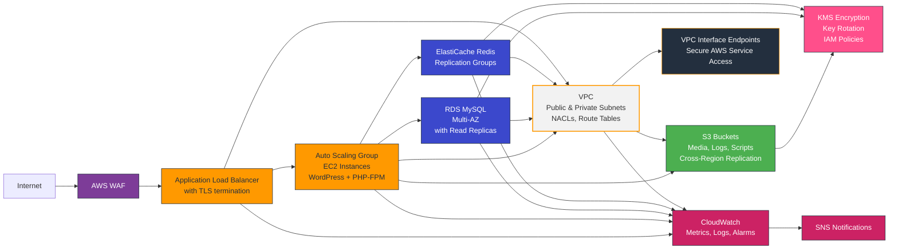

# AWS Infrastructure as Code with Terraform


A comprehensive Terraform project for deploying a secure, scalable, and highly available AWS infrastructure with WordPress hosting capabilities.

## Requirements

| Name            | Version   |
|-----------------|-----------|
| Terraform       | >= 1.11   |
| AWS Provider    | >= 5.0    |
| Random Provider | >= 3.0    |

## Architecture Overview

This project implements a production-ready AWS infrastructure with the following components:



## Features

- **Secure Networking**: VPC with public and private subnets across multiple Availability Zones, Network ACLs, and VPC Flow Logs
- **High Availability**: Auto Scaling Groups, Multi-AZ RDS, and ElastiCache Redis with replication
- **Security**: WAF protection, KMS encryption, HTTPS enforcement, secure IAM policies, and Secrets Manager for credentials management
- **Monitoring**: CloudWatch alarms, SNS notifications, and comprehensive logging
- **Scalability**: Auto Scaling policies based on CPU and memory utilization
- **WordPress Hosting**: Pre-configured WordPress deployment with database and caching
- **Disaster Recovery**: Cross-region S3 replication and database backups
- **Cost Optimization**: Lifecycle policies, right-sized instances, and efficient resource usage

## Modules

This project consists of the following modules:

| Module                                                       | Description                                                          |
|--------------------------------------------------------------|----------------------------------------------------------------------|
| [vpc](/terraform/modules/vpc)                                | VPC with public/private subnets, route tables, NACLs, and endpoints  |
| [alb](/terraform/modules/alb)                                | Application Load Balancer with WAF, security groups, and monitoring  |
| [asg](/terraform/modules/asg)                                | Auto Scaling Groups for WordPress with scaling policies and IAM roles|
| [rds](/terraform/modules/rds)                                | RDS MySQL with Multi-AZ support and monitoring                       |
| [elasticache](/terraform/modules/elasticache)                | ElastiCache Redis with replication and monitoring                    |
| [s3](/terraform/modules/s3)                                  | S3 buckets with encryption, lifecycle policies, and replication      |
| [kms](/terraform/modules/kms)                                | KMS keys for resource encryption                                     |
| [interface_endpoints](/terraform/modules/interface_endpoints)| VPC interface endpoints with conditional creation                    |

---

## Code Structure Overview

```
terraform/                           # Main Terraform configuration directory
├── main.tf                          # Primary configuration file with module calls
├── variables.tf                     # Input variable declarations
├── outputs.tf                       # Output value definitions
├── providers.tf                     # AWS provider configuration
├── remote_backend.tf                # S3 backend for state management
├── secrets.tf                       # AWS Secrets Manager configuration
├── cloudtrail.tf                    # CloudTrail logging setup
├── sns_topic.tf                     # SNS notification configuration
├── terraform.tfvars                 # Variable values for deployment
│
├── modules/                         # Modular components of the infrastructure
│   ├── vpc/                         # Virtual Private Cloud module
│   │   ├── main.tf                  # VPC, subnets, and core resources
│   │   ├── endpoints_routes.tf      # Route tables and VPC endpoints
│   │   ├── flow_logs.tf             # VPC Flow Logs configuration
│   │   ├── nacl.tf                  # Network ACL rules
│   │   ├── variables.tf             # Input variables for the module
│   │   ├── outputs.tf               # Output values from the module
│   │   └── README.md                # Module documentation
│   │
│   ├── alb/                         # Application Load Balancer module
│   │   ├── main.tf                  # ALB and target group configuration
│   │   ├── security_group.tf        # ALB security groups
│   │   ├── waf.tf                   # Web Application Firewall rules
│   │   ├── firehose.tf              # Kinesis Firehose for logs
│   │   ├── metrics.tf               # CloudWatch metrics and alarms
│   │   ├── variables.tf             # Input variables
│   │   ├── outputs.tf               # Output values
│   │   └── README.md                # Module documentation
│   │
│   ├── asg/                         # Auto Scaling Group module
│   │   ├── main.tf                  # ASG configuration and scaling policies
│   │   ├── launch_template.tf       # EC2 launch template with WordPress deployment
│   │   ├── iam.tf                   # IAM roles and conditional policies for S3, KMS, and SSM
│   │   ├── security_group.tf        # EC2 security groups with dynamic rules
│   │   ├── variables.tf             # Input variables
│   │   ├── outputs.tf               # Output values
│   │   └── README.md                # Module documentation
│   │
│   ├── rds/                         # RDS Database module
│   │   ├── main.tf                  # RDS instance configuration
│   │   ├── security_group.tf        # Database security groups
│   │   ├── iam.tf                   # IAM roles for monitoring
│   │   ├── metrics.tf               # CloudWatch metrics and alarms
│   │   ├── variables.tf             # Input variables
│   │   ├── outputs.tf               # Output values
│   │   └── README.md                # Module documentation
│   │
│   ├── elasticache/                 # ElastiCache Redis module
│   │   ├── main.tf                  # Redis cluster configuration
│   │   ├── security_group.tf        # Redis security groups
│   │   ├── metrics.tf               # CloudWatch metrics and alarms
│   │   ├── variables.tf             # Input variables
│   │   ├── outputs.tf               # Output values
│   │   └── README.md                # Module documentation
│   │
│   ├── s3/                          # S3 Storage module
│   │   ├── main.tf                  # S3 bucket configuration
│   │   ├── policies.tf              # Bucket policies
│   │   ├── lifecycle.tf             # Object lifecycle rules
│   │   ├── replication.tf           # Cross-region replication
│   │   ├── dynamodb.tf              # DynamoDB for state locking
│   │   ├── variables.tf             # Input variables
│   │   ├── outputs.tf               # Output values
│   │   └── README.md                # Module documentation
│   │
│   ├── kms/                         # KMS Encryption module
│   │   ├── main.tf                  # Main KMS configuration
│   │   ├── key.tf                   # KMS key configuration
│   │   ├── metrics.tf               # CloudWatch metrics and alarms
│   │   ├── variables.tf             # Input variables
│   │   ├── outputs.tf               # Output values
│   │   └── README.md                # Module documentation
│   │
│   └── interface_endpoints/         # VPC Interface Endpoints module (now disabled)
│       ├── main.tf                  # Endpoint configuration
│       ├── security_group.tf        # Endpoint security groups
│       ├── variables.tf             # Input variables
│       ├── outputs.tf               # Output values
│       └── README.md                # Module documentation
│
├── scripts/                         # Deployment and maintenance scripts
│   ├── check_aws_resources.sh       # Checks AWS resource status
│   ├── check_server_status.sh       # EC2 instance health checker
│   ├── deploy_wordpress.sh          # Automates WordPress deployment
│   ├── healthcheck-1.0.php          # Simple ALB health check
│   ├── healthcheck-2.0.php          # Advanced ALB health check
│   └── README.md                    # Scripts documentation
│
└── templates/                       # Template files for resources
    ├── user_data.sh.tpl             # EC2 user data template
    └── README.md                    # Templates documentation
```

## Monitoring and Logging

This project implements comprehensive monitoring and logging to ensure visibility and troubleshooting capabilities:

### CloudWatch Integration

- **Alarms**: Configured for critical metrics across all services
- **Dashboards**: Custom dashboards for infrastructure overview
- **Metrics**: Detailed metrics for VPC, EC2, RDS, ElastiCache, and ALB

### Centralized Logging

- **ALB Access Logs**: Stored in S3 with proper bucket policies
  - Region-specific ELB account permissions (e.g., 156460612806 for eu-west-1)
  - Configured with `s3:PutObject` and `s3:GetBucketAcl` permissions
  - Bucket ownership controls set to `BucketOwnerPreferred`
- **VPC Flow Logs**: Network traffic analysis stored in CloudWatch Logs
- **CloudTrail**: API activity tracking with S3 storage

### Notification System

- **SNS Topics**: Configured for critical alerts
- **Email Notifications**: Sent for threshold breaches
- **Integration**: Compatible with external monitoring tools

## Security Considerations

- **Data Encryption**: All sensitive data is encrypted using KMS
- **Secrets Management**: Secrets Manager securely stores WordPress and database credentials
- **S3 Security**:
  - Public access to S3 buckets is blocked
  - Bucket policies enforce HTTPS-only access
  - Proper IAM permissions for service access (e.g., ALB logging)
  - Object lifecycle management for compliance
- **Network Security**:
  - HTTPS is enforced for all web traffic
  - Security groups follow the principle of least privilege
  - NACLs provide additional network protection
- **Identity and Access**:
  - IAM roles use minimal permissions required for functionality
  - VPC endpoints are used to keep traffic within the AWS network
  - All KMS keys have automatic key rotation enabled where possible

## Prerequisites

- Terraform v1.11+ (tested on v1.11.2)
- AWS CLI v2.x configured with appropriate credentials
- AWS Provider v5.0+ and Random Provider v3.0+
- AWS account with permissions to create the required resources
- Domain name (if using HTTPS with ACM certificates)

## Getting Started

### 1. Clone the Repository

```bash
git clone <repository-url>
cd AWS
```

### 2. Configure Variables

Create a `terraform.tfvars` file based on the example provided:

```bash
cp terraform/terraform.tfvars.example terraform/terraform.tfvars
```

Edit the `terraform.tfvars` file to customize your deployment:

```hcl
# General Configuration
aws_region         = "eu-west-1"
replication_region = "us-east-1"
environment        = "prod"
name_prefix        = "myproject"
aws_account_id     = "123456789012"

# VPC Configuration
vpc_cidr_block = "10.0.0.0/16"
# ... additional variables
```

### 3. Initialize Terraform

```bash
cd terraform
terraform init
```

### 4. Plan the Deployment

```bash
terraform plan -out=tfplan
```

### 5. Apply the Configuration

```bash
terraform apply tfplan
```

## Remote State Management

# Remote State Must Be Configured First

Important: If you skip this step, Terraform may recreate resources, causing downtime or duplication.

This project uses S3 for remote state storage with DynamoDB for state locking. The configuration is in `remote_backend.tf`.

To enable remote state storage:

1. First, deploy the S3 and DynamoDB resources:

```bash
terraform apply -target=module.s3 -target=aws_dynamodb_table.terraform_locks
```

2. Uncomment and configure the backend configuration in `remote_backend.tf` (the file contains a commented template)
3. Replace the placeholder values with your actual S3 bucket name, DynamoDB table name, and AWS region
4. Run `terraform init -reconfigure` to migrate the state to S3

## Important: Remote State Migration

If you initially deployed infrastructure using **local Terraform state (`terraform.tfstate`)**,  
you **must migrate** the state file to the remote S3 backend **before** continuing to avoid resource duplication.

### Migration Steps:
1. Configure the remote backend in `remote_backend.tf`.
2. Run the reconfiguration command to migrate the state:
   ```bash
   terraform init -reconfigure
   ```
3. Terraform will prompt:
   ```
   Do you want to copy the existing state to the new backend?
     Enter "yes" to copy and "no" to start with an empty state.
   ```
4. Enter `yes` to migrate your existing local state to S3.

---

**Why is this important?**
- Prevents resource duplication and accidental recreation
- Ensures all future `terraform plan` and `apply` operations work from the same remote state
- Allows team collaboration with a consistent state file

After successful migration, **the local `terraform.tfstate` is no longer used**.  
You can archive or delete it safely.

---

## Cost Optimization

- Use Auto Scaling to match capacity with demand
- Configure lifecycle policies for S3 objects
- Enable bucket keys for KMS cost reduction
- Monitor CloudWatch metrics for resource utilization
- Consider reserved instances for predictable workloads

## Maintenance and Operations

You can automate AMI updates using EC2 Image Builder or Packer for continuous delivery.

### Updating WordPress

WordPress updates can be managed through the admin interface or by updating the AMI used by the Auto Scaling Group.

### Backups

- Database: Automated RDS snapshots
- Media files: S3 cross-region replication
- Configuration: Terraform state in S3 with versioning

## Troubleshooting

### Common Issues

1. **Deployment Failures**
   - Check CloudTrail logs for API errors
   - Verify IAM permissions

2. **Website Unavailability**
   - Check ALB health checks
   - Verify security group rules
   - Inspect Auto Scaling Group status

3. **Performance Issues**
   - Review CloudWatch metrics
   - Check ElastiCache hit ratio
   - Monitor RDS performance insights

## Contributing

1. Fork the repository
2. Create a feature branch
3. Submit a pull request with a clear description of changes

## Limitations

- The project does not automatically create Route53 zones (must be managed separately).
- ACM certificates must be requested manually if DNS validation is required.

## Project Status

This project is production-ready, tested, and verified for AWS multi-AZ high availability deployments.

## License

This project is licensed under the MIT License - see the [LICENSE](./LICENSE) file for details.


## References

- [Terraform Documentation](https://www.terraform.io/docs)
- [AWS Best Practices](https://aws.amazon.com/architecture/well-architected/)
- [WordPress on AWS](https://aws.amazon.com/blogs/architecture/wordpress-best-practices-on-aws/)
- [Terraform Releases](https://github.com/hashicorp/terraform/releases)