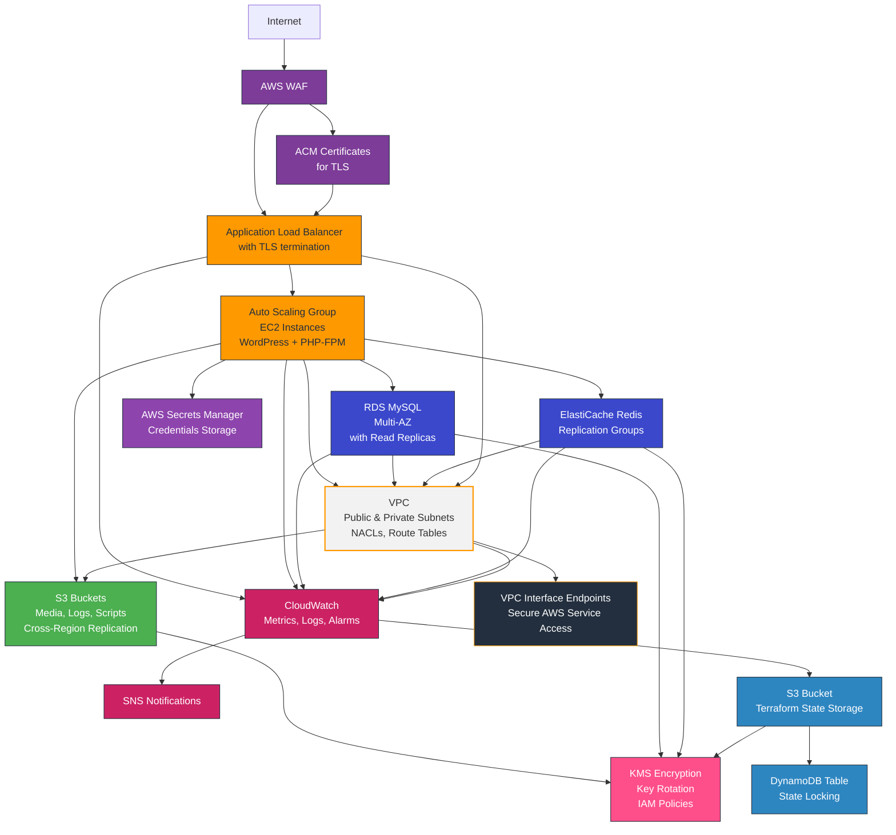

# AWS Infrastructure as Code with Terraform


---

## 1. Overview

A comprehensive Terraform project leveraging a modular structure for deploying a secure, scalable, and highly available AWS infrastructure with WordPress hosting capabilities.

---

## 2. Prerequisites / Requirements

### Requirements

| Name            | Version   |
|-----------------|-----------|
| Terraform       | >= 1.11   |
| AWS Provider    | >= 5.0    |
| Random Provider | >= 3.0    |

### Additional Requirements
- Terraform v1.11+ (tested on v1.11.2)
- AWS CLI v2.x configured with appropriate credentials
- AWS Provider and Random Provider plugins installed
- AWS account with sufficient IAM permissions to create VPC, EC2, S3, RDS, and other resources
- Domain name (required if enabling HTTPS via ACM certificates)
- **S3 bucket and DynamoDB table must be deployed first** for remote state management

### Remote State Requirement
This project uses **S3** for remote state storage and **DynamoDB** for state locking.  
**Important:** These resources **must be deployed first** before running `terraform apply`.

---

## Architecture Diagram

This project implements a production-ready AWS infrastructure with the following components:


_The diagram below illustrates the core AWS services, Terraform backend components, and their interactions within this project._

---

## 4. Features

- **Secure Networking**: VPC with public and private subnets across multiple Availability Zones, Network ACLs, and VPC Flow Logs
- **High Availability**: Auto Scaling Groups, Multi-AZ RDS, and ElastiCache Redis with replication
- **Security**: WAF protection, KMS encryption, HTTPS enforcement, secure IAM policies, and Secrets Manager for credentials management
- **Monitoring**: CloudWatch alarms, SNS notifications, and comprehensive logging
- **Scalability**: Auto Scaling policies based on CPU and memory utilization
- **WordPress Hosting**: Pre-configured WordPress deployment with database and caching
- **Disaster Recovery**: Cross-region S3 replication and database backups
- **Cost Optimization**: Lifecycle policies, right-sized instances, and efficient resource usage
- **Remote State Management**: S3 backend with DynamoDB state locking for safe multi-user collaboration
- **Compliance & Auditing**: CloudTrail logging and KMS encryption supporting security and compliance requirements

---

## 5. Modules Architecture

This project is designed in a modular way to support reusability and scalability.
This modular design allows easy extension with additional components (e.g., NAT Gateway, Transit Gateway).

| Module                                                       | Description                                                          |
|--------------------------------------------------------------|----------------------------------------------------------------------|
| [vpc](/terraform/modules/vpc)                                | VPC with public/private subnets, route tables, NACLs, and endpoints  |
| [alb](/terraform/modules/alb)                                | Application Load Balancer with WAF, security groups, and monitoring  |
| [asg](/terraform/modules/asg)                                | Auto Scaling Groups for WordPress with scaling policies and IAM roles|
| [rds](/terraform/modules/rds)                                | RDS MySQL with Multi-AZ support and monitoring                       |
| [elasticache](/terraform/modules/elasticache)                | ElastiCache Redis with replication and monitoring                    |
| [s3](/terraform/modules/s3)                                  | S3 buckets with encryption, lifecycle policies, and replication      |
| [kms](/terraform/modules/kms)                                | KMS keys for resource encryption                                     |
| [interface_endpoints](/terraform/modules/interface_endpoints)| Optional VPC Interface Endpoints module (disabled by default)        |

---

## 6. Modules Files Structure

Each module follows Terraform best practices with separate logical files (main, variables, outputs, policies, lifecycle).
All modules are self-contained and documented for reusability.

```
terraform/                           # Main Terraform configuration directory
├── main.tf                          # Primary configuration file with module calls
├── variables.tf                     # Input variable declarations
├── outputs.tf                       # Output value definitions
├── providers.tf                     # AWS provider configuration
├── remote_backend.tf                # S3 backend for state management
├── secrets.tf                       # AWS Secrets Manager configuration
├── cloudtrail.tf                    # CloudTrail logging setup
├── sns_topic.tf                     # SNS notification configuration
├── terraform.tfvars                 # Variable values for deployment
│
├── modules/                         # Modular components of the infrastructure
│   ├── vpc/                         # Virtual Private Cloud module
│   │   ├── main.tf                  # VPC, subnets, and core resources
│   │   ├── endpoints_routes.tf      # Route tables and VPC endpoints
│   │   ├── flow_logs.tf             # VPC Flow Logs configuration
│   │   ├── nacl.tf                  # Network ACL rules
│   │   ├── variables.tf             # Input variables for the module
│   │   ├── outputs.tf               # Output values from the module
│   │   └── README.md                # Module documentation
│   │
│   ├── alb/                         # Application Load Balancer module
│   │   ├── main.tf                  # ALB and target group configuration
│   │   ├── security_group.tf        # ALB security groups
│   │   ├── waf.tf                   # Web Application Firewall rules
│   │   ├── firehose.tf              # Kinesis Firehose for logs
│   │   ├── metrics.tf               # CloudWatch metrics and alarms
│   │   ├── variables.tf             # Input variables
│   │   ├── outputs.tf               # Output values
│   │   └── README.md                # Module documentation
│   │
│   ├── asg/                         # Auto Scaling Group module
│   │   ├── main.tf                  # ASG configuration and scaling policies
│   │   ├── launch_template.tf       # EC2 launch template with WordPress deployment
│   │   ├── iam.tf                   # IAM roles and conditional policies for S3, KMS, and SSM
│   │   ├── security_group.tf        # EC2 security groups with dynamic rules
│   │   ├── variables.tf             # Input variables
│   │   ├── outputs.tf               # Output values
│   │   └── README.md                # Module documentation
│   │
│   ├── rds/                         # RDS Database module
│   │   ├── main.tf                  # RDS instance configuration
│   │   ├── security_group.tf        # Database security groups
│   │   ├── iam.tf                   # IAM roles for monitoring
│   │   ├── metrics.tf               # CloudWatch metrics and alarms
│   │   ├── variables.tf             # Input variables
│   │   ├── outputs.tf               # Output values
│   │   └── README.md                # Module documentation
│   │
│   ├── elasticache/                 # ElastiCache Redis module
│   │   ├── main.tf                  # Redis cluster configuration
│   │   ├── security_group.tf        # Redis security groups
│   │   ├── metrics.tf               # CloudWatch metrics and alarms
│   │   ├── variables.tf             # Input variables
│   │   ├── outputs.tf               # Output values
│   │   └── README.md                # Module documentation
│   │
│   ├── s3/                          # S3 Storage module
│   │   ├── main.tf                  # S3 bucket configuration
│   │   ├── policies.tf              # Bucket policies
│   │   ├── lifecycle.tf             # Object lifecycle rules
│   │   ├── replication.tf           # Cross-region replication
│   │   ├── dynamodb.tf              # DynamoDB for state locking
│   │   ├── variables.tf             # Input variables
│   │   ├── outputs.tf               # Output values
│   │   └── README.md                # Module documentation
│   │
│   ├── kms/                         # KMS Encryption module
│   │   ├── main.tf                  # Main KMS configuration
│   │   ├── key.tf                   # KMS key configuration
│   │   ├── metrics.tf               # CloudWatch metrics and alarms
│   │   ├── variables.tf             # Input variables
│   │   ├── outputs.tf               # Output values
│   │   └── README.md                # Module documentation
│   │
│   └── interface_endpoints/         # VPC Interface Endpoints module (now disabled)
│       ├── main.tf                  # Endpoint configuration
│       ├── security_group.tf        # Endpoint security groups
│       ├── variables.tf             # Input variables
│       ├── outputs.tf               # Output values
│       └── README.md                # Module documentation
│
├── scripts/                         # Deployment and maintenance scripts
│   ├── check_aws_resources.sh       # Checks AWS resource status
│   ├── check_server_status.sh       # EC2 instance health checker
│   ├── deploy_wordpress.sh          # Automates WordPress deployment
│   ├── healthcheck-1.0.php          # Simple ALB health check
│   ├── healthcheck-2.0.php          # Advanced ALB health check
│   └── README.md                    # Scripts documentation
│
└── templates/                       # Template files for resources
    ├── user_data.sh.tpl             # EC2 user data template
    └── README.md                    # Templates documentation
```
---

## 7. Example Usage

### Getting Started

### 1. Clone the Repository

```bash
git clone https://github.com/your-org/aws-infrastructure-terraform.git
cd aws-infrastructure-terraform
```

### 2. Configure Variables

Create a `terraform.tfvars` file based on the example provided:

```bash
cp terraform/terraform.tfvars.example terraform/terraform.tfvars
```

Edit the `terraform.tfvars` file to customize your deployment:

```hcl
# General Configuration
aws_region         = "eu-west-1"
replication_region = "us-east-1"
environment        = "prod"
name_prefix        = "myproject"
aws_account_id     = "123456789012"

# VPC Configuration
vpc_cidr_block = "10.0.0.0/16"
# ... additional variables
```

Note: Do not commit terraform.tfvars to version control if it contains sensitive data like passwords or secret keys.

Tip: Avoid hardcoding sensitive data like database passwords or API keys. Use environment variables or AWS Secrets Manager wherever possible.

### 3. Initialize Terraform

```bash
cd terraform
terraform init
```

### 4. Validate Configuration (Optional but Recommended)

```bash
terraform validate
```
### 5. Format the Code (Optional for Code Consistency)

```bash
terraform fmt -recursive
```
### 6. Plan the Deployment

```bash
terraform plan -out=tfplan
```
7. (Optional) Review the Planned Changes

```bash
terraform show tfplan
```

### 8. Apply the Configuration

```bash
terraform apply tfplan
```

### 9. Remote State Management

### Remote State Must Be Configured First

Important: Remote state configuration must be completed before deploying any other modules to avoid inconsistent state or resource duplication.

This project uses S3 for remote state storage with DynamoDB for state locking.
Configuration is located in remote_backend.tf.

### Enabling Remote State Storage:

1. Deploy the S3 and DynamoDB resources first:

```bash
terraform apply -target=module.s3 -target=aws_dynamodb_table.terraform_locks
```

2. Configure the backend:

- Uncomment and update the backend configuration in remote_backend.tf.
- Replace placeholders with your actual S3 bucket name, DynamoDB table name, and AWS region.

Example snippet from remote_backend.tf:

```hcl
backend "s3" {
  bucket         = "my-terraform-state-bucket"
  key            = "global/s3/terraform.tfstate"
  region         = "eu-west-1"
  dynamodb_table = "terraform_locks"
  encrypt        = true
}
```
### Re-initialize Terraform with Backend Reconfiguration and Migrate State

If you initially deployed infrastructure using **local Terraform state (`terraform.tfstate`)**,  
you **must** migrate the state file to the remote S3 backend to avoid resource duplication or data loss.

### Migration Steps:
1. Ensure remote_backend.tf is properly configured.
2. Run the reconfiguration command to migrate the state:

   ```bash
    terraform init -reconfigure
    ```
3. Terraform will prompt:

   ```
    Do you want to copy the existing state to the new backend?
    Enter "yes" to copy and "no" to start with an empty state.
    ```
4. Type yes to migrate your existing local state to S3.

---

**Why is this important?**
- Prevents resource duplication and accidental recreation
- Ensures all future `terraform plan` and `apply` operations work from the same remote state
- Allows team collaboration with a consistent state file
- Provides state locking to prevent concurrent changes

After successful migration, **the local `terraform.tfstate` is no longer used**.  
You can archive or delete it safely:

```bash
   rm terraform.tfstate terraform.tfstate.backup
   ```

### Example of Full Remote Workflow:

```bash
    terraform fmt -recursive
    terraform validate
    terraform plan -out=tfplan
    terraform show tfplan
    terraform apply tfplan
   ```

---

## 8. Security Considerations / Recommendations

- **Data Encryption**: All sensitive data is encrypted using KMS
- **Secrets Management**: Secrets Manager (or SSM Parameter Store) securely stores WordPress and database credentials
- **S3 Security**:
  - Public access to S3 buckets is blocked
  - Bucket policies enforce HTTPS-only access
  - Proper IAM permissions for service access (e.g., ALB logging)
  - Object lifecycle management for compliance
- **Network Security**:
  - HTTPS is enforced for all web traffic
  - Security groups follow the principle of least privilege
  - NACLs provide additional network protection
- **Identity and Access**:
  - IAM roles use minimal permissions required for functionality
  - VPC endpoints are used to keep traffic within the AWS network
  - All KMS keys have automatic key rotation enabled where possible
- **Log Encryption**: CloudWatch Logs are encrypted with KMS for compliance and data protection
- **Security Monitoring**: VPC Flow Logs and CloudTrail enable continuous security auditing

---

## 9. Conditional Resource Creation

The following components are created conditionally based on input variables:

- **Interface Endpoints**: Created only if `enable_interface_endpoints = true`
- **Cross-Region Replication**: Enabled only if `enable_replication = true`
- **DynamoDB Lock Table**: Created only if `enable_dynamodb = true`
- **VPC Flow Logs Monitoring**: Enabled if `enable_flow_logs_monitoring = true`
- **WAF Module**: Can be enabled or disabled with `enable_waf` flag depending on the application layer security requirements

---

## 10. Best Practices

- **Enable Versioning** on all critical S3 buckets to prevent accidental data loss
- **Use KMS encryption** consistently for compliance and security
- **Apply least privilege IAM policies** to restrict access
- **Restrict public access** to S3 and EC2 as much as possible
- **Utilize lifecycle policies** to optimize S3 storage costs
- **Monitor resource utilization** with CloudWatch and optimize instance types
- **Use VPC endpoints** to avoid exposing services to the public internet
- **Enable logging** for ALB, VPC, and CloudTrail
- **Enable CloudTrail log validation** to ensure log integrity
- **Regularly review NACL and SG rules**
- **Consider multi-region backups** for disaster recovery and data durability

---

## 11. Integration with Other Modules

This project is designed for seamless integration between modules:

- **VPC Module**: Provides network backbone for ALB, ASG, RDS, ElastiCache
- **ALB Module**: Integrates with ASG to distribute incoming traffic
- **ASG Module**: Runs WordPress instances and connects to RDS and ElastiCache
- **RDS Module**: Provides a highly available MySQL database
- **ElastiCache Module**: Handles session storage for WordPress
- **S3 Module**: Stores media, logs, and supports replication
- **KMS Module**: Central encryption for S3, RDS, ElastiCache, and logs
- **SNS Module**: Delivers alerts from CloudWatch alarms (including RDS and ElastiCache monitoring)

---

## 12. Future Improvements

- Add support for **NAT Gateways** to enable private subnet internet access
- Integrate **Transit Gateway** for multi-VPC architectures
- Implement **S3 Object Lock** for compliance use cases
- Add **Intelligent-Tiering** in S3 for cost optimization
- Expand **CloudWatch Alarms** for detailed monitoring
- Integrate **AWS Config** for continuous compliance monitoring
- Add **AWS Backup** module for centralized backup management
- **Consider Graviton instances** for cost and performance benefits
- **Expand IAM least privilege analysis** using `AWS Access Analyzer`
- **Evaluate AWS Shield Advanced** for enhanced DDoS protection

> **Note:** Graviton (`t4g.*`) ARM instances are not included in the AWS Free Tier. 
> Use `t2.micro` instance types to stay within Free Tier limits.

---

## 13. Troubleshooting and Common Issues

### Common Issues

1. **Deployment Failures**
   - Check CloudTrail logs for API errors
   ```bash
   aws cloudtrail lookup-events --lookup-attributes AttributeKey=ResourceName,AttributeValue=<resource-name>
   ```
   - Verify IAM permissions
   - Ensure Terraform AWS Provider version matches requirements.

2. **Website Unavailability**
   - Check ALB health checks for failed targets.
   - Verify Security Group (SG) rules allow HTTP/HTTPS traffic.
   - Inspect Auto Scaling Group (ASG) status and instance health:
   ```bash
   aws autoscaling describe-auto-scaling-groups
   ```

3. **Performance Issues**
   - Review CloudWatch metrics and alarms:
   ```bash
   aws cloudwatch describe-alarms
   ```
   - Check ElastiCache hit/miss ratio for performance bottlenecks.
   - Monitor RDS Performance Insights and instance CPU/memory usage.

4. **SSL Certificate Issues**
   - Ensure ACM certificates are issued in the correct region (us-east-1 for global services like CloudFront).
   - Validate that the certificate is in ISSUED status.
5. **Secrets Manager Access Errors**
   - Verify IAM permissions include secretsmanager:GetSecretValue.
   - Confirm that the secret's resource policy allows access.

6. VPC Endpoints Not Working
   - Ensure correct route table association with the VPC endpoint.
   - Verify endpoint status is available.
   - Check security group attached to the endpoint.

7. Remote State Backend Errors
   - Ensure S3 bucket and DynamoDB table for remote state exist and have correct policies.
   - Re-run:
   ```bash
   terraform init -reconfigure
   ```
---

## 14. Notes

### Monitoring and Logging

This project implements comprehensive monitoring and logging to ensure visibility, troubleshooting, and operational excellence:

### CloudWatch Integration

- **Alarms**: Configured for critical metrics across all services
- **Dashboards**: Custom dashboards for infrastructure overview
- **Metrics**: Detailed metrics for VPC, EC2, RDS, ElastiCache, and ALB
- Contributor Insights: (Optional) Enables anomaly detection and traffic analysis for CloudWatch Logs and Metrics

---

### Centralized Logging

- **ALB Access Logs**: Stored in S3 with proper bucket policies
  - Includes region-specific ELB account permissions (e.g., 156460612806 for eu-west-1)
  - Requires s3:PutObject and s3:GetBucketAcl permissions
  - `BucketOwnerPreferred` ownership controls enabled
- **VPC Flow Logs**: Captures network traffic, stored in CloudWatch Logs
- **CloudTrail**: API activity tracking with secure S3 storage

---

### Notification System

- **SNS Topics**: Configured for mission-critical alerts
- **Email Notifications**: Triggered for threshold breaches
- **Third-party Integration**: Compatible with external monitoring tools like Datadog, Grafana, or Splunk

---

### Cost Optimization

- Auto Scaling: Matches capacity to demand automatically
- S3 Lifecycle Policies: Removes stale data and optimizes storage
- KMS Bucket Keys: Reduces encryption costs
- CloudWatch Usage Monitoring: Regular review of VPC Flow Logs and log storage costs
- AWS Compute Optimizer: Analyzes resource utilization for instance right-sizing
- S3 Intelligent-Tiering: Recommended for large, infrequently accessed datasets
- Reserved Instances and Savings Plans: Considered for predictable workloads

---

### Maintenance and Operations

- AMI Automation: Use EC2 Image Builder or Packer for AMI lifecycle management
- SSM Patch Manager (optional): Automates patching of instances for security compliance
- Regular Backups:
   - RDS: Automated snapshots
   - S3 Media: Cross-region replication
   - Terraform State: Stored with versioning in S3

---

### Updating WordPress

- Updates are managed through the Git repository and deployment scripts.
- Push changes to the repository to trigger the deployment pipeline.
- User data scripts and configurations are updated automatically with each deployment.
- WordPress updates via the admin interface are also supported but version control is recommended through Git.

---

### Contributing

1. Fork the repository
2. Create a feature branch
3. Submit a pull request with a clear description of changes and tests if applicable

---

### Limitations

- Route53 zones must be managed separately
- ACM certificates must be requested manually if DNS validation is required
- No automatic SSM Document generation for advanced management scenarios (optional future enhancement)

---

### Project Status

This project is production-ready, tested, and verified for AWS multi-AZ high availability deployments.

---

### License

This project is licensed under the MIT License - see the [LICENSE](./LICENSE) file for details.

---

## 15. Useful Resources

- [Terraform Documentation](https://www.terraform.io/docs) — Official Terraform documentation  
- [Terraform AWS Provider Guide](https://registry.terraform.io/providers/hashicorp/aws/latest/docs) — Full AWS Provider resource reference  
- [AWS Best Practices](https://aws.amazon.com/architecture/well-architected/) — AWS Well-Architected Framework  
- [WordPress on AWS Best Practices](https://aws.amazon.com/blogs/architecture/wordpress-best-practices-on-aws/) — Architecture recommendations for WordPress  
- [Terraform Releases](https://github.com/hashicorp/terraform/releases) — Latest Terraform versions  
- [AWS KMS Best Practices](https://docs.aws.amazon.com/kms/latest/developerguide/best-practices.html) — Key management guidelines  
- [AWS S3 Cross-Region Replication Guide](https://docs.aws.amazon.com/AmazonS3/latest/userguide/replication.html) — S3 replication overview  
- [AWS VPC Best Practices](https://docs.aws.amazon.com/vpc/latest/userguide/vpc-best-practices.html) — Designing secure and scalable VPCs  
- [CloudWatch Metrics and Alarms Guide](https://docs.aws.amazon.com/AmazonCloudWatch/latest/monitoring/WhatIsCloudWatch.html) — Monitoring with CloudWatch  
- [AWS Security Best Practices](https://docs.aws.amazon.com/general/latest/gr/aws-security-best-practices.html) — Comprehensive security guidelines

---

## Notes:
**README Location:**  
This `README.md` is intentionally placed inside the `terraform/` directory as it documents the entire Terraform infrastructure project, including modules, architecture, deployment steps, and best practices.

If your project structure changes (e.g., adding backend/frontend applications or other components outside of Terraform), consider moving this `README.md` to the project root or creating a new global `README.md` to cover the full stack.

---