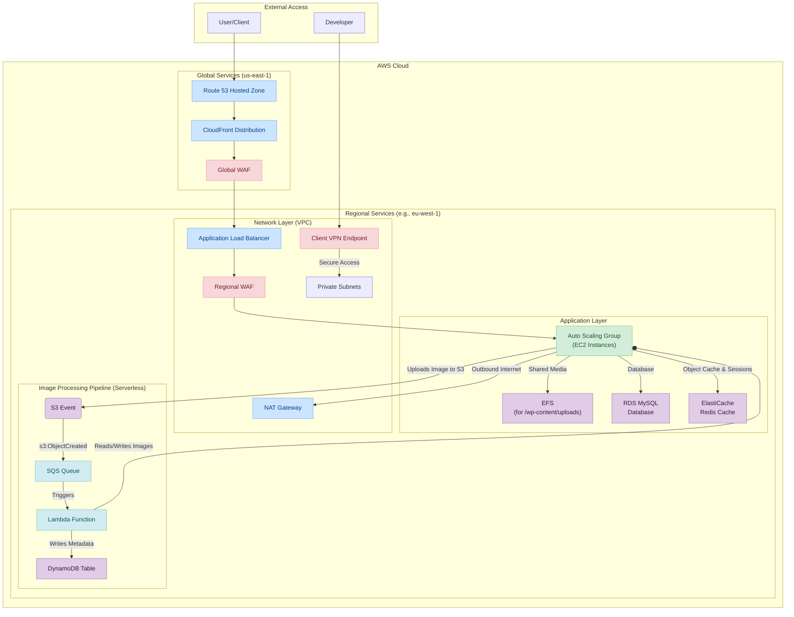

# WordPress on AWS - Terraform Infrastructure


## 1. Overview

This repository contains a comprehensive, modular, and production-ready Terraform project for deploying a secure, scalable, and highly available WordPress infrastructure on AWS.

This project is designed with a clear separation of concerns, leveraging a multi-environment setup (`dev`, `stage`) and a rich set of reusable Terraform modules. It automates the provisioning of everything from the foundational network layer (VPC) to the application stack (ALB, ASG, RDS, ElastiCache) and its supporting services (KMS, S3, CloudFront).

Two distinct deployment strategies are supported:
1.  **On-the-Fly Provisioning (for `dev`):** Uses Ansible to configure instances from a base OS on boot, ideal for rapid development and testing. An alternative, script-based method is also available.
2.  **Golden AMI (for `stage`):** Uses pre-built, hardened machine images for faster, more consistent, and reliable deployments in a pre-production environment.

---

## 2. Table of Contents

- [1. Overview](#1-overview)
- [2. Table of Contents](#2-table-of-contents)
- [3. Architecture](#3-architecture)
- [4. Project Structure](#4-project-structure)
- [5. Core Concepts](#5-core-concepts)
  - [5.1. Environments](#51-environments)
  - [5.2. Modularity](#52-modularity)
- [6. Local Prerequisites](#6-local-prerequisites)
- [7. How to Deploy](#7-how-to-deploy)
- [8. Key Operational Workflows](#8-key-operational-workflows)
  - [8.1. Golden AMI Workflow](#81-golden-ami-workflow)
  - [8.2. Secrets Rotation](#82-secrets-rotation)
  - [8.3. Accessing EC2 Instances](#83-accessing-ec2-instances)
  - [8.4. Connecting to the Client VPN](#84-connecting-to-the-client-vpn)
- [9. Makefile Commands](#9-makefile-commands)

---

## 3. Architecture

The architecture is designed for security, scalability, and high availability. Web traffic is filtered through two layers of Web Application Firewalls (CloudFront and ALB) before reaching application instances. These instances are deployed in private subnets with no direct internet access and rely on a NAT Gateway for outbound traffic.



---

## 4. Project Structure

The repository is organized into distinct directories, each with a specific responsibility.

```
.
├── Makefile                # Automates common Terraform and script commands.
├── README.md               # This file.
├── ansible/                # Ansible playbooks for instance provisioning.
├── environments/           # Root configurations for each deployment environment.
│   ├── dev/                # Development: cost-optimized, on-the-fly provisioning.
│   └── stage/              # Staging: mirrors production, Golden AMI deployment.
├── modules/                # Reusable Terraform modules for creating AWS resources.
│   ├── acm/
│   ├── alb/
│   ├── asg/
│   ├── client_vpn/
│   ├── cloudfront/
│   ├── dynamodb/
│   ├── efs/
│   ├── elasticache/
│   ├── interface_endpoints/
│   ├── kms/
│   ├── lambda_images/
│   ├── lambda_layer/
│   ├── rds/
│   ├── route53/
│   ├── s3/
│   ├── sqs/
│   └── vpc/
├── scripts/                # Helper scripts for deployment, debugging, and maintenance.
└── templates/              # User Data templates for EC2 instances.
```

---

## 5. Core Concepts

### 5.1. Environments

The project uses a multi-environment setup located in the `environments/` directory. Each environment has its own `main.tf`, `variables.tf`, and `terraform.tfvars` files, allowing for isolated and customized deployments.

-   **`dev` Environment:**
    -   **Purpose:** Development and functional testing.
    -   **Strategy:** Optimized for cost-effectiveness and rapid iteration. It uses an **on-the-fly provisioning** strategy where Ansible installs and configures WordPress on each EC2 instance at boot time.
    -   See `environments/dev/README.md` for full details.

-   **`stage` Environment:**
    -   **Purpose:** Pre-production validation, integration testing, and performance testing.
    -   **Strategy:** Designed to be a near-perfect mirror of production. It uses a **Golden AMI** deployment strategy, where instances are launched from a pre-built machine image. This ensures faster, more reliable, and consistent deployments.
    -   See `environments/stage/README.md` for full details.

### 5.2. Modularity

The infrastructure is broken down into reusable **modules**, each responsible for a specific set of AWS resources (e.g., `vpc`, `alb`, `rds`). This approach promotes code reuse, maintainability, and consistency. Each module is self-contained and documented in its own `README.md` file.

---

## 6. Local Prerequisites

To deploy and manage this infrastructure, the following tools must be installed on your local machine:

-   **Terraform (`~> 1.12`)**: To manage infrastructure as code.
-   **AWS CLI**: To interact with your AWS account.
-   **Docker**: Required by the `build_layer.sh` script to create a consistent build environment for Python Lambda layers.
-   **Python 3**: Required by helper scripts.

---

## 7. How to Deploy

1.  **Clone the Repository:**
    ```bash
    git clone <repository-url>
    cd terraform
    ```

2.  **Set up your AWS credentials** as described in `environments/dev/README.md` (the model uses a limited-privilege IAM user that assumes a powerful role).

3.  **Navigate to an Environment:**
    ```bash
    # For example, to deploy the 'dev' environment
    cd environments/dev
    ```

4.  **Configure Variables:**
    Copy the example variables file and customize it for your deployment.
    ```bash
    cp terraform.tfvars.example terraform.tfvars
    # Edit terraform.tfvars with your specific values (e.g., domain name)
    ```

5.  **Initialize and Deploy using Makefile:**
    From the root `terraform/` directory, use the `make` commands.
    ```bash
    # From the terraform/ directory
    make all ENV=dev   # Initializes, formats, validates, and plans the 'dev' environment
    make apply ENV=dev # Applies the changes for the 'dev' environment
    ```

---

## 8. Key Operational Workflows

### 8.1. Golden AMI Workflow

The `stage` environment relies on a "Golden AMI" for deployments. The `Makefile` provides a complete, automated workflow for creating and promoting these AMIs.

1.  **Provision & Harden Instance:** In the `dev` environment, select a running instance and prepare it to be an AMI. This script hardens the OS, installs updates, and cleans the instance.
    ```bash
    make provision-ami ENV=dev
    ```
2.  **Run Smoke Tests:** Execute a suite of tests against the hardened instance to verify its configuration (firewall, services, cleanup).
    ```bash
    make test-ami ENV=dev
    ```
3.  **Create the AMI:** If tests pass, create a new AMI from the hardened EC2 instance. This command also tags the AMI and commits its new ID to a history file in Git.
    ```bash
    make create-ami ENV=dev
    ```
4.  **Promote the AMI:** Update the `stage` environment to use the new Golden AMI. This command automatically edits `environments/stage/terraform.tfvars` with the new AMI ID and commits the change.
    ```bash
    make use-ami TARGET_ENV=stage SOURCE_ENV=dev
    ```
5.  **Deploy Staging:** Apply the changes to the `stage` environment. The ASG will perform a zero-downtime rolling update.
    ```bash
    make apply ENV=stage
    ```

### 8.2. Secrets Rotation

All sensitive data (database passwords, salts, Redis tokens) is managed in AWS Secrets Manager. Secrets are generated using `random_password` resources in Terraform, tied to a versioning variable.

To rotate all secrets:
1.  **Update Version:** In `environments/<env>/terraform.tfvars`, increment the `secrets_version` variable (e.g., `"v1.0.0"` -> `"v1.0.1"`).
2.  **Apply Changes:** Run `make apply ENV=<env>`. Terraform will detect the version change, generate new random values, and update the secrets in AWS Secrets Manager.
3.  **Roll Out:** Trigger a rolling refresh of the Auto Scaling Group to force new instances to launch. They will fetch the updated secrets on boot.
    ```bash
    # Example command to trigger a refresh for the 'dev' ASG
    aws autoscaling start-instance-refresh --auto-scaling-group-name <asg-name>
    ```

### 8.3. Accessing EC2 Instances

Direct SSH access to instances is disabled. All access is managed through **AWS Systems Manager (SSM) Session Manager**.
1.  Install the [Session Manager plugin for the AWS CLI](https://docs.aws.amazon.com/systems-manager/latest/userguide/session-manager-working-with-install-plugin.html).
2.  Start a session using an instance ID:
    ```bash
    aws ssm start-session --target <instance-id>
    ```

### 8.4. Connecting to the Client VPN

Secure access to the VPC is provided via the Client VPN.
1.  **Get the `.ovpn` configuration file** from the Terraform output after deployment:
    ```bash
    # In environments/dev directory
    terraform output -raw client_vpn_config > wordpress-vpn.ovpn
    ```
2.  **Import** this file into your AWS VPN Client or any other OpenVPN-compatible client and connect.

---

## 9. Makefile Commands

The root `Makefile` provides a convenient interface for common tasks. All commands should be run from the `terraform/` directory.

| Command                                    | Description                                                                                       |
|--------------------------------------------|---------------------------------------------------------------------------------------------------|
| `make all ENV=<env>`                       | Runs the full pre-flight check for an environment: `init`, `format`, `validate`, `plan`.          |
| `make apply ENV=<env>`                     | Applies the Terraform configuration for the specified environment.                                |
| `make destroy ENV=<env>`                   | Destroys all resources in the specified environment. **Use with extreme caution.**                |
| `make debug ENV=<env>`                     | Starts a real-time log monitoring session for a deploying instance in the environment.            |
| `make check ENV=<env>`                     | Runs a script to check for any leftover AWS resources after a destroy operation.                  |
| `make provision-ami`                       | **(Golden AMI)** Prepares a `dev` instance for imaging (updates, hardens, cleans).                |
| `make test-ami`                            | **(Golden AMI)** Runs smoke tests on the prepared `dev` instance.                                 |
| `make create-ami`                          | **(Golden AMI)** Creates the AMI from the tested `dev` instance and logs its ID.                  |
| `make use-ami TARGET_ENV=<env>`            | **(Golden AMI)** Promotes the latest `dev` AMI to another environment (e.g., `stage`).            |
| `make update-wordpress`                    | For local use. Updates the WordPress core/plugins in the source Git repository.                   |
| `make build-layer`                         | For local use. Builds the Lambda Layer `.zip` file using Docker.                                  |
