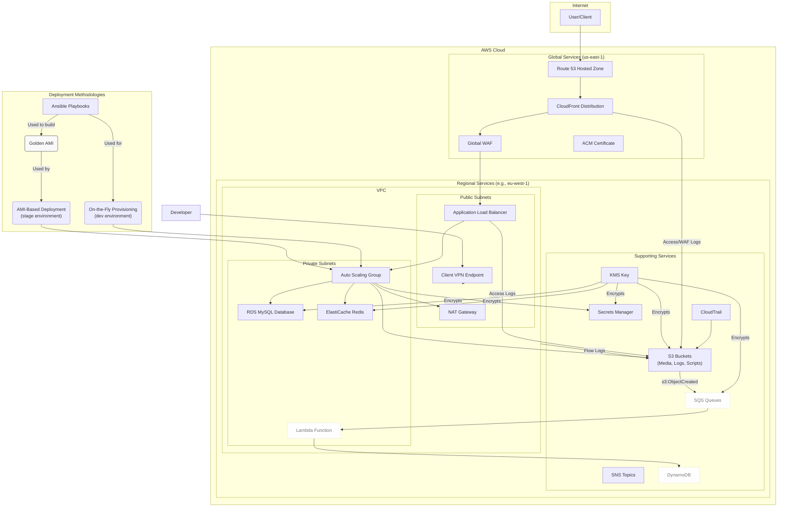

# WordPress on AWS - Terraform Infrastructure


## 1. Overview

This repository contains a comprehensive, modular, and production-ready Terraform project for deploying a secure, scalable, and highly available WordPress infrastructure on AWS.

This project is designed with a clear separation of concerns, leveraging a multi-environment setup (`dev`, `stage`) and a rich set of reusable Terraform modules. It automates the provisioning of everything from the foundational network layer (VPC) to the application stack (ALB, ASG, RDS, ElastiCache) and its supporting services (KMS, S3, CloudFront).

Two distinct deployment strategies are supported:
1.  **On-the-Fly Provisioning (for `dev`):** Uses Ansible to configure instances from a base OS on boot, ideal for rapid development and testing.
2.  **Golden AMI (for `stage`):** Uses pre-built, hardened machine images for faster, more consistent, and reliable deployments in a pre-production environment.

---

## 2. Table of Contents

- [1. Overview](#1-overview)
- [2. Table of Contents](#2-table-of-contents)
- [3. Architecture](#3-architecture)
- [4. Project Structure](#4-project-structure)
- [5. Core Concepts](#5-core-concepts)
  - [5.1. Environments](#51-environments)
  - [5.2. Modularity](#52-modularity)
  - [5.3. Provisioning and Deployment](#53-provisioning-and-deployment)
- [6. Local Prerequisites](#6-local-prerequisites)
- [7. How to Deploy](#7-how-to-deploy)
- [8. Key Operational Workflows](#8-key-operational-workflows)
  - [8.1. Golden AMI Workflow](#81-golden-ami-workflow)
  - [8.2. Secrets Rotation](#82-secrets-rotation)
  - [8.3. Accessing EC2 Instances](#83-accessing-ec2-instances)
  - [8.4. Connecting to the Client VPN](#84-connecting-to-the-client-vpn)
- [9. Makefile](#9-makefile)

---

## 3. Architecture

The architecture is designed for security, scalability, and high availability. Instances are deployed in private subnets and access other AWS services securely, with all inbound web traffic routed through a Web Application Firewall (WAF) and an Application Load Balancer (ALB).



---

## 4. Project Structure

The repository is organized into distinct directories, each with a specific responsibility.

```
.
├── Makefile                # Automates common Terraform and script commands.
├── README.md               # This file.
├── ansible/                # Ansible playbooks for instance provisioning (WordPress, Nginx, etc.).
│   ├── playbooks/
│   └── templates/
├── environments/           # Contains the root configurations for each deployment environment.
│   ├── dev/                # Development environment: cost-optimized, uses on-the-fly provisioning.
│   └── stage/              # Staging environment: mirrors production, uses Golden AMI deployment.
├── modules/                # Reusable Terraform modules for creating AWS resources.
│   ├── acm/                # ACM Certificate requests.
│   ├── alb/                # Application Load Balancer, WAF, Listeners.
│   ├── asg/                # Auto Scaling Group, Launch Templates, IAM Roles.
│   ├── client_vpn/         # Client VPN for secure developer access.
│   ├── cloudfront/         # CloudFront Distribution, OAC, Logging.
│   ├── dynamodb/           # DynamoDB tables.
│   ├── efs/                # Elastic File System for shared storage.
│   ├── elasticache/        # ElastiCache for Redis clusters.
│   ├── interface_endpoints/# VPC Interface Endpoints for private service access.
│   ├── kms/                # KMS Keys for encryption.
│   ├── lambda_images/      # Lambda function for image processing.
│   ├── lambda_layer/       # Lambda Layer builder.
│   ├── rds/                # RDS Database instances.
│   ├── route53/            # Route 53 Hosted Zones and records.
│   ├── s3/                 # S3 Buckets for media, logs, and state.
│   ├── sqs/                # SQS Queues for decoupled tasks.
│   └── vpc/                # VPC, Subnets, NAT Gateways, NACLs, Flow Logs.
├── scripts/                # Helper scripts for deployment, debugging, and maintenance.
└── templates/              # User Data templates for EC2 instances.
```

---

## 5. Core Concepts

### 5.1. Environments

The project uses a multi-environment setup located in the `environments/` directory. Each environment has its own `main.tf`, `variables.tf`, and `terraform.tfvars` files, allowing for isolated and customized deployments.

-   **`dev` Environment:**
    -   **Purpose:** Development and functional testing.
    -   **Strategy:** Optimized for cost-effectiveness and rapid iteration. It uses an **on-the-fly provisioning** strategy where Ansible installs and configures WordPress on each EC2 instance at boot time.
    -   See `environments/dev/README.md` for full details.

-   **`stage` Environment:**
    -   **Purpose:** Pre-production validation, integration testing, and performance testing.
    -   **Strategy:** Designed to be a near-perfect mirror of production. It uses a **Golden AMI** deployment strategy, where instances are launched from a pre-built machine image. This ensures faster, more reliable, and consistent deployments.
    -   See `environments/stage/README.md` for full details.

### 5.2. Modularity

The infrastructure is broken down into reusable **modules**, each responsible for a specific set of AWS resources (e.g., `vpc`, `alb`, `rds`). This approach promotes code reuse, maintainability, and consistency. Each module is self-contained and documented in its own `README.md` file.

### 5.3. Provisioning and Deployment

-   **Ansible (`ansible/`):** Contains playbooks that automate the software installation and configuration on EC2 instances. This includes setting up Nginx, PHP, Redis, the CloudWatch Agent, and WordPress itself.
-   **User Data Templates (`templates/`):** These scripts are passed to EC2 instances at launch. They are responsible for bootstrapping the instance and triggering the correct deployment process, whether it's running Ansible or simply configuring a Golden AMI instance.

---

## 6. Local Prerequisites

To deploy and manage this infrastructure, the following tools must be installed on your local machine:

-   **Terraform (`~> 1.12`)**: To manage infrastructure as code.
-   **AWS CLI**: To interact with your AWS account. Ensure it is configured with the necessary credentials.
-   **Ansible**: Required for the provisioning of `dev` instances and for building the Golden AMI used by `stage`.
-   **Docker**: Required by the `build_layer.sh` script to create a consistent build environment for Python Lambda layers.
-   **Python & pip**: Required by helper scripts.
-   **zip**: A standard command-line utility for packaging Lambda source code.

---

## 7. How to Deploy

1.  **Clone the Repository:**
    ```bash
    git clone <repository-url>
    cd <repository-name>
    ```

2.  **Navigate to an Environment:**
    Choose the environment you want to deploy (e.g., `dev`).
    ```bash
    cd environments/dev
    ```

3.  **Configure Variables:**
    Copy the example variables file and customize it for your deployment.
    ```bash
    cp terraform.tfvars.example terraform.tfvars
    # Edit terraform.tfvars with your specific values (e.g., account ID)
    ```

4.  **Initialize Terraform:**
    This downloads the necessary providers and initializes the backend. This project uses a local backend by default.
    ```bash
    terraform init
    ```

5.  **Plan and Apply:**
    Generate an execution plan and then apply it to create the resources in AWS.
    ```bash
    terraform plan -out=tfplan
    terraform apply tfplan
    ```

> **Remote State:** For team collaboration, it is critical to configure a remote backend. The configuration for an S3 remote backend is available in `remote_backend.tf`. Uncomment it and run `terraform init -reconfigure` to migrate your state.

---

## 8. Key Operational Workflows

### 8.1. Golden AMI Workflow

The `stage` environment relies on a "Golden AMI" for deployments. To create or update it:
1.  **Launch a Base Instance:** Use a `dev`-like environment to launch a fresh instance that runs the full Ansible provisioning process.
2.  **Harden and Seal:** Run the `ansible/playbooks/prepare-golden-ami.yml` playbook to finalize the image by running updates and cleaning temporary files.
3.  **Create AMI:** Create a new AMI from the hardened EC2 instance in the AWS Console.
4.  **Update `terraform.tfvars`:** Update the `ami_id` variable in `environments/stage/terraform.tfvars` with the new AMI ID.
5.  **Deploy:** Run `terraform apply` in the `stage` environment. The ASG will perform a rolling update to launch new instances from the new AMI.

### 8.2. Secrets Rotation

All sensitive data (database passwords, salts, etc.) is managed in AWS Secrets Manager. To rotate them:
1.  **Update Version:** Change the `secrets_version` variable in `terraform.tfvars`.
2.  **Apply:** Run `terraform apply` to regenerate the random values and update them in Secrets Manager.
3.  **Roll Out:** Trigger a rolling refresh of the Auto Scaling Group to force new instances to launch and fetch the updated secrets on boot.

### 8.3. Accessing EC2 Instances

Direct SSH access to instances is disabled. All access is managed through **AWS Systems Manager (SSM) Session Manager**.
1.  Install the [Session Manager plugin for the AWS CLI](https://docs.aws.amazon.com/systems-manager/latest/userguide/session-manager-working-with-install-plugin.html).
2.  Start a session using an instance ID:
    ```bash
    aws ssm start-session --target <instance-id>
    ```

### 8.4. Connecting to the Client VPN

Secure access to the VPC (and the WordPress admin panel) is provided via the Client VPN.
1.  **Get the `.ovpn` configuration file** from the Terraform output after deployment:
    ```bash
    terraform output -raw client_vpn_config_file > wordpress-vpn.ovpn
    ```
2.  **Import** this file into your AWS VPN Client or any other OpenVPN-compatible client and connect.

---

## 9. Makefile

The project includes a `Makefile` to automate common infrastructure management tasks. This simplifies the deployment and management of the AWS infrastructure by providing easy-to-use commands for Terraform operations, script execution, and maintenance tasks.

For a complete list of available commands and their usage, please refer directly to the `Makefile` in the project root.
