# Ansible Playbooks for AWS Infrastructure Provisioning

---

## Table of Contents

- [1. Overview](#1-overview)
- [2. Prerequisites / Requirements](#2-prerequisites--requirements)
- [3. Architecture Diagram](#3-architecture-diagram)
- [4. Features](#4-features)
- [5. Architecture and Directory Structure](#5-architecture-and-directory-structure)
- [6. Playbooks Description](#6-playbooks-description)
- [7. Configuration (`ansible.cfg`)](#7-configuration-ansiblecfg)
- [8. Inventory](#8-inventory)
- [9. Templates](#9-templates)
- [10. Variable Management](#10-variable-management)
- [11. Example Usage](#11-example-usage)
- [12. Security Considerations / Recommendations](#12-security-considerations--recommendations)
- [13. Logging and Monitoring](#13-logging-and-monitoring)
- [14. Integration with Terraform](#14-integration-with-terraform)
- [15. Troubleshooting and Common Issues](#15-troubleshooting-and-common-issues)
- [16. Useful Resources](#16-useful-resources)

---

## 1. Overview

This directory contains Ansible playbooks and associated configuration files used for provisioning and managing EC2 instances within the AWS infrastructure. The primary roles of these playbooks include:
- Preparing hardened Golden AMIs.
- Deploying and configuring WordPress on EC2 instances.
- Performing smoke tests to verify instance health and configuration.

Ansible automates the configuration management process, ensuring consistency and adherence to best practices across instances.

---

## 2. Prerequisites / Requirements

To run these Ansible playbooks, the following are generally required on the control machine:

- **Ansible:** Version 2.10 or higher.
- **Python 3:** With `boto3` and `botocore` libraries for AWS integration.
- **AWS CLI:** Configured with appropriate credentials and default region.
- **AWS Session Manager Plugin:** Required for Ansible to connect to EC2 instances via SSM.
- **Ansible Collection `community.aws`:** Install via `ansible-galaxy collection install community.aws`.

---

## 3. Architecture Diagram

```mermaid
graph TD
    subgraph "Control Machine"
        Ansible[Ansible Control Node]
    end

    subgraph "Deployment Flow on EC2 Instance"
        EC2[EC2 Instance]
        EC2 -- Installs --> BaseOS("Base OS & Security")
        EC2 -- Installs --> Nginx("Web Server: Nginx")
        EC2 -- Installs --> PHP("PHP-FPM")
        EC2 -- Installs --> RedisClient("Redis Client")
        EC2 -- Installs --> WordPress("WordPress Core & Plugins")
        EC2 -- Installs --> CW_Agent("CloudWatch Agent")
        EC2 -- Installs --> EFS_Mount("EFS Mount Point")
    end

    subgraph "External AWS Services"
        GitRepo["Git Repository<br><i>(WordPress Fork)</i>"]
        S3["S3 Bucket<br><i>(Deployment Scripts)</i>"]
        SecretsManager["AWS Secrets Manager"]
        CloudWatch["AWS CloudWatch Logs"]
        EFS["AWS EFS"]
        ElastiCache["AWS ElastiCache"]
        RDS["AWS RDS"]
    end

    subgraph "Orchestration"
        Terraform -- Triggers Ansible --> Ansible
        Terraform -- Provides Variables --> Ansible
        Terraform -- Provisions --> ExternalServices
    end

    %% Connections
    WordPress -- Clone From --> GitRepo
    WordPress -- Scripts From --> S3
    WordPress -- Retrieve Credentials From --> SecretsManager
    PHP -- Connects To --> RDS
    RedisClient -- Connects To --> ElastiCache
    CW_Agent -- Send Logs To --> CloudWatch
    EFS_Mount -- Mounts --> EFS

    %% Styling
    style Terraform fill:#7D3C98,stroke:#232F3E,color:white
    style Ansible fill:#1A73E8,stroke:#232F3E,color:white
    style EC2 fill:#FF9900,stroke:#232F3E,color:white
    class BaseOS,Nginx,PHP,RedisClient,WordPress,CW_Agent,EFS_Mount fill:#3F8624,stroke:#232F3E,color:white
    class GitRepo,S3,SecretsManager,CloudWatch,EFS,ElastiCache,RDS fill:#0B5345,stroke:#232F3e,color:white
```



> _Diagram generated with [Mermaid](https://mermaid.js.org/)_

> **Note on Ansible Connection**: While this diagram shows Ansible interacting with the EC2 instance, the actual connection method varies:
> -   For **Golden AMI provisioning and testing**, the Ansible Control Node connects to the EC2 instance via **AWS Systems Manager (SSM)**.
> -   For **application deployment** (via `user_data_ansible.sh.tpl`), Ansible is installed and executed **locally on the EC2 instance itself** (connecting to `localhost`).


---

## 4. Features

- **Golden AMI Preparation:** Automates system updates, security hardening (UFW, SSH configuration), and cleanup for creating secure base images.
- **WordPress Deployment:** Installs and configures Nginx, PHP-FPM, MySQL client, Redis, WordPress core, and necessary plugins.
- **EFS Integration:** Configures EFS mounts for WordPress content (e.g., `wp-content/uploads`).
- **CloudWatch Agent Setup:** Installs and configures the CloudWatch Agent for comprehensive log collection.
- **Secrets Management:** Integrates with AWS Secrets Manager for secure retrieval of database credentials and other sensitive data.
- **Smoke Testing:** Verifies the correct application of hardening measures and basic service functionality on new instances.

---

## 5. Architecture and Directory Structure

The `ansible/` directory is organized as follows:

```
ansible/
├── ansible.cfg                 # Main Ansible configuration file
├── inventory/                  # Directory for Ansible inventory files
│   └── golden-ami-ssh.yaml     # Example static inventory for Golden AMI creation
├── playbooks/                  # Directory containing Ansible playbooks
│   ├── install-wordpress.yml   # Playbook for installing and configuring WordPress
│   ├── prepare-golden-ami.yml  # Playbook for hardening and updating the base AMI
│   └── smoke-test-ami.yml      # Playbook for verifying AMI configuration
└── templates/                  # Directory for Jinja2 templates used by playbooks
    ├── wordpress.conf.j2       # Nginx virtual host configuration template
    └── wp-config.php.j2        # WordPress configuration file template
```

---

## 6. Playbooks Description

| **Playbook**               | **Description**                                                                                                                         |
|----------------------------|-----------------------------------------------------------------------------------------------------------------------------------------|
| `prepare-golden-ami.yml`   | Automates secure Golden AMI preparation: system updates, security hardening (UFW, SSH), and cleanup.                                    |
| `install-wordpress.yml`    | Installs and configures the full WordPress stack, including Nginx, PHP, Redis, EFS media mounting, and CloudWatch Agent for logging.    |
| `smoke-test-ami.yml`       | Verifies `prepare-golden-ami.yml` application: checks UFW status, SSH config, security packages, and essential services for AMI health. |

---

## 7. Configuration (`ansible.cfg`)

The `ansible.cfg` file contains global settings for Ansible.

-   **`ansible.cfg`**: This is the default configuration file for general Ansible operations. It typically uses default connection methods (e.g., SSH) if not overridden.
-   **`ansible-ami.cfg`**: This specialized configuration file is used specifically for the Golden AMI provisioning and testing processes. It configures Ansible to use the `community.aws.aws_ssm` connection plugin, enabling secure connections to EC2 instances via AWS Session Manager without requiring SSH keys or open SSH ports.

Key settings within these files include:
-   **`inventory`**: Specifies the path to inventory files (or is set dynamically).
-   **`remote_user`**: The user to connect as on the remote system (e.g., `ubuntu`).
-   **`transport`**: Defines the connection plugin to use (e.g., `community.aws.aws_ssm`).
-   **`retry_files_enabled`**: Disabled to prevent `.retry` files.
-   **`host_key_checking`**: Set to `False` in some contexts for dynamic environments, though less relevant for SSM.
-   **`stdout_callback`**: Set to `yaml` for human-readable output.
-   **`log_path`**: Configured to direct Ansible's output to `/var/log/ansible_playbook.log` on the managed node, which is then picked up by the CloudWatch Agent.
-   **`verbosity`**: Sets the detail level for logging.

---

## 8. Inventory

The `inventory/` directory previously held static inventory files. With the transition to AWS Systems Manager (SSM) for Golden AMI provisioning and testing, Ansible now uses dynamic inventory directly referencing the EC2 Instance ID.

-   **Dynamic Inventory with `community.aws.aws_ssm`**: For Golden AMI creation and testing, Ansible directly targets the EC2 instance ID. The `community.aws.aws_ssm` connection plugin handles the connection securely without the need for traditional inventory files specifying IP addresses or SSH details.

---

## 9. Templates

The `templates/` directory contains Jinja2 templates used by the playbooks to generate configuration files tailored to each instance:
- **`wordpress.conf.j2`**: A template for Nginx virtual host configuration, handling WordPress permalinks, proxy headers (ALB/CloudFront), and PHP-FPM integration.
- **`wp-config.php.j2`**: A template for the WordPress `wp-config.php` file, dynamically populating database credentials, security keys, Redis settings, and SSL configurations from Ansible variables.

---

## 10. Variable Management

Ansible playbooks utilize variables, often passed from Terraform or defined within the playbooks themselves, to customize deployments. Key variables include:
- `wp_config`: Contains WordPress-specific configurations like database host, port, PHP version, Redis host.
- `db_name`, `db_user`, `db_password`: Database credentials (retrieved from Secrets Manager).
- `site_url`, `wp_admin_user`, `wp_admin_email`, `wp_admin_password`: WordPress installation details.
- `auth_key`, `secure_auth_key`, etc.: WordPress security keys and salts.
- `efs_file_system_id`, `efs_access_point_id`: EFS related variables for conditional mounting.
- `enable_cloudwatch_logs`: Boolean to enable/disable CloudWatch Agent configuration.
- `scripts_bucket_name`: Name of the S3 bucket where `healthcheck.php` and other scripts are stored.

---

## 11. Example Usage

### Running a Playbook for Golden AMI Preparation (via SSM)

For preparing and testing Golden AMIs, Ansible connects to the target EC2 instance via AWS Systems Manager (SSM). This is managed by the `Makefile` targets (`make provision-ami`, `make test-ami`). The command format is as follows:

```bash
# Example: Provision and harden an instance for Golden AMI creation
# (This command is typically executed via 'make provision-ami ENV=dev')
ansible-playbook -i "i-0abcdef1234567890," -c community.aws.aws_ssm \
  --ansible-cfg ansible/ansible-ami.cfg \
  playbooks/prepare-golden-ami.yml

# Example: Run automated smoke tests against the provisioned instance
# (This command is typically executed via 'make test-ami ENV=dev')
ansible-playbook -i "i-0abcdef1234567890," -c community.aws.aws_ssm \
  --ansible-cfg ansible/ansible-ami.cfg \
  playbooks/smoke-test-ami.yml
```
_Note: Replace `i-0abcdef1234567890` with the actual EC2 Instance ID._

### Integration with User Data (for Application Deployment)

For deploying WordPress on newly launched EC2 instances (e.g., in a `dev` environment Auto Scaling Group), a shell script (like `user_data_ansible.sh.tpl` in the root `templates/` directory) directly invokes the `install-wordpress.yml` playbook on the instance itself. In this scenario, Ansible runs locally on the instance, so no remote connection (SSH or SSM) is needed.

```bash
# Example: Install WordPress on localhost (run by user-data script on the EC2 instance)
ansible-playbook -i localhost, -c local playbooks/install-wordpress.yml \
  --extra-vars "@extra_vars.json"
```

---

## 12. Security Considerations / Recommendations

-   **SSM-based Access**: For Golden AMI provisioning and testing, Ansible connects to EC2 instances via AWS Systems Manager (SSM). This eliminates the need for open SSH ports in security groups and removes the dependency on SSH keys on the control machine for these specific operations.
-   **SSH Hardening:** The `prepare-golden-ami.yml` playbook implements SSH hardening best practices (disabling root login, password authentication, configuring UFW to allow SSH) *on the instance itself*. This is important because while Ansible connects via SSM, SSM can proxy SSH connections, and the underlying SSH daemon still needs to be secured.
-   **Secrets Management:** Sensitive information like database passwords and API keys should *never* be hardcoded in playbooks or templates. This project utilizes AWS Secrets Manager, with instances retrieving secrets at runtime via IAM roles.
-   **Least Privilege:** Ensure the IAM roles assigned to EC2 instances running Ansible have only the minimum necessary permissions.
-   **Regular Updates:** The `prepare-golden-ami.yml` playbook handles regular package updates for the base AMI.

---

## 13. Logging and Monitoring

- **Ansible Log Path:** Ansible's verbose output is directed to `/var/log/ansible_playbook.log` on the managed node, as configured in `ansible.cfg`.
- **CloudWatch Integration:** The `install-wordpress.yml` playbook installs and configures the CloudWatch Agent. This agent is set up to collect various logs, including `/var/log/ansible_playbook.log`, `/var/log/wordpress.log`, and system logs, forwarding them to AWS CloudWatch Logs for centralized monitoring and analysis.
- **WordPress Debug Logs:** WordPress debug output is directed to `/var/log/wordpress.log` and also collected by the CloudWatch Agent.

---

## 14. Integration with Terraform

These Ansible playbooks are designed to integrate seamlessly with the Terraform project:

-   **Golden AMI Creation (via SSM)**: The `Makefile` (invoked by the user or CI/CD) now triggers `prepare-golden-ami.yml` to build base AMIs, connecting to the target instance via AWS Systems Manager (SSM). This eliminates the need for Terraform to manage SSH keys or inventory for this process.
-   **Instance Provisioning (Local Ansible)**: Terraform passes instance-specific configurations and sensitive data (via AWS Secrets Manager) to EC2 instances. The instances then use user-data scripts to bootstrap Ansible locally and execute `install-wordpress.yml` for application deployment.
-   **EFS & S3 Buckets**: Terraform provisions EFS file systems and S3 buckets (e.g., for scripts like `healthcheck.php`), which are then utilized by the Ansible playbooks.

---

## 15. Troubleshooting and Common Issues

### 1. Playbook Fails to Connect to Host (SSM Connection)
-   **Cause:**
    -   EC2 instance is not running or terminated.
    -   SSM Agent not running on the EC2 instance.
    -   IAM role attached to the EC2 instance lacks necessary SSM permissions (`AmazonSSMManagedInstanceCore`).
    -   Network connectivity issues preventing SSM Agent from reaching SSM endpoints (e.g., missing VPC endpoints for SSM, `ssmmessages`, `ec2messages`).
    -   AWS CLI or Session Manager Plugin not correctly configured/installed on the control machine.
-   **Solution:**
    -   Verify the EC2 instance state is `running`.
    -   Check SSM Agent status on the instance.
    -   Review the instance's IAM role and attached policies.
    -   Ensure VPC endpoints for SSM-related services are configured in private subnets, or the instance has access to public SSM endpoints.
    -   Confirm AWS CLI and Session Manager Plugin are installed and configured correctly on your local machine (`aws ssm start-session --help`).

### 2. Missing Dependencies on Managed Node
-   **Cause:** A package required by a task is not installed, or the `apt` cache is outdated.
-   **Solution:** Ensure `update_cache: yes` is used in `apt` tasks and all necessary packages are listed.

### 3. Permission Denied Errors
-   **Cause:** Ansible running as a user without sufficient privileges (`become: yes` might be missing or incorrect `become_user`).
-   **Solution:** Verify `become: yes` is set for tasks requiring root privileges. Ensure file ownership/permissions are correct (e.g., `www-data` for WordPress files).

### 4. Secrets Manager Retrieval Issues
-   **Cause:** IAM role on the EC2 instance lacks permissions to `secretsmanager:GetSecretValue` or incorrect `secret-id`.
-   **Solution:** Check the IAM role policies attached to the instance and the `secret-id` variable.

### 5. CloudWatch Logs Not Appearing
-   **Cause:** CloudWatch Agent not installed/running, incorrect configuration file (`amazon-cloudwatch-agent.json`), or IAM permissions.
-   **Solution:** Verify agent installation, service status, and IAM role permissions (e.g., `CloudWatchAgentServerPolicy`). Check `log_path` in `ansible.cfg`.

---

## 16. Useful Resources

- [Ansible Documentation](https://docs.ansible.com/)
- [Jinja2 Templating](https://jinja.palletsprojects.com/en/3.1.x/templates/)
- [AWS CLI Documentation](https://docs.aws.amazon.com/cli/latest/userguide/cli-chap-welcome.html)
- [AWS Secrets Manager](https://docs.aws.amazon.com/secretsmanager/latest/userguide/intro.html)
- [AWS CloudWatch Agent](https://docs.aws.amazon.com/AmazonCloudWatch/latest/monitoring/Unified-Agent.html)
