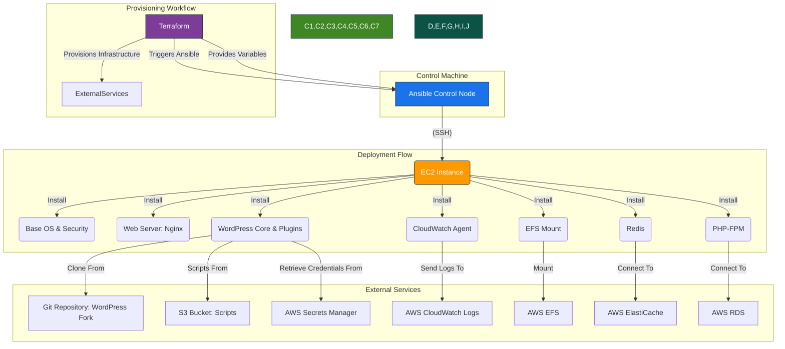

# Ansible Playbooks for AWS Infrastructure Provisioning

---

## Table of Contents

- [1. Overview](#1-overview)
- [2. Prerequisites / Requirements](#2-prerequisites--requirements)
- [3. Architecture Diagram](#3-architecture-diagram)
- [4. Features](#4-features)
- [5. Architecture and Directory Structure](#5-architecture-and-directory-structure)
- [6. Playbooks Description](#6-playbooks-description)
- [7. Configuration (`ansible.cfg`)](#7-configuration-ansiblecfg)
- [8. Inventory](#8-inventory)
- [9. Templates](#9-templates)
- [10. Variable Management](#10-variable-management)
- [11. Example Usage](#11-example-usage)
- [12. Security Considerations / Recommendations](#12-security-considerations--recommendations)
- [13. Logging and Monitoring](#13-logging-and-monitoring)
- [14. Integration with Terraform](#14-integration-with-terraform)
- [15. Troubleshooting and Common Issues](#15-troubleshooting-and-common-issues)
- [16. Useful Resources](#16-useful-resources)

---

## 1. Overview

This directory contains Ansible playbooks and associated configuration files used for provisioning and managing EC2 instances within the AWS infrastructure. The primary roles of these playbooks include:
- Preparing hardened Golden AMIs.
- Deploying and configuring WordPress on EC2 instances.
- Performing smoke tests to verify instance health and configuration.

Ansible automates the configuration management process, ensuring consistency and adherence to best practices across instances.

---

## 2. Prerequisites / Requirements

To run these Ansible playbooks, the following are generally required on the control machine:

- **Ansible:** Version 2.10 or higher.
- **Python 3:** With `boto3` and `botocore` libraries for AWS integration.
- **AWS CLI:** Configured with appropriate credentials and default region.
- **SSH Client:** For connecting to EC2 instances.
- **SSH Key Pair:** The private key corresponding to the public key injected into the EC2 instances.

---

## 3. Architecture Diagram



> _Diagram generated with [Mermaid](https://mermaid.js.org/)_

---

## 4. Features

- **Golden AMI Preparation:** Automates system updates, security hardening (UFW, SSH configuration), and cleanup for creating secure base images.
- **WordPress Deployment:** Installs and configures Nginx, PHP-FPM, MySQL client, Redis, WordPress core, and necessary plugins.
- **EFS Integration:** Configures EFS mounts for WordPress content (e.g., `wp-content/uploads`).
- **CloudWatch Agent Setup:** Installs and configures the CloudWatch Agent for comprehensive log collection.
- **Secrets Management:** Integrates with AWS Secrets Manager for secure retrieval of database credentials and other sensitive data.
- **Smoke Testing:** Verifies the correct application of hardening measures and basic service functionality on new instances.

---

## 5. Architecture and Directory Structure

The `ansible/` directory is organized as follows:

```
ansible/
├── ansible.cfg                 # Main Ansible configuration file
├── inventory/                  # Directory for Ansible inventory files
│   └── golden-ami-ssh.yaml     # Example static inventory for Golden AMI creation
├── playbooks/                  # Directory containing Ansible playbooks
│   ├── install-wordpress.yml   # Playbook for installing and configuring WordPress
│   ├── prepare-golden-ami.yml  # Playbook for hardening and updating the base AMI
│   └── smoke-test-ami.yml      # Playbook for verifying AMI configuration
└── templates/                  # Directory for Jinja2 templates used by playbooks
    ├── wordpress.conf.j2       # Nginx virtual host configuration template
    └── wp-config.php.j2        # WordPress configuration file template
```

---

## 6. Playbooks Description

| **Playbook**               | **Description**                                                                                                                         |
|----------------------------|-----------------------------------------------------------------------------------------------------------------------------------------|
| `prepare-golden-ami.yml`   | Automates secure Golden AMI preparation: system updates, security hardening (UFW, SSH), and cleanup.                                    |
| `install-wordpress.yml`    | Installs and configures the full WordPress stack, including Nginx, PHP, Redis, EFS media mounting, and CloudWatch Agent for logging.    |
| `smoke-test-ami.yml`       | Verifies `prepare-golden-ami.yml` application: checks UFW status, SSH config, security packages, and essential services for AMI health. |

---

## 7. Configuration (`ansible.cfg`)

The `ansible.cfg` file contains global settings for Ansible, including:
- **`inventory`**: Specifies the path to inventory files.
- **`retry_files_enabled`**: Disabled to prevent `.retry` files.
- **`host_key_checking`**: Set to `False` for dynamic environments (caution advised in production).
- **`stdout_callback`**: Set to `yaml` for human-readable output.
- **`log_path`**: Configured to direct Ansible's output to `/var/log/ansible_playbook.log` on the managed node, which is then picked up by the CloudWatch Agent.
- **`verbosity`**: Sets the detail level for logging.

---

## 8. Inventory

The `inventory/` directory holds Ansible inventory files. Currently, it contains:
- **`golden-ami-ssh.yaml`**: A static inventory file example for connecting to a specific EC2 instance (e.g., for initial Golden AMI creation) using SSH keys. For dynamic environments (like Auto Scaling Groups), dynamic inventory scripts are typically used by Terraform.

---

## 9. Templates

The `templates/` directory contains Jinja2 templates used by the playbooks to generate configuration files tailored to each instance:
- **`wordpress.conf.j2`**: A template for Nginx virtual host configuration, handling WordPress permalinks, proxy headers (ALB/CloudFront), and PHP-FPM integration.
- **`wp-config.php.j2`**: A template for the WordPress `wp-config.php` file, dynamically populating database credentials, security keys, Redis settings, and SSL configurations from Ansible variables.

---

## 10. Variable Management

Ansible playbooks utilize variables, often passed from Terraform or defined within the playbooks themselves, to customize deployments. Key variables include:
- `wp_config`: Contains WordPress-specific configurations like database host, port, PHP version, Redis host.
- `db_name`, `db_user`, `db_password`: Database credentials (retrieved from Secrets Manager).
- `site_url`, `wp_admin_user`, `wp_admin_email`, `wp_admin_password`: WordPress installation details.
- `auth_key`, `secure_auth_key`, etc.: WordPress security keys and salts.
- `efs_file_system_id`, `efs_access_point_id`: EFS related variables for conditional mounting.
- `enable_cloudwatch_logs`: Boolean to enable/disable CloudWatch Agent configuration.
- `scripts_bucket_name`: Name of the S3 bucket where `healthcheck.php` and other scripts are stored.

---

## 11. Example Usage

### Running a Playbook on a Local/Development Instance

To run a playbook, you typically specify the inventory file and the playbook itself:

```bash
# Example: Prepare a Golden AMI
ansible-playbook -i inventory/golden-ami-ssh.yaml playbooks/prepare-golden-ami.yml --private-key /path/to/your/ssh_key.pem

# Example: Install WordPress (requires variables to be passed)
ansible-playbook -i inventory/golden-ami-ssh.yaml playbooks/install-wordpress.yml \
  --extra-vars "wp_config.DB_HOST=your_db_host wp_config.DB_PORT=3306 db_name=wordpress db_user=admin db_password=your_password site_url=http://example.com ..." \
  --private-key /path/to/your/ssh_key.pem
```

### Integration with User Data (via Terraform)

In a typical cloud deployment, these playbooks are not run manually against instances in an ASG. Instead, a shell script (e.g., `user_data_ansible.sh.tpl` in the `templates/` directory of the root project) would invoke the Ansible `install-wordpress.yml` playbook on a newly launched EC2 instance as part of its user-data, after bootstrapping Ansible itself.

---

## 12. Security Considerations / Recommendations

- **SSH Hardening:** The `prepare-golden-ami.yml` playbook implements SSH hardening best practices (disabling root login, password authentication).
- **Secrets Management:** Sensitive information like database passwords and API keys should *never* be hardcoded in playbooks or templates. This project utilizes AWS Secrets Manager, with instances retrieving secrets at runtime via IAM roles.
- **Least Privilege:** Ensure the IAM roles assigned to EC2 instances running Ansible have only the minimum necessary permissions.
- **Host Key Checking:** While `host_key_checking = False` is set in `ansible.cfg` for flexibility in dynamic environments, for stricter security, ensure proper host key management is in place in production.
- **Regular Updates:** The `prepare-golden-ami.yml` playbook handles regular package updates for the base AMI.

---

## 13. Logging and Monitoring

- **Ansible Log Path:** Ansible's verbose output is directed to `/var/log/ansible_playbook.log` on the managed node, as configured in `ansible.cfg`.
- **CloudWatch Integration:** The `install-wordpress.yml` playbook installs and configures the CloudWatch Agent. This agent is set up to collect various logs, including `/var/log/ansible_playbook.log`, `/var/log/wordpress.log`, and system logs, forwarding them to AWS CloudWatch Logs for centralized monitoring and analysis.
- **WordPress Debug Logs:** WordPress debug output is directed to `/var/log/wordpress.log` and also collected by the CloudWatch Agent.

---

## 14. Integration with Terraform

These Ansible playbooks are designed to integrate seamlessly with the Terraform project:
- **Golden AMI Creation:** Terraform might invoke `prepare-golden-ami.yml` to build base AMIs.
- **Instance Provisioning:** Terraform passes instance-specific configurations and sensitive data (via AWS Secrets Manager) to EC2 instances. The instances then use user-data scripts to bootstrap Ansible and execute `install-wordpress.yml` for application deployment.
- **EFS & S3 Buckets:** Terraform provisions EFS file systems and S3 buckets (e.g., for scripts like `healthcheck.php`), which are then utilized by the Ansible playbooks.

---

## 15. Troubleshooting and Common Issues

### 1. Playbook Fails to Connect to Host
- **Cause:** Incorrect SSH key path, wrong `ansible_host`, security group rules blocking SSH (port 22).
- **Solution:** Verify SSH key permissions (`chmod 400`), correct IP/DNS, and check security group ingress rules for port 22. Ensure `ssh-agent` is running if using it.

### 2. Missing Dependencies on Managed Node
- **Cause:** A package required by a task is not installed, or the `apt` cache is outdated.
- **Solution:** Ensure `update_cache: yes` is used in `apt` tasks and all necessary packages are listed.

### 3. Permission Denied Errors
- **Cause:** Ansible running as a user without sufficient privileges (`become: yes` might be missing or incorrect `become_user`).
- **Solution:** Verify `become: yes` is set for tasks requiring root privileges. Ensure file ownership/permissions are correct (e.g., `www-data` for WordPress files).

### 4. Secrets Manager Retrieval Issues
- **Cause:** IAM role on the EC2 instance lacks permissions to `secretsmanager:GetSecretValue` or incorrect `secret-id`.
- **Solution:** Check the IAM role policies attached to the instance and the `secret-id` variable.

### 5. CloudWatch Logs Not Appearing
- **Cause:** CloudWatch Agent not installed/running, incorrect configuration file (`amazon-cloudwatch-agent.json`), or IAM permissions.
- **Solution:** Verify agent installation, service status, and IAM role permissions (e.g., `CloudWatchAgentServerPolicy`). Check `log_path` in `ansible.cfg`.

---

## 16. Useful Resources

- [Ansible Documentation](https://docs.ansible.com/)
- [Jinja2 Templating](https://jinja.palletsprojects.com/en/3.1.x/templates/)
- [AWS CLI Documentation](https://docs.aws.amazon.com/cli/latest/userguide/cli-chap-welcome.html)
- [AWS Secrets Manager](https://docs.aws.amazon.com/secretsmanager/latest/userguide/intro.html)
- [AWS CloudWatch Agent](https://docs.aws.amazon.com/AmazonCloudWatch/latest/monitoring/Unified-Agent.html)
