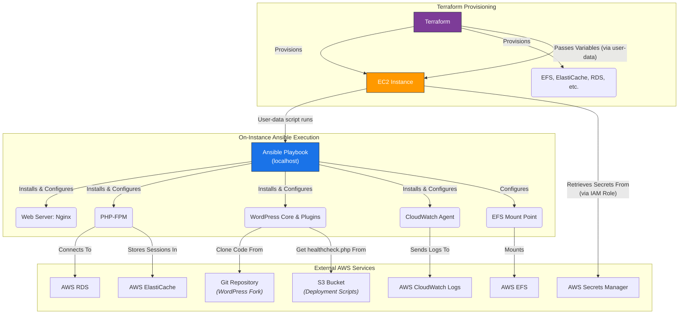

# Ansible Playbook for AWS WordPress Deployment

---

## Table of Contents

- [1. Overview](#1-overview)
- [2. Prerequisites / Requirements](#2-prerequisites--requirements)
- [3. Architecture Diagram](#3-architecture-diagram)
- [4. Features](#4-features)
- [5. Architecture and Directory Structure](#5-architecture-and-directory-structure)
- [6. Playbook Description](#6-playbook-description)
- [7. Configuration (`ansible.cfg`)](#7-configuration-ansiblecfg)
- [8. Inventory](#8-inventory)
- [9. Templates](#9-templates)
- [10. Variable Management](#10-variable-management)
- [11. Example Usage](#11-example-usage)
- [12. Security Considerations / Recommendations](#12-security-considerations--recommendations)
- [13. Logging and Monitoring](#13-logging-and-monitoring)
- [14. Integration with Terraform](#14-integration-with-terraform)
- [15. Troubleshooting and Common Issues](#15-troubleshooting-and-common-issues)
- [16. Useful Resources](#16-useful-resources)

---

## 1. Overview

This directory contains the Ansible playbook and associated configuration files used for deploying a complete WordPress stack on an EC2 instance within the AWS infrastructure.

This playbook serves as the **primary, high-fidelity deployment method** for the `dev` environment. It is designed to be executed on the EC2 instance itself, triggered by a `user-data` script when the `use_ansible_deployment` variable is set to `true` in the Terraform configuration. It automates the entire software stack setup, ensuring a consistent and reliable application environment.

---

## 2. Prerequisites / Requirements

To apply this Ansible playbook on an EC2 instance, the following are required on the instance:

- **Ansible:** Version 2.10 or higher.
- **Python 3:** With `boto3` and `botocore` libraries for AWS integration.
- **Ansible Collection `community.aws`:** Should be installed via `requirements.yml`.

These dependencies are typically installed by a bootstrapping script before the playbook is run.

---

## 3. Architecture Diagram



> _Diagram generated with [Mermaid](https://mermaid.js.org/)_```

> _Diagram generated with [Mermaid](https://mermaid.js.org/)_

This diagram illustrates the application deployment model where Terraform provisions the necessary infrastructure and then triggers an on-instance Ansible run via a user-data script to configure the software stack.

---

## 4. Features

- **Full Stack WordPress Deployment:** Installs and configures Nginx, PHP-FPM, MySQL client, Redis client, WordPress core, and necessary plugins.
- **Secure Database & Cache Integration:** Configures WordPress to connect to RDS (MySQL) and ElastiCache (Redis) using SSL/TLS.
- **EFS Integration:** Configures EFS mounts for shared WordPress content (e.g., `wp-content/uploads`).
- **CloudWatch Agent Setup:** Installs and configures the CloudWatch Agent for comprehensive log collection from the application and system.
- **Secrets Management:** Integrates with AWS Secrets Manager for secure retrieval of database credentials and other sensitive data at runtime.

---

## 5. Architecture and Directory Structure

The `ansible/` directory is organized as follows:

```
`ansible/
├── ansible.cfg                 # Main Ansible configuration for on-instance execution
├── requirements.yml            # Ansible Galaxy collection requirements
├── playbooks/                  # Directory containing the Ansible playbook
│   └── install-wordpress.yml   # Playbook for installing and configuring WordPress
└── templates/                  # Directory for Jinja2 templates used by the playbook
    ├── wordpress.conf.j2       # Nginx virtual host configuration template
    └── wp-config.php.j2        # WordPress configuration file template
```

---

## 6. Playbook Description

The core logic is contained in the `install-wordpress.yml` playbook. It is a comprehensive, idempotent playbook that installs and configures the full WordPress stack, including Nginx, PHP, Redis integration, EFS media mounting, and the CloudWatch Agent for logging. It is designed to be run on `localhost` by a bootstrapping script.

---

## 7. Configuration (`ansible.cfg`)

The primary configuration for the playbook is `ansible.cfg`.

Key settings:
-   **`log_path`**: Specifies the absolute path for the Ansible log file (e.g., `/var/log/ansible_playbook.log`). When Ansible runs on the EC2 instance via user-data, the log file is created there and subsequently collected by the CloudWatch Agent.
-   **`stdout_callback`**: Set to `yaml` for human-readable output.
-   **`host_key_checking`**: Disabled, as it is not relevant for local execution.

---

## 8. Inventory

This project does not use a static inventory file. For application deployment, the user-data script runs Ansible against `localhost`, so an inventory file is not required.

---

## 9. Templates

The `templates/` directory contains Jinja2 templates used by the `install-wordpress.yml` playbook to generate configuration files tailored to each deployment:
- **`wordpress.conf.j2`**: A template for Nginx virtual host configuration, handling WordPress permalinks, proxy headers (from ALB/CloudFront), and PHP-FPM integration.
- **`wp-config.php.j2`**: A template for the WordPress `wp-config.php` file, dynamically populating database credentials, security keys, Redis settings, and SSL configurations from Ansible variables.

---

## 10. Variable Management

The `install-wordpress.yml` playbook is designed to receive all its configuration from variables passed by the `user-data` bootstrapping script (which in turn gets them from Terraform). These variables are passed as "extra vars" from a JSON file.

They are organized into two main structures:

#### 1. `wp_config` (JSON Object)

A JSON object containing general configuration for the stack.

- `wp_config.DB_HOST`: The RDS database endpoint.
- `wp_config.DB_PORT`: The RDS database port.
- `wp_config.PHP_VERSION`: The PHP version to install (e.g., "8.3").
- `wp_config.REDIS_HOST`: The ElastiCache for Redis endpoint.
- `wp_config.REDIS_PORT`: The ElastiCache for Redis port.
- `wp_config.WP_TITLE`: The title for the WordPress site.

#### 2. Top-Level Variables

All other variables, including secrets, are passed as individual top-level keys in the JSON file.

**Secrets (from AWS Secrets Manager):**
- `db_name`, `db_user`, `db_password`
- `wp_admin_user`, `wp_admin_email`, `wp_admin_password_base64` (must be base64 encoded)
- `redis_auth_token`
- `auth_key`, `secure_auth_key`, etc. (all WordPress salts and keys)

**Infrastructure & Configuration:**
- `site_url`: The full public URL for the WordPress site.
- `efs_file_system_id`, `efs_access_point_id`: EFS identifiers for conditional mounting.
- `enable_cloudwatch_logs`: Boolean to enable/disable CloudWatch Agent setup.
- `cloudwatch_log_groups`: A map of log group names.
- `scripts_bucket_name`: Name of the S3 bucket where `healthcheck.php` is stored.
- `vpc_cidr_block`: The VPC CIDR, used to configure trusted IP ranges in Nginx.

---

## 11. Example Usage

### Integration with User Data (Application Deployment)

For deploying WordPress on newly launched EC2 instances (e.g., in an Auto Scaling Group), a shell script (like `user_data_ansible.sh.tpl` in the root `templates/` directory) invokes the `install-wordpress.yml` playbook on the instance itself. In this scenario, Ansible runs locally, so no remote connection (SSH or SSM) is needed.

The user-data script is responsible for:
1. Installing Ansible and its dependencies.
2. Installing the `community.aws` collection from `requirements.yml`.
3. Creating a JSON file (`extra_vars.json`) containing the variables passed by Terraform.
4. Executing the playbook against `localhost`.

```bash
# Example command run by the user-data script on the EC2 instance:
ansible-playbook -i localhost, -c local playbooks/install-wordpress.yml \
  --extra-vars "@extra_vars.json"
```

---

## 12. Security Considerations / Recommendations

- **Secrets Management**: Sensitive information like database passwords and API keys are **never** hardcoded. This project utilizes AWS Secrets Manager, and instances retrieve secrets at runtime via their IAM role. The `install-wordpress.yml` playbook expects these secrets to be passed as variables.
- **Least Privilege IAM Roles**: Ensure the IAM role assigned to the EC2 instance has only the minimum necessary permissions (e.g., to fetch secrets from Secrets Manager, write logs to CloudWatch, and get objects from S3).
- **Secure Connections**: The playbook configures WordPress to connect to its database (RDS) and cache (ElastiCache for Redis) over encrypted TLS connections, and verifies the RDS CA certificate.
- **No Open Inbound Ports**: The security model relies on having no direct public access to the instances (e.g., no open SSH port 22). Access is provided through the load balancer (ports 80/443) and AWS Systems Manager (SSM) for administrative tasks.

---

## 13. Logging and Monitoring

- **Ansible Logs:** When run via **user-data on an EC2 instance**, Ansible logs are written to the path specified in `ansible.cfg` (e.g., `/var/log/ansible_playbook.log`).
- **CloudWatch Integration:** The `install-wordpress.yml` playbook configures the CloudWatch Agent to collect the on-instance Ansible log, along with Nginx, PHP-FPM, WordPress, and system logs. This provides centralized monitoring in AWS CloudWatch.
- **WordPress Debug Logs:** WordPress debug output is directed to `/var/log/wordpress.log` and is also collected by the CloudWatch Agent.

---

## 14. Integration with Terraform

This Ansible playbook is designed to be triggered by the Terraform project:

- **Instance Provisioning**: Terraform provisions EC2 instances and passes instance-specific configurations and sensitive data (retrieved from AWS Secrets Manager) to them.
- **User-Data Bootstrapping**: The instances use a user-data script (templated by Terraform) to bootstrap Ansible locally and execute the `install-wordpress.yml` playbook for application deployment.
- **Infrastructure Dependencies**: Terraform provisions the infrastructure that Ansible configures, including EFS file systems, S3 buckets (for scripts), and the necessary IAM roles and security groups.

---

## 15. Troubleshooting and Common Issues

### 1. Playbook Fails During User-Data Execution
- **Cause:**
    -   An error in the user-data script itself (check `/var/log/cloud-init-output.log`).
    -   Missing dependencies (e.g., `git`, `python3-pip`, `ansible`).
    -   Network issues preventing `apt` or `pip` from downloading packages.
    -   IAM role permissions are insufficient for the instance to fetch secrets or other resources.
- **Solution:**
    -   Connect to the instance via SSM and examine the user-data logs.
    -   Manually run the failing command from the script to get more detailed error output.
    -   Verify the instance's IAM role has the required permissions.
    -   Check VPC security groups, NACLs, and route tables for connectivity issues.

### 2. Permission Denied Errors
- **Cause:** Ansible running a task that requires `sudo` privileges without `become: yes`, or file permission issues.
- **Solution:** Most tasks in `install-wordpress.yml` use `become: yes`. Check that file/directory ownership is correct (e.g., `www-data` for WordPress web root) and that the correct `become_user` is specified for tasks that should not run as root (like `composer`).

### 3. Secrets Manager Retrieval Issues
- **Cause:** The IAM role on the EC2 instance lacks permissions to `secretsmanager:GetSecretValue`.
- **Solution:** Check the IAM role policies attached to the instance. The Terraform templates should grant this permission.

### 4. CloudWatch Logs Not Appearing
- **Cause:** CloudWatch Agent not installed/running, incorrect configuration file (`amazon-cloudwatch-agent.json`), or IAM permissions.
- **Solution:** Verify the agent installation and service status (`sudo /opt/aws/amazon-cloudwatch-agent/bin/amazon-cloudwatch-agent-ctl -m ec2 -a status`). Check the agent's own log file at `/opt/aws/amazon-cloudwatch-agent/logs/amazon-cloudwatch-agent.log`. Ensure the instance IAM role has the `CloudWatchAgentServerPolicy`.

---

## 16. Useful Resources

- [Ansible Documentation](https://docs.ansible.com/)
- [Jinja2 Templating](https://jinja.palletsprojects.com/en/3.1.x/templates/)
- [AWS User Data and Cloud-Init](https://docs.aws.amazon.com/AWSEC2/latest/UserGuide/user-data.html)
- [AWS Secrets Manager](https://docs.aws.amazon.com/secretsmanager/latest/userguide/intro.html)
- [AWS CloudWatch Agent](https://docs.aws.amazon.com/AmazonCloudWatch/latest/monitoring/Unified-Agent.html)
