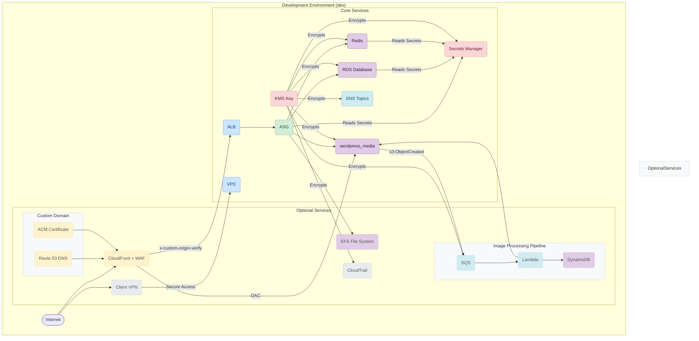

# AWS WordPress Project - Development (`dev`) Environment

---

## Table of Contents

- [1. Overview](#1-overview)
- [2. Architecture](#2-architecture)
  - [2.1. Diagram](#21-diagram)
  - [2.2. Key Configuration Choices](#22-key-configuration-choices)
- [3. How to Deploy](#3-how-to-deploy)
- [4. Local Prerequisites](#4-local-prerequisites)
- [5. Key Operational Workflows](#5-key-operational-workflows)
- [6. Accessing the Environment](#6-accessing-the-environment)
- [7. Primary Outputs](#7-primary-outputs)

---

## 1. Overview

This document describes the configuration of the **development (`dev`) environment** for the WordPress on AWS project.

**Key Characteristics:**
- **Purpose:** Intended for the development and functional testing of the WordPress application and its underlying infrastructure.
- **Region:** `eu-west-1`.
- **Cost-Optimization:** This environment is configured to minimize costs. Many features related to high availability, extensive logging, and data replication are disabled by default but can be enabled via variables in `terraform.tfvars`.
- **Dynamic Configuration:** The services enabled in this environment are not fixed. Developers can enable or disable features as needed for testing by modifying the `terraform.tfvars` file.

---

## 2. Architecture

### 2.1. Diagram

The following diagram illustrates the potential architecture of the `dev` environment. Solid-line components are enabled by default, while dashed-line components are optional and can be enabled via feature flags.



### 2.2. Key Configuration Choices

This environment is highly configurable via `terraform.tfvars`. Below is a description of the default state and how to modify it.

- **Networking (VPC):** A VPC with CIDR `10.0.0.0/16` is created with public and private subnets across three AZs. A **single NAT Gateway** is used to save costs.

- **Compute (ASG):** A single `t3.micro` instance is deployed (max 2). Auto-scaling policies are disabled by default. Deployment is handled on boot via **Ansible** (`use_ansible_deployment = true`). This provisioning process also serves as the basis for creating the "Golden AMI" used by the `stage` environment.

- **Database (RDS):** A single `db.t3.micro` MySQL instance is used. **Multi-AZ is disabled**, and no read replicas are created by default.

- **Caching (ElastiCache):** A single `cache.t2.micro` Redis node is deployed. **Replication and failover are disabled** by default.

- **CDN & WAF (CloudFront):**
  - **Status:** `Enabled`.
  - **Details:** CloudFront serves as the primary entry point, using the default `*.cloudfront.net` domain. The associated **WAF is active**, using AWS managed rules for WordPress and a custom rule to restrict `/wp-admin/` access to Client VPN IPs.
  - **Toggle:** `wordpress_media_cloudfront_enabled = true`

- **Security & Access:**
  - **Secrets Manager:** **Enabled**. All secrets (DB, WordPress, Redis) are managed by Secrets Manager and rotated via the `secrets_version` variable.
  - **Client VPN:**
    - **Status:** `Enabled`.
    - **Details:** Provides secure developer access to the VPC and is required for accessing the WordPress admin panel.
    - **Toggle:** `enable_client_vpn = true`
  - **KMS:** **Enabled**. A central CMK encrypts data at rest for Secrets Manager, RDS, ElastiCache, and CloudWatch Logs.

- **Monitoring & Logging:**
  - **Status:** `Enabled`.
  - **Details:** Basic CloudWatch Log groups for EC2/Nginx/PHP are enabled with a **1-day retention period**. Most alarms are disabled, except for critical ones like `UnHealthyHostCount` for the ALB.
  - **Toggle:** `enable_cloudwatch_logs = true`

- **Optional Features (Current Configuration):**
  - **EFS:**
    - **Status:** Currently `Disabled`. EC2 instances use local EBS storage. Can be enabled by setting `enable_efs = true`.
    - **Toggle Variable:** `enable_efs`
  - **Image Processing Pipeline:**
    - **Status:** Currently `Disabled`. The Lambda, SQS, and DynamoDB resources for image processing are not created. Can be enabled by setting `enable_image_processor = true`.
    - **Toggle Variable:** `enable_image_processor`
  - **CloudTrail:**
    - **Status:** Currently `Disabled`. Can be enabled by setting `default_region_buckets["cloudtrail"].enabled = true`.
    - **Toggle Variable:** `default_region_buckets["cloudtrail"].enabled`
  - **Custom Domain:**
    - **Status:** Currently `Disabled`. The ACM and Route53 modules are not used. Can be enabled by setting `create_dns_and_ssl = true`.
    - **Toggle Variable:** `create_dns_and_ssl`

---

## 3. How to Deploy

### State Backend Warning
This environment currently uses a **local backend** to store the Terraform state file (`terraform.tfstate`). This is suitable for individual work but not for team collaboration. For team-based development, configure the S3 remote backend by uncommenting and filling out `remote_backend.tf`.

### Deployment Instructions
1. Navigate to the environment directory:
   ```bash
   cd environments/dev
   ```
2. Initialize Terraform (this will download providers and set up the local backend):
   ```bash
   terraform init
   ```
3. Apply the configuration:
   ```bash
   terraform apply
   ```
---

## 4. Local Prerequisites

To successfully deploy and manage this environment, the following tools must be installed on your local machine:

- **Terraform (`~> 1.12`)**: To manage infrastructure as code.
- **AWS CLI**: To interact with your AWS account. Ensure it is configured with the necessary credentials.
- **Ansible**: Required for the initial provisioning of the EC2 instances in this `dev` environment.
- **Python & pip**: Required by the `build_layer.sh` script for building Lambda layers (if the image processing feature is enabled).
- **zip**: A standard command-line utility required for packaging Lambda source code.
- **Docker**: Required by the `build_layer.sh` script to create a consistent build environment for Python dependencies.

---

## 5. Key Operational Workflows

### Secrets Rotation
This project uses an IaC-driven approach to rotate secrets (e.g., database password, WordPress salts).

1.  **Update Secret Version**: Change the value of the `secrets_version` variable in `terraform.tfvars`.
2.  **Apply Changes**: Run `terraform apply`. This will regenerate the random passwords/keys and update the values in AWS Secrets Manager.
3.  **Roll Out to Application**: The running EC2 instances will not automatically pick up the new secrets. You must force the Auto Scaling Group to launch new instances, which will fetch the new secrets on boot. This can be done via the AWS Console or by running:
    ```bash
    aws autoscaling start-instance-refresh --auto-scaling-group-name <asg-name>
    ```
    *(Replace `<asg-name>` with the actual name of the Auto Scaling Group from Terraform outputs.)*

### Shutting Down the Environment
To avoid incurring costs when the environment is not in use, you can destroy all provisioned resources:
```bash
terraform destroy
```

---

## 6. Accessing the Environment

### Website Access
The public URL for the WordPress site is available as a Terraform output:
```bash
terraform output -raw alb_dns_name
```

### WordPress Admin Panel (`/wp-admin/`)
Access to the admin panel is blocked by the WAF and is only permitted from an active Client VPN session.

### Client VPN Connection
1.  **Get the `.ovpn` configuration file:**
    ```bash
    terraform output -raw client_vpn_config_file > wordpress-dev.ovpn
    ```
2.  **Import and Connect:** Import the `wordpress-dev.ovpn` file into your AWS VPN Client or any other OpenVPN-compatible client and connect.
3.  Once connected, you will be able to access the `/wp-admin/` path on the site URL.

---

## 7. Primary Outputs

- `alb_dns_name`: The DNS name of the Application Load Balancer to access the site.
- `client_vpn_config_file`: Command to get the `.ovpn` configuration file for VPN access.
- `asg_id`: The ID of the Auto Scaling Group.
- `rds_db_instance_identifier`: The identifier of the RDS instance.
- `kms_key_arn`: The ARN of the master KMS key.
