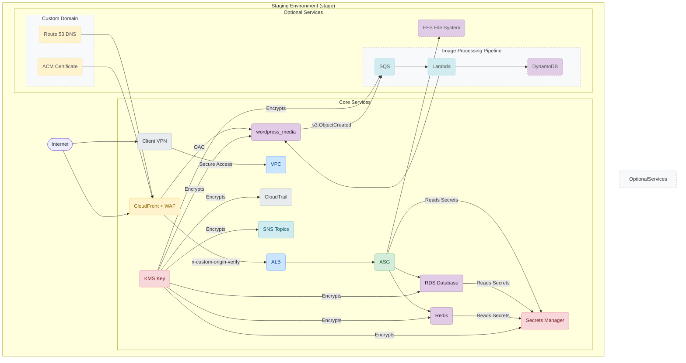

# AWS WordPress Project - Staging (`stage`) Environment

---

## Table of Contents

- [1. Overview](#1-overview)
- [2. Architecture and Deployment Strategy](#2-architecture-and-deployment-strategy)
  - [2.1. Diagram](#21-diagram)
  - [2.2. Key Configuration Choices](#22-key-configuration-choices)
- [3. How to Deploy](#3-how-to-deploy)
- [4. Local Prerequisites](#4-local-prerequisites)
- [5. Key Operational Workflows](#5-key-operational-workflows)
- [6. Accessing the Environment](#6-accessing-the-environment)
- [7. Primary Outputs](#7-primary-outputs)

---

## 1. Overview

This document describes the configuration of the **staging (`stage`) environment** for the WordPress on AWS project.

**Key Characteristics:**
- **Purpose:** Serves as a pre-production environment for integration testing, load testing, and final validation before deploying to production. It is designed to mirror the production environment as closely as possible.
- **Region:** `eu-west-1`.
- **Enhanced Monitoring & Logging:** Compared to `dev`, this environment has more robust monitoring and logging enabled by default to facilitate thorough testing and performance analysis.

---

## 2. Architecture and Deployment Strategy

### 2.1. Diagram

The following diagram illustrates the potential architecture of the `stage` environment. Solid-line components are generally enabled by default in `stage`, while dashed-line components are optional and can be enabled via feature flags for specific testing scenarios.



### 2.2. Key Configuration Choices

- **Deployment Strategy (Golden AMI):**
  - The `stage` environment uses a **Golden AMI** deployment strategy for its EC2 instances. This is a fundamental difference from the `dev` environment.
  - The process involves pre-building an AMI using the Ansible playbooks `ansible/playbooks/install-wordpress.yml` and `ansible/playbooks/prepare-golden-ami.yml`.
  - At launch, instances use the `user_data_runtime.sh.tpl` template, which only injects runtime configurations (e.g., fetching secrets) rather than performing a full software installation. This results in much faster and more consistent deployments.
  - The `use_ansible_deployment` variable is set to `false` to reflect this.

- **Monitoring & Logging (Enhanced):**
  - **Status:** `Enabled`.
  - **Details:** Unlike `dev`, the `stage` environment has most monitoring and logging features enabled by default to allow for proper performance and security analysis. This includes:
    - Scaling alarms for the ASG.
    - Low storage alarms for RDS.
    - ALB access logging to S3.
    - CloudTrail logging to S3.
    - WAF logging via Kinesis Firehose for both ALB and CloudFront.
    - S3 bucket versioning is enabled.

- **Networking & Compute:**
  - The VPC and subnet layout is identical to `dev`.
  - ASG and RDS instances may use more powerful instance types than `dev`, and auto-scaling is enabled. These are configured in `terraform.tfvars`.

- **Disabled/Optional Features (by default):**
  - **EFS:**
    - **Status:** Currently `Disabled`. Can be enabled by setting `enable_efs = true`.
  - **Image Processing Pipeline:**
    - **Status:** Currently `Disabled`. Can be enabled by setting `enable_image_processor = true`.
  - **Custom Domain:**
    - **Status:** Currently `Disabled`. Can be enabled by setting `create_dns_and_ssl = true`.

---

## 3. How to Deploy

### State Backend Warning
This environment currently uses a **local backend** to store the Terraform state file (`terraform.tfstate`). For team-based development, configure the S3 remote backend by uncommenting and filling out `remote_backend.tf`.

### Deployment Instructions
1. Navigate to the environment directory:
   ```bash
   cd environments/stage
   ```
2. Initialize Terraform:
   ```bash
   terraform init
   ```
3. Apply the configuration. Ensure you are using the correct Golden AMI ID in `terraform.tfvars`.
   ```bash
   terraform apply
   ```
---

## 4. Local Prerequisites

To successfully deploy and manage this environment, the following tools must be installed on your local machine:

- **Terraform (`~> 1.12`)**: To manage infrastructure as code.
- **AWS CLI**: To interact with your AWS account. Ensure it is configured with the necessary credentials.
- **Ansible**: Although `stage` instances do not run Ansible on boot, it is required for the *creation* of the Golden AMI.
- **Python & pip**: Required by helper scripts for Lambda layers (if enabled).
- **zip**: A standard command-line utility required for packaging Lambda source code.
- **Docker**: Potentially required by build scripts for creating consistent build environments.

---

## 5. Key Operational Workflows

### Golden AMI Workflow
The `stage` environment uses a pre-built "Golden AMI" for faster and more consistent deployments. To update this AMI (e.g., for OS updates or new software):

1.  **Provision a Base Instance**: Deploy a temporary EC2 instance using a configuration similar to the `dev` environment, which runs the full `ansible/playbooks/install-wordpress.yml` playbook on a base OS.
2.  **Harden and Seal the Image**: Run the `ansible/playbooks/prepare-golden-ami.yml` playbook against the running instance. This playbook performs system updates, hardens security settings (SSH, firewall), and cleans up any sensitive data or temporary files.
3.  **Create the AMI**: From the AWS EC2 Console, create a new Amazon Machine Image (AMI) from the hardened instance.
4.  **Update Configuration**: Update the `ami_id` variable in `environments/stage/terraform.tfvars` with the ID of the new Golden AMI.
5.  **Deploy**: Run `terraform apply`. The Auto Scaling Group will perform a rolling refresh to launch new instances with the updated Golden AMI.

### Secrets Rotation
This project uses an IaC-driven approach to rotate secrets (e.g., database password, WordPress salts).

1.  **Update Secret Version**: Change the value of the `secrets_version` variable in `terraform.tfvars`.
2.  **Apply Changes**: Run `terraform apply`. This will regenerate the random passwords/keys and update the values in AWS Secrets Manager.
3.  **Roll Out to Application**: The running EC2 instances will not automatically pick up the new secrets. You must force the Auto Scaling Group to launch new instances, which will fetch the new secrets on boot. This can be done via the AWS Console or by running:
    ```bash
    aws autoscaling start-instance-refresh --auto-scaling-group-name <asg-name>
    ```
    *(Replace `<asg-name>` with the actual name of the Auto Scaling Group from Terraform outputs.)*

### Shutting Down the Environment
To avoid incurring costs when the environment is not in use, you can destroy all provisioned resources:
```bash
terraform destroy
```

---

## 6. Accessing the Environment

Access methods are identical to the `dev` environment.

### Website Access
The public URL for the WordPress site is available as a Terraform output:
```bash
terraform output -raw alb_dns_name
```

### WordPress Admin Panel (`/wp-admin/`)
Access to the admin panel is blocked by the WAF and is only permitted from an active Client VPN session.

### Client VPN Connection
1.  **Get the `.ovpn` configuration file:**
    ```bash
    terraform output -raw client_vpn_config_file > wordpress-stage.ovpn
    ```
2.  **Import and Connect:** Import the `wordpress-stage.ovpn` file into your AWS VPN Client or any other OpenVPN-compatible client and connect.
3.  Once connected, you will be able to access the `/wp-admin/` path on the site URL.

---

## 7. Primary Outputs

- `alb_dns_name`: The DNS name of the Application Load Balancer to access the site.
- `client_vpn_config_file`: Command to get the `.ovpn` configuration file for VPN access.
- `asg_id`: The ID of the Auto Scaling Group.
- `rds_db_instance_identifier`: The identifier of the RDS instance.
- `kms_key_arn`: The ARN of the master KMS key.
