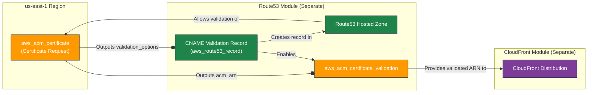

# AWS Certificate Manager (ACM) Terraform Module

---

## Table of Contents

- [1. Overview](#1-overview)
- [2. Prerequisites / Requirements](#2-prerequisites--requirements)
- [3. Architecture Diagram](#3-architecture-diagram)
- [4. Features](#4-features)
- [5. Module Architecture](#5-module-architecture)
- [6. Module Files Structure](#6-module-files-structure)
- [7. Inputs](#7-inputs)
- [8. Outputs](#8-outputs)
- [9. Example Usage](#9-example-usage)
- [10. Security Considerations / Recommendations](#10-security-considerations--recommendations)
- [11. Conditional Resource Creation](#11-conditional-resource-creation)
- [12. Best Practices](#12-best-practices)
- [13. Integration](#13-integration)
- [14. Future Improvements](#14-future-improvements)
- [15. Troubleshooting and Common Issues](#15-troubleshooting-and-common-issues)
- [16. Notes](#16-notes)
- [17. Useful Resources](#17-useful-resources)

---

## 1. Overview

This Terraform module provisions an AWS Certificate Manager (ACM) certificate specifically for use with global services like Amazon CloudFront. It automates the certificate request process using DNS validation, which is the most robust method for infrastructure-as-code workflows. The module is intentionally designed to be decoupled from the validation process to prevent circular dependencies with DNS management modules (like Route53).

---

## 2. Prerequisites / Requirements

- An AWS provider aliased as `aws.cloudfront` and configured for the `us-east-1` region must be available in the root module. This is a strict AWS requirement for certificates used with CloudFront.
- A Route53 hosted zone for the domain specified in `custom_domain_name` must exist or be managed in a separate module.

---

## 3. Architecture Diagram



> _This diagram illustrates the decoupled architecture. This `acm` module only creates the `aws_acm_certificate`. The validation records and the `aws_acm_certificate_validation` resource must be handled in a separate DNS module to avoid circular dependencies._

---

## 4. Features

- **Certificate Request:** Provisions an `aws_acm_certificate` resource.
- **`us-east-1` Enforcement:** Ensures the certificate is created in the `us-east-1` region, making it compatible with CloudFront.
- **DNS Validation:** Configured for DNS validation, enabling full automation.
- **Decoupled Design:** Intentionally separated from the validation logic to maintain a clean dependency graph.
- **Safe Updates:** Uses `create_before_destroy` lifecycle policy to prevent downtime during certificate renewals or changes.

---

## 5. Module Architecture

This module's architecture is intentionally minimal and focused. It is responsible for a single task: **requesting an ACM certificate**.

The validation of the certificate is explicitly **not** handled by this module. The module outputs the necessary `domain_validation_options`, which must be consumed by another module (typically a Route53 module) to create the required DNS CNAME records. That same Route53 module should also contain the `aws_acm_certificate_validation` resource to complete the process.

This separation is critical for preventing a circular dependency where `acm` depends on `route53` for validation records, and `route53` might depend on `acm` for other purposes.

---

## 6. Module Files Structure

| **File**       | **Description**                                                                 |
|----------------|---------------------------------------------------------------------------------|
| `main.tf`      | Declares the `aws_acm_certificate` resource.                                    |
| `variables.tf` | Defines all configurable input variables for the certificate.                   |
| `outputs.tf`   | Exposes the certificate ARN and the data required for DNS validation.           |
| `README.md`    | This documentation file.                                                        |

---

## 7. Inputs

| Name                        | Type           | Description                                                                                |
|-----------------------------|----------------|--------------------------------------------------------------------------------------------|
| `name_prefix`               | `string`       | Resource name prefix (e.g., 'myproject').                                                  |
| `environment`               | `string`       | Deployment environment (e.g., 'dev', 'stage', 'prod').                                     |
| `tags`                      | `map(string)`  | Tags applied to all taggable resources.                                                    |
| `custom_domain_name`        | `string`       | Main domain (FQDN) for which the certificate should be issued (e.g., 'example.com').       |
| `subject_alternative_names` | `list(string)` | List of additional domains (SANs) included in the certificate (e.g., ["www.example.com"]). |

---

## 8. Outputs

| **Name**                    | **Description**                                                                                                                   |
|-----------------------------|-----------------------------------------------------------------------------------------------------------------------------------|
| `acm_arn`                   | The Amazon Resource Name (ARN) of the certificate. Use this to attach the certificate to CloudFront or other AWS services.        |
| `acm_id`                    | The ID of the certificate (identical to the ARN).                                                                                 |
| `domain_validation_options` | A set of objects containing the DNS records required for validating the certificate. Use these to create CNAME records in Route53.|

---

## 9. Example Usage

```hcl
# In your root module (e.g., main.tf)

# This ACM module requests the certificate
module "acm" {
  source                    = "./modules/acm"
  name_prefix               = "my-app"
  environment               = "prod"
  custom_domain_name        = "example.com"
  subject_alternative_names = ["www.example.com"]
  tags                      = { "Terraform" = "true" }
}

# A separate Route53 module would consume the output to create validation records
# (This is a conceptual example)
module "route53" {
  source = "./modules/route53"

  # Pass the validation options to the route53 module
  acm_validation_options = module.acm.domain_validation_options
  certificate_arn        = module.acm.acm_arn

  # ... other route53 variables
}
```

---

## 10. Security Considerations / Recommendations

- **Decoupled Validation:** The primary security and architectural recommendation is to handle certificate validation in a separate DNS management module, as designed. This avoids complex dependency issues.
- **Least Privilege:** The IAM role executing this Terraform code only needs permissions for `acm:RequestCertificate`, `acm:DescribeCertificate`, `acm:DeleteCertificate`, and `acm:AddTagsToCertificate`.
- **Sensitive Outputs:** The `domain_validation_options` output is correctly marked as sensitive because it contains unique tokens that should not be exposed in logs.

---

## 11. Conditional Resource Creation

This module does not contain any conditionally created resources. It always creates one `aws_acm_certificate` resource.

---

## 12. Best Practices

- **Use `us-east-1`:** Always use a provider alias to ensure the certificate is created in `us-east-1` for CloudFront compatibility.
- **Automate Validation:** Integrate the module's output with a Route53 module to fully automate the DNS validation process.
- **`create_before_destroy`:** This lifecycle hook is included to ensure zero downtime during certificate renewals or updates.

---

## 13. Integration

This module is designed to integrate with:
- **Route53 Module:** Consumes `domain_validation_options` to create DNS validation records and `acm_arn` to run `aws_acm_certificate_validation`.
- **CloudFront Module:** Consumes the final, validated `acm_arn` to enable HTTPS on a distribution.

---

## 14. Future Improvements

- Given the module's focused scope, there are no major improvements planned. Its simplicity is its primary strength.

---

## 15. Troubleshooting and Common Issues

### 1. Certificate Stuck in `PENDING_VALIDATION`
- **Cause:** The DNS validation records were not created, or were created incorrectly.
- **Solution:** Ensure that the `domain_validation_options` output of this module is being correctly used by a Route53 module to create the necessary CNAME records. Verify the records exist in your Route53 hosted zone using the AWS console or CLI.

### 2. `Ineligible` Certificate Status
- **Cause:** You are trying to request a certificate for an AWS-owned domain (e.g., `*.amazonaws.com`) or a domain for which you do not have validation rights.
- **Solution:** Ensure `custom_domain_name` is a domain you own and control.

### 3. Terraform Error: `provider "aws.cloudfront" not configured`
- **Cause:** You have not defined a provider alias named `cloudfront` in your root Terraform configuration.
- **Solution:** Add the provider block to your main configuration:
  ```hcl
  provider "aws" {
    alias  = "cloudfront"
    region = "us-east-1"
  }
  ```

---

## 16. Notes

- The responsibility of this module ends at requesting the certificate. The caller of the module is responsible for ensuring the certificate becomes valid by creating the appropriate DNS records.

---

## 17. Useful Resources

- [AWS ACM Documentation](https://docs.aws.amazon.com/acm/latest/userguide/acm-overview.html)
- [Terraform `aws_acm_certificate` Resource](https://registry.terraform.io/providers/hashicorp/aws/latest/docs/resources/acm_certificate)
- [Terraform `aws_acm_certificate_validation` Resource](https://registry.terraform.io/providers/hashicorp/aws/latest/docs/resources/acm_certificate_validation)
- [Using ACM Certificates with CloudFront](https://docs.aws.amazon.com/AmazonCloudFront/latest/DeveloperGuide/cnames-and-https-requirements.html#https-requirements-aws-managed-certificates)
