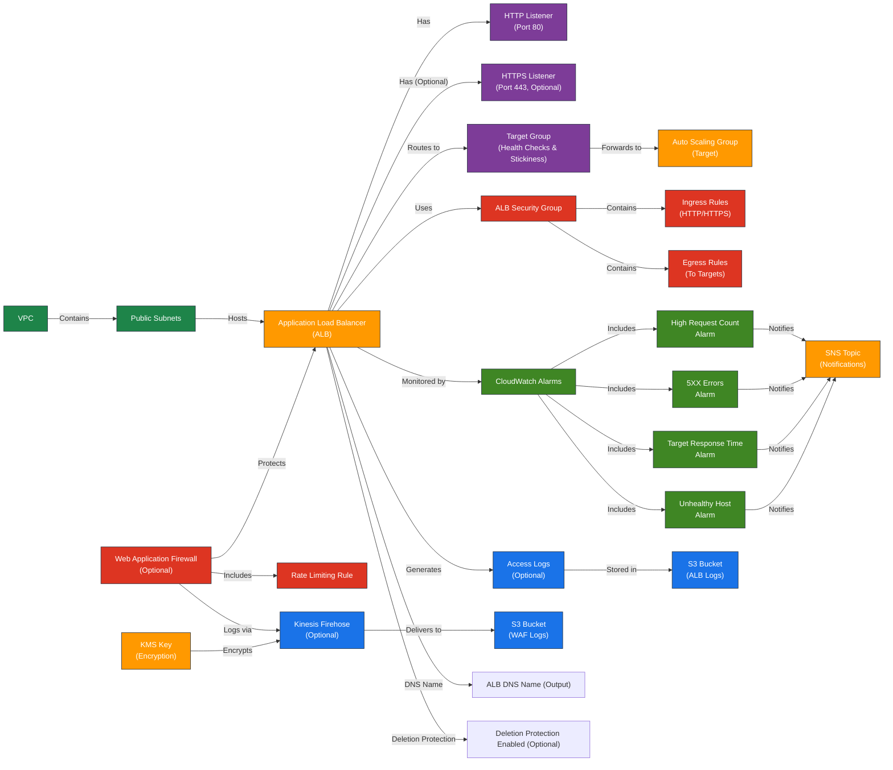

# AWS Application Load Balancer (ALB) Terraform Module

---

## Table of Contents

- [1. Overview](#1-overview)
- [2. Prerequisites / Requirements](#2-prerequisites--requirements)
- [3. Architecture Diagram](#3-architecture-diagram)
- [4. Features](#4-features)
- [5. Module Architecture](#5-module-architecture)
- [6. Module Files Structure](#6-module-files-structure)
- [7. Inputs](#7-inputs)
- [8. Outputs](#8-outputs)
- [9. Example Usage](#9-example-usage)
- [10. Security Considerations / Recommendations](#10-security-considerations--recommendations)
- [11. Conditional Resource Creation](#11-conditional-resource-creation)
- [12. Best Practices](#12-best-practices)
- [13. Integration](#13-integration)
- [14. Future Improvements](#14-future-improvements)
- [15. Troubleshooting and Common Issues](#15-troubleshooting-and-common-issues)
- [16. Notes](#16-notes)
- [17. Useful Resources](#17-useful-resources)

---

## 1. Overview

This Terraform module provisions and manages an AWS Application Load Balancer (ALB) with full support for HTTP and HTTPS traffic. It includes integrated security groups, monitoring, access logging, and Web Application Firewall (WAF) protection, following Terraform and AWS best practices.

---

## 2. Prerequisites / Requirements

- AWS provider must be configured in the root module.
- Existing **VPC** and **Public Subnets** must be provided.
- Valid **ACM SSL Certificate ARN** is required if HTTPS Listener is enabled.
- **KMS Key ARN** is required if Kinesis Firehose is enabled for WAF logging.
- **S3 Bucket** for ALB Access Logs if logging is enabled.

---

## 3. Architecture Diagram



> _Diagram generated with [Mermaid](https://mermaid.js.org/)_

---

## 4. Features:
- **Public-facing ALB** handling HTTP/HTTPS traffic
- **Target Group** configured with advanced health checks and session stickiness
- **Security Group** with controlled inbound/outbound traffic rules
- **CloudWatch Alarms** for performance and error monitoring
- **WAF Integration** for protection against web-layer attacks
- **Kinesis Firehose** for efficient WAF log delivery to S3

---

## 5. Module Architecture

This module provisions:
- **Application Load Balancer (ALB)**
- **ALB Target Group** for backend integration (e.g., Auto Scaling Groups)
- **Security Group** tailored for ALB traffic management
- **Optional HTTPS Listener** (requires valid SSL certificate)
- **AWS WAF** with rate-based rules and conditional logging
- **CloudWatch Alarms** for proactive monitoring
- **Kinesis Firehose** for log processing (conditional)

---

## 6. Module Files Structure
- The module is organized into logical files for clarity and maintainability:

| **File**             | **Description**                                                           |
|----------------------|---------------------------------------------------------------------------|
| `main.tf`            | Declares the ALB, Target Group, Listeners, and core configuration.        |
| `security_group.tf`  | Manages the Security Group and its rules for the ALB.                     |
| `waf.tf`             | Provisions WAF with rate limiting and optional AWS Managed Rules.         |
| `firehose.tf`        | Sets up Kinesis Firehose for WAF log delivery to S3 with KMS encryption.  |
| `metrics.tf`         | Contains CloudWatch Alarms for monitoring ALB performance and errors.     |
| `variables.tf`       | Defines all configurable variables with validation and defaults.          |
| `outputs.tf`         | Exposes module outputs for integration with other modules or environments.|

---

## 7. Inputs

| Name                                    | Type           | Description                                                | Validation                          |
|-----------------------------------------|----------------|------------------------------------------------------------|-------------------------------------|
| `name_prefix`                           | `string`       | Prefix for resource names                                  | <= 24 chars                         |
| `environment`                           | `string`       | Deployment environment                                     | One of: `dev`, `stage`, `prod`      |
| `tags`                                  | `map(string)`  | Tags to apply to all resources                             | `{}` (Optional)                     |
| `public_subnets`                        | `list(string)` | Public subnet IDs for ALB                                  | Valid subnet IDs                    |
| `vpc_id`                                | `string`       | VPC ID for ALB                                             | Valid VPC ID                        |
| `vpc_cidr_block`                        | `string`       | The CIDR block of the VPC, used for internal health checks.| Non-empty string                    |
| `target_group_port`                     | `number`       | Port for the target group                                  | Default: `80`                       |
| `certificate_arn`                       | `string`       | SSL Certificate ARN for HTTPS listener                     | Required if HTTPS enabled           |
| `alb_enable_deletion_protection`        | `bool`         | Enable deletion protection for the ALB                     | Default: `false`                    |
| `enable_https_listener`                 | `bool`         | Toggle HTTPS Listener                                      | `true` or `false`                   |
| `enable_alb_access_logs`                | `bool`         | Toggle ALB access logs                                     | `true` or `false`                   |
| `alb_logs_bucket_name`                  | `string`       | S3 bucket for ALB logs                                     | Non-empty string or `null`          |
| `logging_bucket_arn`                    | `string`       | ARN of S3 bucket for Firehose                              | Non-empty if Firehose enabled       |
| `kms_key_arn`                           | `string`       | KMS key ARN for log encryption                             | Non-empty if Firehose enabled       |
| `enable_alb_firehose`                   | `bool`         | Toggle Kinesis Firehose                                    | `true` or `false`                   |
| `enable_alb_firehose_cloudwatch_logs`   | `bool`         | Enable CloudWatch logging for Firehose delivery stream     | `true` or `false`                   |
| `enable_alb_waf`                        | `bool`         | Toggle WAF protection                                      | `true` or `false`                   |
| `enable_alb_waf_logging`                | `bool`         | Toggle WAF logging (requires Firehose)                     | `true` or `false`                   |
| `cloudfront_to_alb_secret_header_value` | `string`       | Secret value for the custom CloudFront → ALB header.       | `sensitive`                         |
| `alb_access_cloudfront_mode`            | `bool`         | If true, restricts ALB ingress to CloudFront IPs.          | Default: `false`                    |
| `asg_security_group_id`                 | `string`       | The ID of the security group attached to the ASG instances.| Non-empty string                    |
| `sns_topic_arn`                         | `string`       | SNS topic for CloudWatch Alarms                            | Valid SNS ARN                       |
| `alb_request_count_threshold`           | `number`       | Threshold for high request count on ALB                    | Default: `1000`                     |
| `alb_5xx_threshold`                     | `number`       | Threshold for 5XX errors on ALB                            | Default: `50`                       |
| `enable_high_request_alarm`             | `bool`         | Enable CloudWatch alarm for high request count             | Default: `false`                    |
| `enable_5xx_alarm`                      | `bool`         | Enable CloudWatch alarm for HTTP 5XX errors                | Default: `false`                    |
| `enable_target_response_time_alarm`     | `bool`         | Enable CloudWatch alarm for Target Response Time           | Default: `false`                    |

---

## 8. Outputs

| **Name**                            | **Description**                                      |
|-------------------------------------|------------------------------------------------------|
| `alb_arn`                           | ARN of the Application Load Balancer                 |
| `alb_dns_name`                      | DNS name of the Application Load Balancer            |
| `alb_name`                          | Name of the Application Load Balancer                |
| `alb_security_group_id`             | Security Group ID of the ALB                         |
| `wordpress_tg_arn`                  | ARN of the WordPress Target Group                    |
| `alb_target_group_name`             | Name of the WordPress target group                   |
| `alb_access_logs_bucket_name`       | Name of the S3 bucket for ALB access logs            |
| `alb_waf_arn`                       | ARN of the WAF Web ACL (if enabled)                  |
| `alb_waf_logs_firehose_arn`         | ARN of the Kinesis Firehose for WAF logs (if enabled)|
| `enable_https_listener`             | Whether HTTPS listener is enabled on the ALB         |
| `alb_high_request_count_alarm_arn`  | ARN for high request count alarm                     |
| `alb_5xx_errors_alarm_arn`          | ARN for 5XX errors alarm                             |
| `alb_target_response_time_alarm_arn`| ARN for target response time alarm                   |
| `alb_unhealthy_host_count_alarm_arn`| ARN for unhealthy targets alarm                      |

---

## 9. Example Usage
### Example usage for production environment with full features enabled (WAF, logging, HTTPS)

```hcl
module "alb" {
  source                                = "./modules/alb"
  name_prefix                           = "prod"
  environment                           = "prod"
  tags                                  = { "Terraform" = "true" }
  public_subnets                        = module.vpc.public_subnet_ids
  vpc_id                                = module.vpc.vpc_id
  vpc_cidr_block                        = module.vpc.vpc_cidr_block
  asg_security_group_id                 = module.asg.asg_security_group_id
  enable_https_listener                 = true
  certificate_arn                       = "arn:aws:acm:eu-west-1:123456789012:certificate/example"
  enable_alb_access_logs                = true
  alb_logs_bucket_name                  = "prod-alb-logs"
  logging_bucket_arn                    = module.s3.logging_bucket_arn
  kms_key_arn                           = module.kms.kms_key_arn
  enable_alb_firehose                   = true
  enable_alb_waf                        = true
  enable_alb_waf_logging                = true
  alb_access_cloudfront_mode            = true
  cloudfront_to_alb_secret_header_value = "a-secure-secret-value"
  sns_topic_arn                         = aws_sns_topic.cloudwatch_alarms.arn
  enable_high_request_alarm             = true
  enable_5xx_alarm                      = true
  enable_target_response_time_alarm     = true
}
```

---

## 10. Security Considerations / Recommendations
- **HTTPS recommended** for encrypted client communication.
- **WAF** protects against common attacks like rate-limiting and injection.
- **Firehose** delivers encrypted logs securely to S3.
- **CloudWatch alarms** proactively monitor ALB health.

### General Recommendations
- Enable HTTPS Listener with a valid SSL certificate.
- Adjust alarm thresholds according to real-world traffic.

### Security Best Practices
- Always enable WAF for production to protect against common web attacks.
- Store ALB and WAF logs securely in S3 with **KMS encryption**.
- Review and tighten Security Group rules periodically.
- Regularly audit IAM roles and policies for least privilege.
- Configure CloudWatch alarms with SNS notifications for proactive monitoring.
- Ensure `enable_alb_firehose` is enabled if WAF logging is required.

---

## 11. Conditional Resource Creation

This module supports conditional creation of certain resources based on input variables:

- **HTTPS Listener** is created only if `enable_https_listener = true`.
- **ALB Access Logging** is enabled only if `enable_alb_access_logs = true` and `alb_logs_bucket_name` is provided.
- **Kinesis Firehose** is provisioned only if `enable_alb_firehose = true`.
- **AWS WAF** is created and attached to ALB only if `enable_alb_waf = true`.
- **WAF Logging** is enabled only if both `enable_alb_waf_logging = true` and `enable_alb_firehose = true`.
- **CloudWatch Alarms** are created based on the following flags:
  - `enable_high_request_alarm` for high request count alarm
  - `enable_5xx_alarm` for 5XX errors alarm
  - `enable_target_response_time_alarm` for target response time alarm
  - Note: The unhealthy host count alarm is always created as it's critical for monitoring

---

## 12. Best Practices
- Enable HTTPS Listener with valid SSL certificate.
- Adjust alarm thresholds according to real-world traffic.

### Security Best Practices
- Always enable WAF for production to protect against common web attacks.
- Store ALB and WAF logs securely in S3 with **KMS encryption**.
- Review and tighten Security Group rules periodically.
- Regularly audit IAM roles and policies for least privilege.
- Configure CloudWatch alarms with SNS notifications for proactive monitoring.
- Ensure `enable_alb_firehose` is enabled if WAF logging is required.

---

## 13. Integration
Integrates with:
- **VPC Module:** Network infrastructure.
- **ASG Module:** Backend instances.
- **KMS Module:** Log encryption.

---

## 14. Future Improvements
- **Enhanced WAF Rules:** Integrate AWS Managed Rule Groups for comprehensive protection:
  - CommonRuleSet
  - SQLiRuleSet
  - CrossSiteScriptingRuleSet
  - KnownBadInputsRuleSet
  - BotControlRuleSet
- **Advanced Traffic Insights:** Add CloudWatch dashboards and additional metrics.
- **Automated SSL management:** Integrate automatic ACM certificate rotation.

---

## 15. Troubleshooting and Common Issues

### 1. HTTPS Listener not working
- **Cause:** Missing or invalid `certificate_arn`
- **Solution:** Ensure a valid ACM certificate is provisioned in the same region and `enable_https_listener = true`.

### 2. WAF Logging not delivered to S3
- **Cause:** `enable_alb_firehose` is not enabled or `logging_bucket_arn` is incorrect.
- **Solution:** Verify both `enable_alb_firehose = true` and a valid `logging_bucket_name` are set.

### 3. CloudWatch Alarms not triggering
- **Cause:** `enable_high_request_alarm`, `enable_5xx_alarm`, or `enable_target_response_time_alarm` not set.
- **Solution:** Enable necessary alarms based on your monitoring needs.

### 4. ALB DNS not resolving
- **Cause:** ALB is not in an active state or incorrect DNS name used.
- **Solution:** Check the ALB state in the AWS Console and use the correct output `alb_dns_name`.

### 5. WAF Managed Rules missing (production)
- **Cause:** Only rate limiting is configured by default.
- **Solution:** Extend the WAF configuration by adding AWS Managed Rule Groups for production.

### 6. AWS CLI Reference

This section provides common AWS CLI commands that help verify and debug the ALB module configuration and runtime behavior.

#### ALB Diagnostics

```bash
# List all Application Load Balancers
aws elbv2 describe-load-balancers --region <region>

# Describe a specific ALB by name
aws elbv2 describe-load-balancers --names <alb-name> --region <region>

# Get listeners attached to a specific ALB
aws elbv2 describe-listeners --load-balancer-arn <alb-arn> --region <region>

# Retrieve listener rules (if using listener rules outside the module)
aws elbv2 describe-rules --listener-arn <listener-arn> --region <region>

# Get target group health status
aws elbv2 describe-target-health --target-group-arn <tg-arn> --region <region>
```

#### Security Group

```bash
# Describe rules for a security group
aws ec2 describe-security-groups --group-ids <sg-id> --region <region>
```

#### WAF (Web ACL)

```bash
# List all Web ACLs in REGIONAL scope
aws wafv2 list-web-acls --scope REGIONAL --region <region>

# Get details of a specific Web ACL
aws wafv2 get-web-acl --scope REGIONAL --id <web-acl-id> --name <waf-name> --region <region>
```

#### Logging & Firehose

```bash
# List ALB access logs in S3
aws s3 ls s3://<alb-logs-bucket>/ --recursive

# List WAF logs in S3 (if enabled via Firehose)
aws s3 ls s3://<waf-logs-bucket>/<prefix>/ --recursive
```

#### CloudWatch Alarms

```bash
# List alarms related to ALB
aws cloudwatch describe-alarms --alarm-name-prefix <alb-name> --region <region>

# View history of a specific alarm
aws cloudwatch describe-alarm-history --alarm-name <alarm-name> --region <region>
```

#### CloudWatch Metrics

```bash
# Get RequestCount metric for ALB over the last hour
aws cloudwatch get-metric-statistics \
  --namespace AWS/ApplicationELB \
  --metric-name RequestCount \
  --dimensions Name=LoadBalancer,Value=<alb-arn-suffix> \
  --start-time $(date -u -d '1 hour ago' +%Y-%m-%dT%H:%M:%SZ) \
  --end-time $(date -u +%Y-%m-%dT%H:%M:%SZ) \
  --period 300 \
  --statistics Sum \
  --region <region>

# Get 5XX error count for the last hour
aws cloudwatch get-metric-statistics \
  --namespace AWS/ApplicationELB \
  --metric-name HTTPCode_Target_5XX_Count \
  --dimensions Name=LoadBalancer,Value=<alb-arn-suffix> \
  --start-time $(date -u -d '1 hour ago' +%Y-%m-%dT%H:%M:%SZ) \
  --end-time $(date -u +%Y-%m-%dT%H:%M:%SZ) \
  --period 300 \
  --statistics Sum \
  --region <region>
```

#### SSL Certificate (for HTTPS Listener)

```bash
# Verify SSL certificate details in ACM
aws acm describe-certificate --certificate-arn <certificate-arn> --region <region>

# List all certificates in ACM (to find the right one)
aws acm list-certificates --region <region>
```

#### WAF Monitoring

```bash
# Get sampled requests that triggered WAF rules
aws wafv2 get-sampled-requests \
  --web-acl-arn <web-acl-arn> \
  --rule-metric-name <rule-name> \
  --scope REGIONAL \
  --max-items 100 \
  --region <region>

# List logging configurations for WAF
aws wafv2 list-logging-configurations --scope REGIONAL --region <region>
```

#### CLI Notes
- Replace `<region>`, `<alb-name>`, `<alb-arn>`, `<tg-arn>`, `<listener-arn>`, `<sg-id>`, `<web-acl-id>`, `<waf-name>`, `<alb-logs-bucket>`, `<waf-logs-bucket>`, `<alb-arn-suffix>`, `<certificate-arn>`, `<web-acl-arn>`, and `<rule-name>` with the appropriate values from your environment.
- These commands are intended for diagnostic purposes and complement the Terraform outputs.
- Use them for validation, debugging, or quick insights during testing and production monitoring.

---

## 16. Notes

_No specific notes for this module._

---

## 17. Useful Resources

- [ALB Documentation](https://docs.aws.amazon.com/elasticloadbalancing/latest/application/introduction.html)
- [ALB Best Practices](https://docs.aws.amazon.com/elasticloadbalancing/latest/application/application-load-balancer-best-practices.html)
- [WAF Protection for ALB](https://docs.aws.amazon.com/waf/latest/developerguide/waf-chapter.html)
- [CloudWatch Metrics for ALB](https://docs.aws.amazon.com/elasticloadbalancing/latest/application/load-balancer-cloudwatch-metrics.html)
- [AWS Managed Rule Groups](https://docs.aws.amazon.com/waf/latest/developerguide/aws-managed-rule-groups.html)
- [Kinesis Firehose for Logging](https://docs.aws.amazon.com/firehose/latest/dev/what-is-this-service.html)
- [Kinesis Firehose Best Practices](https://docs.aws.amazon.com/firehose/latest/dev/best-practices.html)
