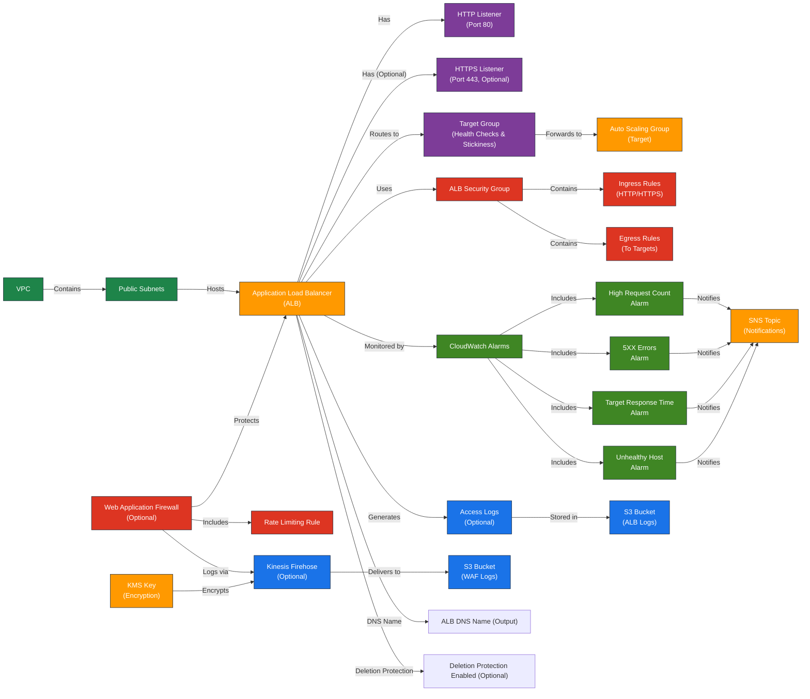

# AWS Application Load Balancer (ALB) Terraform Module

Terraform module to provision and manage an AWS Application Load Balancer (ALB) with integrated security, monitoring, logging, and Web Application Firewall (WAF) support.

## 1. Overview

This module creates and manages an Application Load Balancer (ALB) in AWS for handling HTTP/HTTPS traffic. It includes comprehensive configurations for monitoring, logging, security, and WAF integration while adhering to Terraform and AWS best practices.

## 2. Prerequisites / Requirements

- AWS provider must be configured in the root module.
- Existing **VPC** and **Public Subnets** must be provided.
- Valid **ACM SSL Certificate ARN** is required if HTTPS Listener is enabled.
- **KMS Key ARN** is required if Kinesis Firehose is enabled for WAF logging.
- **S3 Bucket** for ALB Access Logs if logging is enabled.

## 3. Architecture Diagram



### 4. Features:
- **Public-facing ALB** handling HTTP/HTTPS traffic
- **Target Group** configured with advanced health checks and session stickiness
- **Security Group** with controlled inbound/outbound traffic rules
- **CloudWatch Alarms** for performance and error monitoring
- **WAF Integration** for protection against web-layer attacks
- **Kinesis Firehose** for efficient WAF log delivery to S3

## 5. Module Architecture

This module provisions:
- **Application Load Balancer (ALB)**
- **ALB Target Group** for backend integration (e.g., Auto Scaling Groups)
- **Security Group** tailored for ALB traffic management
- **Optional HTTPS Listener** (requires valid SSL certificate)
- **AWS WAF** with rate-based rules and conditional logging
- **CloudWatch Alarms** for proactive monitoring
- **Kinesis Firehose** for log processing (conditional)

## 6. Module Files Structure
- The module is organized into logical files for clarity and maintainability:

| **File**             | **Description**                                                           |
|----------------------|---------------------------------------------------------------------------|
| `main.tf`            | Declares the ALB, Target Group, Listeners, and core configuration.        |
| `security_group.tf`  | Manages the Security Group and its rules for the ALB.                     |
| `waf.tf`             | Provisions WAF with rate limiting and optional AWS Managed Rules.         |
| `firehose.tf`        | Sets up Kinesis Firehose for WAF log delivery to S3 with KMS encryption.  |
| `metrics.tf`         | Contains CloudWatch Alarms for monitoring ALB performance and errors.     |
| `variables.tf`       | Defines all configurable variables with validation and defaults.          |
| `outputs.tf`         | Exposes module outputs for integration with other modules or environments.|

## 7. Inputs

| Name                               | Type           | Description                                              | Validation                          |
|------------------------------------|----------------|----------------------------------------------------------|-------------------------------------|
| `aws_region`                       | `string`       | AWS region for resources                                 | Format: `xx-xxxx-x`                 |
| `aws_account_id`                   | `string`       | AWS Account ID for security policies                     | 12-digit numeric string             |
| `name_prefix`                      | `string`       | Prefix for resource names                                | <= 24 chars                         |
| `environment`                      | `string`       | Deployment environment                                   | One of: `dev`, `stage`, `prod`      |
| `public_subnets`                   | `list(string)` | Public subnet IDs for ALB                                | Valid subnet IDs                    |
| `vpc_id`                           | `string`       | VPC ID for ALB                                           | Valid VPC ID                        |
| `target_group_port`                | `number`       | Port for the target group                                | Default: `80`                       |
| `certificate_arn`                  | `string`       | SSL Certificate ARN for HTTPS listener                   | Required if HTTPS enabled           |
| `alb_enable_deletion_protection`   | `bool`         | Enable deletion protection for the ALB                   | Default: `false`                    |
| `enable_https_listener`            | `bool`         | Toggle HTTPS Listener                                    | `true` or `false`                   |
| `enable_alb_access_logs`           | `bool`         | Toggle ALB access logs                                   | `true` or `false`                   |
| `alb_logs_bucket_name`             | `string`       | S3 bucket for ALB logs                                   | Non-empty string or `null`          |
| `logging_bucket_arn`               | `string`       | ARN of S3 bucket for Firehose                            | Non-empty if Firehose enabled       |
| `kms_key_arn`                      | `string`       | KMS key ARN for log encryption                           | Non-empty if Firehose enabled       |
| `enable_firehose`                  | `bool`         | Toggle Kinesis Firehose                                  | `true` or `false`                   |
| `enable_waf`                       | `bool`         | Toggle WAF protection                                    | `true` or `false`                   |
| `enable_waf_logging`               | `bool`         | Toggle WAF logging (requires Firehose)                   | `true` or `false`                   |
| `sns_topic_arn`                    | `string`       | SNS topic for CloudWatch Alarms                          | Valid SNS ARN                       |
| `alb_request_count_threshold`      | `number`       | Threshold for high request count on ALB                  | Default: `1000`                     |
| `alb_5xx_threshold`                | `number`       | Threshold for 5XX errors on ALB                          | Default: `50`                       |
| `enable_high_request_alarm`        | `bool`         | Enable CloudWatch alarm for high request count           | Default: `false`                    |
| `enable_5xx_alarm`                 | `bool`         | Enable CloudWatch alarm for HTTP 5XX errors              | Default: `false`                    |
| `enable_target_response_time_alarm`| `bool`      | Enable CloudWatch alarm for Target Response Time            | Default: `false`                    |

## 8. Outputs

| **Name**                            | **Description**                                    |
|-------------------------------------|----------------------------------------------------|
| `alb_arn`                           | ARN of the Application Load Balancer               |
| `alb_dns_name`                      | DNS name of the Application Load Balancer          |
| `alb_name`                          | Name of the Application Load Balancer              |
| `alb_security_group_id`             | Security Group ID for ALB                          |
| `wordpress_tg_arn`                  | ARN of the Target Group                            |
| `alb_access_logs_bucket_name`       | Name of the S3 bucket for ALB access logs          |
| `waf_arn`                           | ARN of the WAF Web ACL (if enabled)                |
| `enable_https_listener`             | Whether HTTPS listener is enabled on the ALB       |
| `alb_high_request_count_alarm_arn`  | ARN for high request count alarm                   |
| `alb_5xx_errors_alarm_arn`          | ARN for 5XX error alarm                            |
| `alb_target_response_time_alarm_arn`| ARN for target response time alarm                 |
| `alb_unhealthy_host_count_alarm_arn`| ARN for unhealthy targets alarm                    |

## 9. Example Usage
# Example usage for production environment with full features enabled (WAF, logging, HTTPS)

```hcl
module "alb" {
  source                         = "./modules/alb"
  aws_region                     = "eu-west-1"
  aws_account_id                 = "123456789012"
  name_prefix                    = "prod"
  environment                    = "prod"
  public_subnets                 = module.vpc.public_subnet_ids
  vpc_id                         = module.vpc.vpc_id
  enable_https_listener          = true
  certificate_arn                = "arn:aws:acm:eu-west-1:123456789012:certificate/example"
  enable_alb_access_logs         = true
  alb_logs_bucket_name           = "prod-alb-logs"
  logging_bucket_arn             = module.s3.logging_bucket_arn
  kms_key_arn                    = module.kms.kms_key_arn
  enable_firehose                = true
  enable_waf                     = true
  enable_waf_logging             = true
  sns_topic_arn                  = module.monitoring.sns_topic_arn
}
```

## 10. Security Considerations / Recommendations
- **HTTPS recommended** for encrypted client communication.
- **WAF** protects against common attacks like rate-limiting and injection.
- **Firehose** delivers encrypted logs securely to S3.
- **CloudWatch alarms** proactively monitor ALB health.

### General Recommendations
- Enable HTTPS Listener with a valid SSL certificate.
- Adjust alarm thresholds according to real-world traffic.

## Security Best Practices
- Always enable WAF for production to protect against common web attacks.
- Store ALB and WAF logs securely in S3 with **KMS encryption**.
- Review and tighten Security Group rules periodically.
- Regularly audit IAM roles and policies for least privilege.
- Configure CloudWatch alarms with SNS notifications for proactive monitoring.
- Ensure `enable_firehose` is enabled if WAF logging is required.

## 11. Conditional Resource Creation

This module supports conditional creation of certain resources based on input variables:

- **HTTPS Listener** is created only if `enable_https_listener = true`.
- **ALB Access Logging** is enabled only if `enable_alb_access_logs = true`.
- **Kinesis Firehose** is provisioned only if `enable_firehose = true`.
- **AWS WAF** is created and attached to ALB only if `enable_waf = true`.
- **WAF Logging** is enabled only if both `enable_waf_logging = true` and `enable_firehose = true`.
- **CloudWatch Alarms** are created based on the following flags:
  - `enable_high_request_alarm`
  - `enable_5xx_alarm`
  - `enable_target_response_time_alarm`

## 12. Best Practices
- Enable HTTPS Listener with valid SSL certificate.
- Adjust alarm thresholds according to real-world traffic.

### Security Best Practices
- Always enable WAF for production to protect against common web attacks.
- Store ALB and WAF logs securely in S3 with **KMS encryption**.
- Review and tighten Security Group rules periodically.
- Regularly audit IAM roles and policies for least privilege.
- Configure CloudWatch alarms with SNS notifications for proactive monitoring.
- Ensure `enable_firehose` is enabled if WAF logging is required.

## 13. Integration
Integrates with:
- **VPC Module:** Network infrastructure.
- **ASG Module:** Backend instances.
- **KMS Module:** Log encryption.

## 14. Future Improvements
- **Enhanced WAF Rules:** Integrate AWS Managed Rule Groups for comprehensive protection:
  - CommonRuleSet
  - SQLiRuleSet
  - CrossSiteScriptingRuleSet
  - KnownBadInputsRuleSet
  - BotControlRuleSet
- **Advanced Traffic Insights:** Add CloudWatch dashboards and additional metrics.
- **Automated SSL management:** Integrate automatic ACM certificate rotation.

## 15. Troubleshooting and Common Issues

### 1. HTTPS Listener not working
- **Cause:** Missing or invalid `certificate_arn`
- **Solution:** Ensure a valid ACM certificate is provisioned in the same region and `enable_https_listener = true`.

### 2. WAF Logging not delivered to S3
- **Cause:** `enable_firehose` is not enabled or `logging_bucket_arn` is incorrect.
- **Solution:** Verify both `enable_firehose = true` and a valid `logging_bucket_arn` are set.

### 3. CloudWatch Alarms not triggering
- **Cause:** `enable_high_request_alarm`, `enable_5xx_alarm`, or `enable_target_response_time_alarm` not set.
- **Solution:** Enable necessary alarms based on your monitoring needs.

### 4. ALB DNS not resolving
- **Cause:** ALB is not in an active state or incorrect DNS name used.
- **Solution:** Check the ALB state in the AWS Console and use the correct output `alb_dns_name`.

### 5. WAF Managed Rules missing (production)
- **Cause:** Only rate limiting is configured by default.
- **Solution:** Extend the WAF configuration by adding AWS Managed Rule Groups for production.

---

## 16. Notes

_No specific notes for this module._

## 17. Useful Resources

- [ALB Documentation](https://docs.aws.amazon.com/elasticloadbalancing/latest/application/introduction.html)
- [ALB Best Practices](https://docs.aws.amazon.com/elasticloadbalancing/latest/application/application-load-balancer-best-practices.html)
- [WAF Protection for ALB](https://docs.aws.amazon.com/waf/latest/developerguide/waf-chapter.html)
- [CloudWatch Metrics for ALB](https://docs.aws.amazon.com/elasticloadbalancing/latest/application/load-balancer-cloudwatch-metrics.html)
- [AWS Managed Rule Groups](https://docs.aws.amazon.com/waf/latest/developerguide/aws-managed-rule-groups.html)
- [Kinesis Firehose for Logging](https://docs.aws.amazon.com/firehose/latest/dev/what-is-this-service.html)
- [Kinesis Firehose Best Practices](https://docs.aws.amazon.com/firehose/latest/dev/best-practices.html)