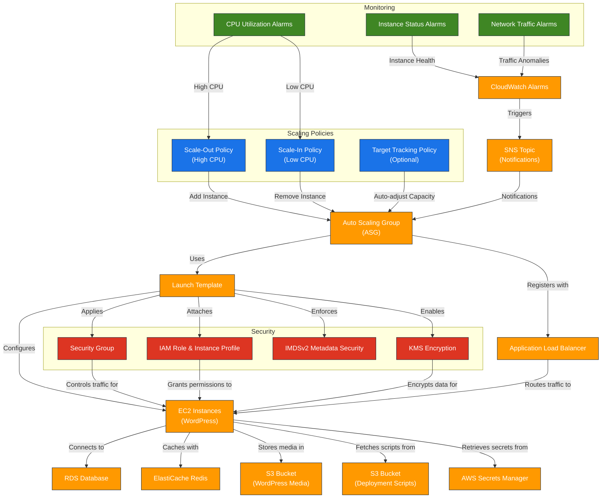

# AWS Auto Scaling Group (ASG) Terraform Module

---

## 1. Overview

This Terraform module provisions a fully managed AWS Auto Scaling Group (ASG) with all supporting resources required to host a scalable WordPress application. It includes EC2 instance configuration, launch template, scaling policies, security groups, and CloudWatch monitoring. The module seamlessly integrates with the Application Load Balancer (ALB), RDS MySQL, ElastiCache Redis, and optionally uses S3 for media storage and deployment scripts.

---

## 2. Prerequisites / Requirements

- AWS provider configured in `providers.tf`.
- Valid AMI ID for the selected region.
- Existing VPC, subnets, and ALB.

---

## 3. Architecture Diagram



## 4. Features

- Automatically scale EC2 instances based on load.
- Deploy and configure WordPress with full infrastructure support.
- Integrate with ALB, RDS, Redis, S3, CloudWatch, IAM, and KMS.

---

## 5. Module Architecture

This module provisions the following AWS resources:

- **Auto Scaling Group (ASG):** Manages EC2 instance scaling based on load.
- **Launch Template:** Defines EC2 instance configuration, AMI, instance type, and user data for WordPress deployment.
- **EC2 Instances:** WordPress application servers integrated with RDS and Redis.
- **IAM Role and Instance Profile:** Grants EC2 instances permissions for S3, Secrets Manager, and CloudWatch.
- **Security Group:** Controls inbound and outbound traffic to the instances.
- **CloudWatch Alarms:** Monitors CPU utilization, instance health, and network traffic.
- **Scaling Policies:** CPU-based scale-out and scale-in automation.
- **KMS Encryption:** Secures sensitive data (optional).
- **IMDSv2 Enforcement:** Ensures enhanced instance metadata security.

---

## 6. Module Files Structure

| File                  | Description                                                   |
|-----------------------|---------------------------------------------------------------|
| `main.tf`             | ASG resource, scaling policies, lifecycle rules.              |
| `launch_template.tf`  | EC2 instance configuration and user data.                     |
| `iam.tf`              | IAM role, policies, instance profile.                         |
| `security_group.tf`   | ASG security group with conditional rules.                    |
| `metrics.tf`          | CloudWatch Alarms (CPU, status, network).                     |
| `outputs.tf`          | Outputs for integration and debugging.                        |
| `variables.tf`        | Module input variables.                                       |

---

## 7. Inputs

| Variable (Partial List)      | Type         | Description                                             | Default / Required |
|------------------------------|--------------|---------------------------------------------------------|--------------------|
| aws_account_id               | string       | AWS Account ID                                          | Required           |
| aws_region                   | string       | AWS Region                                              | Required           |
| environment                  | string       | dev, stage, prod                                        | Required           |
| name_prefix                  | string       | Resource name prefix                                    | Required           |
| instance_type                | string       | EC2 instance type                                       | Required           |
| ami_id                       | string       | AMI ID                                                  | Required           |
| ssh_key_name                 | string       | SSH Key Pair name                                       | Required           |
| autoscaling_min              | number       | Minimum instances                                       | Required           |
| autoscaling_max              | number       | Maximum instances                                       | Required           |
| desired_capacity             | number       | Desired capacity                                        | null / Optional    |
| scale_out_cpu_threshold      | number       | CPU % threshold to scale out                            | Required           |
| scale_in_cpu_threshold       | number       | CPU % threshold to scale in                             | Required           |
| volume_size                  | number       | EBS volume size (GiB)                                   | Required           |
| volume_type                  | string       | EBS volume type                                         | Required           |
| vpc_id                       | string       | VPC ID                                                  | Required           |
| public_subnet_ids            | list(string) | Subnets for ASG instances                               | Required           |
| wordpress_tg_arn             | string       | ALB Target Group ARN                                    | Required           |
| sns_topic_arn                | string       | SNS topic for alarms                                    | Required           |
| kms_key_arn                  | string       | KMS key ARN                                             | Required           |
| php_version                  | string       | PHP version                                             | Required           |
| php_fpm_service              | string       | PHP-FPM service name                                    | Required           |
| redis_endpoint               | string       | Redis endpoint                                          | Required           |
| redis_port                   | number       | Redis port                                              | Required           |
| wordpress_media_bucket_name  | string       | S3 bucket for WordPress media                           | ""                 |
| scripts_bucket_name          | string       | S3 bucket for deployment scripts                        | ""                 |
| healthcheck_version          | string       | Version of healthcheck (1.0 / 2.0)                      | "1.0"              |
| enable_interface_endpoints   | bool         | Use VPC Interface Endpoints                             | false              |
| enable_data_source           | bool         | Enable fetching ASG instance data                       | false              |

_(Full input table available in code)_

---

## 8. Outputs

| Output                        | Description                                          |
|-------------------------------|------------------------------------------------------|
| asg_id                        | Auto Scaling Group ID                                |
| asg_name                      | Auto Scaling Group Name                              |
| launch_template_id            | Launch Template ID                                   |
| launch_template_latest_version| Latest version of Launch Template                    |
| instance_ids                  | ASG instance IDs (if enabled)                        |
| instance_public_ips           | Public IPs of ASG instances                          |
| instance_private_ips          | Private IPs of ASG instances                         |
| asg_security_group_id         | Security Group ID for ASG instances                  |
| instance_role_id              | IAM Role ID for instances                            |
| instance_profile_arn          | IAM Instance Profile ARN                             |
| scale_out_policy_arn          | Scale-Out Policy ARN                                 |
| scale_in_policy_arn           | Scale-In Policy ARN                                  |
| rendered_user_data (sensitive)| Rendered User Data script                            |

---

## 9. Example Usage

```hcl
module "asg" {
  source = "./modules/asg"

  aws_account_id    = var.aws_account_id
  aws_region        = var.aws_region
  environment       = "dev"
  name_prefix       = "dev"
  instance_type     = "t2.micro"
  ami_id            = "ami-03fd334507439f4d1"
  ssh_key_name      = "my-ssh-key"

  autoscaling_min   = 1
  autoscaling_max   = 3
  desired_capacity  = 1

  vpc_id            = module.vpc.vpc_id
  public_subnet_ids = module.vpc.public_subnet_ids

  wordpress_tg_arn  = module.alb.wordpress_tg_arn
  sns_topic_arn     = module.sns.topic_arn

  # Optional
  kms_key_arn       = module.kms.kms_key_arn
  enable_s3_script  = true
  healthcheck_version = "2.0"
}
```

## 10. Security Considerations / Recommendations

- Use **IMDSv2 exclusively** to enhance instance metadata security.
- Restrict **SSH access** in production environments. Prefer **SSM Session Manager**.
- Enable **KMS encryption** for EBS volumes and S3 buckets.
- Ensure **least privilege** by limiting IAM policies attached to instances.
- Monitor scaling events and instance health with **CloudWatch Alarms**.
- Use **VPC Interface Endpoints** to avoid exposing traffic to the public internet when possible.
- Validate **Security Group rules** to minimize open access and reduce the attack surface.

---

## 11. Conditional Resource Creation

- SSH rules only if `enable_asg_ssh_access = true`
- Scaling policies if `enable_scaling_policies = true`
- CloudWatch Alarms (CPU, Network, Status) based on individual toggles.
- KMS and S3 policies created conditionally.
- IMDSv2 always enforced.
- Target Tracking is optional.

---

## 12. Best Practices

### Security Best Practices
- Disable SSH in production (use SSM).
- Enable KMS encryption for S3 and EBS.
- Use IMDSv2 exclusively.
- Monitor all alarms via SNS.
- Enable Interface Endpoints if deploying in private subnets.
- Limit Security Group CIDRs.

### General Recommendations
- Review scaling thresholds periodically.
- Use Lifecycle Hooks for graceful scale in/out.
- Prefer Spot Instances where possible for cost optimization.

---

## 13. Integration

This module is designed to integrate seamlessly with the following components:

- **VPC Module:** Provides networking, public subnets, and route tables.
- **ALB Module:** Receives incoming HTTP/HTTPS traffic and forwards it to the ASG.
- **RDS Module:** Provides the MySQL database for WordPress.
- **ElastiCache Module:** Supplies Redis for caching and session storage.
- **S3 Module:** Stores WordPress media and deployment scripts.
- **KMS Module:** Enables encryption of sensitive data and logs.
- **Monitoring Module:** Manages SNS topics and CloudWatch Alarms.

---

## 14. Future Improvements

- Lifecycle hooks (graceful scaling).
- Blue/Green deployments.
- Spot Instances support.
- CloudWatch Anomaly Detection.
- AWS Security Hub integration.

---

## 15. Troubleshooting and Common Issues

### 1. EC2 Instances Have No Internet Access
**Cause:** Missing or incorrect route to the Internet Gateway in public subnets.  
**Solution:**  
- Ensure the `vpc_zone_identifier` references public subnets.  
- Verify the route table includes `0.0.0.0/0 → igw` pointing to the Internet Gateway.

---

### 2. User Data Script Not Executed or WordPress Not Installed
**Cause:** Incorrect user data rendering, missing execution permissions, or failed S3 script fetch.  
**Solution:**  
- Check the `rendered_user_data` output for correctness.  
- Ensure the script is executable (`chmod +x`).  
- If using S3, validate bucket permissions and that `enable_s3_script = true` is configured properly.

---

### 3. Auto Scaling (Scale-Out/Scale-In) Not Triggering
**Cause:** Misconfigured CloudWatch thresholds, disabled scaling policies, or target tracking issues.  
**Solution:**  
- Adjust `scale_out_cpu_threshold` and `scale_in_cpu_threshold`.  
- Ensure `enable_scaling_policies = true`.  
- Check CloudWatch metrics and alarms are configured correctly.

---

### 4. Instances Marked Unhealthy by ALB
**Cause:** ALB health check path misconfigured or application not ready.  
**Solution:**  
- Validate the ALB Target Group health check settings.  
- Ensure the WordPress health check endpoint is created and reachable in `user_data`.

---

### 5. SSM Connection Fails
**Cause:** Missing SSM IAM policy or instance not registered.  
**Solution:**  
- Confirm the `AmazonSSMManagedInstanceCore` policy is attached to the instance IAM role.  
- Check Systems Manager → Managed Instances for registration status.

---

### 6. Security Group is Too Open
**Cause:** Default wide-open SSH (0.0.0.0/0) or unrestricted outbound rules.  
**Solution:**  
- Limit `ssh_allowed_cidr` to trusted IPs in production.  
- Restrict outbound rules to required destinations only.

---

### 7. KMS Decryption Fails
**Cause:** Incorrect KMS permissions or wrong KMS Key ARN.  
**Solution:**  
- Check that the IAM role has `kms:Decrypt` permission.  
- Validate the `kms_key_arn` used.

---

### 8. S3 Access Denied Errors
**Cause:** Missing or incorrect S3 bucket policy or IAM permissions.  
**Solution:**  
- Review the S3 bucket policy for required permissions.  
- Ensure the `s3_access_policy` is attached and correct ARNs are provided.

---

### 9. CloudWatch Alarms Do Not Trigger
**Cause:** Alarms disabled or metric misconfiguration.  
**Solution:**  
- Verify `enable_*_alarm` variables are set to `true`.  
- Review thresholds and metric dimensions in alarm configurations.

---

### 10. Frequent Instance Replacement in ASG
**Cause:** Misconfigured termination policies or overly aggressive scaling thresholds.  
**Solution:**  
- Check `termination_policies`.  
- Increase cooldown periods and fine-tune scaling thresholds to reduce churn.

---

## 16. Notes

_No specific notes for this module._

---

## 17. Useful Resources

- [AWS Auto Scaling](https://docs.aws.amazon.com/autoscaling/)
- [Terraform AWS Provider](https://registry.terraform.io/providers/hashicorp/aws/latest/docs)
- [AWS EC2 IMDSv2](https://docs.aws.amazon.com/AWSEC2/latest/UserGuide/configuring-instance-metadata-service.html)
- [AWS CloudWatch Alarms](https://docs.aws.amazon.com/AmazonCloudWatch/latest/monitoring/AlarmThatSendsEmail.html)
- [AWS Systems Manager (SSM)](https://docs.aws.amazon.com/systems-manager/)

---