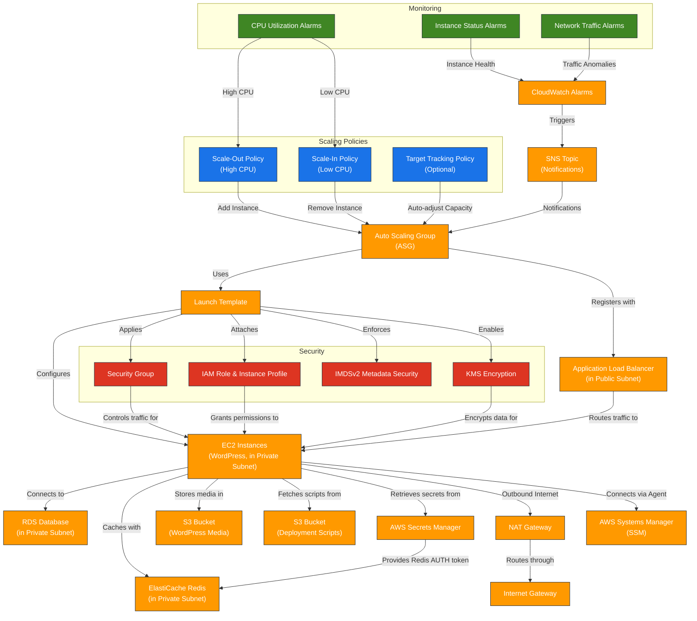

# AWS Auto Scaling Group (ASG) Terraform Module

---

## Table of Contents

- [1. Overview](#1-overview)
- [2. Prerequisites / Requirements](#2-prerequisites--requirements)
- [3. Instance Access](#3-instance-access)
- [4. Architecture Diagram](#4-architecture-diagram)
- [5. Features](#5-features)
- [6. Module Architecture](#6-module-architecture)
- [7. Module Files Structure](#7-module-files-structure)
- [8. Inputs (Variables)](#8-inputs-variables)
- [9. Outputs](#9-outputs)
- [10. Example Usage](#10-example-usage)
- [11. Security Considerations / Recommendations](#11-security-considerations--recommendations)
- [12. Conditional Resource Creation](#12-conditional-resource-creation)
- [13. Best Practices](#13-best-practices)
- [14. Integration](#14-integration)
- [15. Future Improvements](#15-future-improvements)
- [16. Troubleshooting and Common Issues](#16-troubleshooting-and-common-issues)
- [17. Notes](#17-notes)
- [18. Useful Resources](#18-useful-resources)

---

## 1. Overview

This Terraform module provisions a fully managed AWS Auto Scaling Group (ASG) designed to host a scalable and secure WordPress application. It deploys instances into **private subnets**, isolating them from direct internet traffic. The module includes a Launch Template, scaling policies, security groups, and deep integration with other AWS services like ALB, RDS, and ElastiCache. Instance access is managed exclusively through **AWS Systems Manager (SSM) Session Manager**, eliminating the need for open SSH ports.

---

## 2. Prerequisites / Requirements

- AWS provider configured in `providers.tf`.
- A valid AMI ID for the selected region. The AMI must have the SSM Agent installed.
- An existing VPC with public and private subnets.
- A **NAT Gateway** configured in the VPC to allow outbound internet access from the private subnets (required for the SSM agent to connect to the AWS control plane).
- An existing Application Load Balancer (ALB).

---

## 3. Instance Access

Access to the EC2 instances is provided **exclusively** through **AWS Systems Manager (SSM) Session Manager**. This method is more secure than traditional SSH access as it does not require open inbound ports in security groups or NACLs.

### How to Connect:
1.  **Prerequisites:** Ensure you have the [Session Manager plugin for the AWS CLI](https://docs.aws.amazon.com/systems-manager/latest/userguide/session-manager-working-with-install-plugin.html) installed on your local machine.
2.  **Find an Instance ID:** Get the ID of an instance you want to connect to from the EC2 console or using the AWS CLI.
3.  **Start a Session:** Run the following AWS CLI command:
    ```bash
    aws ssm start-session --target <instance-id>
    ```
    (Replace `<instance-id>` with the actual ID of your instance).

This will open a secure shell session directly to the instance through the AWS API.

---

## 4. Architecture Diagram



> _Diagram generated with [Mermaid](https://mermaid.js.org/)_

---

## 5. Features

- Automatically scale EC2 instances based on load.
- Deploy instances into **private subnets** for enhanced security.
- **Secure instance access** via AWS Systems Manager (SSM) Session Manager, with no open SSH ports.
- Deploy and configure WordPress with full infrastructure support.
- Integrate with ALB, RDS, Redis, S3, CloudWatch, IAM, and KMS.

---

## 6. Module Architecture

This module provisions the following AWS resources:

- **Auto Scaling Group (ASG):** Manages EC2 instance scaling within private subnets.
- **Launch Template:** Defines EC2 instance configuration, AMI, instance type, and user data for WordPress deployment.
- **EC2 Instances:** WordPress application servers integrated with RDS and Redis.
- **IAM Role and Instance Profile:** Grants EC2 instances permissions for SSM, S3, Secrets Manager, and CloudWatch.
- **Security Group:** Controls inbound and outbound traffic to the instances.
- **CloudWatch Alarms:** Monitors CPU utilization, instance health, and network traffic.
- **Scaling Policies:** CPU-based scale-out and scale-in automation.

---

## 7. Module Files Structure

| File                  | Description                                                                |
|-----------------------|----------------------------------------------------------------------------|
| `main.tf`             | ASG resource, scaling policies, lifecycle rules.                           |
| `launch_template.tf`  | EC2 instance configuration and user data.                                  |
| `iam.tf`              | IAM role, instance profile, and policies for S3, CloudWatch, Secrets, etc. |
| `ssm.tf`              | Attaches the IAM policy required for SSM Session Manager access.           |
| `security_group.tf`   | ASG security group with conditional rules and outbound access.             |
| `metrics.tf`          | CloudWatch Alarms (CPU, status, network).                                  |
| `outputs.tf`          | Outputs for integration and debugging.                                     |
| `variables.tf`        | Module input variables.                                                    |

---

## 8. Inputs

| Name                           | Type           | Description                                             |
|--------------------------------|----------------|---------------------------------------------------------|
| `aws_account_id`               | `string`       | AWS Account ID                                          |
| `aws_region`                   | `string`       | AWS Region                                              |
| `environment`                  | `string`       | dev, stage, prod                                        |
| `tags`                         | `map(string)`  | Tags to apply to all resources.                         |
| `name_prefix`                  | `string`       | Resource name prefix                                    |
| `instance_type`                | `string`       | EC2 instance type                                       |
| `ami_id`                       | `string`       | AMI ID                                                  |
| `autoscaling_min`              | `number`       | Minimum instances                                       |
| `autoscaling_max`              | `number`       | Maximum instances                                       |
| `desired_capacity`             | `number`       | Desired capacity                                        |
| `scale_out_cpu_threshold`      | `number`       | CPU % threshold to scale out                            |
| `scale_in_cpu_threshold`       | `number`       | CPU % threshold to scale in                             |
| `volume_size`                  | `number`       | EBS volume size (GiB)                                   |
| `volume_type`                  | `string`       | EBS volume type                                         |
| `vpc_id`                       | `string`       | VPC ID                                                  |
| `subnet_ids`                   | `list(string)` | Subnets for ASG instances (typically private subnets)   |
| `wordpress_tg_arn`             | `string`       | ALB Target Group ARN                                    |
| `sns_topic_arn`                | `string`       | SNS topic for alarms                                    |
| `kms_key_arn`                  | `string`       | KMS key ARN                                             |
| `redis_endpoint`               | `string`       | Redis endpoint                                          |
| `redis_port`                   | `number`       | Redis port                                              |
| `wordpress_media_bucket_name`  | `string`       | S3 bucket for WordPress media                           |
| `scripts_bucket_name`          | `string`       | S3 bucket for deployment scripts                        |
| `enable_interface_endpoints`   | `bool`         | Use VPC Interface Endpoints                             |
| `enable_data_source`           | `bool`         | Enable fetching ASG instance data                       |
| `enable_ebs_encryption`	     | `bool`         |	Enable EBS encryption via KMS	                        |
| `wordpress_secrets_name`	     | `string`	      | Name of WordPress secret in Secrets Manager	            |
| `wordpress_secrets_arn`	     | `string`	      | ARN of WordPress secret in Secrets Manager	            |
| `redis_auth_secret_name`	     | `string`	      | Name of Redis AUTH secret in Secrets Manager	        |
| `redis_auth_secret_arn`	     | `string`	      | ARN of Redis AUTH secret in Secrets Manager	            |
| `enable_cloudwatch_logs`	     | `bool`	      | Enable or disable CloudWatch Logs integration	        |
| `cloudwatch_log_groups`	     | `map(string)`  | Map of log group names for EC2 logs	                    |

_(Full list of variables available in the `variables.tf` file)_

---

## 9. Outputs

| Output                        | Description                                          |
|-------------------------------|------------------------------------------------------|
| asg_id                        | Auto Scaling Group ID                                |
| asg_name                      | Auto Scaling Group Name                              |
| launch_template_id            | Launch Template ID                                   |
| launch_template_latest_version| Latest version of Launch Template                    |
| instance_ids                  | ASG instance IDs (if enabled)                        |
| instance_public_ips           | Public IPs of ASG instances                          |
| instance_private_ips          | Private IPs of ASG instances                         |
| asg_security_group_id         | Security Group ID for ASG instances                  |
| instance_role_id              | IAM Role ID for instances                            |
| instance_profile_arn          | IAM Instance Profile ARN                             |
| asg_role_arn                  | ARN of the IAM role used by ASG instances            |
| scale_out_policy_arn          | Scale-Out Policy ARN                                 |
| scale_in_policy_arn           | Scale-In Policy ARN                                  |
| rendered_user_data (sensitive)| Rendered User Data script                            |

---

## 10. Example Usage

```hcl
module "asg" {
  source = "./modules/asg"

  aws_account_id    = var.aws_account_id
  aws_region        = var.aws_region
  environment       = "dev"
  name_prefix       = "dev"
  instance_type     = "t2.micro"
  ami_id            = "ami-03fd334507439f4d1"

  autoscaling_min   = 1
  autoscaling_max   = 3
  desired_capacity  = 1

  vpc_id            = module.vpc.vpc_id
  subnet_ids        = local.private_subnet_ids

  wordpress_tg_arn  = module.alb.wordpress_tg_arn
  sns_topic_arn     = aws_sns_topic.cloudwatch_alarms.arn
  kms_key_arn       = module.kms.kms_key_arn

  # Pass the ARN and NAME of your secrets in AWS Secrets Manager
  wordpress_secrets_name = aws_secretsmanager_secret.wp_secrets.name
  wordpress_secrets_arn  = aws_secretsmanager_secret.wp_secrets.arn
}
```

---

## 11. Security Considerations / Recommendations

- **Private Instances:** Instances are deployed into **private subnets**, isolating them from direct internet access.
- **SSM Access Only:** Instance access is exclusively via **SSM Session Manager**. No SSH key pairs are associated with the instances, and no inbound SSH ports are opened.
- **Least Privilege IAM:** The IAM role for instances grants only the necessary permissions for SSM, S3, Secrets Manager, and CloudWatch.
- **IMDSv2:** The launch template enforces the use of **IMDSv2** for all instance metadata requests, enhancing security against SSRF vulnerabilities.
- **NAT Gateway:** Outbound traffic for software updates and to AWS APIs is routed through a NAT Gateway.
- **Secrets Management:** Sensitive secrets (WordPress DB, Redis AUTH) are **not hardcoded**. The `user_data` script only passes secret names/ARNs; the instance then fetches the values at runtime using its IAM role.
- **Egress Traffic:** The default outbound security group rule allows all traffic to `0.0.0.0/0`. For production, consider restricting this to only required endpoints or using VPC Interface Endpoints for AWS services.

---

## 12. Conditional Resource Creation

- Scaling policies are created only if `enable_scaling_policies = true`.
- CloudWatch Alarms (CPU, Network, Status) are created based on individual boolean flags.
- The KMS policy for decrypting S3 and EBS data is created only if encryption or relevant buckets are enabled.

---

## 13. Best Practices

- **Secure Access:** Always use SSM Session Manager for instance access. Avoid modifying the configuration to allow direct SSH access.
- **Encryption:** Enable KMS encryption for S3 and EBS volumes in production environments using a customer-managed key (CMK).
- **Monitoring:** Enable and monitor all relevant CloudWatch alarms via an SNS topic.
- **Cost Optimization:** Use Lifecycle Hooks for graceful scale-in and consider Spot Instances for non-production workloads.

---

## 14. Integration

This module is designed to integrate seamlessly with the following components:

- **VPC Module:** Provides networking, subnets, and NAT Gateway.
- **ALB Module:** Receives incoming HTTP/HTTPS traffic and forwards it to the ASG.
- **RDS Module:** Provides the MySQL database for WordPress.
- **ElastiCache Module:** Supplies Redis for caching and session storage.
- **S3 Module:** Stores WordPress media and deployment scripts.
- **KMS Module:** Enables encryption of sensitive data.
- **AWS Secrets Manager:** Stores credentials securely retrieved by instances at runtime.

---

## 15. Future Improvements

- **Blue/Green Deployments:** Introduce versioned deployments and switching between environments with minimal downtime.
- **Spot Instances Support:** Add support for mixing spot and on-demand instances for cost optimization.
- **CloudWatch Anomaly Detection:** Use machine learning–based anomaly detection to enhance alarm accuracy.

---

## 16. Troubleshooting and Common Issues

### 1. Instances Fail to Launch or Become Healthy
**Cause:**
- Incorrect AMI ID.
- User data script failure.
- IAM permissions or KMS key issues preventing boot.
- Health check misconfiguration.
**Solution:**
- Check the "Activity History" for the Auto Scaling Group in the AWS Console for detailed error messages.
- Connect to a failed instance using SSM (if it registers) and inspect the user data logs at `/var/log/user-data.log`.

---

### 2. SSM Session Manager Fails to Connect
**Cause:**
- The instance's IAM role is missing the `AmazonSSMManagedInstanceCore` policy.
- The SSM agent is not installed or running on the AMI.
- The instance cannot communicate with the SSM service endpoints (requires internet access via NAT Gateway or VPC endpoints).
**Solution:**
- Verify the `ssm.tf` file correctly attaches the policy.
- Check the AMI to ensure the SSM agent is pre-installed.
- Confirm the private subnets have a route to the internet via a NAT Gateway.

---

### 3. Auto Scaling (Scale-Out/Scale-In) Not Triggering
**Cause:** Misconfigured CloudWatch thresholds or disabled scaling policies.
**Solution:**
- Adjust `scale_out_cpu_threshold` and `scale_in_cpu_threshold`.
- Ensure `enable_scaling_policies = true`.
- Check CloudWatch metrics and alarms are configured correctly.

---

### 4. KMS Decryption Fails
**Cause:** Incorrect KMS permissions or wrong KMS Key ARN.
**Solution:**
- Check that the instance IAM role has the necessary KMS permissions (`kms:Decrypt`, `kms:GenerateDataKey`, etc.).
- Validate the `kms_key_arn` used.

---

### 11. AWS CLI Reference

Below are useful AWS CLI commands for troubleshooting and inspecting ASG-related resources:

#### View Auto Scaling Group details
```bash
aws autoscaling describe-auto-scaling-groups --auto-scaling-group-names <asg-name>
```

#### Check EC2 instance status
```bash
aws ec2 describe-instance-status --instance-ids <instance-id>
```

#### Start an SSM Session
```bash
aws ssm start-session --target <instance-id>
```

#### Inspect Launch Template details
```bash
aws ec2 describe-launch-templates --launch-template-names <template-name>
```

---

_Tip: Replace placeholders like `<asg-name>`, `<instance-id>`, etc., with actual values from your Terraform outputs or AWS Console._

---

## 17. Notes

- Secrets are not exposed in `user_data`. All sensitive data is securely retrieved by the deployment script at runtime.
- CloudWatch alarms and scaling policies are disabled or enabled via individual flags.

---

## 18. Useful Resources

- [AWS Auto Scaling](https://docs.aws.amazon.com/autoscaling/)
- [Terraform AWS Provider](https://registry.terraform.io/providers/hashicorp/aws/latest/docs)
- [AWS Systems Manager (SSM) Session Manager](https://docs.aws.amazon.com/systems-manager/latest/userguide/session-manager.html)
- [AWS EC2 IMDSv2](https://docs.aws.amazon.com/AWSEC2/latest/UserGuide/configuring-instance-metadata-service.html)
