# AWS Client VPN Terraform Module

---

## Table of Contents

- [1. Overview](#1-overview)
- [2. Prerequisites / Requirements](#2-prerequisites--requirements)
- [3. Architecture Diagram](#3-architecture-diagram)
- [4. Features](#4-features)
- [5. Module Architecture](#5-module-architecture)
- [6. Module Files Structure](#6-module-files-structure)
- [7. Inputs (Variables)](#7-inputs-variables)
- [8. Outputs](#8-outputs)
- [9. Example Usage](#9-example-usage)
- [10. Security Considerations / Recommendations](#10-security-considerations--recommendations)
- [11. Conditional Resource Creation](#11-conditional-resource-creation)
- [12. Best Practices](#12-best-practices)
- [13. Integration](#13-integration)
- [14. Future Improvements](#14-future-improvements)
- [15. Troubleshooting and Common Issues](#15-troubleshooting-and-common-issues)
- [16. Notes](#16-notes)
- [17. Useful Resources](#17-useful-resources)

---

## 1. Overview

This Terraform module provisions a fully managed AWS Client VPN endpoint. It provides secure access for remote clients to resources within a VPC. The module supports two authentication methods: mutual certificate-based authentication and federated authentication via an IAM SAML provider. It fully automates the creation of the required Public Key Infrastructure (PKI) when using certificate authentication.

---

## 2. Prerequisites / Requirements

- An existing VPC with subnets.
- An IAM SAML provider ARN (only if using `federated` authentication).
- Terraform `tls` provider for certificate generation.

---

## 3. Architecture Diagram

```mermaid
graph TD
    subgraph "AWS Cloud"
        subgraph "VPC"
            CVPN["Client VPN Endpoint"]
            ENI1["ENI (Subnet A)"]
            ENI2["ENI (Subnet B)"]
            SG["Security Group"]
            VPCResources["VPC Resources<br>(EC2, RDS, etc.)"]
        end

        subgraph "IAM"
            SAML["IAM SAML Provider<br>(Optional)"]
        end

        subgraph "Certificate Management"
            ACMServer["ACM: Server Certificate"]
            ACMCA["ACM: CA Certificate<br>(Cert-Auth Only)"]
        end

        subgraph "Logging"
            CWLogs["CloudWatch Log Group"]
        end
    end

    subgraph "Terraform PKI (Cert-Auth Only)"
        TLSP["TLS Provider"]
        CAKey["CA Private Key"]
        CACert["CA Certificate"]
        ServerKey["Server Private Key"]
        ServerCert["Server Certificate"]
        ClientKey["Client Private Key"]
        ClientCert["Client Certificate"]
    end

    subgraph "Remote User"
        UserDevice["User Device<br>with OpenVPN Client"]
    end

    %% Connections
    UserDevice -- "Connects (TCP/443)" --> CVPN
    CVPN -- "Associates with" --> ENI1
    CVPN -- "Associates with" --> ENI2
    CVPN -- "Uses" --> SG
    CVPN -- "Forwards traffic to" --> VPCResources
    CVPN -- "Authenticates via" --> SAML
    CVPN -- "Authenticates via" --> ACMCA
    CVPN -- "Encrypts via" --> ACMServer
    CVPN -- "Sends logs to" --> CWLogs

    TLSP --> CAKey & CACert & ServerKey & ServerCert & ClientKey & ClientCert
    CACert & ServerCert --> ACMServer
    CACert --> ACMCA

    %% Styling
    classDef aws fill:#FF9900,stroke:#232F3E,color:white;
    classDef security fill:#DD3522,stroke:#232F3E,color:white;
    classDef pki fill:#1A73E8,stroke:#232F3E,color:white;

    class CVPN,ENI1,ENI2,SG,VPCResources,SAML,ACMServer,ACMCA,CWLogs aws;
    class UserDevice,TLSP pki;
```



> _Diagram generated with [Mermaid](https://mermaid.js.org/)_

---

## 4. Features

- **Dual Authentication:** Supports both `certificate` and `federated` authentication.
- **Automated PKI:** Automatically generates a full certificate hierarchy (CA, server, client) for certificate-based authentication using the `tls` provider.
- **High Availability:** Associates the endpoint with multiple subnets across different Availability Zones.
- **Connection Logging:** Logs all connection events to a dedicated CloudWatch Log Group, with optional KMS encryption.
- **Split Tunneling:** Supports split-tunnel mode to route only VPC-destined traffic through the VPN.
- **Custom DNS:** Allows pushing custom DNS servers to clients to resolve private hostnames.
- **Automated Client Configuration:** Generates a ready-to-use `.ovpn` file for clients when using certificate authentication.

---

## 5. Module Architecture

- **`main.tf`**: Contains the core `aws_ec2_client_vpn_endpoint` resource, network associations, authorization rules, and routes. It also handles the conditional logic for authentication.
- **`certificates.tf`**: Manages the entire PKI lifecycle for certificate-based authentication using the `tls` provider.
- **`security_group.tf`**: Defines the security group for the Client VPN endpoint, allowing inbound connections and outbound traffic.
- **`variables.tf`**: Declares all input variables for the module.
- **`outputs.tf`**: Exposes important outputs, including the sensitive client configuration file.
- **`client_vpn_config.tpl`**: A template for generating the `.ovpn` client configuration file.

---

## 6. Module Files Structure

| File | Description |
|---|---|
| `main.tf` | Core Client VPN endpoint, associations, routes, and logging. |
| `certificates.tf` | PKI generation (CA, server, client certificates). |
| `security_group.tf` | Security group for the VPN endpoint. |
| `variables.tf` | Module input variables. |
| `outputs.tf` | Module outputs, including the client `.ovpn` config. |
| `client_vpn_config.tpl` | Template for the OpenVPN client configuration file. |
| `versions.tf` | Terraform and provider version requirements. |

---

## 7. Inputs (Variables)

| Variable | Type | Description | Default / Required |
|---|---|---|---|
| `name_prefix` | `string` | Prefix for all resource names. | Required |
| `environment` | `string` | Deployment environment (e.g., 'dev'). | Required |
| `vpc_id` | `string` | ID of the VPC to associate the endpoint with. | Required |
| `vpc_cidr` | `string` | Primary CIDR block of the VPC for routing. | Required |
| `vpc_subnet_ids` | `list(string)` | Subnets to associate for high availability. | Required |
| `authentication_type` | `string` | Authentication method: `certificate` or `federated`. | `certificate` |
| `client_vpn_client_cidr_blocks` | `list(string)` | IP range for clients. Must not overlap with VPC CIDR. | Required |
| `client_vpn_split_tunnel` | `bool` | If true, only VPC traffic goes through the VPN. | `true` |
| `saml_provider_arn` | `string` | ARN of the IAM SAML provider (for `federated` auth). | `null` |
| `custom_dns_servers` | `list(string)` | Up to two DNS servers to push to clients. | `[]` |
| `kms_key_arn` | `string` | Optional KMS key ARN to encrypt connection logs. | `null` |

_(Full list of variables available in the `variables.tf` file)_

---

## 8. Outputs

| Output | Description |
|---|---|
| `client_vpn_config` | The rendered OpenVPN configuration file (`.ovpn`). Contains sensitive keys. |
| `client_vpn_config_info`| A hint on how to save and use the configuration file. |
| `client_vpn_endpoint_id`| The ID of the created Client VPN endpoint. |

---

## 9. Example Usage

```hcl
module "client_vpn" {
  source = "./modules/client_vpn"

  name_prefix     = "my-project"
  environment     = "dev"
  tags            = { "Project" = "MyProject" }

  vpc_id          = "vpc-0123456789abcdef0"
  vpc_cidr        = "10.0.0.0/16"
  vpc_subnet_ids  = ["subnet-0123...", "subnet-4567..."]

  authentication_type = "certificate"
  client_vpn_client_cidr_blocks = ["10.100.0.0/22"]

  # Optional: Use VPC's internal DNS resolver
  custom_dns_servers = ["10.0.0.2"]
}
```

**To get the client configuration file:**
```bash
terraform output -raw client_vpn_config > my-vpn-config.ovpn
```

---

## 10. Security Considerations / Recommendations

- **Terraform State:** When using `certificate` authentication, the private keys for the CA, server, and client are stored in the Terraform state file. **It is critical to use a secure, encrypted remote backend for your state file (e.g., S3 with SSE-KMS).**
- **Production PKI:** For production environments, consider using AWS Certificate Manager Private Certificate Authority (ACM PCA) instead of the `tls` provider to manage your CA. This ensures the CA's private key never leaves a hardware security module.
- **Split Tunneling:** Split tunneling is enabled by default (`true`), which is a security best practice. It prevents forcing all of a user's internet traffic through your VPC, reducing your network load and attack surface.
- **Logging:** Connection logging to CloudWatch is enabled by default. Review these logs regularly for suspicious activity. Enable KMS encryption for these logs in production.

---

## 11. Conditional Resource Creation

- **Client Certificate:** The client certificate and private key (`tls_private_key.client`, `tls_cert_request.client`, `tls_locally_signed_cert.client`) are only created if `var.authentication_type` is set to `certificate`.
- **CA Certificate in ACM:** The CA certificate is only imported into ACM (`aws_acm_certificate.ca`) if `var.authentication_type` is `certificate`.
- **Client Config:** The `.ovpn` client configuration is only rendered for `certificate` authentication.

---

## 12. Best Practices

- Use `federated` authentication for production environments for better user management and auditing.
- Always use a secure remote backend for Terraform state to protect the private keys generated by the `tls` provider.
- Keep `split_tunnel = true` (the default) to avoid routing unnecessary user internet traffic through your VPC.
- Regularly rotate client certificates if using certificate-based authentication.
- Use the VPC's internal DNS resolver (`custom_dns_servers`) to allow clients to resolve private resources.

---

## 13. Integration

- **VPC:** The endpoint is deployed into an existing VPC and associated with its subnets.
- **IAM:** Integrates with an IAM SAML Provider for `federated` authentication.
- **AWS Certificate Manager (ACM):** Imports the server and CA certificates for the endpoint to use.
- **CloudWatch Logs:** All connection attempts and statuses are logged to CloudWatch for monitoring and auditing.
- **KMS:** Can optionally integrate with KMS to encrypt the CloudWatch Log Group.

---

## 14. Future Improvements

- Add support for `udp` transport protocol for potentially higher performance.
- Integrate with AWS SSO for a more streamlined federated authentication setup.
- Add an option to use an existing ACM Private Certificate Authority (PCA) for certificate generation.

---

## 15. Troubleshooting and Common Issues

- **Client Cannot Connect:**
  - **Cause:** Security group on the Client VPN endpoint is not allowing TCP/443 from the client's IP.
  - **Solution:** Ensure the `allow_vpn_connections_in` rule in `security_group.tf` allows `0.0.0.0/0` on TCP port 443.
- **No Access to VPC Resources:**
  - **Cause:** Missing or incorrect authorization rule or route.
  - **Solution:** Verify that `aws_ec2_client_vpn_authorization_rule.vpc_access` authorizes access to the correct VPC CIDR (`var.vpc_cidr`) and that `aws_ec2_client_vpn_route.to_vpc` creates a route for that CIDR.
- **Private DNS Names Not Resolving:**
  - **Cause:** The VPN is not configured to use the VPC's internal DNS server.
  - **Solution:** Set the `custom_dns_servers` variable to the VPC's DNS resolver IP (usually the second IP in the VPC's CIDR, e.g., `10.0.0.2` for a `10.0.0.0/16` VPC).
- **Certificate Errors:**
  - **Cause:** The client `.ovpn` file is malformed or using the wrong certificates.
  - **Solution:** Regenerate the output using `terraform output` and ensure the full certificate chain is included in the file.

---

## 16. Notes

- The server certificate is **always** created and imported into ACM, as it is required for TLS tunnel encryption regardless of the user authentication method.
- For `federated` authentication, users must download their client configuration from the AWS self-service portal (if enabled).

---

## 17. Useful Resources

- [AWS Client VPN Documentation](https://docs.aws.amazon.com/vpn/latest/clientvpn-admin/what-is.html)
- [Terraform `tls` Provider](https://registry.terraform.io/providers/hashicorp/tls/latest/docs)
- [OpenVPN Client](https://openvpn.net/client-connect-vpn-for-windows/)
- [Mutual authentication - AWS Client VPN](https://docs.aws.amazon.com/vpn/latest/clientvpn-admin/client-authentication.html#mutual)
