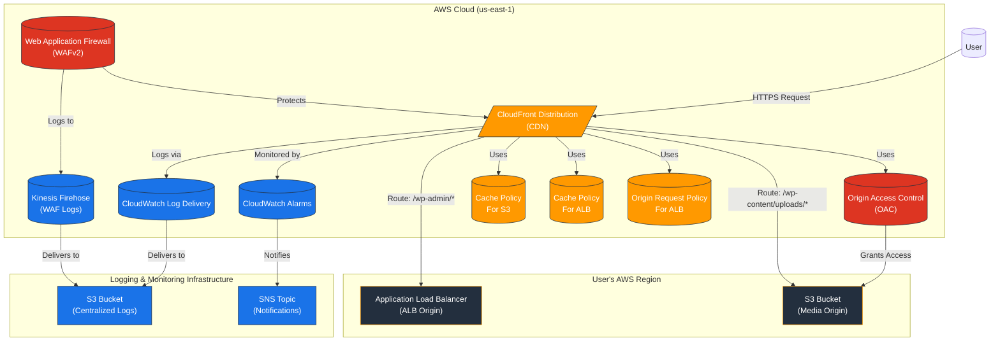

# AWS CloudFront Terraform Module

---

## Table of Contents

- [1. Overview](#1-overview)
- [2. Prerequisites / Requirements](#2-prerequisites--requirements)
- [3. Architecture Diagram](#3-architecture-diagram)
- [4. Features](#4-features)
- [5. Module Architecture](#5-module-architecture)
- [6. Module Files Structure](#6-module-files-structure)
- [7. Inputs](#7-inputs)
- [8. Outputs](#8-outputs)
- [9. Example Usage](#9-example-usage)
- [10. Security Considerations / Recommendations](#10-security-considerations--recommendations)
- [11. Conditional Resource Creation](#11-conditional-resource-creation)
- [12. Best Practices](#12-best-practices)
- [13. Integration](#13-integration)
- [14. Future Improvements](#14-future-improvements)
- [15. Troubleshooting and Common Issues](#15-troubleshooting-and-common-issues)
- [16. Notes](#16-notes)
- [17. Useful Resources](#17-useful-resources)

---

## 1. Overview

This Terraform module provisions a secure and high-performance AWS CloudFront distribution. It is designed as a multi-origin CDN, serving dynamic application content from an Application Load Balancer (ALB) and static media assets from a private S3 bucket. The module includes robust security features like AWS WAF, Origin Access Control (OAC), and modern logging via CloudWatch Log Delivery, all provisioned in `us-east-1` as required by AWS.

---

## 2. Prerequisites / Requirements

- **AWS Provider Alias:** The root module must configure an `aws.cloudfront` provider alias for the `us-east-1` region.
- **Existing Infrastructure:**
    - An **Application Load Balancer (ALB)** for the application origin.
    - A private **S3 Bucket** for static media.
    - A centralized **S3 Bucket** for storing access and WAF logs.
- **ACM Certificate:** A valid **ACM SSL Certificate ARN** located in `us-east-1` is required for custom domain names.
- **SNS Topic:** An SNS Topic ARN (in `us-east-1`) is needed for CloudWatch alarm notifications.

---

## 3. Architecture Diagram



> _Diagram generated with [Mermaid](https://mermaid.js.org/)_

---

## 4. Features

- **Multi-Origin Distribution:** Serves dynamic content from an ALB and static assets from a private S3 bucket.
- **Secure S3 Access:** Uses **Origin Access Control (OAC)** to ensure the S3 bucket is only accessible via CloudFront.
- **Optimized Caching:** Implements separate, fine-tuned cache policies for the application and media origins.
- **Modern Logging:** Leverages **CloudWatch Log Delivery (Logging v2)** for efficient, real-time access logging in Parquet format.
- **WAF Protection:** Integrates with **AWS WAFv2**, including AWS Managed Rule Sets for WordPress and common threats.
- **WAF Log Streaming:** Uses **Kinesis Firehose** to deliver WAF logs to a central S3 bucket.
- **Performance:** Enables HTTP/2, HTTP/3, and optional **Origin Shield** for reduced latency and origin load.
- **Security:** Enforces HTTPS, supports custom domains with ACM, and uses a secret header to protect the ALB origin.
- **Monitoring:** Creates **CloudWatch Alarms** for key metrics like error rates, notifying via SNS.

---

## 5. Module Architecture

This module provisions all resources in the **`us-east-1`** region using the `aws.cloudfront` provider alias:
- **CloudFront Distribution:** The core CDN resource with multiple origins and cache behaviors.
- **Origin Access Control (OAC):** A dedicated resource for secure S3 access.
- **Cache & Origin Request Policies:** Custom policies to control caching and header forwarding.
- **AWS WAFv2 Web ACL:** With AWS Managed Rules and custom rules for IP whitelisting.
- **Kinesis Firehose Delivery Stream:** For streaming WAF logs to S3.
- **IAM Roles & Policies:** Least-privilege roles for Firehose.
- **CloudWatch Log Delivery:** A modern setup for standard CloudFront access logs.
- **CloudWatch Alarms:** For monitoring the distribution's health.

---

## 6. Module Files Structure

| **File**       | **Description**                                                      |
|----------------|----------------------------------------------------------------------|
| `main.tf`      | Defines the core CloudFront distribution, OAC, and cache policies.   |
| `logging.tf`   | Configures CloudFront Access Logging v2 via CloudWatch Log Delivery. |
| `waf.tf`       | Provisions the WAFv2 Web ACL, IP sets, and managed rules.            |
| `firehose.tf`  | Sets up the Kinesis Firehose stream for WAF log delivery.            |
| `iam.tf`       | Manages IAM roles and policies required for Kinesis Firehose.        |
| `metrics.tf`   | Contains CloudWatch Alarms for monitoring key CloudFront metrics.    |
| `variables.tf` | Defines all configurable input variables for the module.             |
| `outputs.tf`   | Exposes important resource attributes as module outputs.             |
| `versions.tf`  | Defines required Terraform and provider versions.                    |

---

## 7. Inputs

| Name                                    | Type           | Description                                                                 |
|-----------------------------------------|----------------|-----------------------------------------------------------------------------|
| `name_prefix`                           | `string`       | A prefix for all resource names.                                            |
| `environment`                           | `string`       | The deployment environment (e.g., 'dev', 'prod').                           |
| `tags`                                  | `map(string)`  | A map of tags to apply to all resources.                                    |
| `s3_module_outputs`                     | `object`       | Outputs from the S3 module, including the media bucket domain name.         |
| `alb_dns_name`                          | `string`       | The DNS name of the Application Load Balancer origin.                       |
| `cloudfront_to_alb_secret_header_value` | `string`       | The secret value sent in a custom header to the ALB.                        |
| `enable_cloudfront_waf`                 | `bool`         | Set to `true` to enable AWS WAF protection.                                 |
| `enable_cloudfront_firehose`            | `bool`         | Set to `true` to enable Kinesis Firehose for WAF logs.                      |
| `enable_cloudfront_standard_logging_v2` | `bool`         | Set to `true` to enable modern CloudFront access logging.                   |
| `logging_bucket_arn`                    | `string`       | ARN of the central S3 bucket for all logs.                                  |
| `logging_bucket_name`                   | `string`       | Name of the central S3 logging bucket.                                      |
| `kms_key_arn`                           | `string`       | Optional: ARN of a KMS key to encrypt WAF logs in S3.                       |
| `sns_alarm_topic_arn`                   | `string`       | Optional: ARN of the SNS topic for CloudWatch alarm notifications.          |
| `acm_certificate_arn`                   | `string`       | Optional: ARN of an ACM certificate in `us-east-1` for a custom domain.     |
| `custom_domain_aliases`                 | `list(string)` | Optional: A list of custom domain names to associate with the distribution. |
| `enable_origin_shield`                  | `bool`         | Set to `true` to enable Origin Shield for the ALB origin.                   |
| `aws_region`                            | `string`       | The primary AWS region of your infrastructure (used by Origin Shield).      |
| `default_region_buckets`                | `map(object)`  | A map describing S3 buckets, used for conditional resource creation.        |
| `wordpress_media_cloudfront_enabled`    | `bool`         | Set to true to enable the CloudFront distribution for WordPress media files.|
| `logging_bucket_enabled`                | `bool`         | Flag to indicate if the central S3 logging bucket is enabled.               |
| `enable_client_vpn`                     | `bool`         | Controls whether the Client VPN module is enabled.                          |
| `vpn_egress_cidrs`                      | `list(string)` | A list of CIDR blocks representing the Client VPN egress IPs.               |

---

## 8. Outputs

| Name                                        | Description                                                  |
|---------------------------------------------|--------------------------------------------------------------|
| `cloudfront_distribution_id`                | The ID of the CloudFront distribution.                       |
| `cloudfront_distribution_arn`               | The ARN of the CloudFront distribution.                      |
| `cloudfront_distribution_domain_name`       | The domain name of the CloudFront distribution.              |
| `cloudfront_distribution_hosted_zone_id`    | The Route 53 Hosted Zone ID for the CloudFront distribution. |
| `cloudfront_oac_id`                         | The ID of the Origin Access Control (OAC).                   |
| `waf_web_acl_id`                            | The ID of the AWS WAFv2 Web ACL.                             |
| `waf_web_acl_arn`                           | The ARN of the WAFv2 Web ACL.                                |
| `firehose_delivery_stream_name`             | The name of the Kinesis Firehose stream for WAF logs.        |
| `firehose_delivery_stream_arn`              | The ARN of the Kinesis Firehose stream for WAF logs.         |
| `firehose_iam_role_arn`                     | The ARN of the IAM role for Kinesis Firehose.                |
| `cloudfront_access_logs_source_name`        | The name of the CloudWatch Log Delivery Source.              |
| `cloudfront_access_logs_destination_name`   | The name of the CloudWatch Log Delivery Destination.         |
| `cloudfront_access_logs_destination_arn`    | The ARN of the CloudWatch Log Delivery Destination.          |
| `cloudfront_access_logs_delivery_id`        | The ID of the CloudWatch Log Delivery connection.            |
| `cloudfront_access_logs_delivery_arn`       | The ARN of the CloudWatch Log Delivery connection.           |
| `cloudfront_standard_logging_v2_log_prefix` | The S3 URI prefix for CloudFront access logs.                |
| `cloudfront_distribution_etag`              | The current ETag of the CloudFront distribution.             |
| `waf_vpn_ip_set_id`                         | The ID of the IP Set for whitelisting VPN access.            |
| `waf_vpn_ip_set_name`                       | The name of the IP Set for whitelisting VPN access.          |
| `waf_vpn_ip_set_arn`                        | The ARN of the IP Set for whitelisting VPN access.           |

---

## 9. Example Usage

```hcl
module "cloudfront" {
  source                                = "./modules/cloudfront"

  # General
  name_prefix                           = "my-app"
  environment                           = "prod"
  tags                                  = { "Terraform" = "true" }
  aws_region                            = "eu-west-1"

  # Origins
  alb_dns_name                          = module.alb.alb_dns_name
  s3_module_outputs                     = module.s3
  cloudfront_to_alb_secret_header_value = "a-very-secret-value"

  # Logging
  enable_cloudfront_standard_logging_v2 = true
  logging_bucket_arn                    = module.s3.logging_bucket_arn
  logging_bucket_name                   = module.s3.logging_bucket_name
  kms_key_arn                           = module.kms.key_arn # For WAF log encryption

  # WAF
  enable_cloudfront_waf                 = true
  enable_cloudfront_firehose            = true

  # Monitoring
  sns_alarm_topic_arn                   = module.sns.alarm_topic_arn

  # Custom Domain (Optional)
  acm_certificate_arn                   = "arn:aws:acm:us-east-1:123456789012:certificate/..."
  custom_domain_aliases                 = ["www.example.com", "example.com"]
}
```

---

## 10. Security Considerations / Recommendations

- **Region Requirement:** All resources in this module **must** be deployed in `us-east-1`. Ensure the `aws.cloudfront` provider alias is correctly configured.
- **ALB Protection:** The ALB security group should be configured to only allow ingress from CloudFront IP ranges and on the port matching the origin's HTTP port. The `x-custom-origin-verify` header provides an additional layer of defense that should be enforced by a WAF rule on the ALB itself.
- **S3 Bucket Policy:** The S3 media bucket policy must be configured to grant access to the CloudFront OAC. This module does not manage that policy; it must be applied separately in the S3 module.
- **WAF Rules:** The module deploys AWS Managed Rules, which is a strong baseline. For production, review and tune these rules (e.g., set actions to `Block` instead of `Count`) and consider adding custom rules specific to your application's traffic patterns.
- **Log Encryption:** When enabling Firehose for WAF logs, provide a `kms_key_arn` to ensure logs are encrypted at rest in S3.

---

## 11. Conditional Resource Creation

- **CloudFront Distribution:** Created only if `wordpress_media_cloudfront_enabled` is `true` and the corresponding S3 bucket is enabled.
- **WAF & Firehose:** The `aws_wafv2_web_acl` and `aws_kinesis_firehose_delivery_stream` are created only if `enable_cloudfront_waf` and `enable_cloudfront_firehose` are set to `true`, respectively.
- **CloudWatch Log Delivery:** The modern logging stack is created if `enable_cloudfront_standard_logging_v2` is `true`.
- **Custom Domain:** The `viewer_certificate` block is dynamically configured based on whether `acm_certificate_arn` is provided.

---

## 12. Best Practices

- **Use `us-east-1`:** All CloudFront-related resources, including WAF ACLs, ACM certificates, and IAM roles for Firehose, must be in `us-east-1`.
- **Multi-Origin Strategy:** Clearly separate dynamic and static content between the ALB and S3 origins with distinct cache behaviors for optimal performance and cost.
- **Modern Logging:** Prefer the `CloudWatch Log Delivery` method (`logging.tf`) over legacy S3 logging. It provides logs in an analytics-friendly Parquet format and offers more delivery flexibility.
- **Response Headers Policies:** Use AWS-managed `ResponseHeadersPolicy` (e.g., `Managed-SecurityHeadersPolicy`) to apply security headers like HSTS, X-Frame-Options, and X-Content-Type-Options at the edge.
- **Content-Security-Policy (CSP):** For maximum protection against XSS, implement a strict CSP. This typically requires a CloudFront Function, as a generic policy cannot be included in a reusable module.

---

## 13. Integration

- **ALB Module:** Consumes the ALB's DNS name as the application origin.
- **S3 Module:** Consumes the S3 media bucket's domain name as the static origin. Requires the S3 module to configure its bucket policy to allow access from the CloudFront OAC created here.
- **KMS Module:** Uses a KMS key ARN for encrypting WAF logs.
- **SNS Module:** Uses an SNS topic ARN for sending CloudWatch alarm notifications.

---

## 14. Future Improvements

- **CloudFront Functions for CSP:** Add an option to associate a CloudFront Function to inject a dynamic Content-Security-Policy (CSP) header.
- **Advanced WAF Rules:** Introduce more granular control over AWS Managed Rules, allowing users to override specific rules within a group.
- **Automated S3 Bucket Policy:** Create a data source or output that generates the required S3 bucket policy statement, making it easier to configure the S3 module.

---

## 15. Troubleshooting and Common Issues

### 1. `InvalidViewerCertificate` Error
- **Cause:** The `acm_certificate_arn` is for a certificate that is not in the `us-east-1` region.
- **Solution:** Provision a new ACM certificate in `us-east-1` and use its ARN.

### 2. S3 Origin Access Denied (403 Error)
- **Cause:** The S3 bucket policy does not grant `s3:GetObject` permission to the CloudFront OAC identity.
- **Solution:** Ensure the S3 media bucket has a policy that allows the `cloudfront.amazonaws.com` service principal to access objects, conditioned on the `aws:SourceArn` being the ARN of the CloudFront distribution.

### 3. WAF logs not appearing in S3
- **Cause:** The IAM role for Firehose (`iam.tf`) lacks permissions to the S3 bucket or KMS key, or the S3 bucket's policy denies access.
- **Solution:** Verify the `aws_iam_policy` for the Firehose role and check the S3 logging bucket's policy for any explicit deny statements.

### 4. Changes to `origin` block in `main.tf` cause persistent diffs
- **Cause:** A known Terraform issue where sensitive values (like the secret header) within a complex block cause a "diff" even if nothing changed.
- **Solution:** The module includes a `lifecycle { ignore_changes = [origin] }` block to mitigate this. Do not remove it.

---

## 16. Notes

- This module is specifically tailored for a WordPress setup but is generic enough to be adapted for other applications with a similar dynamic/static content architecture.
- The `aws.cloudfront` provider alias is critical. Without it, Terraform will attempt to create resources in the default provider's region, which will fail for most CloudFront-related resources.

---

## 17. Useful Resources

- [CloudFront Developer Guide](https://docs.aws.amazon.com/AmazonCloudFront/latest/DeveloperGuide/Introduction.html)
- [Restricting access to an S3 origin](https://docs.aws.amazon.com/AmazonCloudFront/latest/DeveloperGuide/private-content-restricting-access-to-s3.html)
- [Using AWS WAF to control access to your content](https://docs.aws.amazon.com/AmazonCloudFront/latest/DeveloperGuide/distribution-web-awswaf.html)
- [CloudFront Logging v2 (CloudWatch Log Delivery)](https://docs.aws.amazon.com/AmazonCloudFront/latest/DeveloperGuide/real-time-logs.html)
- [AWS Managed Rules for WAF](https://docs.aws.amazon.com/waf/latest/developerguide/aws-managed-rule-groups.html)
