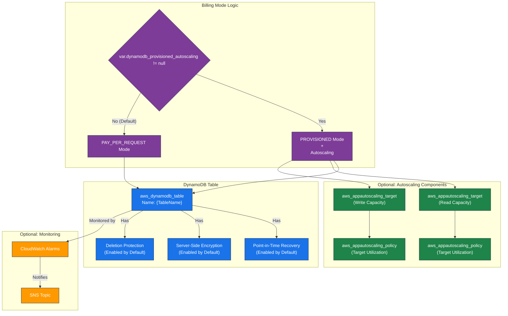

# AWS DynamoDB Terraform Module

---

## Table of Contents

- [1. Overview](#1-overview)
- [2. Prerequisites / Requirements](#2-prerequisites--requirements)
- [3. Architecture Diagram](#3-architecture-diagram)
- [4. Features](#4-features)
- [5. Module Architecture](#5-module-architecture)
- [6. Module Files Structure](#6-module-files-structure)
- [7. Inputs](#7-inputs)
- [8. Outputs](#8-outputs)
- [9. Example Usage](#9-example-usage)
- [10. Security Considerations / Recommendations](#10-security-considerations--recommendations)
- [11. Conditional Resource Creation](#11-conditional-resource-creation)
- [12. Best Practices](#12-best-practices)
- [13. Integration](#13-integration)
- [14. Future Improvements](#14-future-improvements)
- [15. Troubleshooting and Common Issues](#15-troubleshooting-and-common-issues)
- [16. Notes](#16-notes)
- [17. Useful Resources](#17-useful-resources)

---

## 1. Overview

This Terraform module provisions a flexible and secure AWS DynamoDB table. It is designed to be highly generic, supporting simple or complex schemas with dynamic attribute and Global Secondary Index (GSI) creation. The module defaults to a cost-effective `PAY_PER_REQUEST` billing mode, with an optional, easy-to-configure `PROVISIONED` mode that includes full autoscaling capabilities.

---

## 2. Prerequisites / Requirements

- **AWS Provider:** Must be configured in the root module.
- **KMS Key ARN:** Optional, for using a customer-managed key for encryption.
- **SNS Topic ARN:** Optional, for receiving CloudWatch alarm notifications.

---

## 3. Architecture Diagram



> _Diagram generated with [Mermaid](https://mermaid.js.org/)_

---

## 4. Features

- **Flexible Billing:** Defaults to `PAY_PER_REQUEST` and supports `PROVISIONED` mode with one variable.
- **Autoscaling:** Full, optional autoscaling for read and write capacity in `PROVISIONED` mode.
- **Dynamic Schema:** Intelligently defines all table and GSI attributes, preventing schema conflicts.
- **Dynamic GSIs:** Create any number of Global Secondary Indexes via a simple list of objects.
- **Secure by Default:**
    - Point-in-Time Recovery (PITR) is enabled.
    - Server-Side Encryption (SSE) is enabled.
    - Deletion Protection is enabled.
- **Monitoring:** Includes CloudWatch alarms for critical metrics like throttling and system errors.

---

## 5. Module Architecture

This module provisions the following resources:
- **`aws_dynamodb_table`:** The core DynamoDB table resource.
- **`aws_appautoscaling_target` (Optional):** Two targets (read/write) to register the table for autoscaling.
- **`aws_appautoscaling_policy` (Optional):** Two policies to manage the scaling of read and write capacity based on utilization.
- **`aws_cloudwatch_metric_alarm` (Optional):** Alarms for throttled requests and system errors.

---

## 6. Module Files Structure

| **File**       | **Description**                                                                       |
|----------------|---------------------------------------------------------------------------------------|
| `main.tf`      | Defines the `aws_dynamodb_table` and all optional autoscaling resources.              |
| `variables.tf` | Defines all input variables, including the `dynamodb_provisioned_autoscaling` object. |
| `outputs.tf`   | Exposes the table's name and ARN for use in other modules.                            |
| `metrics.tf`   | Contains CloudWatch Alarms for monitoring table health.                               |

---

## 7. Inputs

| Name                                     | Type           | Description                                                                                           |
|------------------------------------------|----------------|-------------------------------------------------------------------------------------------------------|
| `name_prefix`                            | `string`       | A prefix for all resource names.                                                                      |
| `environment`                            | `string`       | The deployment environment (e.g., 'dev', 'prod').                                                     |
| `tags`                                   | `map(string)`  | A map of tags to apply to all resources.                                                              |
| `dynamodb_table_name`                    | `string`       | The base name for the DynamoDB table.                                                                 |
| `dynamodb_hash_key_name`                 | `string`       | The name of the table's partition key.                                                                |
| `dynamodb_hash_key_type`                 | `string`       | The type of the partition key (`S`, `N`, or `B`).                                                     |
| `dynamodb_range_key_name`                | `string`       | Optional: The name of the table's sort key.                                                           |
| `dynamodb_range_key_type`                | `string`       | Optional: The type of the sort key.                                                                   |
| `dynamodb_gsi`                           | `list(object)` | A list of objects, each defining a Global Secondary Index.                                            |
| `dynamodb_provisioned_autoscaling`       | `object`       | **If set, enables `PROVISIONED` mode with autoscaling.** Defaults to `null` (`PAY_PER_REQUEST` mode). |
| `enable_dynamodb_point_in_time_recovery` | `bool`         | Enables Point-in-Time Recovery. Default: `true`.                                                      |
| `dynamodb_deletion_protection_enabled`   | `bool`         | Enables deletion protection. Default: `true`.                                                         |
| `enable_dynamodb_ttl`                    | `bool`         | Enables Time-to-Live (TTL) on an attribute. Default: `false`.                                         |
| `dynamodb_ttl_attribute_name`            | `string`       | The attribute name for TTL. Default: `ExpirationTime`.                                                |
| `kms_key_arn`                            | `string`       | Optional: ARN of a KMS key for server-side encryption.                                                |
| `cloudwatch_alarms_topic_arn`            | `string`       | Optional: ARN of an SNS topic for alarm notifications.                                                |

---

## 8. Outputs

| Name                  | Description                                           |
|-----------------------|-------------------------------------------------------|
| `dynamodb_table_arn`  | The ARN of the DynamoDB table, used for IAM policies. |
| `dynamodb_table_name` | The name of the DynamoDB table, used by applications. |

---

## 9. Example Usage

### Example 1: Default PAY_PER_REQUEST Mode

This is the simplest way to use the module.

```hcl
module "my_table" {
  source = "./modules/dynamodb"

  name_prefix           = "app"
  environment           = "dev"
  dynamodb_table_name   = "user-sessions"
  dynamodb_hash_key_name = "sessionId"
  dynamodb_hash_key_type = "S"

  tags = {
    Project = "MyWebApp"
  }
}
```

### Example 2: PROVISIONED Mode with Autoscaling

To enable provisioned mode, simply define the `dynamodb_provisioned_autoscaling` object.

```hcl
module "my_table_prod" {
  source = "./modules/dynamodb"

  name_prefix           = "app"
  environment           = "prod"
  dynamodb_table_name   = "user-profiles"
  dynamodb_hash_key_name = "userId"
  dynamodb_hash_key_type = "S"

  # Enable PROVISIONED mode with autoscaling by setting this variable
  dynamodb_provisioned_autoscaling = {
    read_min_capacity        = 10
    read_max_capacity        = 500
    read_target_utilization  = 75
    write_min_capacity       = 10
    write_max_capacity       = 200
    write_target_utilization = 75
  }

  # It's recommended to use a customer-managed KMS key for production
  kms_key_arn = module.kms.key_arn

  # Send alarm notifications to an SNS topic
  cloudwatch_alarms_topic_arn = module.sns.alarms_topic_arn

  tags = {
    Project = "MyWebApp"
  }
}
```

---

## 10. Security Considerations / Recommendations

- **IAM Policies:** This module does not create IAM policies. Use the `dynamodb_table_arn` output to create least-privilege IAM policies for the applications or users that need to access this table.
- **KMS Encryption:** While default AWS-owned key encryption is enabled, it is a security best practice to use a Customer-Managed Key (CMK) by providing a `kms_key_arn`. This gives you full control over the key's lifecycle and permissions.
- **Point-in-Time Recovery (PITR):** PITR is enabled by default and should not be disabled in production environments as it is critical for recovering from accidental data deletion or modification.

---

## 11. Conditional Resource Creation

- **Billing & Autoscaling:** The `billing_mode` of the table and the creation of all four `aws_appautoscaling_*` resources are controlled by a single condition: `var.dynamodb_provisioned_autoscaling != null`.
- **TTL:** The `ttl` block is only added to the table if `var.enable_dynamodb_ttl` is `true`.
- **CloudWatch Alarms:** The alarms are only created if a `cloudwatch_alarms_topic_arn` is provided.

---

## 12. Best Practices

- **Choose the Right Billing Mode:**
    - Use the default `PAY_PER_REQUEST` mode for development, testing, and applications with unpredictable or spiky traffic.
    - Use the `PROVISIONED` mode (by setting `dynamodb_provisioned_autoscaling`) for production applications with predictable or high-volume traffic to optimize costs.
- **GSI Design:** While this module makes it easy to add GSIs, design them carefully based on your application's query patterns to avoid unnecessary costs.
- **Tagging:** Apply consistent tags for cost allocation and resource management.

---

## 13. Integration

- **IAM Modules:** The `dynamodb_table_arn` output is the primary integration point for IAM modules to grant permissions to the table.
- **Lambda/Application Modules:** The `dynamodb_table_name` output should be passed as an environment variable to your application code (e.g., a Lambda function) so it knows which table to target.
- **Monitoring Modules:** The `cloudwatch_alarms_topic_arn` variable allows integration with a central SNS topic for notifications.

---

## 14. Future Improvements

- **GSI Autoscaling:** The current implementation configures autoscaling for the main table only. A future improvement could be to add support for configuring autoscaling on a per-GSI basis.
- **DAX Integration:** Add optional support for creating a DynamoDB Accelerator (DAX) cluster for the table.

---

## 15. Troubleshooting and Common Issues

### 1. `ValidationException` on `read_capacity`
- **Cause:** You have set `dynamodb_provisioned_autoscaling = null` (or left it as default) but are trying to set `read_capacity` or `write_capacity` arguments elsewhere.
- **Solution:** The `PAY_PER_REQUEST` mode does not accept capacity arguments. Let the module handle the billing mode logic based on the `dynamodb_provisioned_autoscaling` variable.

### 2. IAM Permission Errors from Application
- **Cause:** The IAM role used by your application does not have sufficient permissions to read from or write to the DynamoDB table.
- **Solution:** Use the `dynamodb_table_arn` output to add the necessary `dynamodb:PutItem`, `dynamodb:GetItem`, `dynamodb:Query`, etc., actions to your application's IAM policy.

---

## 16. Notes

- The logic to dynamically build the `attribute` list in `main.tf` is a key feature. It merges the primary key and all GSI keys into a single map, ensuring every required attribute is defined exactly once, which is a requirement of the `aws_dynamodb_table` resource.

---

## 17. Useful Resources

- [DynamoDB Developer Guide](https://docs.aws.amazon.com/amazondynamodb/latest/developerguide/Introduction.html)
- [DynamoDB Billing Modes](https://docs.aws.amazon.com/amazondynamodb/latest/developerguide/HowItWorks.ReadWriteCapacityMode.html)
- [DynamoDB Auto Scaling](https://docs.aws.amazon.com/amazondynamodb/latest/developerguide/AutoScaling.html)
- [Terraform `aws_dynamodb_table` resource](https://registry.terraform.io/providers/hashicorp/aws/latest/docs/resources/dynamodb_table)
- [Terraform `aws_appautoscaling_policy` resource](https://registry.terraform.io/providers/hashicorp/aws/latest/docs/resources/appautoscaling_policy)
