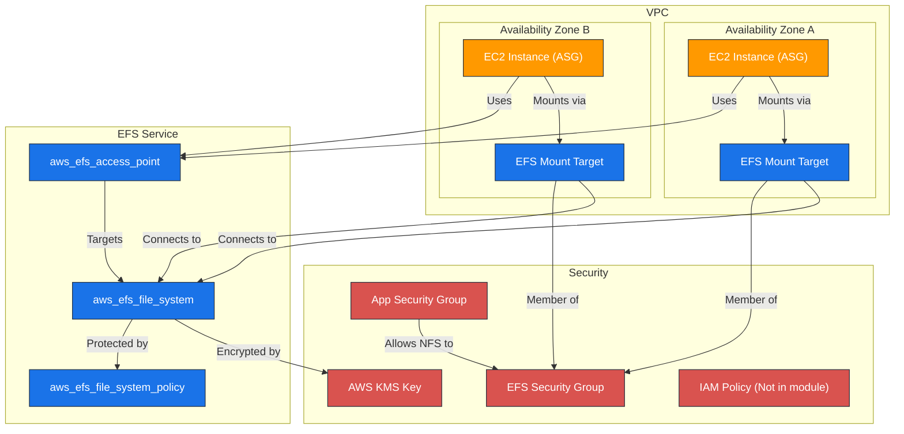

# AWS EFS Terraform Module

---

## Table of Contents

- [1. Overview](#1-overview)
- [2. Prerequisites / Requirements](#2-prerequisites--requirements)
- [3. Architecture Diagram](#3-architecture-diagram)
- [4. Features](#4-features)
- [5. Module Architecture](#5-module-architecture)
- [6. Module Files Structure](#6-module-files-structure)
- [7. Inputs](#7-inputs)
- [8. Outputs](#8-outputs)
- [9. Example Usage](#9-example-usage)
- [10. Security Considerations / Recommendations](#10-security-considerations--recommendations)
- [11. Conditional Resource Creation](#11-conditional-resource-creation)
- [12. Best Practices](#12-best-practices)
- [13. Integration](#13-integration)
- [14. Future Improvements](#14-future-improvements)
- [15. Troubleshooting and Common Issues](#15-troubleshooting-and-common-issues)
- [16. Notes](#16-notes)
- [17. Useful Resources](#17-useful-resources)

---

## 1. Overview

This Terraform module provisions a secure and highly available AWS Elastic File System (EFS). It is designed to provide a shared file system for applications (like WordPress) running on EC2 instances within an Auto Scaling Group. The module enforces security best practices by default, including encryption at rest and in transit, and restricts access to a specific application entry point.

---

## 2. Prerequisites / Requirements

- **AWS Provider:** Must be configured in the root module.
- **VPC:** An existing VPC ID and a set of private subnet IDs are required to create the mount targets.
- **Application Security Group:** The security group ID of the application instances (e.g., from an ASG) that need to mount the EFS.
- **KMS Key ARN:** Required for encryption at rest.

---

## 3. Architecture Diagram



> _Diagram generated with [Mermaid](https://mermaid.js.org/)_

---

## 4. Features

- **High Availability:** Creates mount targets across multiple subnets for multi-AZ resilience.
- **Secure by Default:**
    - Enforces encryption at rest using a customer-provided KMS key.
    - Enforces encryption in transit (TLS) via a mandatory file system policy.
    - Restricts root access by forcing a POSIX user/group on the access point.
    - Isolates network access via a dedicated security group.
- **Application-Specific Access:** Creates an EFS Access Point to restrict applications to a specific directory.
- **Cost Optimization:** Optional lifecycle policy to transition inactive files to the EFS Infrequent Access (IA) storage class.
- **Performance Monitoring:** Optional CloudWatch alarm for low burst credits in `bursting` throughput mode.
- **Production Safety:** Automatically enables deletion protection for the `prod` environment.

---

## 5. Module Architecture

This module provisions the following resources:
- **`aws_efs_file_system`:** The core EFS file system.
- **`aws_efs_mount_target`:** Network interfaces in each specified subnet that allow EC2 instances to connect to the file system.
- **`aws_efs_access_point`:** An application-specific entry point that enforces user identity and a root directory.
- **`aws_efs_file_system_policy`:** A resource policy that mandates in-transit encryption and restricts access to the specified access point.
- **`aws_security_group`:** A dedicated security group for the EFS mount targets.
- **`aws_security_group_rule`:** A rule to allow inbound NFS traffic only from the application's security group.
- **`aws_cloudwatch_metric_alarm` (Optional):** An alarm to monitor the burst credit balance.

---

## 6. Module Files Structure

| **File**            | **Description**                                                                     |
|---------------------|-------------------------------------------------------------------------------------|
| `main.tf`           | Defines the `aws_efs_file_system` and `aws_efs_mount_target` resources.             |
| `access_point.tf`   | Defines the `aws_efs_access_point` for secure application access.                   |
| `security_group.tf` | Defines the security group and ingress rule for the mount targets.                  |
| `policies.tf`       | Defines the `aws_efs_file_system_policy` to enforce encryption and access controls. |
| `metrics.tf`        | Contains the optional CloudWatch Alarm for monitoring burst credits.                |
| `variables.tf`      | Defines all input variables for the module.                                         |
| `outputs.tf`        | Exposes key resource IDs and attributes for use in other modules.                   |

---

## 7. Inputs

| Name                              | Type          | Description                                                                                        |
|-----------------------------------|---------------|----------------------------------------------------------------------------------------------------|
| `name_prefix`                     | `string`      | A prefix for all resource names.                                                                   |
| `environment`                     | `string`      | The deployment environment ('dev', 'stage', or 'prod').                                            |
| `tags`                            | `map(string)` | A map of tags to apply to all resources.                                                           |
| `vpc_id`                          | `string`      | The ID of the VPC where resources will be created.                                                 |
| `subnet_ids`                      | `set(string)` | A set of subnet IDs for creating EFS mount targets.                                                |
| `asg_security_group_id`           | `string`      | The security group ID of the application instances that will access the EFS.                       |
| `efs_encrypted`                   | `bool`        | Enables at-rest encryption. Default: `true`.                                                       |
| `kms_key_arn`                     | `string`      | The ARN of the KMS key for encryption. Required if `efs_encrypted` is `true`.                      |
| `performance_mode`                | `string`      | Performance mode for the file system ('generalPurpose' or 'maxIO'). Default: `generalPurpose`.     |
| `throughput_mode`                 | `string`      | Throughput mode ('bursting', 'provisioned', or 'elastic'). Default: `bursting`.                    |
| `provisioned_throughput_in_mibps` | `number`      | Throughput in MiB/s for 'provisioned' mode. Default: `null`.                                       |
| `enable_efs_lifecycle_policy`     | `bool`        | Enables the lifecycle policy to move files to IA storage. Default: `false`.                        |
| `transition_to_ia`                | `string`      | Defines when to transition files to the Infrequent Access storage class. Default: `AFTER_30_DAYS`. |
| `sns_topic_arn`                   | `string`      | ARN of an SNS topic for CloudWatch alarm notifications.                                            |
| `enable_burst_credit_alarm`       | `bool`        | Enables the CloudWatch alarm for low burst credits. Default: `true`.                               |
| `burst_credit_threshold`          | `number`      | The threshold in bytes for the burst credit alarm. Default: `1099511627776` (~1 TiB).              |
| `efs_access_point_path`           | `string`      | The directory path for the access point. Default: `/wordpress`.                                    |
| `efs_access_point_posix_uid`      | `string`      | The POSIX user ID for the access point. Default: `33` (www-data).                                  |
| `efs_access_point_posix_gid`      | `string`      | The POSIX group ID for the access point. Default: `33` (www-data).                                 |

---

## 8. Outputs

| Name                    | Description                                             |
|-------------------------|---------------------------------------------------------|
| `efs_id`                | The ID of the EFS file system.                          |
| `efs_arn`               | The ARN of the EFS file system.                         |
| `efs_dns_name`          | The DNS name of the EFS file system, used for mounting. |
| `efs_access_point_id`   | The ID of the EFS Access Point.                         |
| `efs_security_group_id` | The ID of the security group for the EFS mount targets. |

---

## 9. Example Usage

```hcl
module "efs" {
  source = "./modules/efs"

  name_prefix           = "my-app"
  environment           = "dev"
  vpc_id                = module.vpc.vpc_id
  subnet_ids            = toset(module.vpc.private_subnet_ids)
  asg_security_group_id = module.asg.security_group_id
  kms_key_arn           = module.kms.key_arn
  sns_topic_arn         = module.sns.alarms_topic_arn

  # Enable lifecycle policy for cost savings in dev
  enable_efs_lifecycle_policy = true
  transition_to_ia            = "AFTER_7_DAYS"

  tags = {
    Project = "MyWebApp"
  }
}
```

---

## 10. Security Considerations / Recommendations

- **IAM Policies:** This module does not create IAM policies for mounting the file system. The EC2 instance profile for your application will need an IAM policy that allows the `elasticfilesystem:ClientMount` action.
- **KMS Key Policy:** Ensure the KMS key's policy grants `kms:Encrypt`, `kms:Decrypt`, `kms:ReEncrypt*`, `kms:GenerateDataKey*`, and `kms:DescribeKey` permissions to the EFS service principal (`efs.amazonaws.com`).
- **Network Security:** The security group rule strictly limits NFS access to the application's security group. Do not widen this rule.
- **File System Policy:** The attached policy is critical. It enforces both encryption-in-transit and access via the designated Access Point, preventing unauthorized connections.

---

## 11. Conditional Resource Creation

- **Lifecycle Policy:** The `lifecycle_policy` block is only added to the file system if `var.enable_efs_lifecycle_policy` is `true`.
- **Provisioned Throughput:** The `provisioned_throughput_in_mibps` argument is only set if `var.throughput_mode` is `provisioned`.
- **CloudWatch Alarm:** The `aws_cloudwatch_metric_alarm` for burst credits is only created if `var.enable_burst_credit_alarm` is `true` and `var.throughput_mode` is `bursting`.
- **Deletion Protection:** The `prevent_destroy` lifecycle argument is automatically set to `true` if `var.environment` is `prod`.

---

## 12. Best Practices

- **High Availability:** Always provide subnets from at least two different Availability Zones to `var.subnet_ids` to ensure resilience.
- **Throughput Mode:** Use `bursting` for applications with spiky traffic (like most web servers). Use `provisioned` for applications with high, sustained throughput needs. Use `elastic` for unpredictable workloads that need to scale automatically.
- **Access Points:** Always use Access Points to mount EFS. They provide a secure, identity-based entry point and prevent applications from accessing unintended directories.
- **Backups:** This module does not include backup functionality. It is strongly recommended to use AWS Backup to create a backup plan for the EFS file system, especially in production.

---

## 13. Integration

- **ASG/EC2:** The `efs_access_point_id` and `efs_dns_name` outputs should be passed to your instance user data scripts to perform the mount operation.
- **VPC:** Requires `vpc_id` and `subnet_ids` from a VPC module.
- **IAM:** The EC2 instance profile needs appropriate IAM permissions to mount the file system.
- **KMS:** Requires a `kms_key_arn` from a KMS module for encryption.

---

## 14. Future Improvements

- **AWS Backup Integration:** Add optional resources to create an `aws_backup_vault` and `aws_backup_plan` for the file system.
- **Replication Configuration:** Add support for EFS Replication to replicate the file system to another region for disaster recovery.

---

## 15. Troubleshooting and Common Issues

### 1. Mount Hangs or Times Out
- **Cause:** Most often caused by incorrect security group rules. The application security group (`asg_security_group_id`) may not have an egress rule allowing port 2049, or the EFS security group ingress rule is misconfigured.
- **Solution:** Verify that the application SG allows outbound TCP traffic on port 2049 to the EFS SG, and the EFS SG allows inbound TCP traffic on port 2049 from the application SG.

### 2. "Access Denied" Errors
- **Cause:** The instance is trying to mount the file system without using the Access Point, or the IAM role is missing permissions.
- **Solution:** Ensure your mount command uses the `-o accesspoint=<access_point_id>` option. Verify the instance's IAM role has the `elasticfilesystem:ClientMount` permission.

---

## 16. Notes

- The file system policy (`policies.tf`) is a critical component that provides a defense-in-depth security layer, complementing the network-level security provided by the security groups.
- The module now uses a `set(string)` for `subnet_ids` for improved flexibility and adherence to modern Terraform practices.

---

## 17. Useful Resources

- [EFS User Guide](https://docs.aws.amazon.com/efs/latest/ug/whatisefs.html)
- [Mounting EFS with Access Points](https://docs.aws.amazon.com/efs/latest/ug/efs-access-points.html)
- [Controlling access with IAM](https://docs.aws.amazon.com/efs/latest/ug/auth-overview.html)
- [Terraform `aws_efs_file_system` resource](https://registry.terraform.io/providers/hashicorp/aws/latest/docs/resources/efs_file_system)
- [Terraform `aws_efs_access_point` resource](https://registry.terraform.io/providers/hashicorp/aws/latest/docs/resources/efs_access_point)
