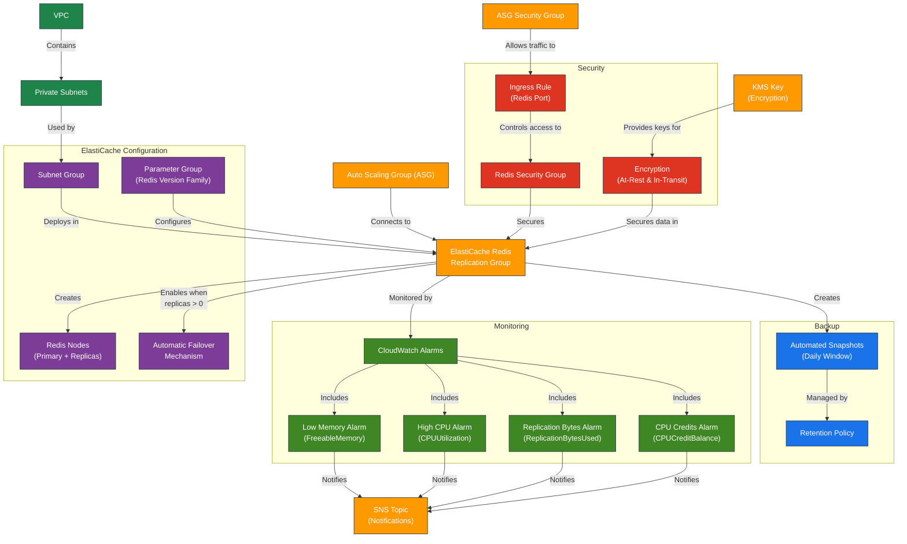

# ElastiCache Module for Terraform

This module creates and manages an ElastiCache Redis cluster in AWS, including a replication group, subnet group, parameter group, CloudWatch alarms for monitoring, and security group management for controlled access.

---

## Architecture Diagram



## Features

- **ElastiCache Subnet Group**:
  - Creates a subnet group for ElastiCache Redis deployment.
  - Deploys in private subnets for enhanced security.

- **Redis Replication Group**:
  - Configurable Redis version with validation (e.g., '7.1').
  - Flexible node type selection (e.g., 'cache.t3.micro').
  - Configurable number of shards (node groups) and replicas per shard.
  - Automatic failover capability (when replicas exist).
  - Encryption at-rest (AWS KMS) and in-transit enabled by default.
  - Configurable port (default: 6379).

- **Parameter Group Management**:
  - Redis parameter group automatically selected based on Redis version.
  - Uses default AWS-optimized parameters.

- **Backup Configuration**:
  - Configurable snapshot retention and backup window.

- **CloudWatch Monitoring**:
  - Low memory detection to prevent performance degradation.
  - High CPU utilization monitoring with multiple evaluations.
  - Replication bytes monitoring for environments with replicas.
  - CPU credits monitoring for burstable instance types.
  - All alarms configurable via variables, thresholds, and SNS notifications.

  **Monitoring Strategy**:
  - **Redis Low Memory Alarm**: Critical to prevent Redis exhaustion and performance degradation.
  - **Redis High CPU Alarm**: Indicates possible Redis overload or inefficient queries.
  - **Replication Bytes Alarm**: Important for environments with replicas, helps prevent replication lag due to high memory usage.
  - **CPU Credits Alarm**: Relevant for T-type (burstable) instances, prevents CPU throttling.

- **Security**:
  - Dedicated security group for Redis.
  - Restricted inbound access from specified ASG Security Group.
  - No explicit egress rules (follows AWS best practices).

---

## Module Files Structure

| File                 | Description                                              |
|----------------------|----------------------------------------------------------|
| `main.tf`            | Creates subnet group, replication group, parameter group |
| `security_group.tf`  | Defines Redis security group and ingress rules           |
| `metrics.tf`         | Configures CloudWatch alarms                             |
| `variables.tf`       | Declares input variables                                 |
| `outputs.tf`         | Exposes outputs for module integration                   |

---

## Input Variables

| Name                                  | Type          | Description                               | Default/Required  |
|---------------------------------------|---------------|-------------------------------------------|-------------------|
| `name_prefix`                         | `string`      | Prefix for resource names                 | **Required**      |
| `environment`                         | `string`      | Environment (`dev`, `stage`, `prod`)      | **Required**      |
| `vpc_id`                              | `string`      | VPC ID for deployment                     | **Required**      |
| `private_subnet_ids`                  | `list(string)`| List of private subnet IDs                | **Required**      |
| `asg_security_group_id`               | `string`      | Security Group ID for ASG access          | **Required**      |
| `redis_version`                       | `string`      | Redis version (`X.Y`)                     | **Required**      |
| `node_type`                           | `string`      | Node type (e.g., `cache.t3.micro`)        | **Required**      |
| `replicas_per_node_group`             | `number`      | Number of replicas per shard              | **Required**      |
| `num_node_groups`                     | `number`      | Number of shards                          | **Required**      |
| `enable_failover`                     | `bool`        | Enable automatic failover                 | `false`           |
| `redis_port`                          | `number`      | Redis port                                | `6379`            |
| `snapshot_retention_limit`            | `number`      | Snapshot retention days                   | **Required**      |
| `snapshot_window`                     | `string`      | Snapshot window (`HH:MM-HH:MM`)           | `"03:00-04:00"`   |
| `redis_cpu_threshold`                 | `number`      | CPU utilization threshold (%)             | **Required**      |
| `redis_memory_threshold`              | `number`      | Memory threshold (bytes)                  | **Required**      |
| `redis_cpu_credits_threshold`         | `number`      | CPU credits threshold                     | `5`               |
| `redis_replication_bytes_threshold`   | `number`      | Replication bytes threshold               | `50000000`        |
| `sns_topic_arn`                       | `string`      | SNS topic ARN for alarms                  | **Required**      |
| `kms_key_arn`                         | `string`      | KMS key ARN for encryption                | **Required**      |
| `enable_redis_low_memory_alarm`       | `bool`        | Enable low memory alarm                   | `false`           |
| `enable_redis_high_cpu_alarm`         | `bool`        | Enable high CPU alarm                     | `false`           |
| `enable_redis_replication_bytes_alarm`| `bool`        | Enable replication bytes alarm            | `false`           |
| `enable_redis_low_cpu_credits_alarm`  | `bool`        | Enable CPU credits alarm                  | `false`           |
| `redis_security_group_id`             | `string`      | Security Group ID for ElastiCache Redis   | `null`            |

---

## Outputs

| Name                           | Description                                          |
|--------------------------------|------------------------------------------------------|
| `redis_port`                   | Port number for Redis connections                    |
| `redis_endpoint`               | Primary endpoint for Redis                           |
| `redis_reader_endpoint`        | Reader endpoint (if replicas exist)                  |
| `redis_security_group_id`      | Security Group ID for Redis                          |
| `redis_replication_group_id`   | Replication group ID                                 |
| `redis_arn`                    | ARN of Redis replication group                       |
| `failover_status`              | Indicates if automatic failover is enabled           |

---

## Troubleshooting and Common Issues

### 1. Redis Cluster Not Accessible
**Cause:** Security group misconfiguration or incorrect port settings.  
**Solution:**  
- Ensure `redis_port` is open in the Redis Security Group.  
- Verify `source_security_group_id` allows traffic from the ASG Security Group.

---

### 2. CloudWatch Alarms Not Triggering
**Cause:** Alarms are not enabled or thresholds are set too high.  
**Solution:**  
- Verify `enable_redis_*_alarm` variables are set to `true`.  
- Re-check values for `redis_cpu_threshold` and `redis_memory_threshold`.

---

### 3. Data Not Encrypted At Rest
**Cause:** Missing or incorrect KMS configuration.  
**Solution:**  
- Ensure `kms_key_arn` is valid and properly configured.  
- Check KMS permissions for the ElastiCache service.

---

### 4. SSM or Redis Monitoring Fails
**Cause:** Missing IAM permissions.  
**Solution:**  
- Attach required IAM policies to allow monitoring and access.

---

### 5. Replication Issues or Failover Not Working
**Cause:** `replicas_per_node_group` is set to `0` or failover is disabled.  
**Solution:**  
- Set `replicas_per_node_group` to a value greater than `0`.  
- Ensure `enable_failover = true` is configured.

---

## Future Improvements

1. **IAM Authentication** for enhanced security.
2. Integration with **AWS Secrets Manager** for credential management.
3. Automated Redis parameter tuning based on usage.
4. Implement Redis Cluster Auto Scaling.

---

## Usage Example

```hcl
module "elasticache" {
  source = "./modules/elasticache"

  name_prefix = "dev"
  environment = "dev"

  vpc_id                = "vpc-0123456789abcdef0"
  private_subnet_ids    = ["subnet-0123456789abcdef0", "subnet-abcdef0123456789"]
  asg_security_group_id = "sg-0123456789abcdef0"

  redis_version = "7.1"
  node_type     = "cache.t3.micro"

  replicas_per_node_group = 1
  num_node_groups         = 2
  enable_failover         = true

  snapshot_retention_limit = 7
  redis_cpu_threshold      = 80
  redis_memory_threshold   = 104857600

  # Enable CloudWatch alarms
  enable_redis_low_memory_alarm = true
  enable_redis_high_cpu_alarm = true
  enable_redis_replication_bytes_alarm = true
  enable_redis_low_cpu_credits_alarm = true

  sns_topic_arn = "arn:aws:sns:eu-west-1:123456789012:cloudwatch-alarms"
  kms_key_arn   = "arn:aws:kms:eu-west-1:123456789012:key/example"
}

```

## Useful Resources

- [Amazon ElastiCache](https://docs.aws.amazon.com/AmazonElastiCache/latest/red-ug/WhatIs.html)
- [AWS CloudWatch Metrics](https://docs.aws.amazon.com/AmazonElastiCache/latest/red-ug/CacheMetrics.html)
- [AWS KMS](https://docs.aws.amazon.com/kms/latest/developerguide/overview.html)
- [ElastiCache Best Practices](https://docs.aws.amazon.com/AmazonElastiCache/latest/red-ug/BestPractices.html)