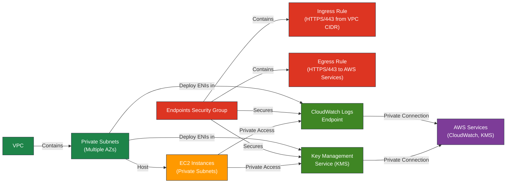

# AWS Interface Endpoints Terraform Module

---

## Table of Contents

- [1. Overview](#1-overview)
- [2. Prerequisites / Requirements](#2-prerequisites--requirements)
- [3. Architecture Diagram](#3-architecture-diagram)
- [4. Features](#4-features)
- [5. Module Architecture](#5-module-architecture)
- [6. Module Files Structure](#6-module-files-structure)
- [7. Inputs](#7-inputs)
- [8. Outputs](#8-outputs)
- [9. Example Usage](#9-example-usage)
- [10. Security Considerations](#10-security-considerations)
- [11. Conditional Resource Creation](#11-conditional-resource-creation)
- [12. Best Practices](#12-best-practices)
- [13. Integration](#13-integration)
- [14. Future Improvements](#14-future-improvements)
- [15. Troubleshooting and Common Issues](#15-troubleshooting-and-common-issues)
- [16. Notes](#16-notes)
- [17. Useful Resources](#17-useful-resources)

---

## 1. Overview

This Terraform module provisions AWS Interface VPC Endpoints for **optional, enhanced security**. By default, EC2 instances in private subnets can access AWS services (like Systems Manager for SSM access) via the NAT Gateway, which routes traffic over the internet.

Enabling this module and creating interface endpoints routes that traffic through private ENIs within the VPC, **preventing it from traversing the public internet**. This is a security best practice and can also reduce NAT Gateway data processing costs.

The module is **disabled by default** (`enable_interface_endpoints = false`) and can be enabled to create endpoints for a custom list of services.

### How to enable?
Set the following in `terraform.tfvars`:
```hcl
enable_interface_endpoints = true
```
And optionally customize the services:
```hcl
interface_endpoint_services = ["ssm", "ssmmessages", "ec2messages", "logs", "kms"]
```
---

## 2. Prerequisites / Requirements

- AWS provider must be configured in the root module.
- Existing **VPC** and **private subnets** must be provided.
- Ensure **DNS hostnames and DNS support** are enabled in the VPC.
- Sufficient **IAM permissions** to create VPC Interface Endpoints and Security Groups.

---

## 3. Architecture Diagram



> _Diagram generated with [Mermaid](https://mermaid.js.org/)_

---

## 4. Features

- Provisions VPC Interface Endpoints for a **configurable list of AWS services**.
- Defaults to creating endpoints for `logs` and `kms`.
- Enables **Private DNS** for seamless service resolution within the VPC.
- Creates a dedicated **Security Group** with strict HTTPS (TCP 443) access control.
- Supports **conditional resource creation** via a single boolean flag.
- Deploys endpoints **across all specified private subnets** for high availability.

---

## 5. Module Architecture

This module provisions the following resources:
- **`aws_vpc_endpoint`**: A single, dynamic resource that creates multiple Interface VPC Endpoints based on a list of services.
- **`aws_security_group`**: A dedicated Security Group to control HTTPS (TCP 443) access to the endpoints.

---

## 6. Module Files Structure

| File                   | Description                                                      |
|------------------------|------------------------------------------------------------------|
| `main.tf`              | Defines Interface VPC Endpoints configuration for AWS services.  |
| `security_group.tf`    | Security Group rules allowing HTTPS access to the endpoints.     |
| `variables.tf`         | Input variables with detailed validation rules.                  |
| `outputs.tf`           | Module outputs: Endpoint IDs and Security Group ID.              |
| `versions.tf`          | Defines required Terraform and provider versions.                |

---

## 7. Inputs

| Name                          | Type           | Description                                                                          |
|-------------------------------|----------------|--------------------------------------------------------------------------------------|
| `aws_region`                  | `string`       | AWS region for resources.                                                            |
| `name_prefix`                 | `string`       | Prefix for naming resources.                                                         |
| `environment`                 | `string`       | Deployment environment label.                                                        |
| `tags`                        | `map(string)`  | Tags to apply to all resources.                                                      |
| `vpc_id`                      | `string`       | ID of the existing VPC.                                                              |
| `vpc_cidr_block`              | `string`       | CIDR block of the VPC.                                                               |
| `private_subnet_ids`          | `list(string)` | List of private subnet IDs.                                                          |
| `enable_interface_endpoints`  | `bool`         | Enable or disable all Interface VPC Endpoints.                                       |
| `interface_endpoint_services` | `list(string)` | A list of AWS services for which to create endpoints. Defaults to `["logs", "kms"]`. |

---

## 8. Outputs

| **Name**                     | **Description**                                               |
|------------------------------|---------------------------------------------------------------|
| `endpoint_ids`               | A map of the created VPC endpoint IDs, keyed by service name. |
| `endpoint_security_group_id` | ID of the Security Group created for endpoints.               |

---

## 9. Example Usage

```hcl
module "interface_endpoints" {
  source = "./modules/interface_endpoints"

  enable_interface_endpoints = true # Set to true to enable

  aws_region         = "eu-west-1"
  name_prefix        = "dev"
  environment        = "dev"
  vpc_id             = module.vpc.vpc_id
  vpc_cidr_block     = module.vpc.vpc_cidr_block
  private_subnet_ids = module.vpc.private_subnet_ids

  # Optionally override the default list to add more services like SSM
  interface_endpoint_services = ["logs", "kms", "ssm", "ssmmessages", "ec2messages"]
}
```

---

## 10. Security Considerations

- Communication is strictly limited to **HTTPS (TCP 443)**.
- **Ingress:** Allowed only from within the VPC CIDR block.
- **Egress:** Allowed to `0.0.0.0/0` on port 443, which is required for endpoints to communicate with regional AWS service APIs.
- **Private DNS** is enabled to ensure services are accessed via standard AWS service URLs without exposing traffic to the public internet.

---

## 11. Conditional Resource Creation

- **Master Switch:** The creation of all resources in this module is controlled by a single variable, `enable_interface_endpoints`. If it is `false` (the default), no resources will be created.
- **Service Selection:** The specific endpoints to be created are determined by the `interface_endpoint_services` list variable. You can customize this list to add or remove services as needed.

---

## 12. Best Practices
- Deploy Interface Endpoints across all private subnets for high availability.
- Consistently tag all resources for easier management.
- For maximum security and to reduce data transfer costs, enable this module to keep AWS service traffic off the public internet.

---

## 13. Integration
Integrate seamlessly with other modules:
- **VPC Module**: Provides networking infrastructure (VPC and subnets).
- **ASG Module**: Instances benefit from secure private AWS service access if this module is enabled.

---

## 14. Future Improvements

- Integrate automated monitoring of endpoint status and connectivity metrics.
- Implement support for granular endpoint policies per service.
- Provide default CloudWatch Alarms for endpoint health and failures.
- Add optional support for **VPC Flow Logs** specific to endpoint network interfaces.

---

## 15. Troubleshooting and Common Issues

### 1. **Interface Endpoints are not created**
**Cause:**
The variable `enable_interface_endpoints` is set to `false`.

**Solution:**
Set `enable_interface_endpoints = true` in `terraform.tfvars` to enable the module and create the required resources.

---

### 2. **EC2 instances in private subnets cannot reach a specific AWS service**
**Cause:**
- The service (e.g., `s3`, `ecr.api`) is not included in the `interface_endpoint_services` list.
- An IAM role is missing permissions for the service.
- A Security Group is blocking HTTPS traffic.

**Solution:**
- Add the required service to the `interface_endpoint_services` variable.
- Verify the instance's IAM role has the necessary policies.
- Ensure security groups allow traffic on port 443.

---

### 3. **SSM Session Manager fails to connect (when using endpoints)**
**Cause:**
- `ssm`, `ssmmessages`, and `ec2messages` are not included in `interface_endpoint_services`.
- Private DNS for endpoints is not enabled.

**Solution:**
- Ensure the three required SSM services are added to the list.
- Ensure `private_dns_enabled = true` is set in the module (enabled by default).
- Check DNS resolution inside the VPC: `dig ssm.<region>.amazonaws.com`. It should resolve to a private IP.

---

### 4. **Terraform plan shows changes or tries to recreate endpoints**
**Cause:**
- Subnet list or Security Group was changed.
- The order of items in the `private_subnet_ids` list was changed.

**Solution:**
- Ensure the order of `private_subnet_ids` is consistent. Using `sort()` can help.
- Review changes carefully before applying.

---

### 6. AWS CLI Reference

```bash
# List all VPC endpoints
aws ec2 describe-vpc-endpoints --query 'VpcEndpoints[*].{ID:VpcEndpointId,Service:ServiceName,Type:VpcEndpointType}' --output table

# Get details for a specific endpoint
aws ec2 describe-vpc-endpoints --vpc-endpoint-ids vpce-xxxxxxxxxxxxxxxxx

# List network interfaces for an endpoint
aws ec2 describe-network-interfaces --filters Name=vpc-endpoint-id,Values=vpce-xxxxxxxxxxxxxxxxx

# List all interface endpoints in a region
aws ec2 describe-vpc-endpoints --filters Name=vpc-endpoint-type,Values=Interface

# Check DNS resolution inside an EC2 instance (example for KMS)
dig kms.eu-west-1.amazonaws.com

# Test HTTPS connectivity to an endpoint from EC2
curl -s https://kms.eu-west-1.amazonaws.com

# Verify IAM role attached to EC2 instance (from within instance)
curl -s http://169.254.169.254/latest/meta-data/iam/info
```

Note: Replace vpce-xxxxxxxxxxxxxxxxx with your actual VPC Endpoint ID

---

## 16. Notes

- The module is fully conditional and does not create any resources if `enable_interface_endpoints = false`.
- Pay attention to the order of `private_subnet_ids` to avoid unnecessary endpoint recreation during updates.
- All outputs safely return `null` when `enable_interface_endpoints = false`, ensuring compatibility with other modules.

---

## 17. Useful Resources

- [AWS Interface VPC Endpoints Documentation](https://docs.aws.amazon.com/vpc/latest/privatelink/vpc-endpoints.html)
- [AWS PrivateLink Best Practices](https://docs.aws.amazon.com/vpc/latest/privatelink/best-practices.html)
- [AWS Systems Manager Documentation](https://docs.aws.amazon.com/systems-manager/latest/userguide/what-is-systems-manager.html)
- [AWS CloudWatch Logs Documentation](https://docs.aws.amazon.com/AmazonCloudWatch/latest/logs/WhatIsCloudWatchLogs.html)
- [AWS Key Management Service (KMS) Documentation](https://docs.aws.amazon.com/kms/latest/developerguide/overview.html)

---
