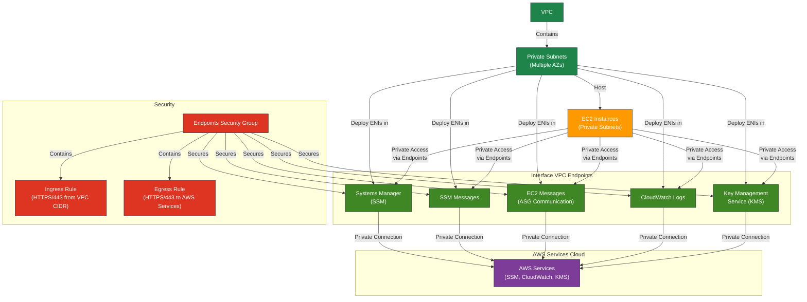

# AWS Interface Endpoints Terraform Module

Terraform module to provision AWS Interface VPC Endpoints for secure and private communication with essential AWS services within your VPC.

This module is currently **disabled** (`enable_interface_endpoints = false`) but remains as a **future-proofing measure**.

### When is it needed?
If EC2 instances are **moved to private subnets** without NAT Gateway, AWS Systems Manager (SSM), CloudWatch Logs, and KMS **will stop working** because they require an internet connection. In such a scenario, **VPC Interface Endpoints** allow these services to work securely inside the VPC **without internet access**.

### Current State
- **EC2 instances are in public subnets** with internet access.
- **Session Manager and CloudWatch Logs work via the public internet**, so VPC Endpoints are **not needed**.
- This module remains in the project in case the architecture changes.

### How to Enable?
If EC2 instances are moved to private subnets, **update `terraform.tfvars`**:
```hcl
enable_interface_endpoints = true
```

## Overview

This module creates Interface VPC Endpoints for secure and highly available access to AWS services without traversing the public internet, enhancing security and reliability.
Using this module allows you to configure access to EC2 instances through AWS Systems Manager Session Manager, which allows you to completely disable SSH access if necessary, increasing the level of infrastructure security.

## Architecture Overview



This architecture enables EC2 instances in private subnets (without internet access) to securely communicate with AWS services through private endpoints within the VPC.

### Supported AWS Services:
- **AWS Systems Manager (SSM)**
- **SSM Messages**
- **EC2 Messages (for Auto Scaling Group communication)**
- **CloudWatch Logs**
- **AWS Key Management Service (KMS)**

Endpoints are deployed across all private subnets, ensuring high availability across multiple Availability Zones (AZ).

## Requirements

| Name         | Version   |
|--------------|-----------|
| Terraform    | >= 1.0    |
| AWS Provider | >= 5.0    |

## Module Architecture

This module provisions:
- **Interface VPC Endpoints** for listed AWS services, using conditional creation based on the `enable_interface_endpoints` variable.
- **Dedicated Security Group** to control HTTPS (port 443) access within the VPC.
- **Inbound and outbound Security Group rules** tailored for secure communication.

## Module Files Structure

| File                   | Description                                                      |
|------------------------|------------------------------------------------------------------|
| `main.tf`              | Defines Interface VPC Endpoints configuration for AWS services.  |
| `security_group.tf`    | Security Group rules allowing HTTPS access to the endpoints.     |
| `variables.tf`         | Input variables with detailed validation rules.                  |
| `outputs.tf`           | Module outputs: Endpoint IDs and Security Group ID.              |

## Requirements

- **Existing VPC and Private Subnets**:
  - Ensure the VPC and private subnets exist before deploying this module.

## Inputs

| Name                          | Type           | Description                               | Validation                              |
|-------------------------------|----------------|-------------------------------------------|-----------------------------------------|
| `aws_region`                  | `string`       | AWS region for resources.                 | Format: `xx-xxxx-x` (e.g., `eu-west-1`) |
| `name_prefix`                 | `string`       | Prefix for naming resources.              | Non-empty string                        |
| `environment`                 | `string`       | Deployment environment label.             | One of: `dev`, `stage`, `prod`          |
| `vpc_id`                      | `string`       | ID of the existing VPC.                   | Valid AWS VPC ID                        |
| `vpc_cidr_block`              | `string`       | CIDR block of the VPC.                    | Valid CIDR block format                 |
| `private_subnet_ids`          | `list(string)` | List of private subnet IDs.               | Valid AWS subnet IDs                    |
| `enable_interface_endpoints`  | `bool`         | Enable or disable Interface VPC Endpoints | Default: `false`                        |

## Outputs

| **Name**                     | **Description**                                   |
|------------------------------|---------------------------------------------------|
| `ssm_endpoint_id`            | ID of the Systems Manager Interface Endpoint      |
| `ssm_messages_endpoint_id`   | ID of the SSM Messages Interface Endpoint         |
| `asg_messages_endpoint_id`   | ID of the EC2 Messages Interface Endpoint         |
| `cloudwatch_logs_endpoint_id`| ID of the CloudWatch Logs Interface Endpoint      |
| `kms_endpoint_id`            | ID of the KMS Interface Endpoint                  |
| `endpoint_security_group_id` | ID of the Security Group created for endpoints    |

## Example Usage

```hcl
module "interface_endpoints" {
  source = "./modules/interface_endpoints"

  aws_region                 = "eu-west-1"
  name_prefix                = "dev"
  environment                = "dev"
  vpc_id                     = module.vpc.vpc_id
  vpc_cidr_block             = module.vpc.vpc_cidr_block
  private_subnet_ids         = module.vpc.private_subnet_ids
  enable_interface_endpoints = false  # Default is false, set to true when needed
}
```

## Security
- **Communication restricted to HTTPS (port 443)**
- **Ingress:** Limited to the VPC CIDR block
- **Egress:** Allowed to AWS services and PrivateLink endpoints (required)
- **Private DNS Enabled:** Allows standard AWS service URLs

## Conditional Creation
All resources in this module use the `count` parameter with the `enable_interface_endpoints` variable to conditionally create resources. When set to `false`, no resources are created, which is the default behavior.

## Best Practices
- Deploy Interface Endpoints across all private subnets for high availability.
- Consistently tag all resources for easier management.
- Enable this module only when instances are in private subnets without internet access.

## Outputs
Outputs provided:
- Endpoint IDs for each AWS service.
- Security Group ID for managing endpoint access.

## Integration
Integrate seamlessly with other modules:
- **VPC Module**: Provides networking infrastructure (VPC and subnets).
- **ASG Module**: Instances benefit from secure private AWS service access.

## Troubleshooting and Common Issues

### 1. **Interface Endpoints are not created**
**Cause:**  
The variable `enable_interface_endpoints` is set to `false`.

**Solution:**  
Set `enable_interface_endpoints = true` in `terraform.tfvars` to enable the module and create the required resources.

---

### 2. **EC2 instances in private subnets cannot reach AWS services (SSM, CloudWatch Logs, KMS)**
**Cause:**  
- Interface Endpoints are not deployed.
- Missing required IAM roles or policies for EC2 instances.
- Incorrect Security Group rules blocking HTTPS (TCP 443).

**Solution:**  
- Ensure Interface Endpoints are created and deployed in the correct private subnets.
- Attach the `AmazonSSMManagedInstanceCore` IAM policy to the EC2 instance role.
- Verify Security Group allows outbound HTTPS (TCP 443) traffic.

---

### 3. **SSM Session Manager fails to connect**
**Cause:**  
- Private DNS for endpoints is not enabled.
- EC2 instance cannot resolve the AWS service endpoint.

**Solution:**  
- Ensure `private_dns_enabled = true` is set in the module (enabled by default).
- Check DNS resolution inside the VPC:
  ```bash
  dig ssm.<region>.amazonaws.com
  ```
  It should resolve to a private IP.

---

### 4. **Terraform plan shows changes or tries to recreate endpoints**
**Cause:**  
- Subnet list or Security Group was changed.
- Endpoint resource is sensitive to order changes in `subnet_ids`.

**Solution:**  
- Ensure the order of `private_subnet_ids` is consistent.
- Review changes carefully before applying.

---

### 5. **tfsec warning: aws-ec2-no-public-egress-sgr**
**Cause:**  
The module allows outbound HTTPS (TCP 443) to `0.0.0.0/0`, which is required for Interface Endpoints.

**Solution:**  
- This is expected behavior.
- The module explicitly ignores this warning:
  ```hcl
  # tfsec:ignore:aws-ec2-no-public-egress-sgr
  ```
- No action needed.

---

For additional details and customizations, refer to [AWS VPC Interface Endpoints Documentation](https://docs.aws.amazon.com/vpc/latest/privatelink/vpc-endpoints.html).