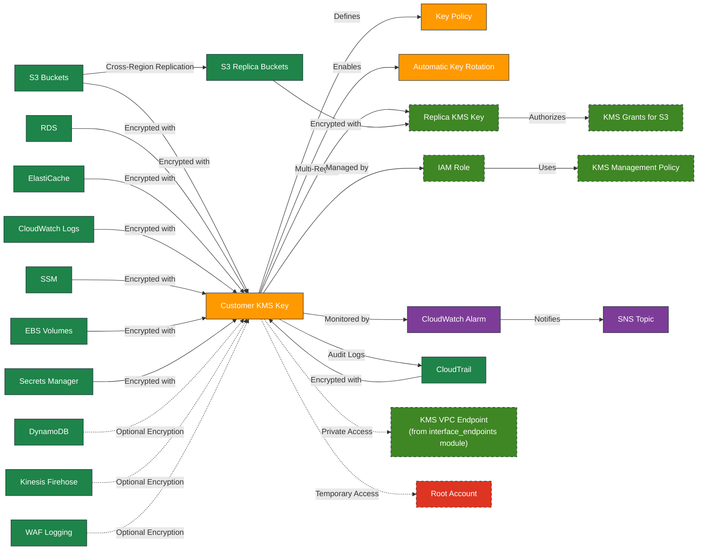

# AWS KMS Terraform Module

---

## Table of Contents

- [1. Overview](#1-overview)
- [2. Prerequisites / Requirements](#2-prerequisites--requirements)
- [3. Architecture Diagram](#3-architecture-diagram)
- [4. Features](#4-features)
- [5. Module Architecture](#5-module-architecture)
- [6. Module Files Structure](#6-module-files-structure)
- [7. Inputs](#7-inputs)
- [8. Outputs](#8-outputs)
- [9. Example Usage](#9-example-usage)
- [10. Security Considerations / Recommendations](#10-security-considerations--recommendations)
- [11. Conditional Resource Creation](#11-conditional-resource-creation)
- [12. Best Practices](#12-best-practices)
- [13. Integration](#13-integration)
- [14. Future Improvements](#14-future-improvements)
- [15. Troubleshooting and Common Issues](#15-troubleshooting-and-common-issues)
- [16. Notes](#16-notes)
- [17. Useful Resources](#17-useful-resources)

---

## 1. Overview

This Terraform module provisions a general-purpose AWS KMS (Key Management Service) Customer Managed Key (CMK) for encrypting a wide range of AWS resources. It supports automatic key rotation, cross-region replication, customizable IAM permissions, and CloudWatch monitoring of key usage. The module is designed to provide secure, flexible, and production-ready encryption management within your infrastructure. Root access can be toggled using the `kms_root_access` variable to simplify secure setup and transition to least privilege.

---

## 2. Prerequisites / Requirements

- **AWS Provider Configuration**:
  - AWS region and account configuration should be defined in the root Terraform block (`providers.tf`).
- **Existing SNS Topic** (required if key monitoring is enabled):
  - SNS topic ARN for alarm notifications.
- **VPC Considerations**:
  - If EC2 instances are in private subnets without internet access, consider enabling KMS VPC Interface Endpoints.
- **Root Access Control**:
  - The `kms_root_access` variable controls whether the root user has permissions on the KMS key.
    It should be set to `true` during initial setup and switched to `false` afterward.

### Supported AWS Resource Encryption:
- CloudWatch Logs
- S3 buckets
- RDS instances
- ElastiCache clusters
- VPC Flow Logs
- SSM parameters and sessions
- EC2 EBS volumes
- WAFv2 logging
- CloudTrail logs (when enabled via bucket configuration)
- Secrets Manager
- Optional support for:
  - DynamoDB
  - Kinesis Firehose
  - WAF (legacy logging)

---

## 3. Architecture Diagram



> _Diagram generated with [Mermaid](https://mermaid.js.org/)_

---

## 4. Features

- Provisions a **general-purpose KMS key** for encrypting AWS resources.
- Supports **automatic key rotation**.
- Optionally creates **cross-region replica KMS keys** for S3 replication.
- Manages **IAM roles and policies** for administrative control.
- Integrates with **CloudWatch Alarms** for decrypt operation monitoring.
- Supports **KMS Grants** for S3 replication and service-specific encryption (DynamoDB, Firehose, WAF).
- Fully supports **environment-specific key separation** (`dev`, `stage`, `prod`).

---

## 5. Module Architecture

This module provisions:
- A **Customer KMS Key** with optional automatic rotation.
- An **optional Replica KMS Key** for cross-region S3 replication.
- **IAM Role and Policy** for administrative management (optional).
- **KMS Grants** for S3 replication and other services.
- **CloudWatch Alarms** monitoring decrypt operations.
- Supports encryption for a wide range of AWS services: S3, RDS, ElastiCache, EBS, CloudWatch, SSM, Secrets Manager, and optionally DynamoDB, Firehose, WAF.

---

## 6. Module Files Structure

| File             | Description                                                         |
|------------------|---------------------------------------------------------------------|
| `main.tf`        | Defines primary and replica KMS keys, policies, and grants.         |
| `key.tf`         | IAM role and policy for administrative key management.              |
| `metrics.tf`     | CloudWatch alarms for monitoring key usage.                         |
| `variables.tf`   | Input variables and validation rules for customization.             |
| `outputs.tf`     | Module outputs including ARNs and IDs of created resources.         |
| `versions.tf`    | Defines required Terraform and provider versions.                   |

---

## 7. Inputs

| Name                                    | Type          | Description                                                         |
|-----------------------------------------|---------------|---------------------------------------------------------------------|
| `aws_account_id`                        | `string`      | AWS Account ID (12-digit numeric string)                            |
| `aws_region`                            | `string`      | AWS Region (format: xx-xxxx-x, e.g., eu-west-1)                     |
| `replication_region`                    | `string`      | AWS Region for replica key (optional)                               |
| `name_prefix`                           | `string`      | Prefix for naming resources                                         |
| `environment`                           | `string`      | Deployment environment label                                        |
| `tags`                                  | `map(string)` | Tags to apply to all resources.                                     |
| `enable_key_rotation`                   | `bool`        | Enable automatic key rotation                                       |
| `kms_root_access`                       | `bool`        | Enable or disable root access to the KMS key                        |
| `enable_kms_admin_role`                 | `bool`        | Create IAM role for key management                                  |
| `enable_key_monitoring`                 | `bool`        | Enable CloudWatch alarms for key usage                              |
| `enable_kms_access_denied_alarm`        | `bool`        | Enable CloudWatch alarm for KMS AccessDenied errors                 |
| `key_decrypt_threshold`                 | `number`      | Threshold for decrypt operations alarm                              |
| `sns_topic_arn`                         | `string`      | ARN of SNS topic for alarms (required if monitoring enabled)        |
| `default_region_buckets`                | `map(object)` | Configuration for default region S3 buckets (see details below)     |
| `replication_region_buckets`            | `map(object)` | Configuration for replication region S3 buckets (see details below) |
| `enable_dynamodb`                       | `bool`        | Allow DynamoDB service usage                                        |
| `enable_alb_firehose`                   | `bool`        | Allow Kinesis Firehose usage for ALB logs                           |
| `enable_alb_waf_logging`                | `bool`        | Allow WAF logging usage for ALB                                     |
| `enable_image_processor`                | `bool`        | Grant SQS service permissions for DLQ encryption                    |

---

## 8. Outputs

| Name                        | Description                                                 |
|-----------------------------|-------------------------------------------------------------|
| `kms_key_arn`               | ARN of the primary KMS key                                  |
| `kms_key_id`                | ID of the primary KMS key                                   |
| `kms_replica_key_arn`       | ARN of the replica KMS key (if created)                     |
| `enable_kms_admin_role`     | Indicates if IAM role for key management was created        |
| `kms_management_role_arn`   | ARN of the IAM role for key management (if created)         |
| `kms_management_policy_arn` | ARN of the IAM policy for key management (if created)       |
| `kms_decrypt_alarm_arn`     | ARN of the CloudWatch decrypt alarm (if created)            |

---

## 9. Example Usage

```hcl
module "kms" {
  source                = "./modules/kms"

  aws_region            = var.aws_region
  aws_account_id        = var.aws_account_id
  environment           = var.environment
  name_prefix           = var.name_prefix

  enable_key_rotation   = true
  kms_root_access       = false # Set to true during initial setup, then switch to false to remove root access automatically
  enable_kms_admin_role = true
  enable_key_monitoring = true
  enable_kms_access_denied_alarm = true
  key_decrypt_threshold = 100
  # Note: sns_topic_arn is required only if enable_key_monitoring = true
  sns_topic_arn         = aws_sns_topic.cloudwatch_alarms.arn

  enable_dynamodb                   = true
  enable_alb_firehose               = false
  enable_alb_waf_logging            = true
  enable_image_processor            = true

  # S3 bucket configuration with CloudTrail enabled
  default_region_buckets = {
    cloudtrail = { enabled = true },
    logs = {
      enabled = true,
      versioning = true
    }
  }

  # Cross-region replication configuration
  replication_region = "us-east-1"
  replication_region_buckets = {
    logs_replica = {
      enabled = true,
      region = "us-east-1"
    }
  }
}
```
### S3 Bucket Configuration Details

#### `default_region_buckets`
```hcl
default_region_buckets = {
  bucket_name = {
    enabled     = bool    # Optional, default: true
    versioning  = bool    # Optional, default: false
    replication = bool    # Optional, default: false
    logging     = bool    # Optional, default: false
    region      = string  # Optional, defaults to provider region if not set
  }
}
```
#### `replication_region_buckets`
```hcl
replication_region_buckets = {
  bucket_name = {
    enabled     = bool    # Optional, default: true
    versioning  = bool    # Optional, default: true (required for replication destinations)
    replication = bool    # Optional, default: false (not applicable for replication buckets)
    logging     = bool    # Optional, default: false
    region      = string  # Required - AWS region for the replication bucket
  }
}
```
#### CloudTrail Integration
To enable CloudTrail integration, include a `cloudtrail` bucket in your configuration:
```hcl
default_region_buckets = {
  cloudtrail = { enabled = true }
}
```
---

## 10. Security Considerations / Recommendations

- **Root access** is controlled via the `kms_root_access` variable.
  Set to `true` during initial setup, then switch to `false` to automatically remove root permissions from the KMS key policy.
- For administrative KMS key management, enable the optional IAM role (`enable_kms_admin_role = true`).
  This role is intended only for secure manual operations (e.g., rotation management), not for automation.
- Enable **automatic key rotation** to reduce the risk of key compromise.
- Use **VPC Interface Endpoints** for KMS when instances operate in private subnets.
- Monitor key usage and unusual activity using **CloudWatch Alarms**.
- For automated encryption, define IAM permissions or KMS grants within each consuming module (e.g., S3, RDS, ElastiCache).

### Security
- **Initial root access** granted temporarily for key setup (must be manually revoked after initial setup).
- **IAM role** (`enable_kms_admin_role = true`) provides secure manual access to manage the KMS key after root access is revoked.
  This role is intended only for administrative actions and is not meant for automation or operational workflows.
- **Ensure that IAM roles for EC2 instances** have `kms:CreateGrant` permission when using EBS encryption. This is critical for instance launch and operation with encrypted volumes.
- **CloudWatch Alarms** monitor abnormal or unauthorized key usage.

### Root Access Removal Process
1. Set kms_root_access = true in terraform.tfvars during initial setup to enable full administrative access via the root account.
2. Once the key is created and the IAM role is provisioned:
    Set enable_kms_admin_role = true to create the administrative IAM role (see key.tf).
3. Then, disable root access by setting kms_root_access = false.
4. Run terraform apply to update the KMS key policy and enforce least privilege.
5. After root access is disabled, any future changes to the key policy require an authorized IAM role with `kms:PutKeyPolicy` permissions. Without it, administrative access cannot be restored.

### Root Access Recovery (Optional)
- Root access is not required for updating or destroying the infrastructure, as long as enable_kms_admin_role = true and the admin role is active in the key policy.
- Only re-enable kms_root_access = true in exceptional cases where the admin role was removed or access was misconfigured.

### CloudWatch Monitoring
The module currently implements monitoring for:
- **Decrypt Operations**: Alerts when the number of decrypt operations exceeds the configured threshold
- **Access Denied Errors**: Alerts when there are any KMS AccessDenied errors (possible unauthorized access attempts)
- Alarm configuration:
  - Evaluation period: 5 minutes
  - Consecutive periods: 3 (to reduce false positives)
  - Datapoints to alarm: 2 (alarm triggers if 2 out of 3 periods exceed threshold)

### KMS Grants for Replication
When cross-region replication is enabled, the module automatically:
1. Creates a replica KMS key in the specified replication region
2. Sets up KMS grants to allow S3 service to use the replica key for replication
3. Configures appropriate permissions for cross-region data transfer

---

## 11. Conditional Resource Creation

This module supports conditional creation of certain resources based on input variables:

- **Customer KMS Key** is always created when the module is enabled.
- **Cross-region Replica KMS Key** is created only if the `replication_region_buckets` map contains at least one bucket with `enabled = true`.
- **KMS Grants** for S3 replication are created automatically **if cross-region replication is configured** (i.e., at least one `replication_region_bucket` is enabled).
- **IAM Role and Policy for KMS administration** are created only if `enable_kms_admin_role = true`.
- **CloudWatch Alarms** for monitoring decryption operations are created only if `enable_key_monitoring = true`.
- **AccessDenied Alarms** for detecting unauthorized access attempts are created only if `enable_kms_access_denied_alarm = true`.

---

## 12. Best Practices
- **Automatic Key Rotation**: Reduces risk of key compromise.
- **Least Privilege Access**: Limit permissions strictly to necessary IAM roles and AWS services.
- **Environment-specific Keys**: Maintain separate KMS keys per environment (`dev`, `stage`, `prod`).
- **Monitoring**: Actively monitor KMS usage through CloudWatch.
- **VPC Endpoints**: Consider using KMS VPC Interface Endpoints for private subnet scenarios.

---

## 13. Integration
Integrates seamlessly with other modules:
- **VPC, ASG, ALB, RDS, S3, ElastiCache Modules**: Encryption at rest for data stored or transmitted by these services.

### EBS Volume Encryption
When using this KMS key for EBS volume encryption:
- Set `enable_ebs_encryption = true` in your ASG or EC2 configuration.
- The KMS key policy includes dedicated statements for the AutoScaling service role:
  - `AllowAutoScalingServiceRoleUsage` - Allows basic key operations
  - `AllowAutoScalingServiceRoleCreateGrant` - Allows creating grants for AWS resources
- The policy also includes `AllowEC2LaunchGrant` statement to allow EC2 to create grants for encrypted volumes.
- This approach follows AWS best practices for EBS encryption with AutoScaling.

---

## 14. Future Improvements

- **Enhanced Policy Flexibility:**
  Allow finer-grained permissions customization per AWS service and principal.

- **Expanded Monitoring:**
  Add additional CloudWatch metrics for better anomaly detection and alerting.

- **Automated Policy Management:**
  Automate the secure removal of initial root access post-setup.

- **Cross-Account Support:**
  Simplify configuration of cross-account permissions where necessary.

---

## 15. Troubleshooting and Common Issues

### 1. KMS Decrypt Operations Alarm Constantly Triggering
**Cause:** Threshold for `DecryptCount` is too low for the workload.
**Solution:**
- Increase the `key_decrypt_threshold` value in `terraform.tfvars`.
- Review actual KMS usage in CloudWatch Metrics and adjust accordingly.
- Validate that legitimate services (e.g., S3, CloudWatch) generate expected decrypt operations.

---

### 2. Root Access Not Removed After Setup
**Cause:** Initial root permissions in the KMS Key Policy were not manually revoked.
**Solution:**
- Follow the **Root Access Removal Process** section in the README.
- Remove the root access statement from `aws_kms_key_policy.general_encryption_key_policy`.
- Re-apply the Terraform configuration to enforce least privilege.

---

### 3. CloudWatch Alarm Not Sending Notifications
**Cause:** `sns_topic_arn` not configured or incorrect.
**Solution:**
- Ensure `sns_topic_arn` is correctly set and matches an existing SNS Topic ARN.
- Verify that the SNS topic has the correct subscription and policy to allow CloudWatch to publish.

---

### 4. Replica KMS Key Not Created
**Cause:** `replication_region_buckets` misconfigured or replication bucket missing `enabled = true`.
**Solution:**
- Validate `replication_region_buckets` contains at least one bucket with `enabled = true`.
- Ensure `replication_region` is properly set and matches the destination region.

---

### 5. S3 Replication Fails with KMS Permission Error
**Cause:** Missing or incorrect KMS Grant for S3 replication.
**Solution:**
- Check that the module created the `aws_kms_grant.s3_replication_grant`.
- Verify that `s3.amazonaws.com` is listed as the grantee principal in the KMS Grant.

---

### 6. DynamoDB, Firehose, or WAF Fails to Use KMS Key
**Cause:** Corresponding `enable_*` variables not enabled.
**Solution:**
- Set `enable_dynamodb`, `enable_firehose`, or `enable_waf_logging` to `true` in `terraform.tfvars` if these services require KMS access.
- Re-apply the configuration.

---

### 7. Monitoring Disabled but Alarms Exist
**Cause:** `enable_key_monitoring` set to `false`, but CloudWatch Alarm resources remain.
**Solution:**
- Run `terraform apply` again to ensure alarms are destroyed when monitoring is disabled.
- Check `metrics.tf` for conditional resource creation based on `enable_key_monitoring`.

---

### 8. KMS Key Not Accessible from Private Subnets
**Cause:** Missing KMS VPC Interface Endpoint when EC2 is fully private.
**Solution:**
- Enable Interface Endpoints for KMS if EC2 instances are in private subnets without internet access.
- Add `enable_interface_endpoints = true` in your Terraform configuration.

---

### 9. Terraform Plan Fails Due to Missing KMS Key Policy
**Cause:** Changes in IAM roles or incorrect references to KMS policy resources.
**Solution:**
- Re-check `aws_kms_key_policy` resource dependencies.
- Ensure the `aws_iam_role.kms_admin_role` is properly created and referenced.

---

### 10. Cross-Region Replication Data Not Encrypted
**Cause:** Replica KMS Key or KMS Grant not applied correctly.
**Solution:**
- Verify the replica KMS key exists in the replication region.
- Confirm the KMS Grant is created and linked to the S3 replication process.

### 11. EC2 Instances Fail to Launch with Encrypted EBS Volumes
**Cause:** Missing permissions in KMS key policy for EBS encryption.
**Solution:**
- Verify that the KMS key policy includes the `AllowAutoScalingServiceRoleUsage` and `AllowAutoScalingServiceRoleCreateGrant` statements.
- Ensure the `AllowAutoScalingServiceRoleUsage` statement includes all necessary actions: `kms:Encrypt`, `kms:Decrypt`, `kms:ReEncrypt*`, `kms:GenerateDataKey*`, and `kms:DescribeKey`.
- Confirm the `AllowAutoScalingServiceRoleCreateGrant` statement allows `kms:CreateGrant` with condition `"kms:GrantIsForAWSResource": "true"`.
- Check that the EC2 service principal is included in the `kms_services` list.
- Verify that the `AllowEC2LaunchGrant` statement is present to allow EC2 to create grants for encrypted volumes.

### 12. AWS CLI Reference

Use these commands to inspect and troubleshoot KMS-related issues directly via the AWS CLI.

```bash
# Check all KMS keys in the account:
aws kms list-keys

# Describe the primary KMS key:
aws kms describe-key --key-id <KMS_KEY_ID>

# Get the current key policy:
aws kms get-key-policy --key-id <KMS_KEY_ID> --policy-name default

# List key grants (e.g., for S3 replication):
aws kms list-grants --key-id <KMS_KEY_ID>

# View recent KMS decrypt operations in CloudWatch:
aws cloudwatch get-metric-statistics \
  --namespace AWS/KMS \
  --metric-name DecryptCount \
  --dimensions Name=KeyId,Value=<KMS_KEY_ID> \
  --statistics Sum \
  --period 300 \
  --start-time $(date -u -d '30 minutes ago' +%Y-%m-%dT%H:%M:%SZ) \
  --end-time $(date -u +%Y-%m-%dT%H:%M:%SZ)

# List CloudWatch alarms:
aws cloudwatch describe-alarms --alarm-name-prefix "kms"

# Describe a specific CloudWatch alarm:
aws cloudwatch describe-alarms --alarm-names "<ALARM_NAME>"

# Check SNS subscriptions (for alarms):
aws sns list-subscriptions-by-topic --topic-arn <SNS_TOPIC_ARN>
```
---

## 16. Notes

- Cross-region replication support is triggered automatically based on `replication_region_buckets`.
- Default CloudWatch monitoring covers **decrypt operations only**; additional metrics can be added manually if needed.
- Root access is controlled via the `kms_root_access` variable.
  Set it to `true` during initial setup, and switch to `false` afterward to remove root permissions automatically.

---

## 17. Useful Resources

- [AWS KMS Documentation](https://docs.aws.amazon.com/kms/latest/developerguide/overview.html)
- [AWS KMS Best Practices](https://docs.aws.amazon.com/kms/latest/developerguide/best-practices.html)
- [AWS KMS Key Policy Examples](https://docs.aws.amazon.com/kms/latest/developerguide/key-policy-examples.html)
- [AWS KMS Grants Documentation](https://docs.aws.amazon.com/kms/latest/developerguide/grants.html)
- [Terraform aws_kms_key Resource](https://registry.terraform.io/providers/hashicorp/aws/latest/docs/resources/kms_key)

---
