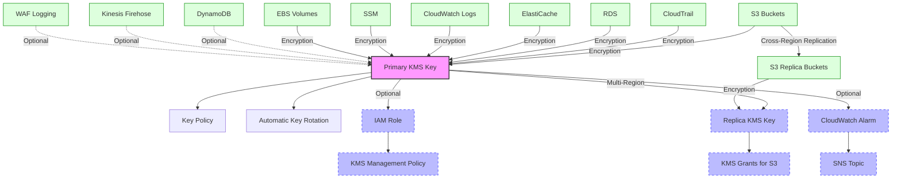

# AWS KMS Terraform Module

Terraform module to create and manage a general-purpose AWS KMS (Key Management Service) key. It provides secure encryption for AWS resources, supports automatic key rotation, IAM-managed administrative roles, and integrates with CloudWatch for monitoring key usage.

## Overview

This module provisions a KMS key designed for encrypting various AWS resources, supporting cross-region replication, customizable permissions, and monitoring through CloudWatch.

### Supported AWS Resource Encryption:
- CloudWatch Logs
- S3 buckets
- RDS instances
- ElastiCache clusters
- VPC Flow Logs
- SSM parameters and sessions
- EC2 EBS volumes
- WAFv2 logging
- CloudTrail logs (when enabled via bucket configuration)
- Optional support for:
  - DynamoDB
  - Kinesis Firehose
  - WAF (legacy logging)

## Requirements

| Name         | Version   |
|--------------|-----------|
| Terraform    | >= 1.0    |
| AWS Provider | >= 5.0    |

## Module Architecture

The module provisions:
- **Primary KMS Key** for general encryption purposes.
- **Optional Replica KMS Key** for cross-region S3 replication (automatically created when replication buckets are enabled).
- **IAM Role and Policy** for administrative key management (optional).
- **CloudWatch Alarms** for monitoring KMS key usage (currently monitoring decrypt operations).
- **KMS Grants** for S3 replication when using replica keys.

### Architecture Diagram



## Prerequisites

- **AWS Provider Configuration**:
  - AWS region and account configuration should be defined in the root Terraform block (`providers.tf`).
- **Existing SNS Topic** (required if key monitoring is enabled):
  - SNS topic ARN for alarm notifications.
- **VPC Considerations**:
  - If EC2 instances are in private subnets without internet access, consider enabling KMS VPC Interface Endpoints.

## Module Files Structure

| File             | Description                                                         |
|------------------|---------------------------------------------------------------------|
| `main.tf`        | Defines primary and replica KMS keys, policies, and grants.         |
| `key.tf`         | IAM role and policy for administrative key management.              |
| `metrics.tf`     | CloudWatch alarms for monitoring key usage.                         |
| `variables.tf`   | Input variables and validation rules for customization.             |
| `outputs.tf`     | Module outputs including ARNs and IDs of created resources.         |

## Inputs

| Name                        | Type           | Description                                                         | Default / Required               |
|-----------------------------|----------------|---------------------------------------------------------------------|----------------------------------|
| `aws_account_id`            | `string`       | AWS Account ID (12-digit numeric string)                            | **Required**                     |
| `aws_region`                | `string`       | AWS Region (format: xx-xxxx-x, e.g., eu-west-1)                     | **Required**                     |
| `replication_region`        | `string`       | AWS Region for replica key (optional)                               | `""` (no replication by default) |
| `name_prefix`               | `string`       | Prefix for naming resources                                         | **Required**                     |
| `environment`               | `string`       | Deployment environment label                                        | One of: `dev`, `stage`, `prod`   |
| `enable_key_rotation`       | `bool`         | Enable automatic key rotation                                       | `true`                           |
| `additional_principals`     | `list(string)` | Additional IAM principals with KMS access                           | `[]`                             |
| `enable_kms_role`           | `bool`         | Create IAM role for key management                                  | `false`                          |
| `enable_key_monitoring`     | `bool`         | Enable CloudWatch monitoring                                        | `false`                          |
| `key_decrypt_threshold`     | `number`       | Threshold for decrypt operations alarm                              | `100`                            |
| `sns_topic_arn`             | `string`       | ARN of SNS topic for alarms (required if monitoring enabled)        | `""`                             |
| `default_region_buckets`    | `map(object)`  | Configuration for default region S3 buckets (see details below)     | `{}`                             |
| `replication_region_buckets`| `map(object)`  | Configuration for replication region S3 buckets (see details below) | `{}`                             |
| `enable_dynamodb`           | `bool`         | Allow DynamoDB service usage                                        | `false`                          |
| `enable_firehose`           | `bool`         | Allow Kinesis Firehose usage                                        | `false`                          |
| `enable_waf_logging`        | `bool`         | Allow WAF logging usage                                             | `false`                          |

### S3 Bucket Configuration Details

#### `default_region_buckets`
```hcl
default_region_buckets = {
  bucket_name = {
    enabled     = bool    # Optional, default: true
    versioning  = bool    # Optional, default: false
    replication = bool    # Optional, default: false
    logging     = bool    # Optional, default: false
    region      = string  # Optional, defaults to provider region if not set
  }
}
```

#### `replication_region_buckets`
```hcl
replication_region_buckets = {
  bucket_name = {
    enabled     = bool    # Optional, default: true
    versioning  = bool    # Optional, default: true (required for replication destinations)
    replication = bool    # Optional, default: false (not applicable for replication buckets)
    logging     = bool    # Optional, default: false
    region      = string  # Required - AWS region for the replication bucket
  }
}
```

#### CloudTrail Integration
To enable CloudTrail integration, include a `cloudtrail` bucket in your configuration:
```hcl
default_region_buckets = {
  cloudtrail = { enabled = true }
}
```

## Outputs

| Name                        | Description                                                 |
|-----------------------------|-------------------------------------------------------------|
| `kms_key_arn`               | ARN of the primary KMS key                                  |
| `kms_key_id`                | ID of the primary KMS key                                   |
| `kms_replica_key_arn`       | ARN of the replica KMS key (if created)                     |
| `enable_kms_role`           | Indicates if IAM role for key management was created        |
| `kms_management_role_arn`   | ARN of the IAM role for key management (if created)         |
| `kms_management_policy_arn` | ARN of the IAM policy for key management (if created)       |
| `kms_decrypt_alarm_arn`     | ARN of the CloudWatch decrypt alarm (if created)            |

## Usage Example

```hcl
module "kms" {
  source                = "./modules/kms"

  aws_region            = var.aws_region
  aws_account_id        = var.aws_account_id
  environment           = var.environment
  name_prefix           = var.name_prefix

  enable_key_rotation   = true
  additional_principals = ["arn:aws:iam::${var.aws_account_id}:role/example-role"]

  enable_kms_role       = true
  enable_key_monitoring = true
  key_decrypt_threshold = 100
  sns_topic_arn         = aws_sns_topic.cloudwatch_alarms.arn

  enable_dynamodb       = true
  enable_firehose       = false
  enable_waf_logging    = true

  # S3 bucket configuration with CloudTrail enabled
  default_region_buckets = {
    cloudtrail = { enabled = true },
    logs = { 
      enabled = true,
      versioning = true
    }
  }
  
  # Cross-region replication configuration
  replication_region = "us-east-1"
  replication_region_buckets = {
    logs_replica = {
      enabled = true,
      region = "us-east-1"
    }
  }

  depends_on = [aws_sns_topic.cloudwatch_alarms]
}
```
## Security
- **Initial root access** granted temporarily for key setup (must be manually revoked after initial setup).
- **IAM role** replaces root account for ongoing administrative management (optional).
- **CloudWatch Alarms** monitor abnormal or unauthorized key usage.

### Root Access Removal Process
1. Set `enable_kms_role = true` in terraform.tfvars
2. Apply to create the IAM role (in key.tf)
3. Manually remove the root access statement from the KMS key policy
4. Apply changes to enforce least privilege

## CloudWatch Monitoring
The module currently implements monitoring for:
- **Decrypt Operations**: Alerts when the number of decrypt operations exceeds the configured threshold
- Alarm configuration:
  - Evaluation period: 5 minutes
  - Consecutive periods: 3 (to reduce false positives)
  - Datapoints to alarm: 2 (alarm triggers if 2 out of 3 periods exceed threshold)

## KMS Grants for Replication
When cross-region replication is enabled, the module automatically:
1. Creates a replica KMS key in the specified replication region
2. Sets up KMS grants to allow S3 service to use the replica key for replication
3. Configures appropriate permissions for cross-region data transfer

## Best Practices
- **Automatic Key Rotation**: Reduces risk of key compromise.
- **Least Privilege Access**: Limit permissions strictly to necessary IAM roles and AWS services.
- **Environment-specific Keys**: Maintain separate KMS keys per environment (`dev`, `stage`, `prod`).
- **Monitoring**: Actively monitor KMS usage through CloudWatch.
- **VPC Endpoints**: Consider using KMS VPC Interface Endpoints for private subnet scenarios.

## Integration
Integrates seamlessly with other modules:
- **VPC, ASG, ALB, RDS, S3, ElastiCache Modules**: Encryption at rest for data stored or transmitted by these services.

## Future Improvements

- **Enhanced Policy Flexibility:**  
  Allow finer-grained permissions customization per AWS service and principal.

- **Expanded Monitoring:**  
  Add additional CloudWatch metrics for better anomaly detection and alerting.

- **Automated Policy Management:**  
  Automate the secure removal of initial root access post-setup.

- **Cross-Account Support:**  
  Simplify configuration of cross-account permissions where necessary.

---

## Troubleshooting and Common Issues

### 1. KMS Decrypt Operations Alarm Constantly Triggering
**Cause:** Threshold for `DecryptCount` is too low for the workload.  
**Solution:**  
- Increase the `key_decrypt_threshold` value in `terraform.tfvars`.  
- Review actual KMS usage in CloudWatch Metrics and adjust accordingly.  
- Validate that legitimate services (e.g., S3, CloudWatch) generate expected decrypt operations.

---

### 2. Root Access Not Removed After Setup
**Cause:** Initial root permissions in the KMS Key Policy were not manually revoked.  
**Solution:**  
- Follow the **Root Access Removal Process** section in the README.  
- Remove the root access statement from `aws_kms_key_policy.general_encryption_key_policy`.  
- Re-apply the Terraform configuration to enforce least privilege.

---

### 3. CloudWatch Alarm Not Sending Notifications
**Cause:** `sns_topic_arn` not configured or incorrect.  
**Solution:**  
- Ensure `sns_topic_arn` is correctly set and matches an existing SNS Topic ARN.  
- Verify that the SNS topic has the correct subscription and policy to allow CloudWatch to publish.

---

### 4. Replica KMS Key Not Created
**Cause:** `replication_region_buckets` misconfigured or replication bucket missing `enabled = true`.  
**Solution:**  
- Validate `replication_region_buckets` contains at least one bucket with `enabled = true`.  
- Ensure `replication_region` is properly set and matches the destination region.

---

### 5. S3 Replication Fails with KMS Permission Error
**Cause:** Missing or incorrect KMS Grant for S3 replication.  
**Solution:**  
- Check that the module created the `aws_kms_grant.s3_replication_grant`.  
- Verify that `s3.amazonaws.com` is listed as the grantee principal in the KMS Grant.

---

### 6. DynamoDB, Firehose, or WAF Fails to Use KMS Key
**Cause:** Corresponding `enable_*` variables not enabled.  
**Solution:**  
- Set `enable_dynamodb`, `enable_firehose`, or `enable_waf_logging` to `true` in `terraform.tfvars` if these services require KMS access.  
- Re-apply the configuration.

---

### 7. Monitoring Disabled but Alarms Exist
**Cause:** `enable_key_monitoring` set to `false`, but CloudWatch Alarm resources remain.  
**Solution:**  
- Run `terraform apply` again to ensure alarms are destroyed when monitoring is disabled.  
- Check `metrics.tf` for conditional resource creation based on `enable_key_monitoring`.  

---

### 8. KMS Key Not Accessible from Private Subnets
**Cause:** Missing KMS VPC Interface Endpoint when EC2 is fully private.  
**Solution:**  
- Enable Interface Endpoints for KMS if EC2 instances are in private subnets without internet access.  
- Add `enable_interface_endpoints = true` in your Terraform configuration.

---

### 9. Terraform Plan Fails Due to Missing KMS Key Policy
**Cause:** Changes in IAM roles or incorrect references to KMS policy resources.  
**Solution:**  
- Re-check `aws_kms_key_policy` resource dependencies.  
- Ensure the `aws_iam_role.kms_role` is properly created and referenced.

---

### 10. Cross-Region Replication Data Not Encrypted
**Cause:** Replica KMS Key or KMS Grant not applied correctly.  
**Solution:**  
- Verify the replica KMS key exists in the replication region.  
- Confirm the KMS Grant is created and linked to the S3 replication process.

---

For additional details, see [AWS KMS Documentation](https://docs.aws.amazon.com/kms/latest/developerguide/overview.html).
For detailed AWS recommendations, see [AWS KMS Best Practices](https://docs.aws.amazon.com/kms/latest/developerguide/best-practices.html).