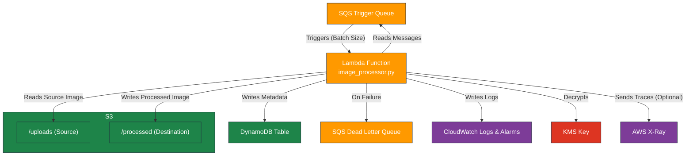

# AWS Lambda Image Processor Module

---

## Table of Contents

- [1. Overview](#1-overview)
- [2. Prerequisites / Requirements](#2-prerequisites--requirements)
- [3. Architecture Diagram](#3-architecture-diagram)
- [4. Features](#4-features)
- [5. Module Architecture](#5-module-architecture)
- [6. Module Files Structure](#6-module-files-structure)
- [7. Inputs](#7-inputs)
- [8. Outputs](#8-outputs)
- [9. Example Usage](#9-example-usage)
- [10. Security Considerations / Recommendations](#10-security-considerations--recommendations)
- [11. Conditional Resource Creation](#11-conditional-resource-creation)
- [12. Best Practices](#12-best-practices)
- [13. Integration](#13-integration)
- [14. Future Improvements](#14-future-improvements)
- [15. Troubleshooting and Common Issues](#15-troubleshooting-and-common-issues)
- [16. Notes](#16-notes)
- [17. Useful Resources](#17-useful-resources)

---

## 1. Overview

This Terraform module provisions an AWS Lambda function designed to process images. The function is triggered by messages from an SQS queue, which are expected to contain S3 event notifications. Upon receiving a message, the Lambda function downloads an image from a source S3 prefix, resizes it according to predefined dimensions, uploads the processed image to a destination prefix in the same bucket, and records metadata about the operation into a DynamoDB table. The module is designed with security and robustness in mind, incorporating features like a Dead Letter Queue (DLQ) for error handling, least-privilege IAM policies, and integration with AWS X-Ray for tracing.

---

## 2. Prerequisites / Requirements

- **AWS Provider Configuration**: The `aws` provider must be configured in the root Terraform project.
- **External AWS Resources**: This module requires several existing AWS resources to be provided as input variables:
  - An **SQS Queue** (`sqs_trigger_queue_arn`) to act as the trigger.
  - An **SQS Dead Letter Queue** (`dead_letter_queue_arn`) for failed message processing.
  - An **S3 Bucket** (`source_s3_bucket_name`) for storing source and processed images.
  - A **DynamoDB Table** (`dynamodb_table_arn`, `dynamodb_table_name`) for metadata logging.
  - A **KMS Key** (`kms_key_arn`) for decrypting SQS messages and S3 objects.
  - A **Lambda Layer** (`lambda_layers`) containing the necessary Python libraries (e.g., Pillow). This layer should be created by the `lambda_layer` module.

---

## 3. Architecture Diagram



> _Diagram generated with [Mermaid](https://mermaid.js.org/)_

---

## 4. Features

- **Event-Driven Architecture**: Triggered asynchronously from an SQS queue for a decoupled and scalable design.
- **Image Processing**: Resizes images to a configurable width using the Pillow library.
- **Robust Error Handling**: Automatically sends failed messages to a Dead Letter Queue (DLQ) for later inspection.
- **Secure by Design**: Implements a least-privilege IAM role with permissions scoped to specific AWS resources.
- **Configurable**: Function behavior (memory, timeout, environment variables) is fully configurable through Terraform variables.
- **Integrated Monitoring**: Creates CloudWatch alarms for errors, throttles, and duration, and supports AWS X-Ray for distributed tracing.
- **Metadata Logging**: Records details of each processing operation into a DynamoDB table for auditing and tracking.

---

## 5. Module Architecture

This module provisions the following AWS resources:
- **AWS Lambda Function**: The core `image_processor` function containing the Python logic.
- **IAM Role and Policy**: A dedicated execution role for the Lambda function with precisely scoped permissions for SQS, S3, DynamoDB, KMS, and CloudWatch Logs.
- **SQS Event Source Mapping**: The trigger that connects the SQS queue to the Lambda function, enabling the Lambda service to poll the queue.
- **CloudWatch Alarms**: A set of alarms to monitor key performance and health metrics of the function.

---

## 6. Module Files Structure

| File             | Description                                                              |
|------------------|--------------------------------------------------------------------------|
| `main.tf`        | Defines the `aws_lambda_function` and `aws_lambda_event_source_mapping`. |
| `iam.tf`         | Defines the IAM role and policy for the Lambda function.                 |
| `variables.tf`   | Input variables for customization.                                       |
| `outputs.tf`     | Module outputs, including the function ARN and IAM role ARN.             |
| `metrics.tf`     | CloudWatch alarms for monitoring function health and performance.        |
| `src/`           | Directory containing the Python source code and `requirements.txt.tftpl`.|
| `versions.tf`    | Defines required Terraform and provider versions.                        |

---

## 7. Inputs

| Name                            | Type           | Description                                                                                                   |
|---------------------------------|----------------|---------------------------------------------------------------------------------------------------------------|
| `aws_region`                    | `string`       | AWS region for resource deployment.                                                                           |
| `aws_account_id`                | `string`       | The AWS account ID.                                                                                           |
| `name_prefix`                   | `string`       | Prefix for all created resource names.                                                                        |
| `environment`                   | `string`       | Deployment environment (e.g., `dev`, `prod`).                                                                 |
| `tags`                          | `map(string)`  | A map of tags to apply to all resources.                                                                      |
| `lambda_function_name`          | `string`       | The name of the Lambda function.                                                                              |
| `lambda_handler`                | `string`       | The function entrypoint in your code.                                                                         |
| `lambda_runtime`                | `string`       | The runtime for the Lambda function.                                                                          |
| `lambda_memory_size`            | `number`       | Memory (MB) allocated to the function.                                                                        |
| `lambda_timeout`                | `number`       | Function timeout in seconds.                                                                                  |
| `lambda_architecture`           | `list(string)` | Instruction set architecture (`x86_64` or `arm64`).                                                           |
| `lambda_environment_variables`  | `map(string)`  | Environment variables for the function.                                                                       |
| `lambda_layers`                 | `list(string)` | List of Lambda Layer ARNs to attach.                                                                          |
| `ephemeral_storage_mb`          | `number`       | Ephemeral storage in MB (`/tmp`).                                                                             |
| `dead_letter_queue_arn`         | `string`       | ARN of the SQS Dead Letter Queue (DLQ).                                                                       |
| `lambda_source_code_path`       | `string`       | Local path to the Lambda source code.                                                                         |
| `lambda_iam_policy_attachments` | `list(string)` | List of IAM policy ARNs to attach to the role.                                                                |
| `sqs_trigger_queue_arn`         | `string`       | ARN of the SQS queue that triggers the function.                                                              |
| `sqs_batch_size`                | `number`       | Maximum number of records per SQS batch.                                                                      |
| `dynamodb_table_arn`            | `string`       | ARN of the DynamoDB table (for IAM permissions).                                                              |
| `dynamodb_table_name`           | `string`       | Name of the DynamoDB table (for env variables).                                                               |
| `source_s3_bucket_name`         | `string`       | Name of the S3 bucket for source images.                                                                      |
| `source_s3_prefix`              | `string`       | S3 prefix for original images.                                                                                |
| `destination_s3_prefix`         | `string`       | S3 prefix for processed images.                                                                               |
| `alarms_enabled`                | `bool`         | If true, create CloudWatch alarms for the function.                                                           |
| `sns_topic_arn`                 | `string`       | SNS Topic ARN for alarm notifications.                                                                        |
| `error_alarm_threshold`         | `number`       | Threshold for the error alarm.                                                                                |
| `throttles_alarm_threshold`     | `number`       | Threshold for the throttles alarm.                                                                            |
| `duration_alarm_threshold_ms`   | `number`       | p95 duration alarm threshold in milliseconds.                                                                 |
| `alarm_evaluation_periods`      | `number`       | Number of periods to evaluate for the alarm.                                                                  |
| `alarm_period_seconds`          | `number`       | Period in seconds to evaluate the alarm.                                                                      |
| `kms_key_arn`                   | `string`       | KMS key ARN for SQS/S3 decryption.                                                                            |
| `enable_lambda_tracing`         | `bool`         | Enable AWS X-Ray active tracing for the function.                                                             |
| `reserved_concurrent_executions`| `number`       | The amount of reserved concurrent executions for the Lambda function. Set to -1 to remove concurrency limits. |

---

## 8. Outputs

| Name                               | Description                                                                          |
|------------------------------------|--------------------------------------------------------------------------------------|
| `lambda_function_arn`              | The Amazon Resource Name (ARN) of the Lambda function.                               |
| `lambda_function_invoke_arn`       | The ARN to be used for invoking the Lambda function from triggers like API Gateway.  |
| `lambda_function_name`             | The name of the Lambda function.                                                     |
| `lambda_cloudwatch_log_group_name` | The name of the CloudWatch Log Group created for the Lambda function.                |
| `lambda_iam_role_arn`              | The Amazon Resource Name (ARN) of the IAM role created for the Lambda function.      |
| `lambda_iam_role_name`             | The name of the IAM role created for the Lambda function.                            |

---

## 9. Example Usage

```hcl
module "image_processor_lambda" {
  source = "./modules/lambda_images"

  aws_region            = var.aws_region
  aws_account_id        = var.aws_account_id
  name_prefix           = var.name_prefix
  environment           = var.environment
  tags                  = var.tags

  lambda_function_name  = "image-processor"
  lambda_layers         = [module.pillow_layer.layer_version_arn]

  # ARNs from other modules/resources
  dead_letter_queue_arn = module.sqs.dead_letter_queue_arn
  sqs_trigger_queue_arn = module.sqs.image_processing_queue_arn
  dynamodb_table_arn    = module.dynamodb.metadata_table_arn
  dynamodb_table_name   = module.dynamodb.metadata_table_name
  source_s3_bucket_name = module.s3.media_bucket_name
  kms_key_arn           = module.kms.key_arn
  sns_topic_arn         = module.sns.alarms_topic_arn

  # Optional: Override default settings
  lambda_memory_size    = 512
  lambda_timeout        = 120
  sqs_batch_size        = 10
}
```

---

## 10. Security Considerations / Recommendations

- **Least Privilege IAM**: The created IAM role is tightly scoped to only the resources necessary for the function's operation (specific SQS queues, DynamoDB table, S3 prefixes, and KMS key).
- **Dead Letter Queue (DLQ)**: The use of a DLQ is enforced by making `dead_letter_queue_arn` a required variable. This prevents data loss by capturing messages that fail processing after multiple retries.
- **Infinite Loop Prevention**: The Python code includes a check to ensure it does not process files that are already in the destination S3 prefix, which is a critical safeguard against misconfiguration-induced infinite loops.
- **KMS Encryption**: The function is granted `kms:Decrypt` permissions on the specific KMS key, ensuring it can process encrypted S3 objects and SQS messages securely.

---

## 11. Conditional Resource Creation

- **CloudWatch Alarms**: All monitoring alarms are created conditionally based on the `alarms_enabled` variable.
- **AWS X-Ray Tracing**: Tracing is enabled conditionally based on the `enable_lambda_tracing` variable.

---

## 12. Best Practices

- **Decoupled Architecture**: Using SQS as a buffer between S3 and Lambda creates a resilient, scalable, and decoupled system.
- **Idempotent Design**: While not fully idempotent, the function's design with DLQs and specific S3 prefixes helps manage failures gracefully.
- **Configuration via Environment Variables**: The Python code is decoupled from the infrastructure, reading all configuration from environment variables set by Terraform.
- **Automated Packaging**: The function's deployment package is created automatically from source using the `archive_file` data source.

---

## 13. Integration

This module is designed to integrate with several other AWS services and modules:
- **`lambda_layer` module**: Provides the necessary Python dependencies (like Pillow) in a reusable layer.
- **`sqs` module**: Provides the trigger queue and the dead letter queue.
- **`s3` module**: Provides the bucket for image storage.
- **`dynamodb` module**: Provides the table for metadata logging.
- **`kms` module**: Provides the key for encryption and decryption.

---

## 14. Future Improvements

- **Add support for more image operations**: Extend the function to support other transformations like watermarking or format conversion.
- **Dynamic output formats**: Allow specifying the output image format (e.g., JPEG, PNG, WEBP) via environment variables.
- **Enhanced Metrics**: Push custom CloudWatch metrics from the Lambda function (e.g., number of images processed, average processing time).

---

## 15. Troubleshooting and Common Issues

- **"Unable to import module 'image_processor'":** This usually indicates an issue with the Lambda Layer. Ensure the layer was built correctly and is attached to the function. Verify the library is in a `python/` directory inside the layer's ZIP file.
- **IAM Permission Errors (Access Denied):** Check the function's CloudWatch logs. The error message will indicate which service and action failed. Verify the ARNs passed into the module are correct and that the IAM policy in `iam.tf` includes the necessary permissions.
- **Function Timeouts:** If the function times out, consider increasing the `lambda_timeout` or `lambda_memory_size`. Processing large images can be resource-intensive.
- **Messages in DLQ:** If messages are ending up in the Dead Letter Queue, inspect the message content and check the function's CloudWatch logs for the corresponding invocation errors to understand the root cause.

---

## 16. Notes

- The function's deployment package is created locally as `lambda_deployment_package.zip` during `terraform apply` and cleaned up during `terraform destroy`.
- The IAM role and its core policy are created and managed entirely within this module to ensure encapsulation and least privilege.

---

## 17. Useful Resources

- [AWS Lambda Developer Guide](https://docs.aws.amazon.com/lambda/latest/dg/welcome.html)
- [Using AWS Lambda with Amazon SQS](https://docs.aws.amazon.com/lambda/latest/dg/with-sqs.html)
- [Boto3 Documentation](https://boto3.amazonaws.com/v1/documentation/api/latest/index.html)
- [Pillow (PIL Fork) Documentation](https://pillow.readthedocs.io/en/stable/)

---
