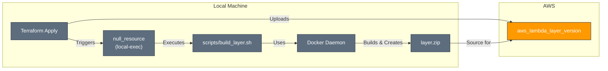

# AWS Lambda Layer Builder Module

---

## Table of Contents

- [1. Overview](#1-overview)
- [2. Prerequisites / Requirements](#2-prerequisites--requirements)
- [3. Architecture Diagram](#3-architecture-diagram)
- [4. Features](#4-features)
- [5. Module Architecture](#5-module-architecture)
- [6. Module Files Structure](#6-module-files-structure)
- [7. Inputs](#7-inputs)
- [8. Outputs](#8-outputs)
- [9. Example Usage](#9-example-usage)
- [10. Security Considerations / Recommendations](#10-security-considerations--recommendations)
- [11. Conditional Resource Creation](#11-conditional-resource-creation)
- [12. Best Practices](#12-best-practices)
- [13. Integration](#13-integration)
- [14. Future Improvements](#14-future-improvements)
- [15. Troubleshooting and Common Issues](#15-troubleshooting-and-common-issues)
- [16. Notes](#16-notes)
- [17. Useful Resources](#17-useful-resources)

---

## 1. Overview

This Terraform module automates the process of building and deploying an AWS Lambda Layer containing Python dependencies. It uses a decoupled shell script that leverages Docker to create a build environment identical to the AWS Lambda runtime. This ensures that the compiled dependencies are fully compatible. The module is triggered to rebuild the layer only when the specified library versions or the build script itself changes, making it efficient and reliable.

---

## 2. Prerequisites / Requirements

- **Local Environment**: The machine executing `terraform apply` must have the following installed and running:
  - **Docker**: Required to run the isolated build process.
  - **Bash**: Required to execute the build script.
  - **zip utility**: Required by the build script to package the layer.
- **AWS Provider Configuration**: The `aws` provider must be configured in the root Terraform project.

---

## 3. Architecture Diagram



> _Diagram generated with [Mermaid](https://mermaid.js.org/)_

---

## 4. Features

- **Automated Build Process**: Triggers a local shell script to build the layer automatically.
- **Reproducible Builds**: Uses official AWS Lambda Docker images to ensure dependencies are compiled in a compatible environment.
- **Efficient Rebuilds**: The layer is only rebuilt and redeployed if the specified library versions or the build script change.
- **Decoupled Logic**: The complex build logic is encapsulated in a separate shell script, keeping the Terraform code clean and focused.

---

## 5. Module Architecture

This module provisions the following resources:
- **`null_resource`**: Acts as a trigger that executes the `build_layer.sh` script via a `local-exec` provisioner. It monitors changes to dependencies and the script itself.
- **`aws_lambda_layer_version`**: Represents the Lambda Layer in AWS. It uploads the `layer.zip` file created by the build script and creates a new layer version.

---

## 6. Module Files Structure

| File           | Description                                                              |
|----------------|--------------------------------------------------------------------------|
| `main.tf`      | Defines the `null_resource` trigger and the `aws_lambda_layer_version`.  |
| `variables.tf` | Input variables for customization.                                       |
| `outputs.tf`   | Module outputs, primarily the ARN of the created layer version.          |
| `versions.tf`  | Defines required Terraform and provider versions.                        |

---

## 7. Inputs

| Name                 | Type           | Description                                                                          |
|----------------------|----------------|--------------------------------------------------------------------------------------|
| `name_prefix`        | `string`       | Prefix for resource names.                                                           |
| `environment`        | `string`       | Environment for the resources (e.g., `dev`, `stage`, `prod`).                        |
| `layer_name`         | `string`       | The unique name for the Lambda Layer (e.g., 'Pillow-Dependencies').                  |
| `source_path`        | `string`       | The relative path to the source directory containing the `requirements.txt.tftpl`.   |
| `layer_runtime`      | `list(string)` | A list of compatible runtimes for the layer (e.g., `["python3.12"]`).                |
| `library_version`    | `string`       | The specific version of the library to install (e.g., '11.2.1' for Pillow).          |
| `layer_architecture` | `list(string)` | The compatible instruction set architecture (e.g., `["x86_64"]`).                    |

---

## 8. Outputs

| Name                | Description                                                                                         |
|---------------------|-----------------------------------------------------------------------------------------------------|
| `layer_version_arn` | The ARN of the created Lambda Layer version. This is used to attach the layer to a Lambda function. |

---

## 9. Example Usage

```hcl
module "pillow_layer" {
  source = "./modules/lambda_layer"

  name_prefix        = var.name_prefix
  environment        = var.environment
  layer_name         = "Pillow-Dependencies"
  source_path        = "../lambda_images/src" # Path to the requirements template
  library_version    = "10.0.1" # Specify Pillow version
  layer_runtime      = ["python3.12"]
  layer_architecture = ["x86_64"]
}
```

---

## 10. Security Considerations / Recommendations

- **Local Environment Security**: The build process runs on the local machine where Terraform is executed. Ensure this environment is secure.
- **Docker Image Source**: The build script uses the official `public.ecr.aws/lambda/python` Docker images provided by AWS, which is a trusted source.
- **Permissions**: The `local-exec` provisioner runs with the same permissions as the user executing Terraform. The script itself does not require elevated privileges beyond access to the Docker daemon.

---

## 11. Conditional Resource Creation

- The entire module is conditional. Resources are only created if the module is included in the Terraform configuration.
- A new layer version is created only when a change is detected in the `requirements.txt.tftpl` content (via `library_version`) or the `build_layer.sh` script itself.

---

## 12. Best Practices

- **Centralized Build Script**: Encapsulating the build logic in a single, reusable shell script (`scripts/build_layer.sh`) is a clean and maintainable approach.
- **Use Official Build Images**: Using the official AWS Lambda build images ensures maximum compatibility between the compiled layer and the target runtime.
- **Hash-Based Triggers**: Using file hashes (`requirements_hash`, `build_script_hash`) as triggers for the `null_resource` is an efficient and reliable way to manage rebuilds.

---

## 13. Integration

- This module is designed to be a dependency for other Lambda function modules, such as the `lambda_images` module.
- The primary output, `layer_version_arn`, should be passed into the `lambda_layers` variable of an `aws_lambda_function` resource.

---

## 14. Future Improvements

- **Multi-Library Support**: Modify the build script and Terraform template to support a list of libraries and versions instead of a single hardcoded one.
- **Platform Flexibility**: Add logic to the build script to select the correct Docker base image based on the `layer_architecture` variable (`x86_64` vs. `arm64`).

---

## 15. Troubleshooting and Common Issues

- **"Docker is not running"**: Ensure the Docker daemon is active on the machine running Terraform.
- **Permission Denied**: If the build script fails with permission errors, ensure the current user has permission to interact with the Docker daemon and to write files in the module directory (`layer.zip`).
- **Build Failures inside Docker**: Check the logs from the `local-exec` provisioner. The error may be due to a missing system dependency inside the container or an invalid library version.

---

## 16. Notes

- The build process creates a `layer.zip` file inside the module directory. This file is cleaned up automatically when `terraform destroy` is run.
- This module is designed to be generic and can be reused to build layers for different Python libraries by modifying the `requirements.txt.tftpl` and build script accordingly.

---

## 17. Useful Resources

- [AWS Lambda Layers Documentation](https://docs.aws.amazon.com/lambda/latest/dg/chapter-layers.html)
- [Using container images to build Lambda layers](https://aws.amazon.com/blogs/compute/using-container-images-to-build-lambda-layers/)
- [Terraform `null_resource` and Provisioners](https://www.terraform.io/docs/language/resources/provisioners/local-exec.html)

---
