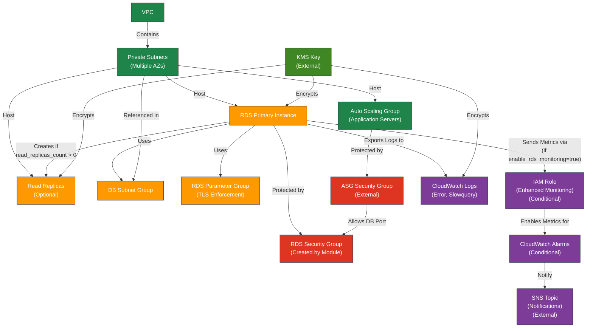

# AWS RDS Module for Terraform

---

## 1. Overview

This module provisions and manages an RDS (Relational Database Service) instance in AWS, including Multi-AZ deployment, read replicas, Enhanced Monitoring, CloudWatch Alarms, and secure networking configurations.

---

## 2. Prerequisites / Requirements

- **AWS Provider Configuration**:
  - The AWS region and account configuration must be defined in the root Terraform `providers.tf`.
  - Ensure the correct version of the AWS provider is used for full RDS support.

- **VPC and Subnet Configuration**:
  - A pre-configured VPC with **private subnets** spanning at least two Availability Zones (AZs) for Multi-AZ deployments.
  - Subnets should have appropriate **route tables** to allow communication with the RDS instance and AWS services.

- **KMS Key (Optional but Recommended)**:
  - An existing KMS key ARN for encrypting the RDS storage and CloudWatch logs.
  - If not provided, RDS will use the default AWS managed key.

- **Security Group(s)**:
  - A security group allowing inbound MySQL (or the selected database engine port) traffic from application servers (e.g., Auto Scaling Group instances).
  - Optional: Security group rules to restrict access based on source CIDR or specific security group IDs.

- **IAM Role (Optional)**:
  - Required only if **Enhanced Monitoring** is enabled (`enable_rds_monitoring = true`).
  - The module automatically creates the role when Enhanced Monitoring is enabled.

- **CloudWatch Log Group (Optional)**:
  - If RDS log exports are enabled, ensure CloudWatch log groups are configured or allow the module to create them.

- **SNS Topic (Optional but Recommended for Alarms)**:
  - If CloudWatch alarms are enabled, an SNS topic ARN must be provided for notifications.

---

## 3. Architecture Diagram


---

## 4. Features

- **Primary RDS Instance**:
  - Configures an RDS instance with options for Multi-AZ deployment for high availability
  - Supports multiple database engines (e.g., MySQL, PostgreSQL)
  - Enables encryption at rest using AWS KMS
  - Configurable automated backups and snapshot retention
  - Enforces TLS/SSL connections by setting 'require_secure_transport = 1' in RDS parameter group
- **Read Replicas**:
  - Optional read replicas for improved read performance and fault tolerance
- **Enhanced Monitoring**:
  - Provides detailed monitoring metrics by enabling Enhanced Monitoring with a dedicated IAM role
  - Monitoring is conditionally created based on the `enable_rds_monitoring` variable
- **CloudWatch Alarms**:
  - Monitors critical metrics such as:
    - **High CPU utilization**
    - **Low free storage space**
    - **High database connections**
  - Alarms are conditionally created based on `enable_high_cpu_alarm`, `enable_low_storage_alarm`, and `enable_high_connections_alarm` variables  
- **Security Group**:
  - Manages access control by allowing database connections only from ASG instances
  - Security Group rules:
    - Ingress: Allows inbound traffic only from ASG Security Groups
    - No explicit egress rules needed due to VPC Endpoints usage
- **CloudWatch Logs**:
  - Exports error logs for critical issues and crashes
  - Includes slowquery logs for performance optimization
  - Conditionally creates RDS OS Metrics log group when Enhanced Monitoring is enabled
  - Configurable log retention period via `rds_log_retention_days` variable
  - Log encryption using KMS for enhanced security

---

## 5. Module Architecture

This module provisions the following AWS resources:
- **Primary RDS Instance** with configurable Multi-AZ deployment and encryption
- **Optional Read Replicas** for scalability and high availability
- **RDS Subnet Group** spanning private subnets in multiple AZs
- **RDS Parameter Group** with TLS/SSL enforcement
- **Security Group** for controlled inbound access from the ASG
- **CloudWatch Log Groups** for error and slow query logs with optional KMS encryption
- **IAM Role and Policy** for Enhanced Monitoring (conditionally created)
- **CloudWatch Alarms** for critical performance metrics (conditionally created)
- **Integration with KMS** for storage and log encryption

---

## 6. Module Files Structure

| **File**               | **Description**                                                                             |
|------------------------|---------------------------------------------------------------------------------------------|
| `main.tf`              | Creates the primary RDS instance, parameter group, subnet group, and optional read replicas |
| `security_group.tf`    | Configures the Security Group to manage RDS access control                                  |
| `metrics.tf`           | Defines CloudWatch Alarms for RDS performance monitoring                                    |
| `iam.tf`               | Configures IAM roles and policies for RDS Enhanced Monitoring                               |
| `variables.tf`         | Declares input variables for the module                                                     |
| `outputs.tf`           | Exposes key outputs for integration with other modules                                      |

---

## 7. Inputs

| **Name**                              | **Type**       | **Description**                                                               | **Default/Required**  |
|---------------------------------------|----------------|-------------------------------------------------------------------------------|-----------------------|
| **AWS Region Configuration**          |                |                                                                               |                       |
| `aws_region`                          | `string`       | The AWS region where resources will be created                                | Required              |
| `aws_account_id`                      | `string`       | AWS account ID for permissions and policies                                   | Required              |
| **Naming and Environment Variables**  |                |                                                                               |                       |
| `name_prefix`                         | `string`       | Prefix for resource names                                                     | Required              |
| `environment`                         | `string`       | Environment for the resources (e.g., dev, stage, prod)                        | Required              |
| **RDS Instance Configuration**        |                |                                                                               |                       |
| `allocated_storage`                   | `number`       | Storage size in GB for the RDS instance                                       | Required              |
| `instance_class`                      | `string`       | Instance class for RDS (e.g., db.t3.micro)                                    | Required              |
| `engine`                              | `string`       | Database engine for the RDS instance (e.g., 'mysql', 'postgres')              | Required              |
| `engine_version`                      | `string`       | Database engine version (e.g., '8.0' for MySQL)                               | Required              |
| `db_username`                         | `string`       | Master username for RDS                                                       | Required              |
| `db_password`                         | `string`       | Master password for RDS                                                       | Required              |
| `db_name`                             | `string`       | Initial database name                                                         | Required              |
| `db_port`                             | `number`       | Database port for RDS (e.g., 3306 for MySQL)                                  | `3306`                |
| `multi_az`                            | `bool`         | Enable Multi-AZ deployment for RDS high availability                          | `false`               |
| **Backup and Retention Configuration**|                |                                                                               |                       |
| `backup_retention_period`             | `number`       | Number of days to retain RDS backups                                          | Required              |
| `backup_window`                       | `string`       | Preferred window for automated RDS backups (e.g., '03:00-04:00')              | Required              |
| `rds_log_retention_days`              | `number`       | Number of days to retain RDS logs in CloudWatch                               | `30`                  |
| **Performance and Protection**        |                |                                                                               |                       |
| `performance_insights_enabled`        | `bool`         | Enable or disable Performance Insights for RDS instance                       | Required              |
| `rds_deletion_protection`             | `bool`         | Enable or disable deletion protection for RDS instance                        | Required              |
| `skip_final_snapshot`                 | `bool`         | Skip final snapshot when deleting the RDS instance                            | `true`                |
| **Networking Variables**              |                |                                                                               |                       |
| `vpc_id`                              | `string`       | The ID of the VPC where the RDS instance is hosted                            | Required              |
| `vpc_cidr_block`                      | `string`       | CIDR block of the VPC where RDS is deployed                                   | Required              |
| `private_subnet_ids`                  | `list(string)` | List of private subnet IDs for RDS deployment                                 | Required              |
| `private_subnet_cidr_blocks`          | `list(string)` | List of CIDR blocks for private subnets                                       | Required              |
| `public_subnet_cidr_blocks`           | `list(string)` | List of CIDR blocks for public subnets                                        | Required              |
| **Security Group Variables**          |                |                                                                               |                       |
| `asg_security_group_id`               | `string`       | Security Group ID for ASG instances that need access to the RDS instance      | Required              |
| **Encryption**                        |                |                                                                               |                       |
| `kms_key_arn`                         | `string`       | The ARN of the KMS key for RDS encryption                                     | Required              |
| **Enhanced Monitoring**               |                |                                                                               |                       |
| `enable_rds_monitoring`               | `bool`         | Enable RDS enhanced monitoring if set to true                                 | Required              |
| **CloudWatch Monitoring Variables**   |                |                                                                               |                       |
| `rds_cpu_threshold_high`              | `number`       | Threshold for high CPU utilization on RDS                                     | Required              |
| `rds_storage_threshold`               | `number`       | Threshold for low free storage space on RDS (in bytes)                        | Required              |
| `rds_connections_threshold`           | `number`       | Threshold for high number of database connections on RDS                      | Required              |
| `sns_topic_arn`                       | `string`       | ARN of the SNS Topic for sending CloudWatch alarm notifications               | Required              |
| **Read Replica Configuration**        |                |                                                                               |                       |
| `read_replicas_count`                 | `number`       | Number of read replicas for the RDS instance                                  | Required              |
| **CloudWatch Alarm Configuration**    |                |                                                                               |                       |
| `enable_low_storage_alarm`            | `bool`         | Enable the CloudWatch Alarm for low storage on RDS                            | `false`               |
| `enable_high_cpu_alarm`               | `bool`         | Enable the CloudWatch Alarm for high CPU utilization on RDS                   | `false`               |
| `enable_high_connections_alarm`       | `bool`         | Enable the CloudWatch Alarm for high database connections on RDS              | `false`               |

---

## 8. Outputs

| **Name**                        | **Description**                                           |
|---------------------------------|-----------------------------------------------------------|
| `db_name`                       | The name of the RDS database                              |
| `rds_security_group_id`         | The ID of the security group for RDS access               |
| `db_port`                       | The port number of the RDS database                       |
| `db_host`                       | The address of the RDS instance to be used as DB_HOST     |
| `db_endpoint`                   | The endpoint of the RDS instance, including host and port |
| `rds_monitoring_role_arn`       | The ARN of the IAM role for RDS Enhanced Monitoring       |
| `rds_read_replicas_ids`         | Identifiers of the RDS read replicas                      |
| `db_instance_identifier`        | The identifier of the RDS instance                        |
| `rds_read_replicas_endpoints`   | Endpoints of the RDS read replicas                        |
| `db_arn`                        | The ARN of the RDS instance                               |
| `db_status`                     | The current status of the RDS instance                    |
| `rds_log_group_names`           | The names of the CloudWatch Log Groups for RDS logs       |

---

## 9. Example Usage

```hcl
module "rds" {
  source = "./modules/rds"

  aws_region     = "eu-west-1"
  aws_account_id = "123456789012"
  name_prefix    = "dev"
  environment    = "dev"

  # Database Configuration
  allocated_storage       = 100
  instance_class          = "db.t3.large"
  engine                  = "mysql"
  engine_version          = "8.0"
  db_username             = var.db_username
  db_password             = var.db_password
  db_name                 = "myapp_db"
  db_port                 = 3306
  multi_az                = true
  backup_retention_period = 7
  backup_window           = "03:00-04:00"
  
  # Performance and Protection
  performance_insights_enabled = true
  rds_deletion_protection      = true
  skip_final_snapshot          = false
  
  # Networking
  vpc_id                    = module.vpc.vpc_id
  vpc_cidr_block            = module.vpc.vpc_cidr_block
  private_subnet_ids        = module.vpc.private_subnet_ids
  private_subnet_cidr_blocks = module.vpc.private_subnet_cidr_blocks
  public_subnet_cidr_blocks = module.vpc.public_subnet_cidr_blocks
  asg_security_group_id     = module.asg.security_group_id
  
  # Encryption
  kms_key_arn = module.kms.key_arn
  
  # Monitoring
  enable_rds_monitoring       = true
  rds_cpu_threshold_high      = 80
  rds_storage_threshold       = 10737418240  # 10 GB in bytes
  rds_connections_threshold   = 100
  sns_topic_arn = aws_sns_topic.cloudwatch_alarms.arn # Required if monitoring or alarms are enabled
  rds_log_retention_days      = 30
  
  # Read Replicas
  read_replicas_count = 1
  
  # CloudWatch Alarms
  enable_low_storage_alarm      = true
  enable_high_cpu_alarm         = true
  enable_high_connections_alarm = true
}
```
---

## 10. Security Considerations / Recommendations

- **Enable storage encryption** using KMS to protect data at rest.
- **Restrict inbound access** to the RDS instance strictly to application Security Groups or specific IP ranges.
- **Enforce TLS/SSL connections** by setting the appropriate parameter in the RDS Parameter Group.
- **Disable public access** to the RDS instance (`publicly_accessible = false`) to prevent exposure to the internet.
- **Rotate database credentials** regularly and consider integrating with AWS Secrets Manager.
- **Enable CloudWatch log exports** for general, slow query, and error logs to monitor database activity and detect anomalies.
- **Monitor performance** and set up alarms for high CPU usage, low storage space, and excessive database connections.

---

## 11. Conditional Resource Creation

This module conditionally creates resources based on input variables:

- **Read Replicas** are created only if `read_replicas_count > 0`.
- **Enhanced Monitoring IAM Role** is created only if `enable_rds_monitoring = true`.
- **CloudWatch Alarms** are created only if the corresponding alarm variables are enabled:
  - `enable_high_cpu_alarm`
  - `enable_low_storage_alarm`
  - `enable_high_connections_alarm`
- **CloudWatch Log Groups** for RDS logs are created based on enabled exports and `rds_log_retention_days`.

---

## 12. Best Practices

### Logging and Monitoring

1. **Log Management**:
   - Review and adjust log retention periods based on compliance requirements
   - Monitor CloudWatch costs, especially when enabling additional log types
   - Consider enabling general and audit logs in production for comprehensive monitoring

2. **Performance Monitoring**:
   - Use slowquery logs during development to identify and optimize problematic queries
   - Set up CloudWatch Alarms for critical metrics
   - Optional: Enable Performance Insights for in-depth database monitoring (disabled by default)

3. **Security**:
   - Ensure KMS keys are properly managed for log encryption
   - Regularly review security group rules
   - Follow the principle of least privilege for IAM roles
   - Enforce TLS/SSL connections to the database for data in transit encryption

---

## 13. Integration

This RDS module integrates with the following modules and AWS services:
- **VPC Module** – for network configuration and private subnets
- **ASG Module** – allows secure database access from application servers
- **KMS Module** – provides encryption for storage and CloudWatch logs
- **CloudWatch Module** – for monitoring and alarms
- **SNS Module** – for sending alarm notifications

---

## 14. Future Improvements

- Consider add support for **Aurora MySQL** for more scalable and highly available database deployments.
- Integrate **automatic credential rotation** with AWS Secrets Manager.
- Expand monitoring to include **query performance insights** (if required).
- Implement **multi-region failover support** for disaster recovery scenarios.
- Add **IAM authentication option** for enhanced security and granular access control.

---

## 15. Troubleshooting and Common Issues

### 1. RDS Instance Not Accepting Connections
**Cause:** Security Group missing correct inbound rules or wrong source.  
**Solution:**  
- Ensure the `rds_security_group` allows inbound traffic on the correct database port (default `3306` for MySQL).  
- Verify the source is restricted to the correct ASG Security Group.

---

### 2. Cannot Connect Without SSL/TLS
**Cause:** SSL/TLS enforcement enabled but client not using SSL connection.  
**Solution:**  
- Ensure the database client uses SSL when connecting.  
- Download the RDS CA bundle from AWS and specify it in the connection string.

---

### 3. CloudWatch Alarms Not Triggering
**Cause:** Alarms misconfigured or metrics not available.  
**Solution:**  
- Verify `enable_<alarm>` variables are set to `true`.  
- Ensure the RDS instance is producing the required metrics in CloudWatch.

---

### 4. Enhanced Monitoring Metrics Missing
**Cause:** IAM role for monitoring not properly created or attached.  
**Solution:**  
- Verify `enable_rds_monitoring = true`.  
- Check that the IAM role `rds_monitoring_role` is created and the correct policy is attached.  
- Confirm the role ARN is assigned to `monitoring_role_arn`.

---

### 5. Read Replicas Not Created
**Cause:** `read_replicas_count` is set to `0` or replication prerequisites not met.  
**Solution:**  
- Increase `read_replicas_count` to desired number.  
- Check engine version and ensure the primary instance allows read replicas.

---

### 6. CloudWatch Logs Missing or Empty
**Cause:** Log exports not enabled or incorrect parameter group settings.  
**Solution:**  
- Ensure `enabled_cloudwatch_logs_exports` includes `"error"` and `"slowquery"`.  
- Verify CloudWatch Log Group names are correct and retention is configured.

---

### 7. Final Snapshot Not Created on Deletion
**Cause:** `skip_final_snapshot` set to `true`.  
**Solution:**  
- Set `skip_final_snapshot = false` to ensure a snapshot is created before RDS deletion.  
- Provide `final_snapshot_identifier` if needed.

---

### 8. Deletion Protection Prevents Terraform Destroy
**Cause:** `rds_deletion_protection = true` prevents deletion.  
**Solution:**  
- Set `rds_deletion_protection = false` in `terraform.tfvars`.  
- Run `terraform apply`, then retry `terraform destroy`.

---

### 9. Performance Insights Failing Due to Missing KMS
**Cause:** `performance_insights_enabled = true` but no valid `kms_key_arn`.  
**Solution:**  
- Ensure you provide a valid KMS Key ARN for Performance Insights encryption.  
- Validate the KMS key policy allows RDS to use it.

---

### 10. Monitoring Costs Unexpectedly High
**Cause:** CloudWatch Logs and Enhanced Monitoring produce high data volumes.  
**Solution:**  
- Review log retention (`rds_log_retention_days`) and lower if necessary.  
- Disable unneeded logs like general or audit logs in non-production environments.  
- Optimize Enhanced Monitoring granularity or disable if not required.

---

## 16. Notes

- Multi-AZ deployment is recommended for production environments to ensure high availability and automatic failover.
- CloudWatch log export and encryption are optional but strongly recommended for production-grade monitoring and security.
- If using MySQL, the module automatically creates a parameter group to enforce SSL connections (`require_secure_transport=ON`).
- Default database port is **3306 (MySQL)** but can be adjusted based on the selected engine.
- Enhanced Monitoring requires additional IAM permissions and resources — enable only if detailed OS-level metrics are required.

---

## 17. Useful Resources

- [Amazon RDS Documentation](https://docs.aws.amazon.com/rds/index.html)
- [RDS Backup and Restore](https://docs.aws.amazon.com/AmazonRDS/latest/UserGuide/CHAP_CommonTasks.BackupRestore.html)
- [AWS CloudWatch for RDS](https://docs.aws.amazon.com/AmazonCloudWatch/latest/monitoring/rds-metricscollected.html)
- [RDS Parameter Groups](https://docs.aws.amazon.com/AmazonRDS/latest/UserGuide/USER_WorkingWithParamGroups.html)
- [RDS Cost Optimization](https://aws.amazon.com/blogs/database/best-practices-for-amazon-rds-cost-optimization/)
- [Terraform RDS Resources](https://registry.terraform.io/providers/hashicorp/aws/latest/docs/resources/db_instance)

---