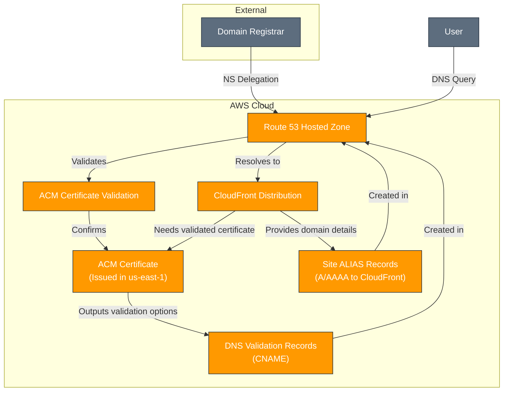

# AWS Route53 Module

---

## Table of Contents

- [1. Overview](#1-overview)
- [2. Prerequisites / Requirements](#2-prerequisites--requirements)
- [3. Architecture Diagram](#3-architecture-diagram)
- [4. Features](#4-features)
- [5. Module Architecture](#5-module-architecture)
- [6. Module Files Structure](#6-module-files-structure)
- [7. Inputs](#7-inputs)
- [8. Outputs](#8-outputs)
- [9. Example Usage](#9-example-usage)
- [10. Security Considerations / Recommendations](#10-security-considerations--recommendations)
- [11. Conditional Resource Creation](#11-conditional-resource-creation)
- [12. Best Practices](#12-best-practices)
- [13. Integration](#13-integration)
- [14. Future Improvements](#14-future-improvements)
- [15. Troubleshooting and Common Issues](#15-troubleshooting-and-common-issues)
- [16. Notes](#16-notes)
- [17. Useful Resources](#17-resources)

---

## 1. Overview

This Terraform module manages a Route 53 public hosted zone, DNS records for AWS Certificate Manager (ACM) validation, and ALIAS records to point a custom domain to an AWS CloudFront distribution. It integrates seamlessly with the `acm` and `cloudfront` modules to provide a complete, automated custom domain setup for web applications.

---

## 2. Prerequisites / Requirements

- **AWS Provider:** Must be configured in the root module.
- **ACM Module:** This module consumes outputs from the `acm` module (`acm_certificate_arn`, `acm_certificate_domain_validation_options`).
- **CloudFront Module:** This module consumes outputs from the `cloudfront` module (`cloudfront_distribution_domain_name`, `cloudfront_distribution_hosted_zone_id`).
- **Domain Registrar Access:** You must have access to your domain registrar to update the Name Server (NS) records for your custom domain to delegate DNS control to AWS Route 53.

---

## 3. Architecture Diagram



> _Diagram generated with [Mermaid](https://mermaid.js.org/)_

---

## 4. Features

- **Hosted Zone Creation:** Automatically creates a public hosted zone for your custom domain.
- **ACM DNS Validation:** Creates the necessary CNAME records to validate an ACM certificate, integrating with the `acm` module.
- **Certificate Validation Wait:** Explicitly waits for the ACM certificate to be issued before proceeding.
- **CloudFront ALIAS Records:** Creates ALIAS (A/AAAA) records to point your custom domain (and SANs) directly to a CloudFront distribution, integrating with the `cloudfront` module.
- **Flexible Domain Support:** Supports both the root domain and subject alternative names (SANs) for CloudFront aliases.

---

## 5. Module Architecture

This module provisions the following resources:
- **`aws_route53_zone`:** The public hosted zone for your custom domain.
- **`aws_route53_record` (for ACM validation):** Creates CNAME records based on ACM module outputs.
- **`aws_acm_certificate_validation`:** Waits for the ACM certificate to transition to an `ISSUED` state.
- **`aws_route53_record` (for CloudFront aliases):** Creates ALIAS records pointing to the CloudFront distribution.

---

## 6. Module Files Structure

| File           | Description                                                                    |
|----------------|--------------------------------------------------------------------------------|
| `main.tf`      | Defines the hosted zone, ACM validation records, and CloudFront ALIAS records. |
| `variables.tf` | Input variables for custom domain, ACM, and CloudFront integration.            |
| `outputs.tf`   | Exposes hosted zone ID, name servers, and generated FQDNs.                     |

---

## 7. Inputs

| Name                                        | Type           | Description                                                                                       |
|---------------------------------------------|----------------|---------------------------------------------------------------------------------------------------|
| `name_prefix`                               | `string`       | Resource name prefix (e.g., 'myproject').                                                         |
| `environment`                               | `string`       | Deployment environment (e.g., 'dev', 'stage', 'prod').                                            |
| `tags`                                      | `map(string)`  | A map of tags applied to all taggable resources.                                                  |
| `custom_domain_name`                        | `string`       | The root domain name (zone) for which to create the Hosted Zone (e.g., 'example.com').            |
| `subject_alternative_names`                 | `list(string)` | A list of subject alternative names (SANs) from the ACM certificate that also need DNS records.   |
| `acm_certificate_arn`                       | `string`       | The ARN of the ACM certificate that needs to be validated.                                        |
| `acm_certificate_domain_validation_options` | `any`          | A complex object containing ACM domain validation options.                                        |
| `cloudfront_distribution_domain_name`       | `string`       | The domain name of the CloudFront distribution (e.g., 'd12345.cloudfront.net').                   |
| `cloudfront_distribution_hosted_zone_id`    | `string`       | The hosted zone ID for the CloudFront distribution, required for creating ALIAS records.          |

---

## 8. Outputs

| Name                       | Description                                                                                                               |
|----------------------------|---------------------------------------------------------------------------------------------------------------------------|
| `custom_zone_id`           | The ID of the created Route 53 Hosted Zone.                                                                               |
| `custom_zone_name_servers` | A list of Name Server (NS) records for the created Hosted Zone. These values must be configured at your domain registrar. |
| `site_alias_fqdns`         | A list of FQDNs (fully qualified domain names) for all ALIAS records pointing to the CloudFront distribution.             |

---

## 9. Example Usage

```hcl
# In your root module (e.g., main.tf)

# This ACM module requests the certificate
module "acm_cert" {
  source                    = "./modules/acm"
  name_prefix               = "my-app"
  environment               = "prod"
  custom_domain_name        = "example.com"
  subject_alternative_names = ["www.example.com"]
  tags                      = { "Terraform" = "true" }
}

# This CloudFront module provisions the CDN
module "cf_dist" {
  source = "./modules/cloudfront"
  # ... other CloudFront variables ...
  custom_domain_name        = module.acm_cert.custom_domain_name
  acm_certificate_arn       = module.acm_cert.acm_arn
  custom_domain_aliases     = module.acm_cert.subject_alternative_names
}


# This Route53 module creates the hosted zone and DNS records
module "route53_setup" {
  source = "./modules/route53"

  name_prefix                 = "my-app"
  environment                 = "prod"
  tags                        = { "Terraform" = "true" }

  custom_domain_name          = module.acm_cert.custom_domain_name
  subject_alternative_names   = module.acm_cert.subject_alternative_names

  # Inputs from ACM module
  acm_certificate_arn                   = module.acm_cert.acm_arn
  acm_certificate_domain_validation_options = module.acm_cert.domain_validation_options

  # Inputs from CloudFront module
  cloudfront_distribution_domain_name  = module.cf_dist.cloudfront_distribution_domain_name
  cloudfront_distribution_hosted_zone_id = module.cf_dist.cloudfront_distribution_hosted_zone_id
}
```

---

## 10. Security Considerations / Recommendations

- **Least Privilege:** Ensure the IAM role executing this Terraform code has only the necessary permissions for `route53:*`, `acm:DescribeCertificate`, and `acm:GetCertificate`.
- **Private Hosted Zones:** This module creates a *public* hosted zone. For internal-only domains, consider creating a separate private hosted zone.
- **DNSSEC:** This module does not enable DNSSEC. For enhanced security, consider enabling DNSSEC manually or in a separate module if your use case requires it.

---

## 11. Conditional Resource Creation

- All resources in this module are created unconditionally, as its purpose is to establish DNS for a custom domain.

---

## 12. Best Practices

- **Delegate DNS Control:** Always update your domain registrar's NS records to delegate DNS control to AWS Route 53.
- **ALIAS Records:** Prefer ALIAS records over CNAMEs for CloudFront distributions, especially for apex domains.
- **ACM DNS Validation:** Use DNS validation for ACM certificates for fully automated certificate lifecycle management.
- **Explicit Dependencies:** Use `depends_on` to ensure correct order of operations, especially for certificate validation.

---

## 13. Integration

This module is designed to integrate seamlessly with:
- **ACM Module:** Consumes ACM certificate ARN and validation options.
- **CloudFront Module:** Consumes CloudFront distribution domain name and hosted zone ID.

---

## 14. Future Improvements

- **DNSSEC Integration:** Add optional support for DNSSEC configuration.
- **Health Checks:** Implement Route 53 health checks for more advanced routing policies.
- **Private Hosted Zones:** Expand to include optional creation of private hosted zones.

---

## 15. Troubleshooting and Common Issues

### 1. Domain Not Resolving After Apply
- **Cause:** NS records at the domain registrar have not been updated or have not propagated yet.
- **Solution:**
  - Verify that you have updated the NS records at your domain registrar with the values from the `custom_zone_name_servers` output.
  - Wait for DNS propagation (can take up to 24-48 hours, but usually faster). Use a DNS lookup tool to check.

### 2. ACM Certificate Stuck in `PENDING_VALIDATION`
- **Cause:** DNS validation records were not created correctly or have not propagated.
- **Solution:**
  - Ensure the `acm_certificate_domain_validation_options` input from the ACM module is correctly passed.
  - Verify that the CNAME records created by this module are visible using a DNS lookup tool.
  - Check the ACM console for more details on the validation failure.

### 3. CloudFront Distribution Not Accessible via Custom Domain
- **Cause:** The ALIAS records are not correctly pointing to the CloudFront distribution.
- **Solution:**
  - Ensure `cloudfront_distribution_domain_name` and `cloudfront_distribution_hosted_zone_id` are correctly passed from the CloudFront module.
  - Verify the ALIAS records in Route 53 console point to the correct CloudFront distribution.

---

## 16. Notes

- The `aws_acm_certificate_validation` resource is key to orchestrating the certificate issuance process seamlessly within Terraform.
- Remember the critical manual step of updating NS records at your domain registrar after the initial `terraform apply`.

---

## 17. Useful Resources

- [AWS Route 53 Documentation](https://docs.aws.amazon.com/route53/index.html)
- [Route 53 ALIAS vs CNAME](https://docs.aws.amazon.com/Route53/latest/DeveloperGuide/how-it-works-alias-records.html)
- [Terraform `aws_route53_zone` Resource](https://registry.terraform.io/providers/hashicorp/aws/latest/docs/resources/route53_zone)
- [Terraform `aws_route53_record` Resource](https://registry.terraform.io/providers/hashicorp/aws/latest/docs/resources/route53_record)
- [Terraform `aws_acm_certificate_validation` Resource](https://registry.terraform.io/providers/hashicorp/aws/latest/docs/resources/acm_certificate_validation)
