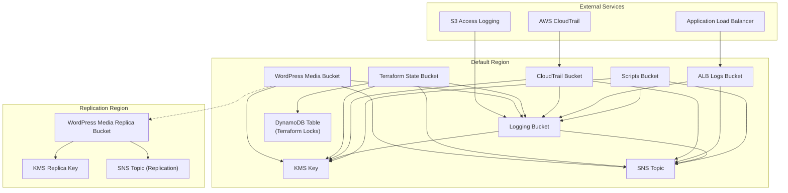

# AWS S3 Module for Terraform

This module creates and manages S3 buckets for various use cases within a project. It includes configurations for encryption, logging, versioning, lifecycle policies, cross-region replication, and access control to ensure security and compliance with best practices.

---

### Prerequisites

- **AWS Provider Configuration**:  
  The `aws` provider configuration, including the region and credentials, must be set in the root block of the Terraform project. An additional provider configuration for replication is required with the alias `aws.replication`.
- **KMS Key**:  
  A KMS key ARN must be provided via the `kms_key_arn` variable for bucket encryption. For replication, a `kms_replica_key_arn` can be provided for the destination region.
- **SNS Topic**:  
  An SNS topic ARN must be provided via `sns_topic_arn` for notifications and alarms. For replication, a `replication_region_sns_topic_arn` can be provided.
- **CORS Configuration**:
  When enabling CORS for WordPress media bucket, configure `allowed_origins` appropriately for your environment.

---

## Features

- **S3 Bucket Management**:
  - **Default region buckets**: Created based on the `default_region_buckets` map variable
  - **Replication region buckets**: Created based on the `replication_region_buckets` map variable
  - Dynamic bucket creation with configurable properties (versioning, replication, server access logging)
  - CORS configuration for WordPress media bucket with configurable origins

- **Logging Configuration**:
  - Centralized logging bucket for all S3 access logs
  - CloudTrail integration for API activity logging in dedicated bucket
  - Bucket policy configured for secure log delivery
  - ALB logs bucket with appropriate permissions for Elastic Load Balancing service

- **Lifecycle Management**:
  - Configurable versioning per bucket via bucket configuration
  - Automatic cleanup of noncurrent versions after specified retention period
  - Incomplete multipart upload cleanup
  - DynamoDB TTL for state locks with automatic cleanup
  - Special lifecycle rules for terraform_state bucket to prevent accidental deletion

- **Conditional Resource Creation**:
  - DynamoDB Table: Created when enabled via `enable_dynamodb` (requires terraform_state bucket)
  - CORS: Enabled via `enable_cors` for WordPress media bucket
  - CORS configuration for WordPress media bucket with configurable origins (restrict origins in production for security)
  - Replication: Enabled for buckets with replication property set to true

- **Encryption and Security**:
  - Mandatory KMS encryption for all buckets (except ALB logs bucket which uses SSE-S3)
  - Enforced HTTPS-only access
  - Public access blocked by default
  - Bucket key enabled for KMS cost optimization

- **Monitoring and Alerting**:
  - SNS notifications for bucket events
  - Centralized logging bucket with proper access controls

- **Cross-Region Replication**:
  - Replication to specified region for eligible buckets
  - IAM roles and policies for secure replication
  - Replication status monitoring
  - Support for KMS encrypted objects

- **DynamoDB Integration**:
  - State locking table with TTL cleanup
  - Point-in-time recovery enabled by default
  - Cost-effective pay-per-request billing mode

---

## Architecture Diagram



---

## Module Files Structure

| **File**          | **Description**                                                                          |
|-------------------|------------------------------------------------------------------------------------------|
| `main.tf`         | Core bucket configurations and notifications setup                                       |
| `dynamodb.tf`     | DynamoDB table for state locking                                                         |
| `lifecycle.tf`    | Lifecycle rules for bucket management                                                    |
| `outputs.tf`      | Module outputs                                                                           |
| `policies.tf`     | Bucket policies, CORS rules, and access controls                                         |
| `replication.tf`  | Cross-region replication configuration and IAM roles                                     |
| `variables.tf`    | Input variables                                                                          |

---

## Input Variables

| **Name**                           | **Type**      | **Description**                                          | **Default**             |
|------------------------------------|---------------|----------------------------------------------------------|-------------------------|
| `aws_region`                       | `string`      | AWS region where resources will be created               | Required                |
| `replication_region`               | `string`      | AWS region for replication bucket                        | Required                |
| `environment`                      | `string`      | Environment (dev, stage, prod)                           | Required                |
| `name_prefix`                      | `string`      | Resource name prefix                                     | Required                |
| `aws_account_id`                   | `string`      | AWS Account ID for bucket policies                       | Required                |
| `kms_key_arn`                      | `string`      | KMS key ARN for encryption                               | Required                |
| `kms_replica_key_arn`              | `string`      | ARN of KMS replica key in replication region             | `null`                  |
| `noncurrent_version_retention_days`| `number`      | Retention days for noncurrent object versions            | Required                |
| `sns_topic_arn`                    | `string`      | ARN of SNS Topic for bucket notifications                | Required                |
| `replication_region_sns_topic_arn` | `string`      | ARN of SNS Topic in replication region                   | `""`                    |
| `default_region_buckets`           | `map(object)` | Config for default AWS region buckets                    | `{}`                    |
| `replication_region_buckets`       | `map(object)` | Config for replication region buckets                    | `{}`                    |
| `enable_s3_script`                 | `bool`        | Enable uploading scripts to S3                           | `false`                 |
| `s3_scripts`                       | `map(string)` | Map of files for scripts bucket upload                   | `{}`                    |
| `enable_cors`                      | `bool`        | Enable CORS for WordPress media bucket                   | `false`                 |
| `allowed_origins`                  | `list(string)`| List of allowed origins for S3 CORS                      |`["https://example.com"]`|
| `enable_dynamodb`                  | `bool`        | Enable DynamoDB for Terraform state locking              | `false`                 |

---

## Outputs

| **Name**                                   | **Description**                                           |
|--------------------------------------------|-----------------------------------------------------------|
| `scripts_bucket_arn`                       | ARN of scripts bucket                                     |
| `scripts_bucket_name`                      | Name of scripts bucket                                    |
| `logging_bucket_arn`                       | ARN of logging bucket                                     |
| `logging_bucket_name`                      | Name of logging bucket                                    |
| `logging_bucket_id`                        | ID of logging bucket                                      |
| `alb_logs_bucket_name`                     | Name of the S3 bucket for ALB logs                        |
| `cloudtrail_bucket_arn`                    | ARN of the CloudTrail S3 bucket                           |
| `cloudtrail_bucket_id`                     | ID of the CloudTrail S3 bucket                            |
| `cloudtrail_bucket_name`                   | Name of the CloudTrail S3 bucket                          |
| `terraform_state_bucket_arn`               | ARN of Terraform state bucket                             |
| `terraform_state_bucket_name`              | Name of Terraform state bucket                            |
| `wordpress_media_bucket_arn`               | ARN of WordPress media bucket                             |
| `wordpress_media_bucket_name`              | Name of WordPress media bucket                            |
| `deploy_wordpress_scripts_files_etags_map` | Map of script file keys to ETags                          |
| `replication_bucket_arn`                   | ARN of replication bucket                                 |
| `replication_bucket_name`                  | Name of replication bucket                                |
| `replication_bucket_region`                | Region of replication bucket                              |
| `terraform_locks_table_arn`                | ARN of DynamoDB table for Terraform state locking         |
| `terraform_locks_table_name`               | Name of DynamoDB table for Terraform state locking        |
| `enable_dynamodb`                          | DynamoDB enabled for state locking                        |
| `all_enabled_buckets_names`                | List of all enabled S3 bucket names                       |

---

## Security Best Practices

- **Access Control**:
  - All buckets are private by default
  - HTTPS-only access enforced
  - Least privilege IAM policies
  - Review and restrict CORS `allowed_origins` in production environments

- **Encryption**:
  - Mandatory KMS encryption for all resources (except ALB logs bucket which uses SSE-S3)
  - Encryption enforced via bucket policies
  - Server-side encryption for all objects
  - Secure key management with KMS
  - Bucket key enabled for cost optimization

- **Monitoring**:
  - SNS notifications for bucket events
  - Centralized logging with retention
  - Point-in-time recovery for DynamoDB

- **Cost Optimization**:
  - Pay-per-request billing for DynamoDB
  - Lifecycle policies for old versions
  - Bucket key enabled for KMS optimization

---

## Usage Example

```hcl
module "s3" {
  source = "./modules/s3"

  aws_region         = "eu-west-1"
  replication_region = "eu-central-1"
  environment        = "dev"
  name_prefix        = "myproject"
  aws_account_id     = "123456789012"
  
  # KMS and SNS configuration
  kms_key_arn                      = module.kms.key_arn
  kms_replica_key_arn              = module.kms_replica.key_arn
  sns_topic_arn                    = module.sns.topic_arn
  replication_region_sns_topic_arn = module.sns_replica.topic_arn
  
  # Versioning configuration
  noncurrent_version_retention_days = 30
  
  # Default region buckets
  default_region_buckets = {
    scripts = {
      enabled               = true
      versioning            = true
      replication           = false
      server_access_logging = true
    }
    logging = {
      enabled               = true
      versioning            = false
      replication           = false
      server_access_logging = false
    }
    alb_logs = {
      enabled               = true
      versioning            = false
      replication           = false
      server_access_logging = true
    }
    cloudtrail = {
      enabled               = true
      versioning            = true
      replication           = false
      server_access_logging = true
    }
    terraform_state = {
      enabled               = true
      versioning            = true
      replication           = false
      server_access_logging = true
    }
    wordpress_media = {
      enabled               = true
      versioning            = true
      replication           = true
      server_access_logging = true
    }
  }
  
  # Replication region buckets
  replication_region_buckets = {
    wordpress_media = {
      enabled               = true
      versioning            = true
      server_access_logging = true
      region                = "eu-central-1"
    }
  }
  
  # WordPress scripts
  enable_s3_script = true
  s3_scripts = {
    "scripts/setup.sh" = "scripts/setup.sh"
    "scripts/backup.sh" = "scripts/backup.sh"
  }
  
  # CORS configuration (IMPORTANT: Restrict origins in production)
  enable_cors = true
  allowed_origins = ["https://myproject.example.com"]
  
  # DynamoDB for state locking
  enable_dynamodb = true
}
```
## Troubleshooting and Common Issues

### 1. Replication Fails with Access Denied
**Cause:** Missing or incorrect IAM role/policy for replication.  
**Solution:**  
- Ensure the replication role is created and attached correctly.
- Verify KMS key permissions cover both source and replica buckets.

---

### 2. ALB Logs Not Delivered to Bucket
**Cause:** Missing bucket policy or incorrect ACL for ALB logs delivery.  
**Solution:**  
- Check that `delivery.logs.amazonaws.com` service has `s3:PutObject` permission.
- Verify `bucket-owner-full-control` ACL is enforced.

---

### 3. Terraform Plan Fails: "DynamoDB requires terraform_state bucket"
**Cause:** `enable_dynamodb = true`, but the `terraform_state` bucket is missing or disabled.  
**Solution:**  
- Ensure the `terraform_state` bucket is defined and `enabled = true`.
- Re-run `terraform apply`.

---

### 4. CORS Preflight Requests Failing
**Cause:** Missing or incorrect CORS configuration on `wordpress_media` bucket.  
**Solution:**  
- Check that `enable_cors = true` and `allowed_origins` are properly configured.
- Review allowed methods and headers.

---

### 5. "KMS Access Denied" on Replication
**Cause:** `kms_replica_key_arn` not provided or IAM policy missing KMS permissions.  
**Solution:**  
- Validate that the correct KMS replica key ARN is set.
- Ensure the replication role has access to both KMS keys (source and replica).

---

### 6. Lifecycle Rules Deleting Data Too Early
**Cause:** The default test rule (`expiration.days = 1`) is active in production.  
**Solution:**  
- Increase `noncurrent_version_retention_days` in production.
- Remove the 1-day expiration rule for production workloads.

---

### 7. S3 Bucket Destroy Fails Due to prevent_destroy
**Cause:** `prevent_destroy = true` enabled on critical resources (e.g., DynamoDB or terraform_state bucket).  
**Solution:**  
- Temporarily remove or override the lifecycle block for testing or teardown.

---

### 8. WordPress Scripts Not Uploaded to S3
**Cause:** `enable_s3_script = false` or `scripts` bucket disabled.  
**Solution:**  
- Set `enable_s3_script = true`.
- Ensure `scripts` bucket is enabled in `default_region_buckets`.

---

## Notes

- This module is designed with security best practices in mind, including encryption, access control, and monitoring.
- The ALB logs bucket uses SSE-S3 encryption (AES256) as required by the AWS Elastic Load Balancing service.
- For production environments, adjust the lifecycle rules to increase retention periods and remove the 1-day expiration rule.
- When using replication, ensure that both source and destination buckets have versioning enabled.
- The `terraform_state` bucket has special lifecycle rules to prevent accidental deletion of state files.
- Always strictly validate and limit CORS `allowed_origins` in production environments to prevent cross-origin vulnerabilities and data leaks.

---

## Useful Resources

- [AWS S3 Documentation](https://docs.aws.amazon.com/AmazonS3/latest/userguide/Welcome.html)
- [S3 Bucket Encryption](https://docs.aws.amazon.com/AmazonS3/latest/userguide/bucket-encryption.html)
- [S3 Bucket Policies](https://docs.aws.amazon.com/AmazonS3/latest/userguide/bucket-policies.html)
- [S3 Lifecycle Management](https://docs.aws.amazon.com/AmazonS3/latest/userguide/object-lifecycle-mgmt.html)
- [S3 Replication](https://docs.aws.amazon.com/AmazonS3/latest/userguide/replication.html)
- [S3 Access Points](https://docs.aws.amazon.com/AmazonS3/latest/userguide/access-points.html)
- [S3 Inventory](https://docs.aws.amazon.com/AmazonS3/latest/userguide/storage-inventory.html)
- [S3 Pricing](https://aws.amazon.com/s3/pricing/)
- [AWS KMS Documentation](https://docs.aws.amazon.com/kms/latest/developerguide/overview.html)
- [S3 Security Best Practices](https://docs.aws.amazon.com/AmazonS3/latest/userguide/security-best-practices.html)