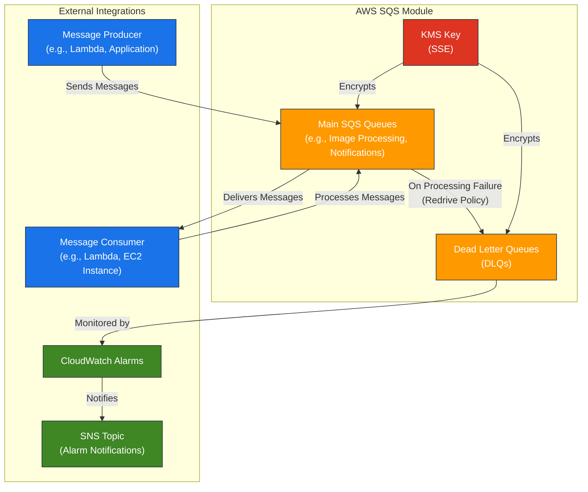

# AWS SQS Module for Terraform

---

## Table of Contents

- [1. Overview](#1-overview)
- [2. Prerequisites / Requirements](#2-prerequisites--requirements)
- [3. Architecture Diagram](#3-architecture-diagram)
- [4. Features](#4-features)
- [5. Module Architecture](#5-module-architecture)
- [6. Module Files Structure](#6-module-files-structure)
- [7. Inputs](#7-inputs)
- [8. Outputs](#8-outputs)
- [9. Example Usage](#9-example-usage)
- [10. Security Considerations / Recommendations](#10-security-considerations--recommendations)
- [11. Conditional Resource Creation](#11-conditional-resource-creation)
- [12. Best Practices](#12-best-practices)
- [13. Integration](#13-integration)
- [14. Future Improvements](#14-future-improvements)
- [15. Troubleshooting and Common Issues](#15-troubleshooting-and-common-issues)
- [16. Notes](#16-notes)
- [17. Useful Resources](#17-useful-resources)

---

## 1. Overview

This Terraform module provisions and manages a collection of AWS SQS (Simple Queue Service) queues, including their Dead Letter Queues (DLQs). It is designed to be highly flexible, allowing the creation of multiple queues with custom configurations, automatic linking of DLQs, and enforcement of Server-Side Encryption (SSE) using customer-managed KMS keys. The module also integrates CloudWatch alarms for monitoring messages in DLQs.

---

## 2. Prerequisites / Requirements

- AWS Provider Configuration: The `aws` provider, including region and credentials, must be configured in the root Terraform project.
- KMS Key ARN: An existing KMS key ARN (`kms_key_arn`) is required for Server-Side Encryption of SQS queues.
- SNS Topic ARN (Optional): An existing SNS topic ARN (`cloudwatch_alarms_topic_arn`) is required if CloudWatch alarms for DLQs are enabled.

---

## 3. Architecture Diagram



> _Diagram generated with [Mermaid](https://mermaid.js.org/)_

---

## 4. Features

- Dynamic Queue Creation: Create multiple SQS queues and their associated Dead Letter Queues (DLQs) using a single, flexible input map (`sqs_queues`).
- Automated DLQ Linking: Automatically configures SQS Redrive Policies, linking main queues to their designated DLQs, and setting `max_receive_count`.
- Server-Side Encryption (SSE): Enforces Server-Side Encryption for all queues using a customer-managed KMS key.
- Configurable Queue Properties: Allows fine-grained control over `visibility_timeout_seconds`, `message_retention_seconds`, and `kms_data_key_reuse_period_seconds`.
- DLQ Monitoring: Integrates CloudWatch alarms that trigger when messages appear in any DLQ, indicating processing failures.

---

## 5. Module Architecture

This module provisions the following AWS resources:
- `aws_sqs_queue`: Creates both main SQS queues and their corresponding DLQs.
- `aws_sqs_queue_redrive_allow_policy`: Configures the necessary permissions for main queues to redrive messages to their DLQs.
- `aws_cloudwatch_metric_alarm`: Creates alarms for each DLQ to monitor for messages.

---

## 6. Module Files Structure

| File           | Description                                                 |
|----------------|-------------------------------------------------------------|
| `main.tf`      | Defines the SQS queues and Redrive Allow Policies.          |
| `variables.tf` | Input variables for queue configuration and encryption.     |
| `outputs.tf`   | Exposes queue ARNs, names, and URLs.                        |
| `metrics.tf`   | Configures CloudWatch alarms for DLQ monitoring.            |
| `versions.tf`  | Defines required Terraform and provider versions.           |

---

## 7. Inputs

| Name                          | Type         | Description                                                                                     |
|-------------------------------|--------------|-------------------------------------------------------------------------------------------------|
| `name_prefix`                 | `string`     | A prefix used for all SQS resources to ensure name uniqueness and project consistency.          |
| `environment`                 | `string`     | The deployment environment (e.g., dev, stage, prod), used for naming and tagging.               |
| `tags`                        | `map(string)`| A map of tags to apply to all taggable resources created by the module.                         |
| `kms_key_arn`                 | `string`     | The ARN of the customer-managed KMS key used for Server-Side Encryption (SSE) of all SQS queues.|
| `sqs_queues`                  | `map(object)`| A map of SQS queues to create. The key of the map is a logical name (e.g., "image-processing"). |
| `cloudwatch_alarms_topic_arn` | `string`     | Optional: The ARN of the SNS topic to which CloudWatch alarms for the queues are sent.          |

---

## 8. Outputs

| Name         | Description                                                                                                          |
|--------------|----------------------------------------------------------------------------------------------------------------------|
| `queue_arns` | A map of logical queue names to their Amazon Resource Names (ARNs).                                                  |
| `queue_names`| A map of logical queue names to their actual, unique SQS queue names.                                                |
| `queue_urls` | A map of logical queue names to their URLs. The URL is the primary endpoint used by SDKs and the AWS CLI.            |

---

## 9. Example Usage

```hcl
module "sqs" {
  source = "./modules/sqs"

  name_prefix = "my-app"
  environment = "dev"
  tags = {
    Project = "MyWebApp"
  }

  kms_key_arn = module.kms.key_arn # From the KMS module

  cloudwatch_alarms_topic_arn = aws_sns_topic.my_alarms.arn # From an SNS topic resource

  sqs_queues = {
    "image-processing-dlq" = {
      name                              = "image-processing-dlq"
      is_dlq                            = true
      message_retention_seconds         = 1209600 # 14 days
      kms_data_key_reuse_period_seconds = 600     # 10 minutes
    },
    "image-processing" = {
      name                              = "image-processing"
      is_dlq                            = false
      dlq_key                           = "image-processing-dlq" # References the DLQ defined above
      max_receive_count                 = 5
      visibility_timeout_seconds        = 300     # 5 minutes
      message_retention_seconds         = 345600  # 4 days
      kms_data_key_reuse_period_seconds = 300     # 5 minutes
    },
    "notification-queue" = {
      name                              = "notification-queue"
      is_dlq                            = false
      visibility_timeout_seconds        = 60
      message_retention_seconds         = 86400   # 1 day
    }
  }
}
```

---

## 10. Security Considerations / Recommendations

- **Server-Side Encryption (SSE):** Always use customer-managed KMS keys for SSE to maintain full control over encryption.
- **Least Privilege IAM:** Ensure IAM policies granting access to SQS queues are scoped to the minimum necessary actions and resources.
- **Redrive Policy Configuration:** Carefully set `max_receive_count` to balance between retry attempts and fast DLQ delivery for failed messages.
- **Visibility Timeout:** Configure `visibility_timeout_seconds` to be longer than the message processing time of your consumers to prevent duplicate processing.
- **Monitoring DLQs:** Actively monitor DLQs for messages, as their presence indicates processing failures requiring investigation.

---

## 11. Conditional Resource Creation

- **CloudWatch Alarms:** DLQ alarms are created only if `cloudwatch_alarms_topic_arn` is provided.
- **SQS Queues:** Queues are dynamically created based on the `sqs_queues` map.

---

## 12. Best Practices

- **DLQ Usage:** Always use Dead Letter Queues for robust message processing workflows to capture and manage failed messages.
- **Visibility Timeout:** Ensure `visibility_timeout_seconds` is appropriate for your message consumers.
- **KMS Key Reuse:** Adjust `kms_data_key_reuse_period_seconds` to balance between KMS cost and security requirements.
- **Batch Processing:** Consider using batch processing for message consumers (e.g., Lambda with SQS event source mapping) to improve efficiency.

---

## 13. Integration

This module is designed to integrate seamlessly with:
- **KMS Module:** Provides the KMS key for queue encryption.
- **SNS Module:** Provides the SNS topic for CloudWatch alarm notifications.
- **Lambda Functions:** SQS queues can serve as event sources for Lambda functions.

---

## 14. Future Improvements

- Add support for SQS FIFO (First-In, First-Out) queues.
- Implement advanced monitoring metrics beyond DLQ messages visible.
- Provide options for fine-tuning Redrive Policy based on message age.

---

## 15. Troubleshooting and Common Issues

### 1. Messages Not Appearing in DLQ
- **Cause:** `max_receive_count` not reached, or Redrive Policy not correctly configured.
- **Solution:**
  - Verify `max_receive_count` is set to an appropriate value (e.g., 5).
  - Ensure `dlq_key` is correctly set in the `sqs_queues` map for the main queue.
  - Check SQS logs (via CloudTrail) for Redrive Policy related errors.

### 2. SQS Messages Are Duplicated
- **Cause:** `visibility_timeout_seconds` is too short, leading to messages becoming visible again before a consumer finishes processing.
- **Solution:**
  - Increase `visibility_timeout_seconds` to be at least 6 times the maximum processing time of your message consumer.
  - Design consumers to be idempotent to handle potential duplicates safely.

### 3. KMS Access Denied Errors
- **Cause:** The IAM role of the producer/consumer lacks permissions to use the KMS key.
- **Solution:**
  - Ensure the IAM role has `kms:Decrypt` and `kms:GenerateDataKey` permissions for the specified `kms_key_arn`.
  - Check the KMS key policy to allow usage by the SQS service and relevant IAM principals.

### 4. CloudWatch Alarm Not Triggering
- **Cause:** `cloudwatch_alarms_topic_arn` is not provided or the alarm is misconfigured.
- **Solution:**
  - Ensure `cloudwatch_alarms_topic_arn` is correctly set to a valid SNS topic ARN.
  - Verify the alarm is created in the CloudWatch console and its state is `INSUFFICIENT_DATA` or `OK` initially.

### AWS CLI Reference

This section provides common AWS CLI commands that help verify and debug the SQS module configuration and runtime behavior.

#### SQS Queue Inspection

```bash
# List all SQS queues in the current region
aws sqs list-queues

# Get the URL of a specific queue
aws sqs get-queue-url --queue-name <queue-name> --region <region>

# Get all attributes for a specific queue
aws sqs get-queue-attributes --queue-url <queue-url> --attribute-names All --region <region>

# Peek at messages in a queue (without deleting them)
aws sqs receive-message --queue-url <queue-url> --max-number-of-messages 1 --visibility-timeout 0 --region <region>

# List dead-letter source queues for a given DLQ
aws sqs list-dead-letter-source-queues --queue-url <dlq-url> --region <region>
```

#### CloudWatch Alarms

```bash
# List alarms related to SQS
aws cloudwatch describe-alarms --query 'MetricAlarms[?contains(AlarmName, `sqs`)]' --region <region>

# View history of a specific alarm
aws cloudwatch describe-alarm-history --alarm-name <alarm-name> --region <region>
```

#### CLI Notes
- Replace `<region>`, `<queue-name>`, `<queue-url>`, `<dlq-url>`, and `<alarm-name>` with the appropriate values from your environment.
- These commands are intended for diagnostic purposes and complement the Terraform outputs.
- Use them for validation, debugging, or quick insights during testing and production monitoring.

---

## 16. Notes

- This module creates queues in a specific order (DLQs first, then main queues) to resolve Terraform dependency issues.
- It is designed for maximum flexibility, allowing creation of many queues from a single configuration.
- `kms_key_arn` is mandatory to enforce secure SSE with customer-managed keys.

---

## 17. Useful Resources

- [AWS SQS Documentation](https://docs.aws.amazon.com/AWSSimpleQueueService/latest/SQSDeveloperGuide/welcome.html)
- [SQS Dead Letter Queues](https://docs.aws.amazon.com/AWSSimpleQueueService/latest/SQSDeveloperGuide/sqs-dead-letter-queues.html)
- [SQS Security Best Practices](https://docs.aws.amazon.com/AWSSimpleQueueService/latest/SQSDeveloperGuide/sqs-security-best-practices.html)
- [Terraform `aws_sqs_queue` Resource](https://registry.terraform.io/providers/hashicorp/aws/latest/docs/resources/sqs_queue)
