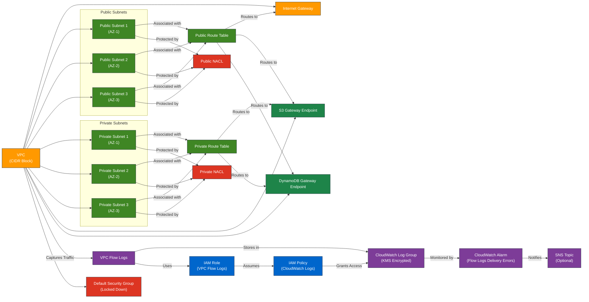

# AWS VPC Module for Terraform

---

## 1. Overview

This module creates and manages a Virtual Private Cloud (VPC) in AWS, including public and private subnets, route tables, Internet Gateway, Network ACLs (NACLs), and VPC Flow Logs. It provides a secure, scalable, and configurable networking foundation for AWS infrastructure.

---

## 2. Prerequisites / Requirements

- **AWS Provider Configuration**:
  - The AWS provider (`aws`) must be properly configured in the root module with region and credentials.
  
- **KMS Key for Flow Logs**:
  - An existing KMS key ARN is required for encrypting VPC Flow Logs.

- **IAM Role for Flow Logs**:
  - An IAM role is created by this module with required permissions for CloudWatch Logs.

- **S3 and DynamoDB Endpoints (optional)**:
  - Gateway Endpoints for S3 and DynamoDB are created by default; Interface Endpoints are not included.

---

## 3. Architecture Diagram


---

## 4. Features

- **VPC Creation**:
  - Creates a VPC with a configurable CIDR block and DNS support.
- **Subnet Management**:
  - Configures public and private subnets across multiple availability zones.
  - Automatically assigns public IPs to instances launched in public subnets.
- **Route Tables**:
  - Creates route tables for public and private subnets:
    - Public route table for internet access via an Internet Gateway.
    - Private route table for secure access to S3 and DynamoDB via Gateway Endpoints.
- **Network ACLs (NACLs)**:
  - Configurable rules for controlling inbound and outbound traffic:
    - Public NACL: Allows HTTP, HTTPS, and SSH traffic.
    - Private NACL: Allows MySQL, Redis, DNS, and ephemeral traffic within the VPC.
  - NACLs operate at the subnet level, while Security Groups (SG) restrict traffic at the instance level.
- **VPC Flow Logs**:
  - **Log Configuration**:
    - Captures ALL traffic types (ACCEPT/REJECT)
    - Logs are organized by environment
    - Configurable retention period via `flow_logs_retention_in_days`
  - **Security**:
    - KMS encryption for sensitive log data
    - IAM roles follow principle of least privilege
    - CloudWatch permissions scoped to specific log groups
  - **Resource Management**:
    - Automatic cleanup support in test environments
    - Proper resource tagging for cost allocation
    - Structured log organization by environment
  - **Monitoring and Alerts**:
    - CloudWatch Alarm for VPC Flow Logs `DeliveryErrors` metric
    - SNS notifications (required for Flow Logs delivery monitoring) for alerting on delivery failures (optional)
  - **Best Practices**:
    - Regular review of retention periods
    - Cost monitoring recommendations
    - Traffic sampling options for high-traffic environments
- **Gateway Endpoints**:
  - Configurable S3 and DynamoDB endpoints for private access without requiring a NAT Gateway.
- **Flexible Access Control**:
  - SSH, HTTP, and HTTPS access can be dynamically enabled or disabled using input variables (`ssh_allowed_cidr`).
- **Tagging**:
  - Consistent tagging for resource tracking and cost allocation.

---

## 5. Module Architecture

This module provisions the following AWS resources:
- **VPC** with customizable CIDR block
- **Public and Private Subnets** across three Availability Zones
- **Internet Gateway** for internet access
- **Route Tables** for public and private routing
- **Network ACLs (NACLs)** with detailed inbound/outbound rules
- **VPC Gateway Endpoints** for S3 and DynamoDB
- **VPC Flow Logs** with CloudWatch Log Group and KMS encryption
- **CloudWatch Alarm** for Flow Logs delivery errors
- **IAM Role and Policy** for Flow Logs permissions
- **Default Security Group** locked by default

---

## 6. Module Files Structure

| **File**              | **Description**                                                                 |
|-----------------------|---------------------------------------------------------------------------------|
| `main.tf`             | Defines the VPC, subnets, and main configurations.                              |
| `endpoints_routes.tf` | Configures route tables, Internet Gateway, and Gateway Endpoints.               |
| `nacl.tf`             | Creates and associates Network ACLs for public and private subnets.             |
| `flow_logs.tf`        | Configures VPC Flow Logs, related IAM roles, policies, and CloudWatch alarms.   |
| `variables.tf`        | Declares input variables for the module.                                        |
| `outputs.tf`          | Exposes key outputs for integration with other modules.                         |

---

## 7. Inputs

| **Name**                         | **Type**       | **Description**                                      | **Default/Required**       |
|----------------------------------|----------------|------------------------------------------------------|----------------------------|
| `aws_region`                     | `string`       | AWS region where resources will be created.          | **Required**               |
| `aws_account_id`                 | `string`       | AWS account ID for configuring permissions.          | **Required**               |
| `vpc_cidr_block`                 | `string`       | CIDR block for the VPC.                              | **Required**               |
| `name_prefix`                    | `string`       | Prefix for resource names.                           | **Required**               |
| `environment`                    | `string`       | Environment tag (e.g., dev, stage, prod).            | **Required**               |
| `public_subnet_cidr_block_1`     | `string`       | CIDR block for the first public subnet.              | **Required**               |
| `public_subnet_cidr_block_2`     | `string`       | CIDR block for the second public subnet.             | **Required**               |
| `public_subnet_cidr_block_3`     | `string`       | CIDR block for the third public subnet.              | **Required**               |
| `private_subnet_cidr_block_1`    | `string`       | CIDR block for the first private subnet.             | **Required**               |
| `private_subnet_cidr_block_2`    | `string`       | CIDR block for the second private subnet.            | **Required**               |
| `private_subnet_cidr_block_3`    | `string`       | CIDR block for the third private subnet.             | **Required**               |
| `availability_zone_public_1`     | `string`       | Availability zone for the first public subnet.       | **Required**               |
| `availability_zone_public_2`     | `string`       | Availability zone for the second public subnet.      | **Required**               |
| `availability_zone_public_3`     | `string`       | Availability zone for the third public subnet.       | **Required**               |
| `availability_zone_private_1`    | `string`       | Availability zone for the first private subnet.      | **Required**               |
| `availability_zone_private_2`    | `string`       | Availability zone for the second private subnet.     | **Required**               |
| `availability_zone_private_3`    | `string`       | Availability zone for the third private subnet.      | **Required**               |
| `kms_key_arn`                    | `string`       | ARN of KMS key for Flow Logs encryption              | **Required**               |
| `flow_logs_retention_in_days`    | `number`       | Number of days to retain VPC Flow Logs               | **Required**               |
| `ssh_allowed_cidr`               | `list(string)` | List of allowed CIDR blocks for SSH access.          | `["0.0.0.0/0"]` (Optional) |
| `sns_topic_arn`                  | `string`       | ARN of SNS Topic for CloudWatch Alarms notifications.| `null` (Optional)          |

---

## 8. Outputs

| **Name**                         | **Description**                                                      |
|----------------------------------|----------------------------------------------------------------------|
| `vpc_id`                         | The ID of the created VPC                                            |
| `vpc_arn`                        | The ARN of the VPC                                                   |
| `vpc_cidr_block`                 | The CIDR block of the VPC                                            |
| `public_subnet_1_id`             | ID of the first public subnet                                        |
| `public_subnet_2_id`             | ID of the second public subnet                                       |
| `public_subnet_3_id`             | ID of the third public subnet                                        |
| `public_subnets`                 | List of public subnet IDs                                            |
| `public_subnet_ids`              | List of IDs for public subnets                                       |
| `private_subnet_1_id`            | ID of the first private subnet                                       |
| `private_subnet_2_id`            | ID of the second private subnet                                      |
| `private_subnet_3_id`            | ID of the third private subnet                                       |
| `private_subnets`                | List of private subnet IDs                                           |
| `private_subnet_ids`             | List of IDs for private subnets                                      |
| `vpc_flow_logs_log_group_name`   | Name of the CloudWatch Log Group for VPC Flow Logs                   |
| `vpc_flow_logs_role_arn`         | IAM Role ARN for VPC Flow Logs                                       |
| `public_subnet_cidr_block_1`     | CIDR block for the first public subnet                               |
| `public_subnet_cidr_block_2`     | CIDR block for the second public subnet                              |
| `public_subnet_cidr_block_3`     | CIDR block for the third public subnet                               |
| `private_subnet_cidr_block_1`    | CIDR block for the first private subnet                              |
| `private_subnet_cidr_block_2`    | CIDR block for the second private subnet                             |
| `private_subnet_cidr_block_3`    | CIDR block for the third private subnet                              |
| `private_route_table_id`         | The ID of the private route table used by all private subnets        |
| `public_route_table_id`          | ID of the public route table                                         |
| `s3_endpoint_id`                 | The ID of the S3 Gateway Endpoint                                    |
| `dynamodb_endpoint_id`           | The ID of the DynamoDB VPC Endpoint                                  |
| `default_security_group_id`      | The ID of the default security group for the VPC                     |
| `public_subnet_nacl_id`          | The ID of the NACL associated with the public subnet                 |
| `private_subnet_nacl_id`         | The ID of the NACL associated with the private subnet                |
| `availability_zone_public_1`     | Availability Zone for public subnet 1                                |
| `availability_zone_public_2`     | Availability Zone for public subnet 2                                |
| `availability_zone_public_3`     | Availability Zone for public subnet 3                                |
| `availability_zone_private_1`    | Availability Zone for private subnet 1                               |
| `availability_zone_private_2`    | Availability Zone for private subnet 2                               |
| `availability_zone_private_3`    | Availability Zone for private subnet 3                               |
| `internet_gateway_id`            | The ID of the Internet Gateway                                       |

---

## 9. Example Usage

```hcl
module "vpc" {
  source                        = "./modules/vpc"
  aws_region                    = "eu-west-1"
  aws_account_id                = "123456789012"
  vpc_cidr_block                = "10.0.0.0/16"
  name_prefix                   = "my-project"
  environment                   = "prod"
  
  # Public Subnet Configuration
  public_subnet_cidr_block_1    = "10.0.1.0/24"
  public_subnet_cidr_block_2    = "10.0.2.0/24"
  public_subnet_cidr_block_3    = "10.0.3.0/24"
  availability_zone_public_1    = "eu-west-1a"
  availability_zone_public_2    = "eu-west-1b"
  availability_zone_public_3    = "eu-west-1c"
  
  # Private Subnet Configuration
  private_subnet_cidr_block_1   = "10.0.4.0/24"
  private_subnet_cidr_block_2   = "10.0.5.0/24"
  private_subnet_cidr_block_3   = "10.0.6.0/24"
  availability_zone_private_1   = "eu-west-1a"
  availability_zone_private_2   = "eu-west-1b"
  availability_zone_private_3   = "eu-west-1c"
  
  # Security Configuration
  ssh_allowed_cidr              = ["10.10.0.0/16"]  # Restrict SSH access to corporate network
  
  # Flow Logs Configuration
  kms_key_arn                   = "arn:aws:kms:eu-west-1:123456789012:key/abcd1234-ab12-cd34-ef56-abcdef123456"
  flow_logs_retention_in_days   = 30
  
  # Monitoring Configuration
  sns_topic_arn                 = aws_sns_topic.cloudwatch_alarms.arn
}
```
---

## 10. Security Considerations / Recommendations

1. **Network ACLs (NACLs)**:
   - Public subnets:
     - SSH access is configurable with CIDR restrictions
     - Ephemeral ports open for return traffic
   - Private subnets:
     - Allow only necessary ports (MySQL, Redis, DNS)
     - Restricted to VPC CIDR for internal communication
   
2. **Flow Logs Security**:
   - KMS encryption for all log data
   - IAM roles follow principle of least privilege
   - CloudWatch Logs permissions scoped to specific log groups
   - CloudWatch alarm for monitoring Flow Logs delivery errors
   - Optional SNS notifications for immediate alerts on delivery failures

3. **Security Considerations**:
   - Public IP assignment is restricted to public subnets only
   - Gateway Endpoints provide secure access to AWS services
   - NACL rules are stateless and provide additional security layer
   - Default Security Group is fully restricted (no ingress/egress)

> Note: Some tfsec rules are intentionally ignored with proper documentation (e.g., public IP assignment in public subnets).

### NACL Rules Comparison Table

| Rule Number | Direction | Protocol | Port Range       | Source/Destination CIDR | Action | Description                                    |
|-------------|-----------|----------|------------------|-------------------------|--------|------------------------------------------------|
| **Public NACL**                                                                                                                           |
| 100         | Inbound   | TCP      | 80               | 0.0.0.0/0               | ALLOW  | Allow HTTP traffic for ALB                     |
| 110         | Inbound   | TCP      | 443              | 0.0.0.0/0               | ALLOW  | Allow HTTPS traffic for ALB                    |
| 120         | Inbound   | TCP      | 22               | var.ssh_allowed_cidr[0] | ALLOW  | Allow SSH traffic (configurable CIDR)          |
| 130         | Inbound   | TCP      | 1024-65535       | 0.0.0.0/0               | ALLOW  | Allow ephemeral ports for return traffic       |
| 100         | Outbound  | ALL      | ALL              | 0.0.0.0/0               | ALLOW  | Allow all outbound traffic                     |
|-------------------------------------------------------------------------------------------------------------------------------------------|
| **Private NACL**                                                                                                                          |
| 200         | Inbound   | TCP      | 3306             | VPC CIDR                | ALLOW  | Allow MySQL from within VPC                    |
| 210         | Inbound   | TCP      | 6379             | VPC CIDR                | ALLOW  | Allow Redis from within VPC                    |
| 220         | Inbound   | TCP      | 1024-65535       | VPC CIDR                | ALLOW  | Allow ephemeral ports for return traffic       |
| 250         | Inbound   | TCP      | 443              | VPC CIDR                | ALLOW  | Allow HTTPS to VPC Endpoints (SSM, etc.)       |
| 200         | Outbound  | TCP      | 3306             | VPC CIDR                | ALLOW  | Allow MySQL outbound to VPC                    |
| 210         | Outbound  | TCP      | 6379             | VPC CIDR                | ALLOW  | Allow Redis outbound to VPC                    |
| 220         | Outbound  | TCP      | 53               | 0.0.0.0/0               | ALLOW  | Allow DNS TCP queries                          |
| 230         | Outbound  | UDP      | 53               | 0.0.0.0/0               | ALLOW  | Allow DNS UDP queries                          |
| 240         | Outbound  | TCP      | 1024-65535       | VPC CIDR                | ALLOW  | Allow ephemeral ports within VPC               |
| 260         | Outbound  | TCP      | 443              | VPC CIDR                | ALLOW  | Allow SSM traffic to VPC Endpoints             |
---------------------------------------------------------------------------------------------------------------------------------------------
---

## 11. Conditional Resource Creation

This module supports conditional creation of CloudWatch Alarms based on input variables:

- **CloudWatch Alarms for Flow Logs**: Created only if `sns_topic_arn` is provided (not null). When provided, an alarm will be created to monitor VPC Flow Logs delivery errors and send notifications to the specified SNS topic.

All other resources in this module are created unconditionally, including:
- VPC and all associated subnets
- Internet Gateway and route tables
- Network ACLs for public and private subnets
- VPC Flow Logs with CloudWatch Log Group
- VPC Endpoints for S3 and DynamoDB

---

## 12. Best Practices

1. **Security**:
   - Regularly review and update NACL rules to maintain security posture
   - Restrict SSH access to known IP ranges
   - Monitor VPC Flow Logs for suspicious activity

2. **Scalability**:
   - Size subnets appropriately for expected workload
   - Reserve IP address space for future expansion
   - Use consistent CIDR block allocation strategy

3. **Monitoring**:
   - Set up CloudWatch alarms for VPC Flow Logs delivery errors
   - Monitor subnet IP address utilization
   - Review Flow Logs regularly for security and performance insights

4. **Maintenance**:
   - Keep documentation updated
   - Regularly review and update security configurations
   - Test failover between availability zones

---

## 13. Integration

This VPC module is designed to integrate with:
- **ALB Module** — for public access to application load balancer
- **ASG Module** — for EC2 auto-scaling groups deployed in public/private subnets
- **RDS Module** — for database instances located in private subnets
- **ElastiCache Module** — for in-memory caching layer inside private subnets
- **S3 and DynamoDB Modules** — utilizing Gateway Endpoints for optimized access

---

## 14. Future Improvements

- Add **NAT Gateway** support for private subnet internet access.
- Implement **Transit Gateway integration** for multi-VPC architecture.
- Add **custom DHCP options set** support.
- Extend VPC Flow Logs with **Athena query support** for deeper analysis.
- Provide **IPv6 support** for modern workloads.

---

## 15. Troubleshooting and Common Issues

This section outlines common issues you may encounter when using the VPC module and provides AWS CLI commands to help diagnose and resolve them.

---

### 1. No Internet Access in Public Subnets
**Cause:** Missing or incorrect route to the Internet Gateway (IGW).

**Solution:**
- Verify that the public route table contains a route for `0.0.0.0/0` via the IGW.
- Ensure public subnets are associated with the correct public route table.
- Confirm `map_public_ip_on_launch = true` is enabled.

```bash
aws ec2 describe-route-tables --filters Name=vpc-id,Values=<vpc-id>
```

---

### 2. SSH Access Fails
**Cause:** Incorrect Security Group or NACL configuration for port 22.

**Solution:**
- Check the NACL rule for SSH:
```bash
aws ec2 describe-network-acls --network-acl-id <nacl-id>
```
- Confirm `ssh_allowed_cidr` is properly configured in Terraform variables.

---

### 3. VPC Flow Logs Not Delivered to CloudWatch
**Cause:** IAM Role is missing permissions or the KMS key policy does not allow access.

**Solution:**
- Verify the IAM role policy:
```bash
aws iam get-role-policy --role-name <role-name> --policy-name <policy-name>
```
- Ensure the KMS key policy allows CloudWatch Logs principal.

---

### 4. Flow Logs Delivery Errors in CloudWatch Metrics
**Cause:** Permissions or destination misconfigurations.

**Solution:** Query delivery errors:
```bash
aws cloudwatch get-metric-statistics \
  --namespace "AWS/Logs" \
  --metric-name "DeliveryErrors" \
  --dimensions Name=LogGroupName,Value=/aws/vpc/flow-logs/<env> \
  --start-time 2024-01-01T00:00:00Z \
  --end-time 2024-01-02T00:00:00Z \
  --period 300 \
  --statistics Sum
```

---

### 5. Subnet Capacity Issues
**Cause:** Subnet CIDR block exhausted due to high instance count.

**Solution:** Monitor subnet IP usage:
```bash
aws ec2 describe-subnets --subnet-ids <subnet-id>
```

---

### 6. Gateway Endpoints Not Working (S3/DynamoDB)
**Cause:** Missing route table associations or endpoint misconfiguration.

**Solution:**
- Check the endpoint status:
```bash
aws ec2 describe-vpc-endpoints --filters Name=vpc-id,Values=<vpc-id>
```
- Ensure correct route table associations are in place.

---

### 7. View and Tail Flow Logs in Real Time
```bash
aws logs tail /aws/vpc/flow-logs/<env> --follow
```

---

### 8. AWS CLI Reference
These CLI commands are helpful for verifying and debugging VPC resources.

```bash
# List VPCs
aws ec2 describe-vpcs

# List Subnets in a VPC
aws ec2 describe-subnets --filters Name=vpc-id,Values=<vpc-id>

# List Route Tables in a VPC
aws ec2 describe-route-tables --filters Name=vpc-id,Values=<vpc-id>

# Describe Internet Gateway
aws ec2 describe-internet-gateways --filters Name=attachment.vpc-id,Values=<vpc-id>

# Describe NACLs
aws ec2 describe-network-acls --filters Name=vpc-id,Values=<vpc-id>

# Describe VPC Endpoints
aws ec2 describe-vpc-endpoints --filters Name=vpc-id,Values=<vpc-id>

# Describe Flow Logs
aws ec2 describe-flow-logs --filter Name=vpc-id,Values=<vpc-id>

# Describe CloudWatch Log Group
aws logs describe-log-groups --log-group-name-prefix /aws/vpc/flow-logs

# Tail logs in real time
aws logs tail /aws/vpc/flow-logs/<env> --follow
```

> Replace `<vpc-id>`, `<subnet-id>`, `<nacl-id>`, `<env>`, etc., with actual values.

---

## 16. Notes
- Review Flow Logs directly:
  ```shell
  aws logs tail /aws/vpc/flow-logs/<env> --follow
  ```
- Keep an eye on CloudWatch Logs and delivery metrics to catch issues early.

- **Public NACL** allows only web traffic and SSH for testing.
- **Private NACL** strictly controls traffic: only MySQL, Redis, DNS, and SSM are allowed.
- All ephemeral port ranges are open for necessary return traffic.
- Rule numbers correspond to Terraform `aws_network_acl_rule` resources for clarity.

### **Cost Management**

1. **VPC Components**:
   - VPC itself - no cost
   - Internet Gateway - no cost
   - Gateway Endpoints - no cost
   - Route Tables - no cost

2. **Flow Logs Costs**:
   - CloudWatch Logs ingestion and storage fees apply
   - Costs vary by region and log volume
   - Example cost calculation:
     ```
     1GB logs/day * 30 days * $0.50/GB = $15/month
     ```

3. **Cost Optimization**:
   - Use log retention policies
   - Consider sampling for high-traffic environments
   - Monitor CloudWatch Logs usage

---

## 17. Useful Resources

- [AWS VPC Documentation](https://docs.aws.amazon.com/vpc/latest/userguide/what-is-amazon-vpc.html)
- [Terraform VPC Module Guide](https://registry.terraform.io/modules/terraform-aws-modules/vpc/aws/latest)
- [AWS Network ACLs Overview](https://docs.aws.amazon.com/vpc/latest/userguide/vpc-network-acls.html)
- [VPC Flow Logs Documentation](https://docs.aws.amazon.com/vpc/latest/userguide/flow-logs.html)
- [CloudWatch Logs Pricing](https://aws.amazon.com/cloudwatch/pricing/)
- [AWS KMS Documentation](https://docs.aws.amazon.com/kms/latest/developerguide/overview.html)
- [AWS Gateway Endpoints](https://docs.aws.amazon.com/vpc/latest/privatelink/vpc-endpoints-s3.html)
- [AWS Security Best Practices](https://docs.aws.amazon.com/vpc/latest/userguide/vpc-security-best-practices.html)

---