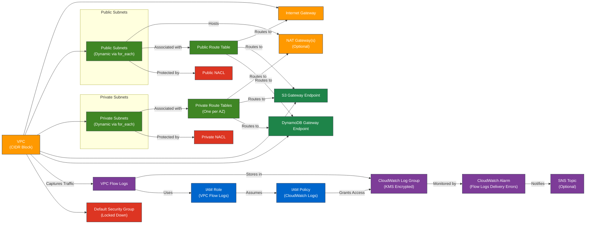

# AWS VPC Module for Terraform

---

## Table of Contents

- [1. Overview](#1-overview)
- [2. Prerequisites / Requirements](#2-prerequisites--requirements)
- [3. Architecture Diagram](#3-architecture-diagram)
- [4. Features](#4-features)
- [5. Module Architecture](#5-module-architecture)
- [6. Module Files Structure](#6-module-files-structure)
- [7. Inputs](#7-inputs)
- [8. Outputs](#8-outputs)
- [9. Example Usage](#9-example-usage)
- [10. Security Considerations / Recommendations](#10-security-considerations--recommendations)
- [11. Conditional Resource Creation](#11-conditional-resource-creation)
- [12. Best Practices](#12-best-practices)
- [13. Integration](#13-integration)
- [14. Future Improvements](#14-future-improvements)
- [15. Troubleshooting and Common Issues](#15-troubleshooting-and-common-issues)
- [16. Notes](#16-notes)
- [17. Useful Resources](#17-useful-resources)

---

## 1. Overview

This module creates and manages a Virtual Private Cloud (VPC) in AWS, including public and private subnets, route tables, an Internet Gateway, optional NAT Gateways, Network ACLs (NACLs), and VPC Flow Logs. It provides a secure, scalable, and configurable networking foundation for AWS infrastructure, built with modern Terraform practices.

---

## 2. Prerequisites / Requirements

- **AWS Provider Configuration**:
  - The AWS provider (`aws`) must be properly configured in the root module with region and credentials.

- **KMS Key for Flow Logs**:
  - An existing KMS key ARN is required for encrypting VPC Flow Logs.

---

## 3. Architecture Diagram



> _Diagram generated with [Mermaid](https://mermaid.js.org/)_

---

## 4. Features

- **VPC Creation**: Creates a VPC with a configurable CIDR block and DNS support.
- **Dynamic Subnet Management**: Configures any number of public and private subnets across multiple availability zones using a map-based variable.
- **Routing**:
    - Creates a single route table for all public subnets with a default route to an Internet Gateway.
    - Creates dedicated private route tables for each private subnet.
- **NAT Gateway**:
    - Optional support for NAT Gateways to provide outbound internet access for private subnets.
    - Supports both a single NAT Gateway for the VPC or a highly-available setup with a NAT Gateway in each Availability Zone.
- **Network ACLs (NACLs)**:
    - Configurable rules for controlling inbound and outbound traffic for public and private subnets.
    - Supports multiple CIDR blocks for SSH access rules.
- **VPC Flow Logs**:
    - Captures all traffic (ACCEPT/REJECT) and sends it to a KMS-encrypted CloudWatch Log Group.
    - Includes a CloudWatch Alarm to monitor for log delivery errors.
- **Gateway Endpoints**: Configurable S3 and DynamoDB endpoints for private access from all subnets.
- **Security**: Locks down the default security group by removing all default rules.

---

## 5. Module Architecture

This module provisions the following AWS resources:
- **VPC** with a customizable CIDR block.
- **Public and Private Subnets** created dynamically based on input variables.
- **Internet Gateway** for public internet access.
- **NAT Gateway(s)** and **Elastic IPs** (optional) for private outbound access.
- **Route Tables** for public and private routing logic.
- **Network ACLs (NACLs)** with detailed inbound/outbound rules.
- **VPC Gateway Endpoints** for S3 and DynamoDB.
- **VPC Flow Logs** with a CloudWatch Log Group and KMS encryption.
- **CloudWatch Alarm** for Flow Logs delivery errors.
- **IAM Role and Policy** for Flow Logs permissions.
- **Default Security Group** with all rules removed.

---

## 6. Module Files Structure

| **File**              | **Description**                                                                 |
|-----------------------|---------------------------------------------------------------------------------|
| `main.tf`             | Defines the VPC, subnets, and default security group.                           |
| `endpoints_routes.tf` | Configures route tables, IGW, NAT Gateways, and Gateway Endpoints.              |
| `nacl.tf`             | Creates and associates Network ACLs for public and private subnets.             |
| `flow_logs.tf`        | Configures VPC Flow Logs, related IAM roles, policies, and CloudWatch alarms.   |
| `variables.tf`        | Declares input variables for the module.                                        |
| `outputs.tf`          | Exposes key outputs for integration with other modules.                         |

---

## 7. Inputs

| **Name**                      | **Type**        | **Description**                                         |
|-------------------------------|-----------------|---------------------------------------------------------|
| `aws_region`                  | `string`        | AWS region for resource creation.                       |
| `aws_account_id`              | `string`        | AWS account ID for policy permissions.                  |
| `vpc_cidr_block`              | `string`        | The CIDR block for the VPC.                             |
| `name_prefix`                 | `string`        | Prefix for resource names.                              |
| `environment`                 | `string`        | Deployment environment (e.g., `dev`, `stage`, `prod`).  |
| `tags`                        | `map(string)`   | Tags to apply to all resources.                         |
| `enable_nat_gateway`          | `bool`          | Enable NAT Gateway for private subnets.                 |
| `single_nat_gateway`          | `bool`          | Use a single NAT Gateway for all AZs.                   |
| `public_subnets`              | `map(object)`   | Map of public subnets to create.                        |
| `private_subnets`             | `map(object)`   | Map of private subnets to create.                       |
| `kms_key_arn`                 | `string`        | KMS key ARN for Flow Log encryption.                    |
| `flow_logs_retention_in_days` | `number`        | Retention period for VPC Flow Logs.                     |
| `ssh_allowed_cidr`            | `list(string)`  | Allowed CIDR blocks for SSH access.                     |
| `sns_topic_arn`               | `string`        | SNS topic ARN for CloudWatch alarm notifications.       |

---

## 8. Outputs

| **Name**                       | **Description**                                                                  |
|--------------------------------|----------------------------------------------------------------------------------|
| `vpc_id`                       | The ID of the VPC.                                                               |
| `vpc_arn`                      | The ARN of the VPC.                                                              |
| `vpc_cidr_block`               | The CIDR block of the VPC.                                                       |
| `public_subnet_ids`            | List of IDs of public subnets.                                                   |
| `private_subnet_ids`           | List of IDs of private subnets.                                                  |
| `public_subnets_map`           | A map of public subnets with their details (id, cidr_block, availability_zone).  |
| `private_subnets_map`          | A map of private subnets with their details (id, cidr_block, availability_zone). |
| `nat_gateway_public_ips`       | List of public Elastic IP addresses assigned to the NAT Gateways.                |
| `public_route_table_id`        | ID of the public route table.                                                    |
| `private_route_table_ids`      | A map of private route table IDs, keyed by the private subnet key.               |
| `s3_endpoint_id`               | The ID of the S3 Gateway Endpoint.                                               |
| `dynamodb_endpoint_id`         | The ID of the DynamoDB VPC Endpoint.                                             |
| `default_security_group_id`    | The ID of the default security group for the VPC.                                |
| `vpc_flow_logs_log_group_name` | Name of the CloudWatch Log Group for VPC Flow Logs.                              |

---

## 9. Example Usage

```hcl
module "vpc" {
  source     = "./modules/vpc"
  aws_region = "eu-west-1"
  aws_account_id   = "123456789012"
  vpc_cidr_block   = "10.0.0.0/16"
  name_prefix      = "my-app"
  environment      = "dev"

  # Enable NAT Gateway for private subnets (HA setup)
  enable_nat_gateway = true
  single_nat_gateway = false

  public_subnets = {
    "1a" = {
      cidr_block        = "10.0.1.0/24"
      availability_zone = "eu-west-1a"
    },
    "1b" = {
      cidr_block        = "10.0.2.0/24"
      availability_zone = "eu-west-1b"
    },
    "1c" = {
      cidr_block        = "10.0.3.0/24"
      availability_zone = "eu-west-1c"
    }
  }

  private_subnets = {
    "1a" = {
      cidr_block        = "10.0.101.0/24"
      availability_zone = "eu-west-1a"
    },
    "1b" = {
      cidr_block        = "10.0.102.0/24"
      availability_zone = "eu-west-1b"
    },
    "1c" = {
      cidr_block        = "10.0.103.0/24"
      availability_zone = "eu-west-1c"
    }
  }

  # Security Configuration
  ssh_allowed_cidr = ["10.10.0.0/16"] # Restrict SSH access

  # Flow Logs Configuration
  kms_key_arn                 = module.kms.key_arn
  flow_logs_retention_in_days = 30
  sns_topic_arn               = aws_sns_topic.default.arn
}
```
---

## 10. Security Considerations / Recommendations

1. **Network ACLs (NACLs)**:
   - Rules are stateless; you must define rules for both inbound and outbound traffic.
   - The private NACL allows outbound HTTPS to `0.0.0.0/0` to enable the NAT Gateway functionality.
   - Restrict the `ssh_allowed_cidr` variable in production environments.

2. **Flow Logs Security**:
   - KMS encryption is enforced for all log data.
   - IAM roles follow the principle of least privilege.
   - A CloudWatch alarm monitors for and alerts on log delivery failures.

3. **NAT Gateways**:
   - For production, use the highly-available setup (`single_nat_gateway = false`) to avoid a single point of failure.
   - Be aware that NAT Gateways incur costs (per hour and per GB processed).

4. **Default Security Group**: The module locks down the default SG by removing all rules, forcing the explicit use of custom security groups for all resources.

---

## 11. Conditional Resource Creation

- **NAT Gateways**: `aws_eip` and `aws_nat_gateway` resources are created only if `enable_nat_gateway` is set to `true`.
- **CloudWatch Alarms for Flow Logs**: Created only if `sns_topic_arn` is provided.

---

## 12. Best Practices

1. **High Availability**: For production workloads, create subnets in multiple Availability Zones and set `single_nat_gateway = false` for resilient outbound connectivity.
2. **Security**: Regularly review NACL rules and restrict `ssh_allowed_cidr` to known IP ranges. Monitor VPC Flow Logs for suspicious activity.
3. **Scalability**: Use a logical naming convention for your subnet maps (e.g., "1a", "1b") to keep routing and associations clear.

---

## 13. Integration

This VPC module is designed to integrate with:
- **ALB Module** — for public access to application load balancers.
- **ASG Module** — for EC2 auto-scaling groups deployed in the subnets.
- **RDS Module** — for database instances located in private subnets.
- **ElastiCache Module** — for in-memory caching layers inside private subnets.

---

## 14. Future Improvements

- Implement **Transit Gateway integration** for multi-VPC architecture.
- Add **custom DHCP options set** support.
- Extend VPC Flow Logs with **Athena query support** for deeper analysis.
- Provide **IPv6 support** for modern workloads.

---

## 15. Troubleshooting and Common Issues

This section outlines common issues and provides AWS CLI commands to help diagnose them.

### 1. No Internet Access in Public Subnets
**Cause:** Missing or incorrect route to the Internet Gateway (IGW).
**Solution:** Verify the public route table has a route for `0.0.0.0/0` pointing to the IGW ID.
```bash
aws ec2 describe-route-tables --filters Name=tag:Name,Values=<name_prefix>-public-rt-<environment>
```

### 2. No Outbound Internet from Private Subnets
**Cause:** NAT Gateway is disabled, or routing is incorrect.
**Solution:**
- Ensure `enable_nat_gateway = true`.
- Check that the private route table for the specific AZ has a `0.0.0.0/0` route pointing to the correct NAT Gateway ID.
- Verify the private NACL allows outbound HTTPS traffic.
```bash
aws ec2 describe-route-tables --filters Name=tag:Name,Values=<name_prefix>-private-rt-<subnet_key>-<environment>
```

### 3. SSH Access Fails
**Cause:** Incorrect Security Group or NACL configuration.
**Solution:** Check the public NACL rules for an allow rule from your IP on port 22.
```bash
aws ec2 describe-network-acls --filters Name=tag:Name,Values=<name_prefix>-public-nacl-<environment>
```

### 4. Flow Logs Delivery Errors
**Cause:** IAM Role or KMS key policy permissions are incorrect.
**Solution:**
- Verify the IAM role policy allows `logs:PutLogEvents`.
- Ensure the KMS key policy allows the `vpc-flow-logs.amazonaws.com` service principal.
- Check the CloudWatch Alarm status for `FlowLogsDeliveryErrors`.

### 8. AWS CLI Reference
```bash
# List VPCs
aws ec2 describe-vpcs --filters Name=tag:Name,Values=<name_prefix>-vpc-<environment>

# List Subnets in a VPC
aws ec2 describe-subnets --filters Name=vpc-id,Values=<vpc-id>

# Describe NAT Gateways
aws ec2 describe-nat-gateways --filter Name=vpc-id,Values=<vpc-id>

# Describe NACLs
aws ec2 describe-network-acls --filters Name=vpc-id,Values=<vpc-id>

# Describe VPC Endpoints
aws ec2 describe-vpc-endpoints --filters Name=vpc-id,Values=<vpc-id>

# Tail logs in real time
aws logs tail /aws/vpc/flow-logs/<env> --follow
```
> Replace `<vpc-id>`, `<name_prefix>`, `<environment>`, etc., with actual values.

---

## 16. Notes
- All subnets and routing are now created dynamically. Ensure your `public_subnets` and `private_subnets` variable maps are structured correctly.
- For High Availability, ensure you have subnets in multiple AZs and set `single_nat_gateway = false`.
- NACL rule numbers are hardcoded and spaced to allow for future additions.

---

## 17. Useful Resources

- [AWS VPC Documentation](https://docs.aws.amazon.com/vpc/latest/userguide/what-is-amazon-vpc.html)
- [Terraform AWS VPC Module](https://registry.terraform.io/modules/terraform-aws-modules/vpc/aws/latest)
- [AWS NAT Gateways](https://docs.aws.amazon.com/vpc/latest/userguide/vpc-nat-gateway.html)
- [VPC Flow Logs Documentation](https://docs.aws.amazon.com/vpc/latest/userguide/flow-logs.html)
- [AWS Security Best Practices](https://docs.aws.amazon.com/vpc/latest/userguide/vpc-security-best-practices.html)

---
