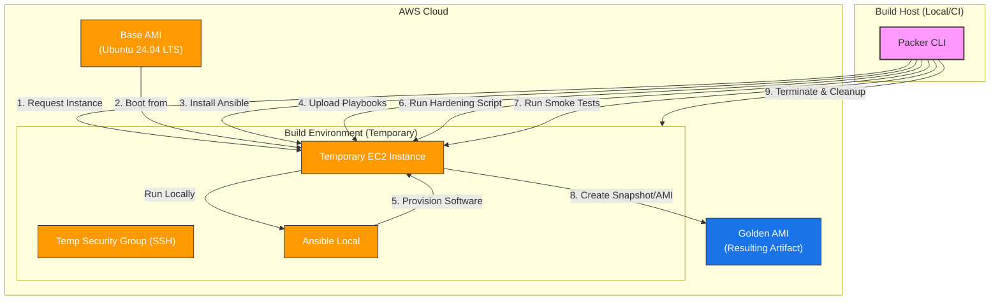

# AWS WordPress Golden AMI (Packer)

---

## Table of Contents

- [1. Overview](#1-overview)
- [2. Prerequisites / Requirements](#2-prerequisites--requirements)
- [3. Architecture Diagram](#3-architecture-diagram)
- [4. Features](#4-features)
- [5. Build Process Architecture](#5-build-process-architecture)
- [6. Configuration Files Structure](#6-configuration-files-structure)
- [7. Variables (Inputs)](#7-variables-inputs)
- [8. Artifacts (Outputs)](#8-artifacts-outputs)
- [9. Example Usage (Commands)](#9-example-usage-commands)
- [10. Security Considerations / Recommendations](#10-security-considerations--recommendations)
- [11. Best Practices](#11-best-practices)
- [12. Integration with Terraform](#12-integration-with-terraform)
- [13. Troubleshooting and Common Issues](#13-troubleshooting-and-common-issues)
- [14. Notes](#14-notes)
- [15. Useful Resources](#15-useful-resources)

---

## 1. Overview

This directory contains the [HashiCorp Packer](https://www.packer.io/) configuration used to build the **Golden AMI** for the WordPress application. It implements the **Immutable Infrastructure** pattern, ensuring that all servers in the Auto Scaling Group are launched from a pre-configured, tested, and secure image.

---

## 2. Prerequisites / Requirements

- **Packer** (v1.9.0 or later) installed locally.
- **AWS CLI** configured with appropriate permissions to create EC2 instances, security groups, and AMIs.
- Existing **Ansible Playbooks** located in `../ansible/playbooks/`.

---

## 3. Architecture Diagram



> _Diagram generated with [Mermaid](https://mermaid.js.org/)_

---

## 4. Features
- **Automated AMI Creation:** Eliminates manual configuration errors.
- **Ansible Local Integration:** Installs Ansible on the builder to run the exact same playbooks used in development.
- **Ubuntu 24.04 LTS:** Uses the latest Long Term Support release for stability and security.
- **Security Hardening:** Includes a dedicated script (`prepare-golden-ami.sh`) to secure SSH, firewall (UFW), and remove logs.
- **Automated Verification:** Runs `smoke-test-ami.sh` to verify firewall status, service health, and cleanup before finalizing the image.
- **Immutable Artifact:** Ensures that what you test is exactly what you deploy.

---

## 5. Build Process Architecture

The build process follows these logical steps:
1.  **Initialize:** Downloads required plugins (Amazon EBS, Ansible).
2.  **Source:** Launches a temporary `t3.micro` instance (Ubuntu 24.04) in the specified region.
3.  **Bootstrap:**
    *   Waits for `cloud-init`.
    *   Installs Ansible and required dependencies on the instance.
4.  **Provision:**
    *   Uploads the `install-wordpress.yml` playbook.
    *   Runs the playbook locally (`ansible-local`) with mocked variables and skipped tags (skips DB/S3 connections).
5.  **Harden:**
    *   Runs `scripts/prepare-golden-ami.sh` to configure UFW, disable SSH root login, and clean up logs.
6.  **Verify:**
    *   Runs `scripts/smoke-test-ami.sh` to validate the instance state (ports, services, security).
7.  **Artifact:** Stops the instance, creates an AMI, and tags it with versioning information.
8.  **Cleanup:** Terminates the temporary EC2 instance and deletes the temporary security group.

---

## 6. Configuration Files Structure

| **File**             | **Description**                                                           |
|----------------------|---------------------------------------------------------------------------|
| `wordpress.pkr.hcl`  | Main template defining sources, variables, and build steps.               |
| `README.md`          | Documentation for the Packer build process.                               |

---

## 7. Variables (Inputs)

| Name                | Type     | Description                                | Default         |
|---------------------|----------|--------------------------------------------|-----------------|
| `aws_region`        | `string` | AWS region where the AMI will be built     | `eu-west-1`     |
| `instance_type`     | `string` | EC2 instance type for the build process    | `t3.micro`      |
| `wordpress_version` | `string` | Version of WordPress to install            | `v6.8.2`        |
| `php_version`       | `string` | PHP version to install                     | `8.3`           |
| `project`           | `string` | Project tag value                          | `AWS`           |
| `owner`             | `string` | Owner tag value                            | `Hetmanskyi`    |
| `application`       | `string` | Application tag value                      | `wordpress`     |
| `component`         | `string` | Component tag value                        | `asg`           |
| `ami_golden_tag`    | `string` | Environment tag value for the Golden AMI   | `golden`        |

---

## 8. Artifacts (Outputs)

| **Artifact**    | **Description**                                                   |
|-----------------|-------------------------------------------------------------------|
| `AMI ID`        | The unique ID of the created Golden AMI (e.g., `ami-0xyz...`).    |
| `AMI Name`      | Name following the pattern `wordpress-golden-ami-YYYYMMDDHHMMSS`. |

---

## 9. Example Usage (Commands)

### Initialize and Build

```bash
# Initialize Packer plugins
packer init .

# Validate the configuration
packer validate .

# Build the Golden AMI
packer build .
```

### Passing Custom Variables

```bash
packer build -var="wordpress_version=v6.8.3" -var="owner=MyTeam" .
```

---

## 10. Security Considerations / Recommendations
- **Least Privilege:** Ensure the IAM user running Packer has only the necessary permissions (EC2, AMI, Tagging).
- **SSH Access:** Packer creates a temporary key pair. Ensure your local machine can connect to the temporary instance via port 22.
- **Cleanup:** The hardening script removes keys and bash history.
- **SSM Alternative:** For higher security, consider switching `ssh_interface` to `session_manager` to avoid opening port 22 entirely.

---

## 11. Best Practices
- **Reuse Playbooks:** We use `ansible/playbooks/install-wordpress.yml` with `skip-tags` to reuse the same logic as the Dev environment.
- **Versioning:** Use the timestamp in the AMI name to track build history.
- **Base Image:** Always use the `most_recent = true` filter for the base AMI to include latest security patches.

---

## 12. Integration with Terraform

Once the build is complete, Packer will display the new AMI ID. Update your environment configuration:

**File:** `terraform/environments/stage/terraform.tfvars`

```hcl
ami_id = "ami-0123456789abcdef0" # Replace with your new AMI ID
```

Run `terraform apply` to update the Launch Template and trigger an Instance Refresh.

---

## 13. Troubleshooting and Common Issues

### 1. Failed to connect via SSH
- **Cause:** Security group rules or network routing (missing Public IP).
- **Solution:** Ensure your subnet has `map_public_ip_on_launch = true` or use a VPC with an Internet Gateway. Default user is `ubuntu`.

### 2. Ansible Playbook fails
- **Cause:** Missing dependencies on the instance or incorrect variable mocking.
- **Solution:** Check the Packer logs. Ensure `php_version` matches the Ubuntu repository availability.

### 3. Build instance stays running on failure
- **Cause:** Packer process interrupted.
- **Solution:** Manually terminate the instance in the AWS Console to avoid costs.

---

## 14. Notes

- The build process reuses `../ansible/playbooks/install-wordpress.yml`.
- Placeholders like `db_host=localhost` are used during the build phase because the database is not required during the "baking" process.
- The resulting AMI is optimized for the `eu-west-1` region by default.

---

## 15. Useful Resources

- [Packer Documentation](https://developer.hashicorp.com/packer/docs)
- [Packer Amazon EBS Builder](https://developer.hashicorp.com/packer/plugins/builders/amazon/ebs)
- [Packer Ansible Provisioner](https://developer.hashicorp.com/packer/plugins/provisioners/ansible)
- [Ubuntu Cloud Images](https://cloud-images.ubuntu.com/locator/ec2/)
- [Immutable Infrastructure Overview](https://www.hashicorp.com/resources/what-is-immutable-infrastructure)
