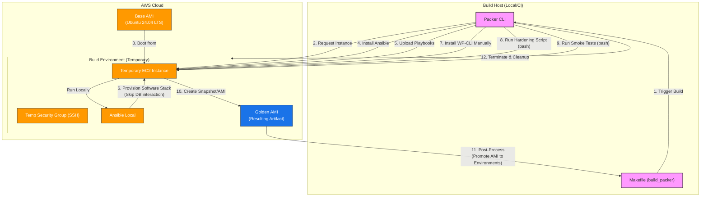

# AWS WordPress Golden AMI (Packer)

---

## Table of Contents

- [1. Overview](#1-overview)
- [2. Prerequisites / Requirements](#2-prerequisites--requirements)
- [3. Architecture Diagram](#3-architecture-diagram)
- [4. Features](#4-features)
- [5. Build Process Architecture](#5-build-process-architecture)
- [6. Configuration Files Structure](#6-configuration-files-structure)
- [7. Variables (Inputs)](#7-variables-inputs)
- [8. Artifacts (Outputs)](#8-artifacts-outputs)
- [9. Example Usage (Commands)](#9-example-usage-commands)
- [10. Security Considerations / Recommendations](#10-security-considerations--recommendations)
- [11. Best Practices](#11-best-practices)
- [12. Integration with Terraform](#12-integration-with-terraform)
- [13. Troubleshooting and Common Issues](#13-troubleshooting-and-common-issues)
- [14. Notes](#14-notes)
- [15. Useful Resources](#15-useful-resources)

---

## 1. Overview

This directory contains the [HashiCorp Packer](https://www.packer.io/) configuration used to build the **Golden AMI** for the WordPress application. It implements the **Immutable Infrastructure** pattern, ensuring that all servers in the Auto Scaling Group are launched from a pre-configured, tested, and secure image.

---

## 2. Prerequisites / Requirements

- **Packer** (v1.10.0 or later) installed locally.
- **AWS CLI** configured with appropriate permissions to create EC2 instances and AMIs.
- Existing **Ansible Playbooks** located in `../ansible/playbooks/`.
- **Make** utility for automated workflows.

---

## 3. Architecture Diagram



---

## 4. Features
- **Automated Promotion:** Automatically updates `terraform.tfvars` in `dev` and `stage` environments via `make use-ami`.
- **Full Build Logging:** Integrates with `Makefile` to save full console output to `ami_history/logs/`.
- **Ansible Decoupling:** Reuses production playbooks while skipping database-dependent tasks during the baking phase.
- **Enhanced Security:** Explicitly uses `bash` for hardening and smoke-test scripts to ensure `pipefail` and other safety features work correctly.
- **WP-CLI Inclusion:** Ensures the `wp` command is available in the AMI by installing it manually after the PHP stack is ready.

---

## 5. Build Process Architecture

The build process follows these logical steps:
1.  **Initialize:** Packer downloads plugins and validates the `wordpress.pkr.hcl` template.
2.  **Bootstrap:** Launches an EC2 instance and installs Ansible, Python, and required AWS collections.
3.  **Software Provisioning:**
    *   Runs Ansible `install-wordpress.yml` skipping `wp-cli` and `plugins` tags to avoid DB errors.
    *   Manually installs `wp-cli` binary after Ansible ensures PHP is present.
4.  **Hardening:** Executes `prepare-golden-ami.sh` using `sudo bash` to secure the OS and cleanup temporary data.
5.  **Verification:** Runs `smoke-test-ami.sh` to validate the image before finalization.
6.  **Imaging:** Stops the instance, creates an AMI with standardized tags, and logs the ID.
7.  **Promotion:** Triggers `make use-ami` to update environment configurations automatically.

---

## 6. Configuration Files Structure

| **File**             | **Description**                                                           |
|----------------------|---------------------------------------------------------------------------|
| `wordpress.pkr.hcl`  | Main template defining sources, variables, and build steps.               |
| `README.md`          | Documentation for the Packer build process.                               |

---

## 7. Variables (Inputs)

| Name                | Type     | Description                                | Default         |
|---------------------|----------|--------------------------------------------|-----------------|
| `aws_region`        | `string` | AWS region where the AMI will be built     | `eu-west-1`     |
| `instance_type`     | `string` | EC2 instance type for the build process    | `t3.micro`      |
| `wordpress_version` | `string` | Version of WordPress to install            | `v6.8.2`        |
| `php_version`       | `string` | PHP version to install                     | `8.3`           |
| `build_timestamp`   | `string` | Optional timestamp passed from Makefile    | `""`            |
| `ami_golden_tag`    | `string` | Environment tag value for the Golden AMI   | `golden`        |

---

## 8. Artifacts (Outputs)

| **Artifact**    | **Description**                                                   |
|-----------------|-------------------------------------------------------------------|
| `AMI ID`        | The unique ID of the created Golden AMI.                          |
| `History Log`   | Full build output saved in `environments/dev/ami_history/logs/`.  |
| `tfvars`        | Updated `ami_id` variable in `dev` and `stage` environments.      |

---

## 9. Example Usage (Commands)

The preferred way to run Packer is through the project's root `Makefile`:

```bash
# Initialize and Validate
make all_packer

# Full Build, Test, and Auto-Promotion
make build_packer
```

Manual execution:
```bash
packer init .
packer build -var "build_timestamp=$(date +%Y%m%d%H%M%S)" .
```

---

## 10. Security Considerations / Recommendations
- **IAM Permissions:** Ensure the builder has `ec2:CreateImage`, `ec2:TerminateInstances`, and `ec2:CreateTags` permissions.
- **Script Execution:** Scripts are run with `sudo bash` to ensure consistent behavior across different shell environments.
- **Cleanup:** All build-time secrets and history are purged by the hardening script before imaging.

---

## 11. Best Practices
- **Idempotency:** The Ansible tasks are designed to be idempotent, allowing for reliable AMI rebuilds.
- **Logging:** Always check `ami_history/logs/` if a build fails to understand where it stopped.
- **Version Parity:** Ensure `php_version` in Packer matches the version expected by the Terraform environment.

---

## 12. Integration with Terraform

The Packer template is integrated with the Terraform workflow via the `post-processor`. Upon completion, it automatically:
1. Appends the new AMI ID to `ami_id.txt`.
2. Updates `environments/dev/terraform.tfvars`.
3. Updates `environments/stage/terraform.tfvars`.

This allows for a seamless `make build_packer && make apply ENV=stage` workflow.

---

## 13. Troubleshooting and Common Issues

### 1. Illegal option -o pipefail
- **Cause:** The shell provisioner attempted to run a script using `/bin/sh` (dash).
- **Solution:** Always use `execute_command = "... sudo bash {{ .Path }}"` in the Packer template.

### 2. WP-CLI: php command not found
- **Cause:** WP-CLI was installed before the PHP stack.
- **Solution:** WP-CLI installation is placed after the Ansible provisioner in the build sequence.

### 3. Post-processor failed
- **Cause:** The build process was interrupted before finalization.
- **Solution:** Check if the AMI was created in AWS and manually run `make use-ami` to update the configuration.

---

## 14. Notes

- **Shebangs:** Scripts in `terraform/scripts/` intentionally lack shebangs to maintain compatibility with legacy SSM execution methods (though SSM supports shebangs, this ensures broader compatibility). They MUST be called with an explicit interpreter (e.g., `bash`).
- **DB Mocking:** Mock database credentials (`build/build`) are used during AMI creation. WordPress is fully initialized only when the final instance boots using User Data.
- **Post-Processor:** If the build is interrupted, the post-processor might not run. In this case, manually update `ami_id.txt` and `terraform.tfvars`.

---

## 15. Useful Resources

- [Packer Documentation](https://developer.hashicorp.com/packer/docs)
- [Packer Amazon EBS Builder](https://developer.hashicorp.com/packer/plugins/builders/amazon/ebs)
- [Packer Ansible Provisioner](https://developer.hashicorp.com/packer/plugins/provisioners/ansible)
- [Ubuntu Cloud Images](https://cloud-images.ubuntu.com/locator/ec2/)
- [Immutable Infrastructure Overview](https://www.hashicorp.com/resources/what-is-immutable-infrastructure)
