# AWS WordPress Deployment Scripts

---

## 1. Overview

This directory contains scripts used for deploying, configuring, and monitoring WordPress installations on AWS infrastructure. These scripts are designed to work with the Terraform modules in this project and provide automation for WordPress deployment, health checks, and AWS resource validation.

---

## 2. Prerequisites / Requirements

- **AWS CLI**:
  - Scripts require AWS CLI v2 installed and configured with appropriate permissions.
  - IAM permissions for accessing AWS Secrets Manager, EC2 metadata, and other AWS services.

- **Runtime Environment**:
  - Scripts are designed to run on Amazon Linux 2 or Ubuntu-based EC2 instances.
  - Bash shell is required for script execution.

- **Dependencies**:
  - `deploy_wordpress.sh` requires internet access to download packages.
  - `check_aws_resources.sh` requires appropriate IAM permissions to describe AWS resources.
  - PHP must be available for the healthcheck files.

---

## 3. Architecture Diagram

```mermaid
graph TD
    %% Main Components
    A["EC2 Instance"] --> B["Scripts"]
    
    %% Script Components
    subgraph "Deployment Scripts"
        Deploy["deploy_wordpress.sh"]
        HealthCheck1["healthcheck-1.0.php"]
        HealthCheck2["healthcheck-2.0.php"]
    end
    
    subgraph "Monitoring Scripts"
        ServerStatus["check_server_status.sh"]
        AWSResources["check_aws_resources.sh"]
    end
    
    B --> Deploy
    B --> ServerStatus
    B --> AWSResources
    
    %% External AWS Services
    RDS["RDS MySQL"]
    Redis["ElastiCache Redis"]
    ALB["Application Load Balancer"]
    SecretsManager["AWS Secrets Manager"]
    
    %% Deployment Flow
    Deploy -->|"Installs"| Nginx["Nginx Web Server"]
    Deploy -->|"Installs"| PHP["PHP-FPM"]
    Deploy -->|"Installs"| WP["WordPress"]
    Deploy -->|"Retrieves Secrets"| SecretsManager
    Deploy -->|"Connects to"| RDS
    Deploy -->|"Configures Caching"| Redis
    Deploy -->|"Sets Site URL"| ALB
    Deploy -->|"Deploys"| HealthCheck1
    Deploy -->|"Deploys"| HealthCheck2
    
    %% Monitoring Flows
    ServerStatus -->|"Checks"| Nginx
    ServerStatus -->|"Checks"| PHP
    ServerStatus -->|"Checks"| WP
    ServerStatus -->|"Validates Connection"| RDS
    ServerStatus -->|"Validates Connection"| Redis
    ServerStatus -->|"Validates"| ALB
    
    AWSResources -->|"Validates"| VPC["VPC Resources"]
    AWSResources -->|"Validates"| EC2["EC2 Resources"]
    AWSResources -->|"Validates"| RDS
    AWSResources -->|"Validates"| ALB
    
    %% Styling
    classDef primary fill:#FF9900,stroke:#232F3E,color:white
    classDef database fill:#3B48CC,stroke:#232F3E,color:white
    classDef cache fill:#C7622B,stroke:#232F3E,color:white
    classDef web fill:#1E8449,stroke:#232F3E,color:white
    classDef security fill:#DD3522,stroke:#232F3E,color:white
    classDef monitoring fill:#7D3C98,stroke:#232F3E,color:white
    
    class A,B primary
    class RDS database
    class Redis cache
    class Nginx,PHP,WP,ALB,HealthCheck1,HealthCheck2 web
    class SecretsManager security
    class ServerStatus,AWSResources,VPC,EC2 monitoring
    class Deploy primary
```


---

## 4. Features

- Automated WordPress deployment with Nginx and PHP-FPM
- Secure retrieval of secrets from AWS Secrets Manager
- Health checks for WordPress, database, Redis, and services
- Validation of AWS infrastructure resources
- Logging and error handling for troubleshooting
- Support for dynamic health check versions (1.0 / 2.0)

---

## 5. Scripts Structure

| Script                   | Description                                                                                 |
|--------------------------|---------------------------------------------------------------------------------------------|
| `deploy_wordpress.sh`    | Installs and configures WordPress on an EC2 instance integrated with RDS and ElastiCache.   |
| `check_server_status.sh` | Performs comprehensive health checks on an EC2 instance running WordPress.                  |
| `check_aws_resources.sh` | Checks AWS resources (VPC, EC2, RDS, etc.) to identify undeleted or orphaned resources.     |
| `healthcheck-1.0.php`    | Simple PHP health check for ALB, returns HTTP 200.                                          |
| `healthcheck-2.0.php`    | Advanced health check verifying PHP, MySQL, Redis, and WordPress REST API.                  |

---

## 6. Script Details

### 6.1 deploy_wordpress.sh

This script automates the installation and configuration of WordPress on an EC2 instance. It handles the installation of required packages, configuration of Nginx and PHP-FPM, WordPress setup, and integration with AWS services.

#### Required Parameters

| Parameter                | Description                                            | Required | Default             |
|--------------------------|--------------------------------------------------------|----------|---------------------|
| `DB_HOST`                | RDS endpoint for MySQL database                        | Yes      | -                   |
| `DB_PORT`                | MySQL port (typically 3306)                            | Yes      | 3306                |
| `SECRET_ARN`             | AWS Secrets Manager ARN containing credentials         | Yes      | -                   |
| `PHP_VERSION`            | PHP version to install (e.g., "8.3")                   | Yes      | 8.3                 |
| `REDIS_HOST`             | ElastiCache Redis endpoint                             | Yes      | -                   |
| `REDIS_PORT`             | Redis port (typically 6379)                            | Yes      | 6379                |
| `AWS_LB_DNS`             | DNS name of the ALB for WordPress site URL             | Yes      | -                   |
| `WP_TITLE`               | Title for the WordPress site                           | Yes      | -                   |
| `HEALTHCHECK_CONTENT_B64`| Base64-encoded content for healthcheck.php             | No       | Simple 200 response |

#### Secrets Retrieved from AWS Secrets Manager

The script retrieves the following secrets from AWS Secrets Manager:
- `db_name`: Database name
- `db_username`: Database username
- `db_password`: Database password
- `admin_user`: WordPress admin username
- `admin_email`: WordPress admin email
- `admin_password`: WordPress admin password

### 6.2 `check_server_status.sh`

This script performs comprehensive health checks on an EC2 instance running WordPress. It validates the instance configuration, service status, and connectivity to external AWS services.

#### Checks Performed

- Instance metadata (ID, type, availability zone, public IP)
- Resource usage (CPU, memory, disk)
- Service status (Nginx, PHP-FPM)
- Database connectivity (RDS MySQL)
- Cache connectivity (ElastiCache Redis)
- Load balancer health (ALB)
- WordPress installation health
- Configuration syntax validation

### 6.3 `check_aws_resources.sh`

This script validates AWS resources provisioned by Terraform to identify any undeleted or orphaned resources. It helps maintain a clean AWS environment and prevent unnecessary costs.

#### Resources Checked

- VPC resources (subnets, route tables, internet gateways)
- EC2 resources (instances, security groups, EBS volumes)
- Load balancer resources (ALB, target groups, listeners)
- Database resources (RDS instances, parameter groups)
- Cache resources (ElastiCache clusters)
- Monitoring resources (CloudWatch alarms, logs)

### 6.4 `healthcheck-1.0.php` and `healthcheck-2.0.php`

These PHP files provide health check endpoints for the Application Load Balancer:
- `healthcheck-1.0.php`: Simple health check that returns HTTP 200
- `healthcheck-2.0.php`: Advanced health check that validates PHP, MySQL, Redis, and WordPress REST API connectivity

---

## 7. Example Usage

The scripts are primarily used by the Terraform modules in this project, but can also be executed manually for troubleshooting or custom deployments.

### Example: Manual WordPress Deployment

```bash
# Set required environment variables
export DB_HOST=mydb.cluster-abc123.us-west-2.rds.amazonaws.com
export DB_PORT=3306
export SECRET_ARN=arn:aws:secretsmanager:us-west-2:123456789012:secret:wordpress-secrets
export PHP_VERSION=8.3
export REDIS_HOST=myredis.abc123.ng.0001.usw2.cache.amazonaws.com
export REDIS_PORT=6379
export AWS_LB_DNS=my-alb-1234567890.us-west-2.elb.amazonaws.com
export WP_TITLE="My WordPress Site"

# Run the deployment script
./deploy_wordpress.sh
```

### Example: Server Health Check

```bash
./check_server_status.sh
```

---

## 8. Security Considerations / Recommendations

- **Secrets Management**: Credentials are retrieved securely from AWS Secrets Manager.
- **File Permissions**: Scripts set appropriate file permissions to restrict access.
- **Secure Connections**: Database and Redis connections use TLS where available.
- **Principle of Least Privilege**: Scripts follow the principle of least privilege.

---

## 9. Conditional Resource Creation

- WordPress health check script version is selected based on the healthcheck_version variable
- The deployment script can be fetched from S3 or embedded, based on the enable_s3_script flag
- PHP health check verifies connection to RDS and Redis only if endpoints are provided
- AWS resource checks run conditionally based on environment and resource existence

## 10. Best Practices

- **Error Handling**: Scripts include comprehensive error handling and logging.
- **Idempotency**: Scripts are designed to be idempotent and can be run multiple times.
- **Logging**: All operations are logged for troubleshooting and auditing.
- **Parameter Validation**: Input parameters are validated before use.
- **Secure Default Values**: Default values are secure and follow best practices.

---

## 11. Integration

This script package integrates with the following modules and AWS services:

- ASG Module – provides EC2 instances for running scripts
- RDS Module – supplies database connection for WordPress
- ElastiCache Module – integrates Redis caching
- ALB Module – routes health check requests
- Secrets Manager – securely stores and retrieves sensitive credentials
- S3 Module – optional source for deployment scripts
- CloudWatch – logs script operations and health status

---

## 12. Future Improvements

- Add SSM Parameter Store support as an alternative for some environment variables
- Extend monitoring scripts with CloudWatch metrics validation
- Implement automatic error reporting to SNS
- Add support for multi-region resource validation
- Enhance Redis and MySQL TLS checks with certificate validation

---

## 13. Troubleshooting and Common Issues

- **Deployment Failures**: Check `/var/log/wordpress_install.log` for detailed error messages.
- **Health Check Failures**: Run `check_server_status.sh` to identify specific issues.
- **AWS Resource Issues**: Run `check_aws_resources.sh` to validate AWS resources.
- **PHP Errors**: Check Nginx and PHP-FPM error logs in `/var/log/nginx/` and `/var/log/php-fpm/`.

---

## 14. Notes

- Scripts are designed to work with the specific Terraform modules in this project.
- Modifications may be required for different environments or configurations.
- Regular updates to scripts are recommended to maintain compatibility with AWS services.

---

## 15. Useful Resources

- [WordPress CLI Documentation](https://developer.wordpress.org/cli/commands/)
- [AWS CLI Documentation](https://awscli.amazonaws.com/v2/documentation/api/latest/index.html)
- [Nginx Documentation](https://nginx.org/en/docs/)
- [PHP-FPM Configuration](https://www.php.net/manual/en/install.fpm.configuration.php)

---