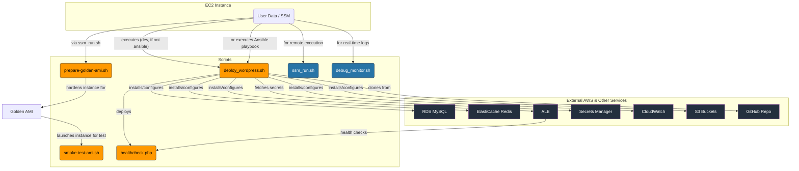

# AWS WordPress Deployment Scripts

---

## Table of Contents

1. [Overview](#1-overview)
2. [Prerequisites / Requirements](#2-prerequisites--requirements)
3. [Architecture Diagram](#3-architecture-diagram)
4. [Features](#4-features)
5. [Scripts Structure](#5-scripts-structure)
6. [Script Details](#6-script-details)
   - [6.1 deploy_wordpress.sh](#61-deploy_wordpresssh)
   - [6.2 check_aws_resources.sh](#62-check_aws_resourcessh)
   - [6.3 debug_monitor.sh](#63-debug_monitorsh)
   - [6.4 fix_php_encoding.sh](#64-fix_php_encodingsh)
   - [6.5 healthcheck.php](#65-healthcheckphp)
   - [6.6 WordPress Source Repository](#66-wordpress-source-repository)
   - [6.7 prepare-golden-ami.sh](#67-prepare-golden-amish)
   - [6.8 smoke-test-ami.sh](#68-smoke-test-amish)
   - [6.9 ssm_run.sh](#69-ssm_runsh)
   - [6.10 update_wordpress.sh](#610-update_wordpresssh)
   - [6.11 get_vpn_ips.sh](#611-get_vpn_ipssh)
   - [6.12 build_layer.sh](#612-build_layersh)
7. [Example Usage](#7-example-usage)
8. [Security Considerations / Recommendations](#8-security-considerations--recommendations)
9. [Conditional Resource Creation](#9-conditional-resource-creation)
10. [Best Practices](#10-best-practices)
11. [Integration](#11-integration)
12. [Future Improvements](#12-future-improvements)
13. [Troubleshooting and Common Issues](#13-troubleshooting-and-common-issues)
14. [Notes](#14-notes)
15. [Useful Resources](#15-useful-resources)

---

## 1. Overview

This directory contains scripts used for deploying, configuring, and monitoring WordPress installations on AWS infrastructure. These scripts are designed to work with the Terraform modules in this project and provide automation for WordPress deployment, health checks, and AWS resource validation.

---

## 2. Prerequisites / Requirements

- **AWS CLI**:
  - Scripts require AWS CLI v2 installed and configured with appropriate permissions.
  - IAM permissions for accessing AWS Secrets Manager, EC2 metadata, and other AWS services.

- **Runtime Environment**:
  - Scripts are designed to run on Amazon Linux 2 or Ubuntu-based EC2 instances.
  - Bash shell is required for script execution.

- **Dependencies**:
  - `deploy_wordpress.sh` requires internet access to download packages.
  - `check_aws_resources.sh` requires appropriate IAM permissions to describe AWS resources.
  - PHP must be available for the healthcheck file.

---

## 3. Architecture Diagram



> _Diagram generated with [Mermaid](https://mermaid.js.org/)_

---

## 4. Features

- Automated WordPress deployment with Nginx and PHP-FPM
- Secure retrieval of secrets from AWS Secrets Manager
- Health checks for WordPress, database, Redis, and services
- Validation of AWS infrastructure resources
- Logging and error handling for troubleshooting
- Redis authentication support via AWS Secrets Manager
- Real-time log monitoring via AWS SSM
- PHP file encoding validation and correction

---

## 5. Scripts Structure

| Script                     | Category      | Description                                                                                                |
|----------------------------|---------------|------------------------------------------------------------------------------------------------------------|
| `deploy_wordpress.sh`      | Deployment    | **(Core)** Installs the full WordPress stack (Nginx, PHP, etc.) on a bare instance. Runs on boot in `dev`. |
| `prepare-golden-ami.sh`    | Deployment    | **(Core)** Hardens a base instance (updates, firewall, SSH) to prepare it for AMI creation.                |
| `smoke-test-ami.sh`        | Deployment    | **(Core)** Verifies that a Golden AMI candidate was hardened and configured correctly.                     |
| `healthcheck.php`          | Deployment    | **(Core)** ALB health check. Verifies PHP, DB, Redis, and WordPress REST API are functional.               |
| `debug_monitor.sh`         | Debugging     | Connects to an EC2 instance via SSM to stream deployment logs in real-time.                                |
| `ssm_run.sh`               | Operations    | Synchronously executes a command on an instance via SSM Run Command and returns the result.                |
| `check_aws_resources.sh`   | Verification  | Scans an AWS account for resources matching a project name to verify cleanup after `terraform destroy`.    |
| `update_wordpress.sh`      | SCM           | Updates the WordPress core/plugins in the source Git repository, commits, and creates a version tag.       |
| `get_vpn_ips.sh`           | Data Source   | Terraform `external` data source that fetches the public IPs of a Client VPN endpoint.                     |
| `build_layer.sh`           | Utility       | Builds an AWS Lambda Layer `.zip` file containing Python dependencies using Docker.                        |
| `fix_php_encoding.sh`      | Utility       | Scans and fixes PHP files to be UTF-8 without BOM, preventing common "headers already sent" errors.        |

---

## 6. Script Details

### 6.1 deploy_wordpress.sh

This script provides a complete, self-contained installation of the WordPress stack. Within this project, it serves as the **alternative deployment method for the `dev` environment**, invoked by `user-data` only when the primary Ansible-based deployment is disabled (`use_ansible_deployment = false` in the `asg` module). It handles the installation of required packages, configuration of Nginx and PHP-FPM, WordPress setup, and integration with AWS services.
Key Features:
- Downloads healthcheck.php from S3 for ALB health check
- Cleans up sensitive variables from /etc/environment after setup
- Installs Predis Redis client with Composer for TLS support

#### Execution Environment & Parameters

This script is not designed to be run manually with arguments. It is executed by the `user-data` script on the EC2 instance at boot time. All configuration is passed to it via **environment variables**, which are exported from `/etc/environment` before the script runs.

Key environment variables include: `DB_HOST`, `DB_PORT`, `PHP_VERSION`, `REDIS_HOST`, `REDIS_PORT`, `AWS_LB_DNS`, `efs_file_system_id`, `wordpress_secrets_name`, `rds_secrets_name`, and `redis_auth_secret_name`.

#### Secrets Retrieved from AWS Secrets Manager

The script fetches credentials from **three distinct secrets** using the AWS CLI at runtime:

1.  **WordPress Secrets** (from `wordpress_secrets_name`):
    - `ADMIN_USER`, `ADMIN_EMAIL`, `ADMIN_PASSWORD`
    - All WordPress security keys and salts (`AUTH_KEY`, `SECURE_AUTH_KEY`, etc.).

2.  **RDS Secrets** (from `rds_secrets_name`):
    - `DB_NAME`, `DB_USER`, `DB_PASSWORD`.

3.  **Redis Secret** (from `redis_auth_secret_name`):
    - `REDIS_AUTH_TOKEN`

#### Key Features

- Installs and configures Nginx with PHP-FPM
- Sets up WordPress with proper file permissions
- Configures SSL for database connections
- Enables Redis Object Cache with authentication
- Deploys health check endpoint for ALB
- Configures CloudWatch Agent for logging
- Securely handles credentials via AWS Secrets Manager
- Performs comprehensive error handling and logging

### 6.2 check_aws_resources.sh

A utility script designed to be run after `terraform destroy` to help identify any lingering AWS resources associated with the project.

#### Key Features

- Scans for common resource types (VPC, EC2, RDS, etc.).
- Filters resources based on an `Owner` tag or a resource name prefix.
- Provides a simple ✅ / 🔴 status report in the console.

#### ❗ Limitations and Bugs

This script should be used as a supplementary diagnostic tool only. Its output is **not guaranteed** to be a complete or accurate list of remaining resources due to the following known issues:

- **Inconsistent Filtering:** The script is not consistent in how it finds resources. Some checks use `Owner` tag filtering, while others use name prefixes. This can lead to missed resources.
- **Noisy/Incorrect Checks:**
  - **KMS Keys & CloudWatch Metrics:** These checks are **not filtered by project**. They will list *all* keys and metrics in the region, making the output very noisy and not useful for its intended purpose.
  - **IAM Roles:** The code filters by name prefix only, though a comment incorrectly suggests it also filters by tag.
- **Placeholder Checks:** Several checks at the end of the script (e.g., for CloudTrail, Lambda Functions, Secrets Manager) are hardcoded to report "✅ No resources" and do not perform any actual check.
- **Hardcoded Region:** The SNS subscription check is hardcoded to the `eu-west-1` region.

#### Resources Checked

The script attempts to check the following services (subject to the limitations above):
- EC2 (VPCs, Subnets, Route Tables, Security Groups, NACLs, VPC Endpoints, Flow Logs, Instances, EBS Volumes, EIPs, Launch Templates)
- Auto Scaling Groups
- ELBv2 (ALBs, Target Groups, Listeners)
- RDS
- ElastiCache
- DynamoDB
- S3
- Kinesis Firehose
- WAFv2
- IAM (Roles, Policies)
- KMS (Unfiltered)
- SNS (Hardcoded region)
- CloudWatch Metrics (Unfiltered)

### 6.3 debug_monitor.sh

This script helps developers monitor WordPress deployment in real-time by connecting to EC2 instances via AWS SSM.

#### Key Features

- Searches for EC2 instances by Name tag
- Connects via AWS SSM Session Manager (no SSH required)
- Streams installation logs in real-time
- Waits for instances to become available
- Provides clear status updates during the monitoring process

#### Required Parameters

| Parameter                | Description                                       | Required | Default             |
|--------------------------|---------------------------------------------------|----------|---------------------|
| `NAME_TAG`               | EC2 instance Name tag to search for               | No       | dev-asg-instance    |
| `REGION`                 | AWS region                                        | No       | AWS_DEFAULT_REGION  |

### 6.4 fix_php_encoding.sh

This utility script ensures that PHP files are properly encoded in UTF-8 without BOM (Byte Order Mark).

#### Key Features

- Scans recursively for PHP files
- Detects and removes BOM if present
- Re-encodes files to clean UTF-8
- Prevents "headers already sent" errors in WordPress
- Provides detailed output of processing steps

### 6.5 healthcheck.php

This PHP file provides a health check endpoint for the Application Load Balancer that validates multiple components of the WordPress installation.

#### Key Features

- Validates PHP functionality
- Tests MySQL database connectivity with SSL
- Verifies Redis connection
- Checks WordPress REST API availability
- Returns appropriate HTTP status codes based on health status
- Does not rely on environment variables — uses constants from wp-config.php for security and consistency
- Provides detailed error messages for troubleshooting

#### 6.6 WordPress Source Repository
- To ensure installation consistency and avoid dependency on external downloads, WordPress is cloned from a dedicated GitHub mirror maintained within this project. This mirror repository contains only the official WordPress release (without themes or plugins) and is not modified, allowing seamless updates and version control integration.

### 6.7 prepare-golden-ami.sh

This script automates the hardening of a base EC2 instance to prepare it for use as a "Golden AMI". It should be run with root privileges on a temporary instance that will be captured as an image.

#### Key Features

- Updates all system packages to their latest versions.
- Installs and enables UFW (Uncomplicated Firewall), allowing only Nginx traffic (HTTP/HTTPS).
- Installs `fail2ban` for intrusion prevention and `unattended-upgrades` for automatic security patches.
- Disables SSH root login and password authentication, enforcing key-based access.
- Validates the `sshd_config` with `sshd -t` before restarting the service to prevent lockouts.
- Cleans up temporary files, package caches, and sensitive data (like bash history and environment variables) to minimize the AMI footprint and enhance security.

### 6.8 smoke-test-ami.sh

The logical counterpart to `prepare-golden-ami.sh`. It runs a series of tests to validate that a Golden AMI candidate has been hardened and configured correctly. It should be run on an instance launched from the newly created AMI.

#### Key Features

- Verifies that UFW is active and allows the `Nginx Full` profile.
- Ensures essential security packages (`fail2ban`, `ufw`, `unattended-upgrades`) are installed.
- Confirms that critical services (`fail2ban`, `ssh`) are running.
- Verifies that no sensitive environment variables or bash history were left in the AMI.
- Runs `apt-get update` to confirm that the instance's networking and repository access are functional.

### 6.9 ssm_run.sh

A powerful wrapper script that makes asynchronous `aws ssm send-command` calls behave synchronously, making it ideal for CI/CD pipelines or `make` targets.

#### Key Features

- Executes a shell command on a target instance and **waits** for it to complete.
- Fetches the full command invocation output, including `stdout` and `stderr`.
- **Propagates failure:** Exits with a non-zero status code if the remote command fails.
- Safely handles commands with spaces and special characters by formatting them as a JSON array.

### 6.10 update_wordpress.sh

Automates updating the WordPress source code (core and plugins) in the project's Git repository. This script manages the version-controlled source code, not a live deployment.

#### Key Features

- Downloads specified versions of WordPress core and selected plugins (`redis-cache`, `wordfence`).
- Replaces the code in a local Git checkout with the newly downloaded files.
- Commits the changes and pushes them to the `master` branch.
- **Force-updates the version tag** (e.g., `v6.9`). It deletes any existing local and remote tag for that version before creating and pushing the new one.

### 6.11 get_vpn_ips.sh

A script designed to be used as a Terraform `external` data source. It dynamically fetches the public egress IP addresses of an AWS Client VPN endpoint.

#### Key Features

- **Plan Safe:** Designed to run during `terraform plan` without errors. If the VPN endpoint doesn't exist yet, the script gracefully returns an empty list.
- **Correct Formatting:** Parses JSON input from Terraform and returns a JSON object containing a stringified list of CIDRs (e.g., `{"public_ips_json": "[\"1.2.3.4/32\"]"}`), which is the required format for consumption in Terraform.
- **Secure:** Safely parses input using `jq`'s `@sh` formatter to prevent command injection.

### 6.12 build_layer.sh

A standalone build script that creates a `.zip` file for an AWS Lambda Layer, ensuring a consistent and reproducible build environment.

#### Key Features

- **Reproducible Builds:** Uses Docker and official `public.ecr.aws/lambda/python` images to build the layer in a Lambda-like environment.
- **Handles Dependencies:** Installs system-level packages (like `gcc`, `zip`) inside the container needed to compile Python packages (e.g., Pillow).
- **Fixes Permissions:** Cleverly uses `chown` as the last step inside the container to ensure the output `.zip` file is owned by the host user, avoiding permissions issues on the host machine.


---

## 7. Example Usage

The scripts are primarily used by the Terraform modules in this project, but can also be executed manually for troubleshooting or custom deployments.

### Example: Manual WordPress Deployment

```bash
# Set required environment variables
export DB_HOST=mydb.cluster-abc123.us-west-2.rds.amazonaws.com
export DB_PORT=3306
export SECRET_NAME="dev-wp-secrets"
export PHP_VERSION=8.3
export REDIS_HOST=myredis.abc123.ng.0001.usw2.cache.amazonaws.com
export REDIS_PORT=6379
export REDIS_AUTH_SECRET_NAME="dev-redis-auth"
export AWS_LB_DNS=my-alb-1234567890.us-west-2.elb.amazonaws.com
export WP_TITLE="My WordPress Site"
export WP_TMP_DIR="/tmp/wp"

# Run the deployment script
./deploy_wordpress.sh
```

### Example: Debug Monitoring

```bash
# Monitor logs of an EC2 instance with the default tag
./debug_monitor.sh

# Monitor logs of a specific instance in a specific region
./debug_monitor.sh dev-asg-instance eu-west-1
```

### Example: AWS Resource Validation

```bash
# Check for remaining AWS resources after terraform destroy
export PROJECT_NAME="dev"
./check_aws_resources.sh
```

### Example: Fix PHP Encoding

```bash
# Fix encoding issues in PHP files in the current directory
./fix_php_encoding.sh
```

---

## 8. Security Considerations / Recommendations

- **Secrets Management**: Credentials are retrieved securely from AWS Secrets Manager.
- **File Permissions**: Scripts set appropriate file permissions to restrict access.
- **Secure Connections**: Database and Redis connections use TLS where available.
- **Redis Authentication**: Redis connections are secured using AUTH token from Secrets Manager.
- **Principle of Least Privilege**: Scripts follow the principle of least privilege.

---

## 9. Conditional Resource Creation

- Health Check Endpoint: The healthcheck.php script is downloaded from S3 if HEALTHCHECK_S3_PATH is provided.
- Redis Authentication: Redis is configured with AUTH token if REDIS_AUTH_SECRET_NAME is defined.
- Secrets Retrieval: Secrets are always retrieved from AWS Secrets Manager, both for MySQL and Redis.
- Database and Cache TLS: MySQL and Redis connections use TLS if available and supported by the instance.
- Instance Detection for Monitoring: debug_monitor.sh waits for instance state before connecting via SSM.
- Resource Cleanup: check_aws_resources.sh runs conditionally and displays only remaining project resources.

## 10. Best Practices

- **Error Handling**: Scripts include comprehensive error handling and logging.
- **Idempotency**: Scripts are designed to be idempotent and can be run multiple times.
- **Logging**: All operations are logged for troubleshooting and auditing.
- **Parameter Validation**: Input parameters are validated before use.
- **Secure Default Values**: Default values are secure and follow best practices.

---

## 11. Integration

This script package integrates with the following modules and AWS services:

- ASG Module – provides EC2 instances for running scripts
- RDS Module – supplies database connection for WordPress
- ElastiCache Module – integrates Redis caching
- ALB Module – routes health check requests
- Secrets Manager – securely stores and retrieves sensitive credentials
- S3 Module – optional source for deployment scripts
- CloudWatch – logs script operations and health status
- SSM – enables remote monitoring and troubleshooting
- WordPress Git Mirror – provides a clean, version-controlled source for WordPress installation

---

## 12. Future Improvements

- Add SSM Parameter Store support as an alternative for some environment variables
- Extend monitoring scripts with CloudWatch metrics validation
- Implement automatic error reporting to SNS
- Add support for multi-region resource validation
- Enhance Redis and MySQL TLS checks with certificate validation

### Recommended Post-Deployment Steps
Enable Automatic System Updates
- Consider enabling automatic security updates on the EC2 instance (e.g., via unattended-upgrades on Ubuntu or yum-cron on Amazon Linux) to reduce the risk of unpatched vulnerabilities.

Install Essential WordPress Security Plugins
At minimum, install and configure trusted plugins such as:
- Wordfence Security – real-time firewall and malware scanner
- WP Super Cache – improves performance and adds basic protection from DDoS-like load

Regularly Review Access Logs
- Use CloudWatch Logs or SSM to periodically review access patterns and detect anomalies.

Regular EC2 Instance Refresh
- Periodically replace EC2 instances through the Auto Scaling Group to ensure a clean state, apply AMI updates, and validate configuration consistency.

---

## 13. Troubleshooting and Common Issues

- **Deployment Failures**: Check `/var/log/wordpress_install.log` for detailed error messages.
- **Health Check Failures**: Check Nginx and PHP error logs to identify specific issues.
- **AWS Resource Issues**: Run `check_aws_resources.sh` to validate AWS resources.
- **PHP Errors**: Check Nginx and PHP-FPM error logs in `/var/log/nginx/` and `/var/log/php-fpm/`.
- **Redis Connection Issues**: Verify Redis AUTH token and TLS settings.
- **Real-time Monitoring**: Use `debug_monitor.sh` to watch logs in real-time during deployment.

---

## 14. Notes

- Scripts are designed to work with the specific Terraform modules in this project.
- These scripts are tightly integrated with the Terraform infrastructure defined in this project. Modifications may be needed if reusing them in a different AWS setup, especially regarding VPC IDs, subnets, and security groups.
- Regular updates to scripts are recommended to maintain compatibility with AWS services.

---

## 15. Useful Resources

- [WordPress CLI Documentation](https://developer.wordpress.org/cli/commands/)
- [AWS CLI Documentation](https://awscli.amazonaws.com/v2/documentation/api/latest/index.html)
- [Nginx Documentation](https://nginx.org/en/docs/)
- [PHP-FPM Configuration](https://www.php.net/manual/en/install.fpm.configuration.php)
- [Redis AUTH Documentation](https://redis.io/commands/auth/)
- [AWS SSM Session Manager](https://docs.aws.amazon.com/systems-manager/latest/userguide/session-manager.html)

---
