# AWS WordPress Deployment Scripts

---

## 1. Overview

This directory contains scripts used for deploying, configuring, and monitoring WordPress installations on AWS infrastructure. These scripts are designed to work with the Terraform modules in this project and provide automation for WordPress deployment, health checks, and AWS resource validation.

---

## 2. Prerequisites / Requirements

- **AWS CLI**:
  - Scripts require AWS CLI v2 installed and configured with appropriate permissions.
  - IAM permissions for accessing AWS Secrets Manager, EC2 metadata, and other AWS services.

- **Runtime Environment**:
  - Scripts are designed to run on Amazon Linux 2 or Ubuntu-based EC2 instances.
  - Bash shell is required for script execution.

- **Dependencies**:
  - `deploy_wordpress.sh` requires internet access to download packages.
  - `check_aws_resources.sh` requires appropriate IAM permissions to describe AWS resources.
  - PHP must be available for the healthcheck file.

---

## 3. Architecture Diagram

```mermaid
graph TD
    %% Main Components
    A["EC2 Instance"] --> B["Scripts"]
    
    %% Script Components
    subgraph "Deployment Scripts"
        Deploy["deploy_wordpress.sh"]
        HealthCheck["healthcheck.php"]
    end
    
    subgraph "Monitoring Scripts"
        AWSResources["check_aws_resources.sh"]
        DebugMonitor["debug_monitor.sh"]
    end
    
    subgraph "Utility Scripts"
        FixPHPEncoding["fix_php_encoding.sh"]
    end
    
    B --> Deploy
    B --> AWSResources
    B --> DebugMonitor
    B --> FixPHPEncoding
    
    %% External AWS Services
    RDS["RDS MySQL"]
    Redis["ElastiCache Redis"]
    ALB["Application Load Balancer"]
    SecretsManager["AWS Secrets Manager"]
    CloudWatch["CloudWatch Logs"]
    SSM["AWS SSM (Session Manager)"]
    
    %% Deployment Flow
    Deploy -->|"Installs"| Nginx["Nginx Web Server"]
    Deploy -->|"Installs"| PHP["PHP-FPM"]
    Deploy -->|"Installs"| WP["WordPress"]
    Deploy -->|"Retrieves Secrets"| SecretsManager
    Deploy -->|"Connects to"| RDS
    Deploy -->|"Configures Caching"| Redis
    Deploy -->|"Sets Site URL"| ALB
    Deploy -->|"Deploys"| HealthCheck
    Deploy -->|"Sends Logs"| CloudWatch
    
    %% Monitoring Flows
    DebugMonitor -->|"Monitors"| Nginx
    DebugMonitor -->|"Monitors"| PHP
    DebugMonitor -->|"Monitors"| WP
    DebugMonitor -->|"Connects via"| SSM
    
    AWSResources -->|"Validates"| VPC["VPC Resources"]
    AWSResources -->|"Validates"| EC2["EC2 Resources"]
    AWSResources -->|"Validates"| RDS
    AWSResources -->|"Validates"| ALB
    
    %% Styling
    classDef primary fill:#FF9900,stroke:#232F3E,color:white
    classDef database fill:#3B48CC,stroke:#232F3E,color:white
    classDef cache fill:#C7622B,stroke:#232F3E,color:white
    classDef web fill:#1E8449,stroke:#232F3E,color:white
    classDef security fill:#DD3522,stroke:#232F3E,color:white
    classDef monitoring fill:#7D3C98,stroke:#232F3E,color:white
    classDef utility fill:#2874A6,stroke:#232F3E,color:white
    
    class A,B primary
    class RDS database
    class Redis cache
    class Nginx,PHP,WP,ALB,HealthCheck web
    class SecretsManager security
    class AWSResources,DebugMonitor,VPC,EC2,CloudWatch,SSM monitoring
    class Deploy primary
    class FixPHPEncoding utility
```


---

## 4. Features

- Automated WordPress deployment with Nginx and PHP-FPM
- Secure retrieval of secrets from AWS Secrets Manager
- Health checks for WordPress, database, Redis, and services
- Validation of AWS infrastructure resources
- Logging and error handling for troubleshooting
- Redis authentication support via AWS Secrets Manager
- Real-time log monitoring via AWS SSM
- PHP file encoding validation and correction

---

## 5. Scripts Structure

The scripts in this directory are grouped into primary and supporting scripts:
Primary scripts:
- deploy_wordpress.sh: Full installation and configuration of WordPress
- healthcheck.php: Application Load Balancer health check endpoint for WordPress
Supporting (utility and monitoring) scripts:
- check_aws_resources.sh: Validates AWS resource cleanup after destroy
- debug_monitor.sh: Monitors EC2 logs in real-time via SSM
- fix_php_encoding.sh: Ensures PHP files are encoded correctly in UTF-8 without BOM

| Script                   | Description                                                                                 |
|--------------------------|---------------------------------------------------------------------------------------------|
| `deploy_wordpress.sh`    | Installs and configures WordPress on an EC2 instance integrated with RDS and ElastiCache.   |
| `check_aws_resources.sh` | Validates AWS resources created by Terraform to ensure proper cleanup after destruction.    |
| `debug_monitor.sh`       | Connects to EC2 instances via SSM and monitors WordPress deployment logs in real-time.      |
| `fix_php_encoding.sh`    | Fixes encoding issues in PHP files, removing BOM and ensuring proper UTF-8 encoding.        |
| `healthcheck.php`        | Provides health check endpoint for the Application Load Balancer with extended checks.      |

---

## 6. Script Details

### 6.1 deploy_wordpress.sh

This script automates the installation and configuration of WordPress on an EC2 instance. It handles the installation of required packages, configuration of Nginx and PHP-FPM, WordPress setup, and integration with AWS services.
Key Features:
- Downloads healthcheck.php from S3 for ALB health check
- Cleans up sensitive variables from /etc/environment after setup
- Installs Predis Redis client with Composer for TLS support

#### Required Parameters

| Parameter                | Description                                       | Required | Default             |
|--------------------------|---------------------------------------------------|----------|---------------------|
| `DB_HOST`                | Hostname/endpoint of the RDS instance             | Yes      | -                   |
| `DB_PORT`                | Port of the RDS instance                          | Yes      | 3306                |
| `SECRET_NAME`            | Name of the secret in AWS Secrets Manager         | Yes      | -                   |
| `REDIS_HOST`             | Hostname/endpoint of the ElastiCache Redis        | Yes      | -                   |
| `REDIS_PORT`             | Port of the ElastiCache Redis                     | Yes      | 6379                |
| `REDIS_AUTH_SECRET_NAME` | Name of Redis AUTH secret in Secrets Manager      | Yes      | -                   |
| `WP_PATH`                | Path to install WordPress                         | No       | /var/www/html       |
| `PHP_VERSION`            | PHP version to install                            | No       | 8.3                 |
| `AWS_LB_DNS`             | DNS name of the ALB for WordPress site URL        | Yes      | -                   |
| `WP_TITLE`               | Title for the WordPress site                      | Yes      | -                   |
| `HEALTHCHECK_S3_PATH`    | S3 path to the healthcheck.php file               | No       | -                   |
| `WP_TMP_DIR`             | Temporary directory for wp-cli and cache          | No       | /tmp/wp             |

#### Secrets Retrieved from AWS Secrets Manager

The script retrieves the following secrets from AWS Secrets Manager:

**From main secret (SECRET_NAME):**
- `DB_NAME` - Database name
- `DB_USER` - Database username
- `DB_PASSWORD` - Database password
- `ADMIN_USER` - WordPress admin username
- `ADMIN_EMAIL` - WordPress admin email
- `ADMIN_PASSWORD` - WordPress admin password
- WordPress security keys and salts (AUTH_KEY, SECURE_AUTH_KEY, etc.)

**From Redis AUTH secret (REDIS_AUTH_SECRET_NAME):**
- `REDIS_AUTH_TOKEN` - Authentication token for Redis

#### Key Features

- Installs and configures Nginx with PHP-FPM
- Sets up WordPress with proper file permissions
- Configures SSL for database connections
- Enables Redis Object Cache with authentication
- Deploys health check endpoint for ALB
- Configures CloudWatch Agent for logging
- Securely handles credentials via AWS Secrets Manager
- Performs comprehensive error handling and logging

### 6.2 check_aws_resources.sh

This script validates AWS resources to ensure proper cleanup after Terraform destroy operations.

#### Key Features

- Checks for remaining AWS resources by tag or name prefix
- Validates resources across multiple AWS services
- Provides clear visual indicators (✅/🔴) for resource status
- Helps identify resources that may not have been properly deleted

#### Resources Checked

- VPC resources (subnets, route tables, internet gateways)
- EC2 resources (instances, security groups, EBS volumes)
- Load balancer resources (ALB, target groups, listeners)
- Database resources (RDS instances, parameter groups)
- Cache resources (ElastiCache clusters)
- Monitoring resources (CloudWatch alarms, logs)
- IAM resources (roles, policies)
- S3 buckets and other storage resources

### 6.3 debug_monitor.sh

This script helps developers monitor WordPress deployment in real-time by connecting to EC2 instances via AWS SSM.

#### Key Features

- Searches for EC2 instances by Name tag
- Connects via AWS SSM Session Manager (no SSH required)
- Streams installation logs in real-time
- Waits for instances to become available
- Provides clear status updates during the monitoring process

#### Required Parameters

| Parameter                | Description                                       | Required | Default             |
|--------------------------|---------------------------------------------------|----------|---------------------|
| `NAME_TAG`               | EC2 instance Name tag to search for               | No       | dev-asg-instance    |
| `REGION`                 | AWS region                                        | No       | AWS_DEFAULT_REGION  |

### 6.4 fix_php_encoding.sh

This utility script ensures that PHP files are properly encoded in UTF-8 without BOM (Byte Order Mark).

#### Key Features

- Scans recursively for PHP files
- Detects and removes BOM if present
- Re-encodes files to clean UTF-8
- Prevents "headers already sent" errors in WordPress
- Provides detailed output of processing steps

### 6.5 healthcheck.php

This PHP file provides a health check endpoint for the Application Load Balancer that validates multiple components of the WordPress installation.

#### Key Features

- Validates PHP functionality
- Tests MySQL database connectivity with SSL
- Verifies Redis connection
- Checks WordPress REST API availability
- Returns appropriate HTTP status codes based on health status
- Does not rely on environment variables — uses constants from wp-config.php for security and consistency
- Provides detailed error messages for troubleshooting

---

## 7. Example Usage

The scripts are primarily used by the Terraform modules in this project, but can also be executed manually for troubleshooting or custom deployments.

### Example: Manual WordPress Deployment

```bash
# Set required environment variables
export DB_HOST=mydb.cluster-abc123.us-west-2.rds.amazonaws.com
export DB_PORT=3306
export SECRET_NAME="dev-wp-secrets"
export PHP_VERSION=8.3
export REDIS_HOST=myredis.abc123.ng.0001.usw2.cache.amazonaws.com
export REDIS_PORT=6379
export REDIS_AUTH_SECRET_NAME="dev-redis-auth"
export AWS_LB_DNS=my-alb-1234567890.us-west-2.elb.amazonaws.com
export WP_TITLE="My WordPress Site"
export WP_TMP_DIR="/tmp/wp"

# Run the deployment script
./deploy_wordpress.sh
```

### Example: Debug Monitoring

```bash
# Monitor logs of an EC2 instance with the default tag
./debug_monitor.sh

# Monitor logs of a specific instance in a specific region
./debug_monitor.sh dev-asg-instance eu-west-1
```

### Example: AWS Resource Validation

```bash
# Check for remaining AWS resources after terraform destroy
export PROJECT_NAME="dev"
./check_aws_resources.sh
```

### Example: Fix PHP Encoding

```bash
# Fix encoding issues in PHP files in the current directory
./fix_php_encoding.sh
```

---

## 8. Security Considerations / Recommendations

- **Secrets Management**: Credentials are retrieved securely from AWS Secrets Manager.
- **File Permissions**: Scripts set appropriate file permissions to restrict access.
- **Secure Connections**: Database and Redis connections use TLS where available.
- **Redis Authentication**: Redis connections are secured using AUTH token from Secrets Manager.
- **Principle of Least Privilege**: Scripts follow the principle of least privilege.

---

## 9. Conditional Resource Creation

- Health Check Endpoint: The healthcheck.php script is downloaded from S3 if HEALTHCHECK_S3_PATH is provided.
- Redis Authentication: Redis is configured with AUTH token if REDIS_AUTH_SECRET_NAME is defined.
- Secrets Retrieval: Secrets are always retrieved from AWS Secrets Manager, both for MySQL and Redis.
- Database and Cache TLS: MySQL and Redis connections use TLS if available and supported by the instance.
- Instance Detection for Monitoring: debug_monitor.sh waits for instance state before connecting via SSM.
- Resource Cleanup: check_aws_resources.sh runs conditionally and displays only remaining project resources.

## 10. Best Practices

- **Error Handling**: Scripts include comprehensive error handling and logging.
- **Idempotency**: Scripts are designed to be idempotent and can be run multiple times.
- **Logging**: All operations are logged for troubleshooting and auditing.
- **Parameter Validation**: Input parameters are validated before use.
- **Secure Default Values**: Default values are secure and follow best practices.

---

## 11. Integration

This script package integrates with the following modules and AWS services:

- ASG Module – provides EC2 instances for running scripts
- RDS Module – supplies database connection for WordPress
- ElastiCache Module – integrates Redis caching
- ALB Module – routes health check requests
- Secrets Manager – securely stores and retrieves sensitive credentials
- S3 Module – optional source for deployment scripts
- CloudWatch – logs script operations and health status
- SSM – enables remote monitoring and troubleshooting

---

## 12. Future Improvements

- Add SSM Parameter Store support as an alternative for some environment variables
- Extend monitoring scripts with CloudWatch metrics validation
- Implement automatic error reporting to SNS
- Add support for multi-region resource validation
- Enhance Redis and MySQL TLS checks with certificate validation

---

## 13. Troubleshooting and Common Issues

- **Deployment Failures**: Check `/var/log/wordpress_install.log` for detailed error messages.
- **Health Check Failures**: Check Nginx and PHP error logs to identify specific issues.
- **AWS Resource Issues**: Run `check_aws_resources.sh` to validate AWS resources.
- **PHP Errors**: Check Nginx and PHP-FPM error logs in `/var/log/nginx/` and `/var/log/php-fpm/`.
- **Redis Connection Issues**: Verify Redis AUTH token and TLS settings.
- **Real-time Monitoring**: Use `debug_monitor.sh` to watch logs in real-time during deployment.

---

## 14. Notes

- Scripts are designed to work with the specific Terraform modules in this project.
- These scripts are tightly integrated with the Terraform infrastructure defined in this project. Modifications may be needed if reusing them in a different AWS setup, especially regarding VPC IDs, subnets, and security groups.
- Regular updates to scripts are recommended to maintain compatibility with AWS services.

---

## 15. Useful Resources

- [WordPress CLI Documentation](https://developer.wordpress.org/cli/commands/)
- [AWS CLI Documentation](https://awscli.amazonaws.com/v2/documentation/api/latest/index.html)
- [Nginx Documentation](https://nginx.org/en/docs/)
- [PHP-FPM Configuration](https://www.php.net/manual/en/install.fpm.configuration.php)
- [Redis AUTH Documentation](https://redis.io/commands/auth/)
- [AWS SSM Session Manager](https://docs.aws.amazon.com/systems-manager/latest/userguide/session-manager.html)

---