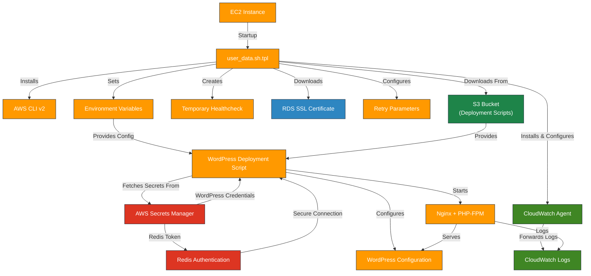

# AWS Terraform User Data Templates

---

## Table of Contents

- [1. Overview](#1-overview)
- [2. Prerequisites / Requirements](#2-prerequisites--requirements)
- [3. Architecture Diagram](#3-architecture-diagram)
- [4. Features](#4-features)
- [5. File Descriptions](#5-file-descriptions)
- [6. Template Variables](#6-template-variables)
- [7. Example Usage](#7-example-usage)
- [8. Security Considerations / Recommendations](#8-security-considerations--recommendations)
- [9. Template-Specific Deployment Processes](#9-template-specific-deployment-processes)
- [10. Best Practices](#10-best-practices)
- [11. Integration](#11-integration)
- [12. Future Improvements](#12-future-improvements)
- [13. Troubleshooting and Common Issues](#13-troubleshooting-and-common-issues)
- [14. Notes](#14-notes)
- [15. Useful Resources](#15-useful-resources)

---

## 1. Overview

This directory contains Terraform `templatefile` scripts used to dynamically generate EC2 user data for various WordPress deployment strategies. These templates are not standalone modules but are consumed by other modules (like the ASG module) to bootstrap EC2 instances.

The three primary strategies supported are:
- **S3-Based Deployment (`user_data.sh.tpl`):** A from-scratch installation where deployment scripts are fetched from an S3 bucket. Ideal for development environments.
- **Ansible-Based Deployment (`user_data_ansible.sh.tpl`):** An alternative from-scratch installation that uses Ansible for provisioning, cloning playbooks from a Git repository.
- **Golden AMI Deployment (`user_data_runtime.sh.tpl`):** A configuration-only approach for instances launched from a pre-built "Golden AMI" where WordPress and all dependencies are already installed. Ideal for staging and production environments to ensure faster, more consistent deployments.

---

## 2. Prerequisites / Requirements

### All Templates
- **Terraform `templatefile` Function:** These templates must be rendered using the Terraform `templatefile` function.
- **Ubuntu OS:** The scripts are designed and tested for **Ubuntu-based** EC2 instances and rely on `apt-get` for package management.
- **IAM Permissions:** The EC2 instance profile must have permissions to:
  - `secretsmanager:GetSecretValue` to retrieve secrets.
  - `s3:GetObject` if using the S3-based deployment.
- **AWS CLI:** The scripts will attempt to install AWS CLI v2 if it's not already present.

### `user_data.sh.tpl`
- **S3 Bucket:** An S3 bucket must exist and contain the `deploy_wordpress.sh` and `healthcheck.php` scripts. The paths to these objects are passed as variables.

### `user_data_ansible.sh.tpl`
- **Git Repository:** The script clones `https://github.com/hetmanskyi-cloud/AWS.git`. This repository must be publicly accessible at the time of instance launch.

### `user_data_runtime.sh.tpl`
- **Golden AMI:** The EC2 instance must be launched from a Golden AMI that includes:
  - Nginx
  - PHP and required extensions (e.g., `php-fpm`)
  - WP-CLI (installed at `/usr/local/bin/wp`)
  - `jq`
  - All other WordPress dependencies.

---

## 3. Architecture Diagram

This diagram primarily illustrates the flow for **`user_data.sh.tpl`**, which is the most comprehensive from-scratch deployment process.



> _Diagram generated with [Mermaid](https://mermaid.js.org/)_

---

## 4. Features

- **Dynamic User Data:** Generates EC2 user data scripts tailored to different deployment environments.
- **Multiple Deployment Strategies:**
  - `user_data.sh.tpl`: Full WordPress installation from scratch using scripts from S3.
  - `user_data_ansible.sh.tpl`: Full installation using Ansible playbooks cloned from Git.
  - `user_data_runtime.sh.tpl`: Runtime configuration for pre-built Golden AMIs.
- **Secrets Management:** Securely retrieves database credentials, WordPress salts, and Redis tokens from **AWS Secrets Manager** at runtime.
- **EFS Integration:** Automatically mounts an EFS file system to `wp-content/uploads` for shared storage.
- **CloudWatch Logs Integration:** Installs and configures the CloudWatch Agent to ship logs for `user-data`, `nginx`, `php-fpm`, and WordPress itself.
- **Idempotency:** The `user_data_runtime.sh.tpl` script checks if WordPress is already installed before attempting to run the installation process, making it safe to run on subsequent boots.
- **SSM Agent Installation:** Ensures the AWS Systems Manager (SSM) agent is installed and running, providing secure, remote management capabilities out-of-the-box.

---

## 5. File Descriptions

| File                       | Description                                                                                                                             |
|----------------------------|-----------------------------------------------------------------------------------------------------------------------------------------|
| `user_data.sh.tpl`         | Template for EC2 User Data script that performs a full WordPress deployment by downloading and executing `deploy_wordpress.sh` from S3. |
| `user_data_ansible.sh.tpl` | Template for EC2 User Data script that bootstraps an instance to deploy WordPress via Ansible by cloning a public Git repo.             |
| `user_data_runtime.sh.tpl` | Template for EC2 User Data script for Golden AMIs, configuring runtime settings (secrets, EFS) without a full installation.             |

---

## 6. Template Variables

This section details the variables required by the `templatefile` function for each template.

| Variable                 | Type         | Description                                                                                                                |
|--------------------------|--------------|----------------------------------------------------------------------------------------------------------------------------|
| `wp_config`              | `map(string)`| Map of WordPress config values (e.g., `DB_HOST`, `REDIS_HOST`, `PHP_VERSION`). Used by `all`.                              |
| `aws_region`             | `string`     | AWS Region for CLI commands and service interaction. Used by `all`.                                                        |
| `wordpress_version`      | `string`     | WordPress version to install (e.g., a Git branch/tag). Used by `user_data.sh.tpl`, `user_data_ansible.sh.tpl`.             |
| `public_site_url`        | `string`     | Public URL for the WordPress site, used to configure `WP_HOME` and `WP_SITEURL`. Used by `all`.                            |
| `enable_https`           | `bool`       | Flag to enable HTTPS/SSL settings in WordPress. Used by `all`.                                                             |
| `wordpress_secrets_name` | `string`     | Name of the AWS Secrets Manager secret for WordPress credentials and salts. Used by `all`.                                 |
| `rds_secrets_name`       | `string`     | Name of the AWS Secrets Manager secret for RDS database credentials. Used by `all`.                                        |
| `redis_auth_secret_name` | `string`     | Name of the AWS Secrets Manager secret for the Redis AUTH token. Used by `all`.                                            |
| `enable_cloudwatch_logs` | `bool`       | Flag to enable/disable CloudWatch Logs integration. Used by `all`.                                                         |
| `cloudwatch_log_groups`  | `map(string)`| Map of log group names for various services (`user_data`, `nginx`, etc.). Used by `all`.                                   |
| `efs_file_system_id`     | `string`     | ID of the EFS File System to mount. If empty, EFS is not mounted. Used by `all`.                                           |
| `efs_access_point_id`    | `string`     | ID of the EFS Access Point to use for mounting. Used by `all`.                                                             |
| `retry_max_retries`      | `number`     | Maximum number of retries for operations like DB connection checks. Used by `user_data.sh.tpl`, `user_data_runtime.sh.tpl`.|
| `retry_retry_interval`   | `number`     | Interval in seconds between retries. Used by `user_data.sh.tpl`, `user_data_runtime.sh.tpl`.                               |
| `wordpress_script_path`  | `string`     | S3 URI (`s3://...`) of the `deploy_wordpress.sh` script. Used by `user_data.sh.tpl`.                                       |
| `healthcheck_s3_path`    | `string`     | S3 URI (`s3://...`) of the `healthcheck.php` file. Used by `user_data.sh.tpl`.                                             |
| `scripts_bucket_name`    | `string`     | S3 bucket name (used by Ansible playbook, passed for context). Used by `user_data_ansible.sh.tpl`.                         |
| `WP_PATH`                | `string`     | The absolute path on the instance where WordPress should be installed. Used by `user_data_runtime.sh.tpl`.                 |

---

## 7. Example Usage

This example shows how to render the `user_data.sh.tpl` template within a Terraform configuration, typically inside an ASG or Launch Template module.

```hcl
locals {
  # Render the user data script using the templatefile function
  rendered_user_data = templatefile(
    # Path to the desired template
    "${path.module}/../../templates/user_data.sh.tpl",

    # Pass in all the required variables for the template
    {
      wp_config              = local.wp_config,
      aws_region             = var.aws_region,
      wordpress_version      = "latest",
      public_site_url        = "https://example.com",
      enable_https           = true,
      wordpress_secrets_name = var.wordpress_secrets_name,
      rds_secrets_name       = var.rds_secrets_name,
      redis_auth_secret_name = var.redis_auth_secret_name,
      enable_cloudwatch_logs = true,
      cloudwatch_log_groups  = local.cloudwatch_log_groups,
      efs_file_system_id     = module.efs.id,
      efs_access_point_id    = module.efs.access_point_id,
      retry_max_retries      = 5,
      retry_retry_interval   = 10,
      wordpress_script_path  = "s3://${var.scripts_bucket_name}/deploy_wordpress.sh",
      healthcheck_s3_path    = "s3://${var.scripts_bucket_name}/healthcheck.php"
    }
  )
}

# Use the rendered user data in a launch template
resource "aws_launch_template" "main" {
  # ... other launch template config ...

  user_data = base64encode(local.rendered_user_data)
}
```
---

## 8. Security Considerations / Recommendations

- **Never Hardcode Secrets:** All sensitive data (DB passwords, API keys, salts) is retrieved from **AWS Secrets Manager** at runtime. Do not pass secrets directly into the template variables.
- **IAM Least Privilege:** The IAM role attached to the EC2 instances should have the minimum necessary permissions. This includes `secretsmanager:GetSecretValue` on specific secrets and `s3:GetObject` on specific S3 objects.
- **Git Repository Security:** `user_data_ansible.sh.tpl` clones a public GitHub repository. For production use, it is strongly recommended to fork this repository into a private account and update the URL in the template to maintain control over the code being executed.
- **Temporary Secret Exposure:** Both deployment scripts temporarily write secrets to disk in plain text, which is a security risk if the instance is compromised or the script fails before cleanup.
  - `user_data_ansible.sh.tpl` writes secrets to `/tmp/extra_vars.json`.
  - `user_data_runtime.sh.tpl` writes secrets to `/etc/environment`.
  This practice should be reviewed and potentially replaced with a more secure mechanism for production.
- **EFS Security:** Ensure that the EFS security group only allows inbound NFS traffic (port 2049) from the EC2 instances that need to mount it.

---

## 9. Template-Specific Deployment Processes

### 9.1 `user_data.sh.tpl` (S3-Based Deployment)
This template is used for a full, from-scratch WordPress installation.
1.  **Prerequisites:** Installs AWS CLI v2 if not present.
2.  **Environment Setup:** Exports non-sensitive config from `wp_config` to `/etc/environment`.
3.  **Dependencies:** Downloads the RDS SSL certificate and installs the CloudWatch Agent.
4.  **EFS Mount:** Installs `amazon-efs-utils` and mounts the specified EFS file system.
5.  **Script Download:** Downloads `deploy_wordpress.sh` and `healthcheck.php` from S3.
6.  **Execution:** Makes `deploy_wordpress.sh` executable and runs it. This downstream script is responsible for:
    - Installing Nginx, PHP, WP-CLI, and other system packages.
    - Fetching all secrets from Secrets Manager.
    - Configuring WordPress (`wp-config.php`), Nginx, and PHP-FPM.
    - Installing WordPress core, plugins, and themes.
    - Setting file permissions.

### 9.2 `user_data_ansible.sh.tpl` (Ansible-Based Deployment)
This template uses Ansible for the WordPress installation.
1.  **Prerequisites:** Installs AWS CLI v2, Git, and Ansible.
2.  **Secrets Retrieval:** Fetches all secrets from Secrets Manager and exports them as environment variables.
3.  **Playbook Download:** Clones the `https://github.com/hetmanskyi-cloud/AWS.git` repository to get the Ansible playbooks.
4.  **Execution:** Runs the `install-wordpress.yml` playbook, passing the secrets and configuration via a temporary JSON file (`/tmp/extra_vars.json`).
5.  **Cleanup:** Deletes the temporary JSON file containing secrets.

### 9.3 `user_data_runtime.sh.tpl` (Golden AMI Deployment)
This template is for configuring an instance that already has WordPress installed.
1.  **Environment Setup:** Exports non-sensitive config from `wp_config` to `/etc/environment`.
2.  **Secrets Retrieval:** Fetches all secrets from Secrets Manager.
3.  **`wp-config.php` Update:** Uses WP-CLI to update `wp-config.php` with the fresh secrets and environment-specific URLs.
4.  **EFS Mount:** Mounts the specified EFS file system.
5.  **Idempotency Check:** Runs `wp core is-installed`. If WordPress is not yet installed in the database, it runs the installer automatically. This makes the script safe for the very first launch of an instance from the Golden AMI.
6.  **Service Restart:** Restarts Nginx and PHP-FPM to apply the new configuration.
7.  **Cleanup:** Removes sensitive variables from `/etc/environment`.

---

## 10. Best Practices

- **Use Golden AMIs for Production:** The `user_data_runtime.sh.tpl` approach is recommended for staging and production to reduce instance boot time and ensure consistency. Use a tool like Packer to automate Golden AMI creation.
- **Idempotency:** Ensure user data scripts are idempotent (can be run multiple times without changing the result beyond the initial application), especially if you re-run user data on instance stop/start.
- **Logging:** All scripts log their output to `/var/log/user-data.log`. If CloudWatch is enabled, this log is automatically shipped for centralized debugging.
- **Error Handling:** All scripts use `set -euxo pipefail` to ensure they fail immediately and loudly if any command fails, preventing partially configured instances.

---

## 11. Integration

- **ASG Module:** The primary consumer of these templates. The ASG module uses the `templatefile` function to render the user data and pass it to a Launch Template.
- **Secrets Manager:** The single source of truth for all secrets.
- **S3 Module:** Stores the deployment scripts (`deploy_wordpress.sh`, `healthcheck.php`).
- **EFS Module:** Provides the shared file system for `wp-content/uploads`.
- **CloudWatch:** Receives logs from the instances for monitoring and alerting.

---

## 12. Future Improvements

- **OS Agnosticism:** Add support for other Linux distributions (e.g., Amazon Linux, RHEL) by abstracting package management commands.
- **SSM Parameter Store:** Consider using SSM Parameter Store for non-sensitive configuration instead of passing it all through `wp_config`.
- **More Secure Secret Handling:** Replace the temporary writing of secrets to `/etc/environment` in `user_data_runtime.sh.tpl` with a more secure method, such as passing them directly to the required processes or using a temporary file with strict permissions.

---

## 13. Troubleshooting and Common Issues

- **User Data Fails to Run:** Check the EC2 instance's System Log in the AWS console for early boot errors.
- **Script Fails Silently:** SSH into the instance and check `/var/log/user-data.log` for detailed error messages.
- **Secrets Retrieval Errors:**
  - Verify the instance's IAM role has `secretsmanager:GetSecretValue` permissions.
  - Check that the secret names passed as variables are correct.
- **S3 Download Failures (`user_data.sh.tpl`):**
  - Verify the instance's IAM role has `s3:GetObject` permissions on the script files.
  - Check that the S3 URIs passed as variables are correct.
- **Git Clone Failure (`user_data_ansible.sh.tpl`):**
  - Ensure the instance has internet connectivity to reach `github.com`.
  - Check that the repository URL is correct and the repo is public.
- **EFS Mount Fails:**
  - Verify the EFS security group allows inbound NFS traffic from the instance's security group.
  - Ensure `amazon-efs-utils` is installed correctly. Check the user data log for installation errors.
- **`wp-cli` command not found (`user_data_runtime.sh.tpl`):**
  - Ensure the Golden AMI was built correctly and `wp-cli` is in the system's PATH (e.g., at `/usr/local/bin/wp`).

---

## 14. Notes

- These templates are tightly coupled with this specific Terraform project's structure and variable conventions.
- All templates are designed exclusively for **Ubuntu-based EC2 instances**. Using them on other operating systems will fail.
- Modifying these scripts requires careful testing, as a failure in user data can cause the entire instance deployment to fail.

---

## 15. Useful Resources

- [Terraform `templatefile` Function](https://developer.hashicorp.com/terraform/language/functions/templatefile)
- [AWS EC2 User Data](https://docs.aws.amazon.com/AWSEC2/latest/UserGuide/user-data.html)
- [AWS Secrets Manager Documentation](https://docs.aws.amazon.com/secretsmanager/latest/userguide/intro.html)
- [WP-CLI Official Site](https://wp-cli.org/)

---
