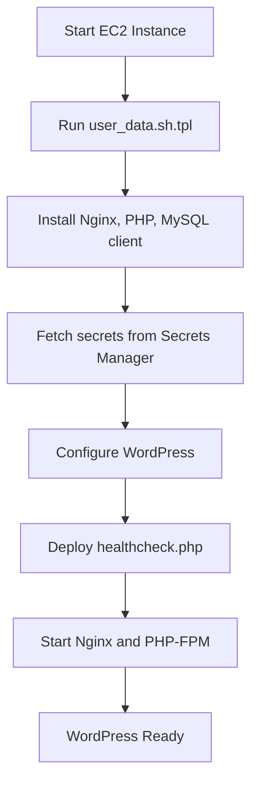

# Terraform Templates

This directory contains template files used by the Terraform modules to generate dynamic content for AWS resources. The primary template, `user_data.sh.tpl`, generates the user data script executed on EC2 instances at launch.

## Template Files Structure

| File               | Description                                     |
|--------------------|-------------------------------------------------|
| `user_data.sh.tpl` | EC2 user data template for WordPress deployment |

## `user_data.sh.tpl`

This template dynamically generates the user data script, which is executed when an EC2 instance starts. It automates the installation and configuration of WordPress, along with necessary dependencies.

## User Data Execution Flow



### Why We Use This Template

AWS limits the size of the user data script to 16 KB. To work around this limitation, we provide an option to download the script from S3 (`enable_s3_script = true`). This allows us to include larger scripts without exceeding AWS constraints. Additionally, using a template file avoids syntax issues when passing complex multi-line scripts in Terraform configurations.

### Configuration Parameters

| Parameter                 | Description                                | Required                       |
|---------------------------|--------------------------------------------|--------------------------------|
| `wp_config`               | Map of WordPress configuration variables   | Yes                            |
| `healthcheck_content_b64` | Base64-encoded content for healthcheck.php | Yes                            |
| `aws_region`              | AWS region for resource access             | Yes                            |
| `enable_s3_script`        | Boolean flag to download script from S3    | Yes                            |
| `wordpress_script_path`   | S3 path to WordPress deployment script     | If `enable_s3_script` is true  |
| `script_content`          | Embedded script content                    | If `enable_s3_script` is false |
| `healthcheck_s3_path`     | S3 path to healthcheck file                | If `enable_s3_script` is true  |

### Template Functionality

1. **AWS CLI Installation**
   - Ensures AWS CLI v2 is installed.
   - Handles different package managers (yum, dnf, apt-get) to maintain compatibility across AMIs.

2. **Environment Variables**
   - Dynamically exports WordPress configuration variables to `/etc/environment`.
   - Sets AWS region and healthcheck content.
   - Allows Terraform to pass critical instance-specific parameters dynamically.

3. **Script Deployment**
   - If `enable_s3_script` is `true`, downloads the deployment script from S3 to bypass AWS user data size limits.
   - Otherwise, embeds the script directly in user data for execution.

4. **Healthcheck File**
   - If `enable_s3_script` is `true`, downloads the healthcheck file from S3.
   - Otherwise, generates the healthcheck file from the provided Base64-encoded content.

5. **Execution**
   - Executes the WordPress deployment script.
   - Logs all output to `/var/log/user-data.log` for troubleshooting.

### Usage Example

```hcl
module "asg" {
  source = "./modules/asg"
  
  # User data template configuration
  user_data_vars = {
    wp_config = {
      DB_HOST     = module.rds.endpoint # Dynamically assigned
      DB_PORT     = "3306"              # Default MySQL port
      SECRET_NAME = aws_secretsmanager_secret.wordpress.name
      PHP_VERSION = "8.3"
      REDIS_HOST  = module.elasticache.endpoint # Dynamically assigned
      REDIS_PORT  = "6379"              # Default Redis port
      AWS_LB_DNS  = module.alb.dns_name # Dynamically assigned
      WP_TITLE    = "My WordPress Site"
    }
    healthcheck_content_b64 = base64encode(file("${path.root}/scripts/healthcheck-2.0.php"))
    aws_region              = var.aws_region # Set dynamically by Terraform
    enable_s3_script        = false
    script_content          = file("${path.root}/scripts/deploy_wordpress.sh")
  }
}
```

## Troubleshooting

### Common Issues

1. **Script Execution Failures**
   - Check EC2 instance logs at `/var/log/user-data.log`.
   - Ensure IAM permissions allow S3 access when `enable_s3_script` is enabled.
   - Verify that all required variables are correctly passed to the template.

2. **AWS CLI Installation Problems**
   - Check internet connectivity from the EC2 instance.
   - Look for package manager errors in logs.
   - Ensure the instance has sufficient disk space for installation.

3. **Environment Variable Issues**
   - Ensure variables are correctly exported to `/etc/environment`.
   - Check for special characters that may require escaping.
   - Confirm that the script has the necessary permissions to modify `/etc/environment`.

### Debugging Tips

- Add `echo` statements within the template to output variable values for debugging.
- Use `set -x` in the script for verbose execution output.
- Check EC2 system logs in CloudWatch for additional error messages.

## Security Considerations

- Secrets and credentials are retrieved securely via AWS Secrets Manager.
- File permissions are strictly set to restrict unauthorized access.
- All scripts follow least privilege principles and enforce logging for traceability.

## Best Practices

- Ensure scripts are executed with necessary permissions.
- Regularly update AWS CLI and dependencies.
- Customize health checks based on instance-specific monitoring needs.
- Use Terraform to dynamically generate and validate configuration values before deployment.