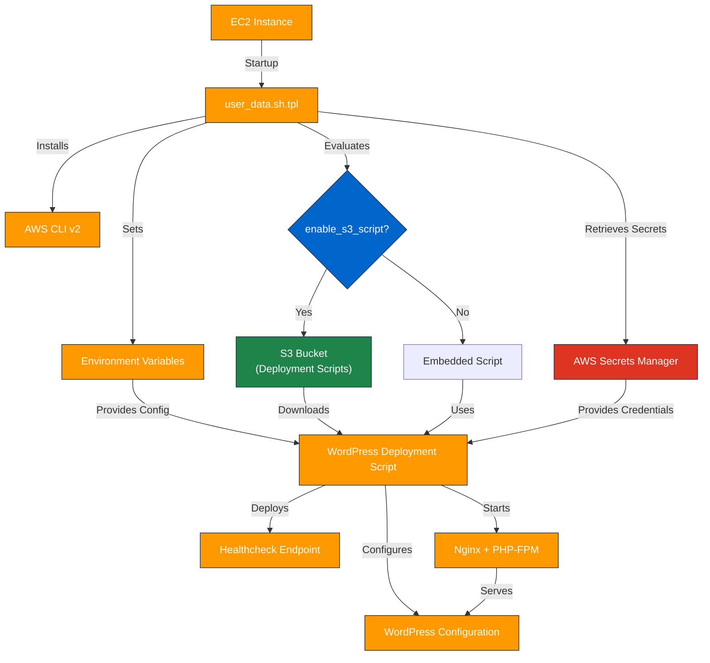

# AWS Terraform Templates

---

## 1. Overview

This directory contains Terraform template files used to dynamically generate scripts and configurations required during infrastructure deployment. The primary template, `user_data.sh.tpl`, generates the EC2 instance bootstrap script for automated WordPress deployment.

---

## 2. Prerequisites / Requirements

- **Terraform Project Context**:
  - Templates are designed for use within this Terraform project and depend on specific variables.

- **AWS CLI**:
  - `user_data.sh.tpl` assumes AWS CLI v2 is installed or installable on the EC2 instance.

- **IAM Permissions**:
  - The EC2 instance requires IAM permissions to access Secrets Manager and optionally S3 for script downloads.

---

## 3. Architecture Diagram


---

## 4. Features

- Dynamic user data generation for EC2 instances
- Automatic retrieval of secrets from AWS Secrets Manager
- Optional deployment script and healthcheck file download from S3
- Configurable environment variable injection for WordPress setup

---

## 5. Files Structure

| File               | Description                                                       |
|--------------------|-------------------------------------------------------------------|
| `user_data.sh.tpl` | Template for EC2 User Data script rendering WordPress deployment  |

---

## 6. Required Variables

| Variable                 | Type        | Description                                                      |
|--------------------------|-------------|------------------------------------------------------------------|
| `wp_config`              | map(string) | WordPress configuration values                                   |
| `aws_region`             | string      | AWS Region                                                       |
| `enable_s3_script`       | bool        | Flag to download deployment script from S3                       |
| `wordpress_script_path`  | string      | S3 path to the WordPress deployment script                       |
| `script_content`         | string      | Embedded WordPress deployment script content                     |
| `healthcheck_content_b64`| string      | Base64-encoded content for healthcheck.php                       |
| `wordpress_secrets_arn`  | string      | ARN of Secrets Manager secret for WordPress                      |

---

## 7. Example Usage

```hcl
locals {
  rendered_user_data = templatefile(
    "${path.module}/../../templates/user_data.sh.tpl",
    {
      wp_config               = local.wp_config,
      aws_region              = var.aws_region,
      enable_s3_script        = var.enable_s3_script,
      wordpress_script_path   = local.wordpress_script_path,
      script_content          = local.script_content,
      healthcheck_content_b64 = local.healthcheck_b64,
      wordpress_secrets_arn   = var.wordpress_secrets_arn
    }
  )
}

resource "aws_launch_template" "asg_launch_template" {
  user_data = base64encode(local.rendered_user_data)
}
```
---

## 8. Security Considerations / Recommendations

- **Secrets Retrieval**: Sensitive credentials are securely retrieved from AWS Secrets Manager.
- **IAM Restrictions**: Ensure the EC2 instance role has only necessary permissions.
- **No Hardcoded Secrets**: Avoid embedding any sensitive data in templates or variables.

---

## 9. Conditional Resource Creation

- WordPress deployment script is either downloaded from S3 or embedded locally based on enable_s3_script variable
- Healthcheck file is either fetched from S3 or embedded depending on the same condition
- Secrets retrieval is dynamically configured through the secrets.tf block in the main module, which passes the Secrets Manager ARN to the template only if secret usage is enabled.

---

## 10. Best Practices

- **Validate Templates**: Always validate template rendering before deployment.
- **Use SSM**: Prefer SSM Parameters for non-sensitive configuration.
- **Idempotency**: Ensure the generated user data script is idempotent.
- **Logging**: Maintain proper logging during user data execution for debugging.

---

## 11. Integration

- ASG Module – uses the template to generate user data for EC2 instances
- Secrets Manager – provides sensitive data during deployment
- S3 Module – stores deployment scripts and healthcheck files (if enabled)

---

## 12. Future Improvements

- Add support for fetching additional configuration files from S3
- Implement templating logic for multi-application deployment scenarios
- Consider switching to SSM Parameter Store for some environment variables

---

## 13. Troubleshooting and Common Issues

- **Failure to Download Script**: Verify S3 permissions and correct path.
- **Secrets Retrieval Errors**: Check IAM role policies for Secrets Manager access.
- **WordPress Install Fails**: Inspect `/var/log/wordpress_install.log` inside the instance.
- **User Data Fails**: Check `/var/log/user-data.log` for syntax or runtime errors.

---

## 14. Notes

- This template is tightly coupled with the project modules.
- Modifications require testing to prevent deployment failures.
- Designed for EC2 Linux instances with Amazon Linux or Ubuntu base images.

---

## 15. Useful Resources

- [AWS Secrets Manager](https://docs.aws.amazon.com/secretsmanager/latest/userguide/intro.html)
- [AWS User Data Documentation](https://docs.aws.amazon.com/AWSEC2/latest/UserGuide/user-data.html)
- [Terraform Templatefile Function](https://developer.hashicorp.com/terraform/language/functions/templatefile)

---