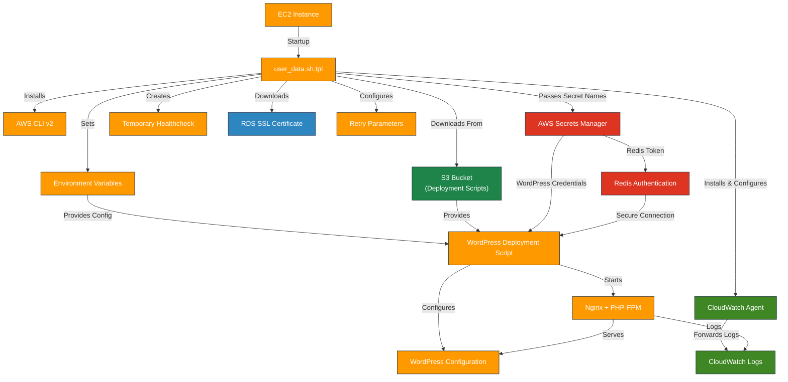

# AWS Terraform Templates

---

## Table of Contents

- [1. Overview](#1-overview)
- [2. Prerequisites / Requirements](#2-prerequisites--requirements)
- [3. Architecture Diagram](#3-architecture-diagram)
- [4. Features](#4-features)
- [5. Files Structure](#5-files-structure)
- [6. Required Variables](#6-required-variables)
- [7. Example Usage](#7-example-usage)
- [8. Security Considerations / Recommendations](#8-security-considerations--recommendations)
- [9. Deployment Process](#9-deployment-process)
- [10. Best Practices](#10-best-practices)
- [11. Integration](#11-integration)
- [12. Future Improvements](#12-future-improvements)
- [13. Troubleshooting and Common Issues](#13-troubleshooting-and-common-issues)
- [14. Notes](#14-notes)
- [15. Useful Resources](#15-useful-resources)

---

## 1. Overview

This directory contains Terraform template files used to dynamically generate scripts and configurations required during infrastructure deployment. The primary template, `user_data.sh.tpl`, generates the EC2 instance bootstrap script for automated WordPress deployment.

---

## 2. Prerequisites / Requirements

- **Terraform Project Context**:
  - Templates are designed for use within this Terraform project and depend on specific variables.

- **AWS CLI**:
  - `user_data.sh.tpl` assumes AWS CLI v2 is installed or installable on the EC2 instance.

- **IAM Permissions**:
  - The EC2 instance requires IAM permissions to access Secrets Manager and optionally S3 for script downloads.

---

## 3. Architecture Diagram



> _Diagram generated with [Mermaid](https://mermaid.js.org/)_

---

## 4. Features

- Dynamic user data generation for EC2 instances
- Automatic retrieval of secrets from AWS Secrets Manager
- Deployment script download from S3
- Configurable environment variable injection for WordPress setup
- RDS SSL certificate download for secure database connections
- Simple healthcheck file creation for ALB health checks
- CloudWatch Logs integration via configurable log group mappings

---

## 5. Files Structure

| File               | Description                                                       |
|--------------------|-------------------------------------------------------------------|
| `user_data.sh.tpl` | Template for EC2 User Data script rendering WordPress deployment  |

---

## 6. Required Variables

| Variable                 | Type        | Description                                                           |
|--------------------------|-------------|-----------------------------------------------------------------------|
| `wp_config`              | map(string) | WordPress configuration values                                        |
| `aws_region`             | string      | AWS Region                                                            |
| `wordpress_script_path`  | string      | S3 path to the WordPress deployment script                            |
| `script_content`         | string      | Local script content (uploaded to S3; not used in user_data directly) |
| `healthcheck_s3_path`    | string      | S3 path to healthcheck file (optional)                                |
| `wordpress_secrets_name` | string      | Name of Secrets Manager secret for WordPress                          |
| `redis_auth_secret_name` | string      | Name of Redis AUTH secret in Secrets Manager                          |
| `retry_max_retries`      | number      | Maximum number of retries for operations                              |
| `retry_retry_interval`   | number      | Interval between retries in seconds                                   |
| `cloudwatch_log_groups`  | map(string) | Map of log group names for CloudWatch Logs integration                |
| `WP_TMP_DIR`             | string      | Temporary directory for WordPress setup                               |
| `WP_PATH`                | string      | WordPress installation path (used in deployment)                      |

---

## 7. Example Usage

```hcl
locals {
  rendered_user_data = templatefile(
    "${path.module}/../../templates/user_data.sh.tpl",
    {
      wp_config              = local.wp_config,
      aws_region             = var.aws_region,
      wordpress_script_path  = local.wordpress_script_path,
      script_content         = local.script_content,
      healthcheck_s3_path    = local.healthcheck_s3_path,
      wordpress_secrets_name = var.wordpress_secrets_name,
      redis_auth_secret_name = var.redis_auth_secret_name,
      retry_max_retries      = local.retry_config.MAX_RETRIES,
      retry_retry_interval   = local.retry_config.RETRY_INTERVAL,
      cloudwatch_log_groups  = local.cloudwatch_log_groups,
      WP_TMP_DIR             = "/tmp/wordpress-setup",
      WP_PATH                = "/var/www/html"
    }
  )
}

resource "aws_launch_template" "asg_launch_template" {
  user_data = base64encode(local.rendered_user_data)
}
```
---

## 8. Security Considerations / Recommendations

- **Secrets Retrieval**: Sensitive credentials are securely retrieved from AWS Secrets Manager.
- **IAM Restrictions**: Ensure the EC2 instance role has only necessary permissions.
- **No Hardcoded Secrets**: Avoid embedding any sensitive data in templates or variables.

---

## 9. Deployment Process

- The user_data.sh.tpl script is executed when an EC2 instance launches
- AWS CLI is installed if not already present
- Environment variables are exported to /etc/environment for use by the WordPress deployment script
- Amazon RDS root SSL certificate is downloaded for secure database connections
- CloudWatch Agent is configured and started (if enabled) to forward logs to CloudWatch Log Groups
- A simple healthcheck file (`<?php http_response_code(200); ?>`) is created directly in the WordPress directory
- The WordPress deployment script is downloaded from S3
- The deployment script is executed to:
  - Retrieve secrets from AWS Secrets Manager
  - Install and configure Nginx and PHP
  - Download and install WordPress
  - Configure WordPress with database and Redis settings
  - Enable Redis Object Cache
  - Download a more comprehensive healthcheck file from S3 (if specified)
- If `enable_cloudwatch_logs` is set to `true`, the CloudWatch Agent is automatically installed and configured on instance launch to forward logs to the specified CloudWatch Log Groups.
- If `enable_cloudwatch_logs` is set to `false`, the CloudWatch Agent will not be installed and no logs will be forwarded.
  To enable CloudWatch log streaming later, set `enable_cloudwatch_logs = true` and **recreate the EC2 instance** via ASG refresh or instance replacement.

---

## 10. Best Practices

- **Validate Templates**: Always validate template rendering before deployment.
- **Use SSM**: Prefer SSM Parameters for non-sensitive configuration.
- **Idempotency**: Ensure the generated user data script is idempotent.
- **Logging**: The script logs all actions to both console and `/var/log/user-data.log` for debugging.
- **Error Handling**: The script uses `set -euxo pipefail` to fail fast on errors and undefined variables.

---

## 11. Integration

- ASG Module – uses the template to generate user data for EC2 instances
- Secrets Manager – provides sensitive data during deployment
- S3 Module – stores deployment scripts and healthcheck files (if enabled)
- CloudWatch Logs – captures logs from user-data script, Nginx, PHP-FPM, system, and WordPress

---

## 12. Future Improvements

- Add support for fetching additional configuration files from S3
- Implement templating logic for multi-application deployment scenarios
- Consider switching to SSM Parameter Store for some environment variables

---

## 13. Troubleshooting and Common Issues

- **Failure to Download Script**: Verify S3 permissions and correct path.
- **Secrets Retrieval Errors**: Check IAM role policies for Secrets Manager access.
- **WordPress Install Fails**: Inspect `/var/log/wordpress_install.log` inside the instance.
- **User Data Fails**: Check `/var/log/user-data.log` for syntax or runtime errors.
- **CloudWatch Agent Issues**: Check `/var/log/cloudwatch-agent-status.log` for configuration errors.
- **Redis Connection Issues**: Verify Redis AUTH token is correctly retrieved from Secrets Manager.

---

## 14. Notes

- This template is tightly coupled with the project modules.
- Modifications require testing to prevent deployment failures.
- Designed for EC2 Linux instances with Amazon Linux or Ubuntu base images.

---

## 15. Useful Resources

- [AWS Secrets Manager](https://docs.aws.amazon.com/secretsmanager/latest/userguide/intro.html)
- [AWS User Data Documentation](https://docs.aws.amazon.com/AWSEC2/latest/UserGuide/user-data.html)
- [Terraform Templatefile Function](https://developer.hashicorp.com/terraform/language/functions/templatefile)
- [AWS CLI – get-secret-value](https://docs.aws.amazon.com/cli/latest/reference/secretsmanager/get-secret-value.html)
- [RDS SSL Support](https://docs.aws.amazon.com/AmazonRDS/latest/UserGuide/UsingWithRDS.SSL.html)
- [CloudWatch Agent Configuration](https://docs.aws.amazon.com/AmazonCloudWatch/latest/monitoring/CloudWatch-Agent-Configuration-File-Details.html)
- [Redis AUTH](https://docs.aws.amazon.com/AmazonElastiCache/latest/red-ug/auth.html)

---
